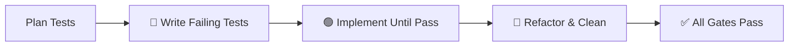

# Plan-Making Workflow

This workflow defines the standard process for creating implementation plans.
It enforces the Planning Gate and Think Phase of the TARS protocol.

## Prerequisites

- Read `GEMINI.md` for rules and guidelines that all plans must comply with.
- Read `architecture.md` (if present) for project-specific design, toolchain, and patterns.
- Read `coding_standard.md` (if present) for language-specific coding standards and practices.
- Read `context.md` (if present) for historical decisions and prior context.
- Confirm you are operating in **Planning mode** (no code edits allowed).

## Steps

### 1. Scope & Impact Analysis

Investigate the request before writing anything:

- **Identify affected files**: List every file/module that will be touched.
- **Map dependencies**: What depends on those files? What do they depend on?
- **Flag risks**: Security concerns, breaking changes, performance impacts.
- **Check for existing tests**: Search for test files related to the affected code.
- **Map to `task.md`**: Ensure each proposed change maps to a top-level item in `task.md`. If `task.md` does not exist, create it as part of the plan with a checklist mirroring the Proposed Changes.

### 2. Draft the Plan

Create an implementation plan artifact with these **required sections**:

#### Header
| Field | Value |
|-------|-------|
| **Role** | Architect / Builder |
| **Date** | Current date |
| **Scope** | One-line summary of what changes |

#### Problem Statement
- What is the problem or feature request?
- Why does it need to be solved now?
- Any relevant context from `context.md` or prior conversations.
- **Constraints**: Technical limitations, environment restrictions (e.g., no admin rights), performance budgets, compatibility requirements, or scope boundaries.
- **Dependencies**: What existing libraries, crates, or packages can be leveraged to avoid reinventing the wheel? Check the ecosystem before proposing custom solutions.

#### Proposed Changes
Group by component. For each file:
- Use `[NEW]`, `[MODIFY]`, or `[DELETE]` tags.
- Link to the file with absolute path.
- Describe *what* changes and *why*.
- Include **logic descriptions**: Explain the reasoning and flow of the change in plain language, not just the code.
- Include **code snippets** for critical logic changes.
- **Atomic steps**: Break each change into steps small enough to be verified independently.

> [!IMPORTANT]
> All proposed changes **must** comply with the guidelines and rules in `GEMINI.md`.
> For Rust projects, also validate against `coding_standard.md` (error handling patterns,
> clippy strictness, documentation requirements, and prohibited patterns).
> Cross-reference before finalizing.

#### Architecture Diagram *(if applicable)*
- Include a Mermaid diagram for any structural or data-flow changes.

#### Edge Cases & Risks
- List edge cases the implementation must handle.
- Document any known risks or trade-offs.

#### Test Plan (TDD)

> [!IMPORTANT]
> Plans **must** specify tests **before** implementation code. The Builder writes
> tests first, verifies they fail (Red), then implements until they pass (Green).

For each proposed change, define:

1. **Test cases**: What tests will be written? Include function signatures and assertions.
2. **Test type**: Unit, integration, property-based, or doc-test.
3. **Expected failures**: What should the test assert when run *before* the implementation exists?
4. **Test file location**: Where will the test live? (co-located `#[cfg(test)]` module or dedicated test file)

#### Verification Plan
Every plan **must** include concrete verification steps:

| Type | Required? | Details |
|------|-----------|---------|
| **Automated tests** | ✅ Yes | Exact command to run (e.g., `cargo test`, `npm test`) |
| **Lint / Format** | ✅ Yes | Exact command (e.g., `cargo fmt --check`, `eslint .`) |
| **Manual testing** | If applicable | Step-by-step instructions a human can follow |
| **Browser testing** | If applicable | Specific pages/flows to validate |

> [!IMPORTANT]
> Do NOT invent test commands. Refer to `architecture.md` § Toolchain for the
> project's standard formatter, linter, and test runner commands.
> If `architecture.md` is not available, read build/config files to verify.

### 3. Self-Review Checklist

Before requesting approval, verify:

- [ ] All affected files are listed
- [ ] Code snippets included for non-trivial changes
- [ ] Logic descriptions explain the *reasoning*, not just the *what*
- [ ] Each change is broken into atomic, independently verifiable steps
- [ ] All changes comply with `GEMINI.md` rules and guidelines
- [ ] No code was edited (Planning Gate enforced)
- [ ] Verification commands sourced from `architecture.md` § Toolchain
- [ ] `context.md` consulted for historical decisions (if present)
- [ ] Constraints clearly documented in Problem Statement
- [ ] Plan aligns with `architecture.md` (if present)
- [ ] Plan aligns with `coding_standard.md` (if present) — error handling, async, testing, and prohibited patterns
- [ ] If plan requires changes to `architecture.md`, explicitly state *what*, *why*, and *where* with reasoning
- [ ] Dependencies researched — existing libraries leveraged where possible
- [ ] Risks and edge cases documented
- [ ] Mermaid diagram included for structural changes

### 4. Request Approval

End the plan with:

> 🛑 **Think Phase Complete.** Reply with **"Proceed"** to Act.

Do NOT proceed to implementation until the user explicitly approves.

### 5. Post-Approval Handoff

Once approved:
- The **Builder** (fast model) picks up the plan.
- Builder must follow the plan exactly — no deviations.
- **TDD order**: Builder writes tests from the Test Plan first (Red), then implements code until tests pass (Green), then refactors (Blue).
- If the plan contradicts `architecture.md`, STOP and re-audit.
- If the plan requires updates to `architecture.md`, the **Architect** must make those changes first and get user approval before the Builder begins implementation.
