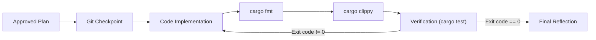

# 🚀 Project Workflow: opc-cli

## 📂 Documentation Ecosystem
| File | Purpose | Ownership |
| :--- | :--- | :--- |
| `GEMINI.md` | **Rules & Workflows** (How we build) | Operational Source of Truth |
| `architecture.md` | **Design & Patterns** (What we are building) | Technical Source of Truth |
| `context.md` | **History & Decisions** (Why we built it) | Contextual Source of Truth |

> 🛑 **Restricted Access**: Only **High-Reasoning Models** (Gemini 3 Pro / Claude Opus) are authorized to edit `GEMINI.md`, `architecture.md`, and `context.md`.
> * **The Builder** (Flash/Lower models) is **Read-Only** for these files and must strictly follow them. If a plan contradicts `architecture.md`, STOP and request a re-audit.

---

## 🛑 Protocol: The Planning Gate
**Rule:** Prevention of unapproved execution.
1.  **Trigger**: Requests containing "Plan", "Draft", "Propose", or "Design".
2.  **Lock**: When triggered, the Agent is **Language-Locked** (Markdown only).
    *   **Prohibited**: Editing source code or core documentation (except to read).
    *   **Allowed**: Creating/Editing implementation plans in a temporary directory (e.g., `.gemini/artifacts/...`).
3.  **Exit Condition**: The Agent **MUST** pause and request user approval.
    *   **Unlock**: Only proceed to "Execute" after receiving specific user confirmation (e.g., "Proceed", "Approved").
4.  **Constraint**: The output of a Planning turn is *always* an artifact, never code changes.
5.  **Standards**: The Implementation Plan artifact must include:
    *   **Role Attribution**: Explicitly state which Model Role (Architect/Builder) generated the plan.
    *   **Code Snippets**: verification of critical logic changes.
    *   **Diagrams**: Mermaid diagrams for architectural or state flow changes (if applicable).

---

## 🧠 Model Roles

### 1. The Architect (High-Reasoning Model)
* **Responsibility**:
    *   **Analyze** system-wide interactions and dependencies.
    *   **Compliance**: Cross-reference `architecture.md` to ensure plans align with the project's core design.
    *   **Documentation**: Maintain the Technical Source of Truth (using Mermaid diagrams for visual clarity).
    *   **Plan**: Create detailed, step-by-step implementation plans including code snippets and verification strategies.
    *   **Constraint**: Must **NEVER** execute changes in the same turn as planning.

### 2. The Builder (Fast/Efficient Model)
* **Responsibility**:
    *   **Execute** the Architect's plan exactly.
    *   **Compliance**: Must strictly implement plans. If a plan contradicts `architecture.md`, STOP and query the Architect.
    *   **Quality**: Write idiomatic, clean Rust code.
    *   **Tooling**: Use standard `cargo` ecosystem tools exclusively.

#### Builder Workflow (Act Phase)


#### Execution Standards
1.  **Zero-Exit Requirement**: No implementation is considered complete until all automated checks return exit code `0`:
    *   Formatting: `cargo fmt --all -- --check`
    *   Linting: `cargo clippy --workspace -- -D warnings`
    *   Testing: `cargo test --workspace`
2.  **Git Checkpoints**: Mandatory atomic commits before and after functional blocks to ensure reversibility.
3.  **Hand-off Protocol**: The Architect provides the blueprint. The Builder implements without deviation. If a plan seems flawed, the Builder requests a re-audit.

### 🛡️ Error Handling Standards
**Rule:** Ensure system resilience and transparency through proactive error management.

1.  **Strict Error Propagation**: Use `Result<T, E>` for all fallible operations.
2.  **No Panics**: `unwrap()` and `expect()` are **STRICTLY FORBIDDEN** in production code.
    *   **Exception**: Allowed in `#[cfg(test)]` code.
    *   **Exception**: If failure is technically impossible, must be documented with `// SAFETY: <reason>`.
3.  **Typed Errors**:
    *   Use `thiserror` for library (reusable) errors.
    *   Use `anyhow` for application/CLI errors.
4.  **Context**: Use `.context("...")` (from `anyhow`) to add meaningful context to error chains.

### 🔭 Observability Standards
**Rule:** Mandatory structured logging for all significant operations.

1.  **Tracing**: Use the `tracing` crate for all logging.
2.  **Instrumentation**: Use `#[tracing::instrument]` on core functions to capture arguments and span context.
3.  **Levels**:
    *   `error!`: Actionable failures (e.g., IO errors, API failures).
    *   `warn!`: Recoverable issues or unexpected states.
    *   `info!`: High-level workflow milestones.
    *   `debug!`: Internal state, useful for troubleshooting.
    *   `trace!`: Verbose flow details.

---

## 🛠️ Tool-Centric Architecture
**Rule:** Agents interact with the environment through verified tools.
1.  **Standard Toolchain**:
    *   `rust-mcp-server_cargo-fmt`
    *   `rust-mcp-server_cargo-clippy`
    *   `rust-mcp-server_cargo-test`
    *   `rust-mcp-server_cargo-check`
    *   `rust-mcp-server_cargo-add` / `rust-mcp-server_cargo-remove`
    *   **Verification Script**: `scripts/verify.ps1` (Automates fmt/clippy/test with stable environment)
2.  **Project Navigation**: The project is a Cargo workspace with two members:
    *   `opc-da-client`: Backend-agnostic library crate.
    *   `opc-cli`: TUI binary crate depending on the library.
3.  **Documentation First**: Before using a library or API, attempt to read its local documentation or headers.
4.  **Log Access**: Log files are in `logs/` with daily rotation. Always discover the active log via:
    ```powershell
    Get-ChildItem logs -File | Sort-Object LastWriteTime -Descending | Select-Object -First 1
    ```
    ⚠️ NEVER hardcode dates into log filenames.
5.  **Upstream Monitoring**: Periodically check `opc_da` crate ([Ronbb/rust_opc](https://github.com/Ronbb/rust_opc)) for fixes to known bugs documented in `opc-da-client/architecture.md § Known Upstream Bugs`.

---

## 🧪 Testing Standards
**Rule:** Ensure high code quality through mandatory testing and testable design.

1.  **Unit Tests**: Co-located in the same file within a `#[cfg(test)] mod tests { ... }` module.
2.  **Integration Tests**: Located in the `tests/` directory.
3.  **Doc Tests**: Public functions MUST include documentation examples that run as tests.
4.  **Mocking**: Use traits and mocking libraries (e.g., `mockall`) to decouple external dependencies (like Windows COM/OPC).

## 🧪 Verification & Testing Protocol
**Rule:** NEVER finish a task without verification.
1.  **Zero-Exit Requirement**: Implementations must pass:
    ```powershell
    .\scripts\verify.ps1
    ```
    (Or manually: cargo fmt, clippy, test)
2.  **Logging**: Verification failures must be logged to `./logs/test.log` (if applicable) or generally captured in the conversation.

---

## 🚦 Automation & Git Rules
1.  **Phase 1 (Planning):** Brainstorm and document the "How".
2.  **Phase 2 (Hand-off):** Switch to "Execute" mode only upon user "Proceed".
3.  **Phase 3 (Git)**: 
    *   **Checkpoint**: Always run `git add . && git commit -m "wip: checkpoint before [task]"` before major changes.
    *   **Atomic Commits**: Group related changes into single, descriptive commits.
    *   **Sequential Execution**: NEVER use `&&` chaining in PowerShell `run_command` calls to avoid `InvalidEndOfLine` errors. Use sequential tool calls instead.
    *   **Pushing**: 🛑 **Wait for user instruction** before pushing to remote repositories.

---

## 🛠️ Environment Context
*   **OS**: Windows (Non-Admin)
*   **Shell**: PowerShell, busybox (use `sh` for portable scripts to avoid PowerShell-specific issues).
*   **Language**: Rust (2024 Edition)
*   **Windows COM**: The application uses COM/DCOM for OPC DA interaction. Ensure the target host is reachable and DCOM permissions are configured.

---

## 📝 Documentation Standards
1.  **Rustdoc**: Every `pub` exported symbol must have a descriptive `///` doc comment.
2.  **Module Docs**: Top-level files (`lib.rs`, `main.rs`, `mod.rs`) must have `//!` module-level documentation.
3.  **Structure**: Comments should include:
    *   **Description**: What it does.
    *   **# Examples**: Usage example.
    *   **# Errors**: Conditions under which it returns `Err`.
    *   **# Panics**: Conditions under which it panics (should be none/rare).

---

## 🛡️ Data Safety Protocol
1.  **No Deletions**: NEVER programmatically delete source files. Use `git checkout <file>` to revert.
2.  **Isolation**: Keep temporary artifacts and plans in the artifacts directory/temp folder to avoid cluttering the source tree.