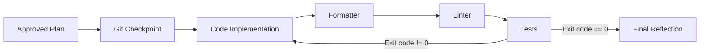

# 🚀 Project Workflow Rules

## 📂 Documentation Ecosystem
| File | Purpose | Ownership |
| :--- | :--- | :--- |
| `GEMINI.md` | **Rules & Workflows** (How we build) | Operational Source of Truth |
| `architecture.md` | **Design & Patterns** (What we are building) | Technical Source of Truth |
| `context.md` | **History & Decisions** (Why we built it) | Contextual Source of Truth |
| `spec.md` | **Behavioral Contracts** (What it should do) | Behavioral Source of Truth |

> 🛑 **Restricted Access**: Only **High-Reasoning Models** are authorized to edit `GEMINI.md`, `architecture.md`, `context.md`, and `spec.md`.
> * **The Builder** (Fast/Lower models) is **Read-Only** for these files and must strictly follow them. If a plan contradicts `architecture.md`, STOP and request a re-audit.

---

## � architecture.md Specification
**Rule:** `architecture.md` is the **project-specific concretization** of the generic rules defined in this file. Every `<!-- CUSTOMIZE -->` marker in `GEMINI.md` points to a topic that `architecture.md` must define concretely.

`architecture.md` **must** contain the following sections:

1.  **Project Overview**: Project name, purpose, and high-level description.
2.  **Language & Runtime**: The specific language(s), edition/version, and runtime environment.
3.  **Project Layout**: Directory structure, workspace members, packages, or modules.
4.  **Toolchain**: The exact formatter, linter, test runner, build tool, and their commands.
    *   Include the verification script path and its contents.
5.  **Error Handling Strategy**: The specific error handling scheme used by the project (e.g., `Result<T,E>` + `thiserror`/`anyhow` in Rust, `try/catch` conventions in TypeScript, `error` interface in Go).
6.  **Observability & Logging**: The specific logging framework/library and instrumentation patterns.
7.  **Testing Strategy**: Specific testing frameworks, file placement conventions, mocking libraries, and any test infrastructure (e.g., fixtures, factories).
8.  **Documentation Conventions**: The specific doc comment format (e.g., Rustdoc `///`, JSDoc `/** */`, GoDoc).
9.  **Dependencies & External Systems**: Key dependencies, upstream libraries to monitor, and external system integrations.
10. **Architecture Diagrams**: Mermaid diagrams showing system structure, data flow, and component relationships.
11. **Known Constraints & Bugs**: Documented limitations, workarounds, and upstream issues.

> [!TIP]
> When setting up a new project, copy this `GEMINI.md` template and then create an `architecture.md` that fills in each of the sections above with your project's specifics.

---

## 📋 spec.md Specification
**Rule:** `spec.md` is the **behavioral contract** for the project. It defines what each
module/component **should do** — independent of how it's currently implemented.
Agents cross-reference this file during refactoring, test generation, and code review.

`spec.md` **must** contain the following sections as applicable:

1.  **Module/Component Contracts**: For each public module, define:
    *   **Purpose**: One-line description of what the module does.
    *   **Public API**: Each public function/method with:
        *   Signature (inputs, outputs, generic constraints).
        *   Error conditions and their meaning.
        *   Invariants (guarantees that always hold, e.g., "never panics", "output is always sorted").
    *   **Required Test Coverage**: Checklist of scenarios that must be tested.
2.  **Data Models**: For each key struct/type/interface, define:
    *   Fields with types, required/optional status, defaults, and constraints.
    *   Validation rules (e.g., "non-empty", "range 1-65535").
3.  **State Machines** *(if applicable)*: For stateful components (TUI, CLI flows, wizards):
    *   State diagram (Mermaid `stateDiagram-v2`).
    *   Transition table: From → To → Trigger → Side Effects.
4.  **Command / CLI Contracts** *(if applicable)*:
    *   Arguments, flags, and their types/defaults.
    *   Exit codes and their meanings.
5.  **Integration Points** *(if applicable)*: For external APIs or inter-module boundaries:
    *   Request/response formats.
    *   Error handling at the boundary.
    *   Retry/timeout policies.

> [!IMPORTANT]
> `spec.md` defines **what** the code should do. `architecture.md` defines **how** it's structured.
> They are complementary — update both when introducing new modules or changing interfaces.

> [!TIP]
> You don't need to spec everything upfront. Start by specifying modules you're actively working on.
> Prioritize public API boundaries and state machines over internal helpers.

---

## �🛑 Protocol: The Planning Gate
**Rule:** Prevention of unapproved execution.
1.  **Trigger**: Requests containing "Plan", "Draft", "Propose", or "Design".
2.  **Lock**: When triggered, the Agent is **Language-Locked** (Markdown only).
    *   **Prohibited**: Editing source code or core documentation (except to read).
    *   **Allowed**: Creating/Editing implementation plans in a temporary directory (e.g., `.gemini/artifacts/...`).
3.  **Exit Condition**: The Agent **MUST** pause and request user approval.
    *   **Unlock**: Only proceed to "Execute" after receiving specific user confirmation (e.g., "Proceed", "Approved").
4.  **Constraint**: The output of a Planning turn is *always* an artifact, never code changes.
5.  **Standards**: The Implementation Plan artifact must include:
    *   **Role Attribution**: Explicitly state which Model Role (Architect/Builder) generated the plan.
    *   **Code Snippets**: Verification of critical logic changes.
    *   **Diagrams**: Mermaid diagrams for architectural or state flow changes (if applicable).

---

## 🧠 Model Roles

### 1. The Architect (High-Reasoning Model)
* **Responsibility**:
    *   **Analyze** system-wide interactions and dependencies.
    *   **Compliance**: Cross-reference `architecture.md` to ensure plans align with the project's core design.
    *   **Documentation**: Maintain the Technical Source of Truth (using Mermaid diagrams for visual clarity).
    *   **Plan**: Create detailed, step-by-step implementation plans including code snippets and verification strategies.
    *   **Constraint**: Must **NEVER** execute changes in the same turn as planning.

### 2. The Builder (Fast/Efficient Model)
* **Responsibility**:
    *   **Execute** the Architect's plan exactly.
    *   **Compliance**: Must strictly implement plans. If a plan contradicts `architecture.md`, STOP and query the Architect.
    *   **Quality**: Write idiomatic, clean code following the project's language conventions.
    *   **Tooling**: Use the project's standard toolchain exclusively. <!-- CUSTOMIZE: Specify in architecture.md -->

#### Builder Workflow (Act Phase)

#### Execution Standards
1.  **Zero-Exit Requirement**: No implementation is considered complete until all automated checks return exit code `0`:
    <!-- CUSTOMIZE: Define in architecture.md § Toolchain -->
    *   Formatting: `<fmt_cmd>`
    *   Linting: `<lint_cmd>`
    *   Testing: `<test_cmd>`
2.  **Git Checkpoints**: Mandatory atomic commits before and after functional blocks to ensure reversibility.
3.  **Hand-off Protocol**: The Architect provides the blueprint. The Builder implements without deviation. If a plan seems flawed, the Builder requests a re-audit.

---

## 🛡️ Error Handling Standards
**Rule:** Ensure system resilience and transparency through proactive error management.

1.  **Meaningful Errors**: Every error must communicate three things:
    *   **What** went wrong (the failure).
    *   **Where** it occurred (module, function, or operation context).
    *   **Why** it happened (root cause or contributing condition).
2.  **No Silent Failures**: All fallible operations must propagate errors explicitly. Swallowing errors is forbidden.
3.  **No Crashes**: Avoid patterns that cause uncontrolled program termination (e.g., unhandled exceptions, raw panics). Fail gracefully.
4.  **Contextual Wrapping**: When re-throwing or propagating errors, add context at each layer to build a meaningful error chain.
<!-- CUSTOMIZE: Define language-specific patterns in architecture.md § Error Handling Strategy -->

---

## 🔭 Observability Standards
**Rule:** Mandatory structured logging for all significant operations.

1.  **Structured Logging**: Use a structured logging framework appropriate to the project's language.
2.  **Instrumentation**: Instrument core functions to capture arguments and execution context.
3.  **Log Levels**:
    *   **Error**: Actionable failures (e.g., IO errors, API failures).
    *   **Warn**: Recoverable issues or unexpected states.
    *   **Info**: High-level workflow milestones.
    *   **Debug**: Internal state, useful for troubleshooting.
    *   **Trace**: Verbose flow details.
<!-- CUSTOMIZE: Define the specific framework in architecture.md § Observability & Logging -->

---

## 🛠️ Tool-Centric Architecture
**Rule:** Agents interact with the environment through verified tools.
1.  **Standard Toolchain**: <!-- CUSTOMIZE: Define in architecture.md § Toolchain -->
2.  **Project Layout**: <!-- CUSTOMIZE: Define in architecture.md § Project Layout -->
3.  **Documentation First**: Before using a library or API, attempt to read its local documentation or headers.
4.  **Log Access**: <!-- CUSTOMIZE: Define in architecture.md § Observability & Logging -->
5.  **Verification Script**: <!-- CUSTOMIZE: Define in architecture.md § Toolchain -->

---

## 🧪 Testing Standards
**Rule:** Ensure high code quality through mandatory testing and testable design.

1.  **Defensive Programming**: Code must be written defensively — validate inputs, handle edge cases, and fail gracefully.
2.  **Testable by Design**: All code must be structured to be testable. Avoid tight coupling to external systems or global state.
3.  **Mockable by Design**: Use interfaces, traits, or abstractions so that external dependencies can be mocked or stubbed in tests.
4.  **Unit Tests**: Co-located with the source or in a dedicated test directory, per the project's language convention.
5.  **Integration Tests**: Located in a dedicated directory for cross-module or system-level tests.
6.  **Doc Tests**: Public APIs should include runnable examples where the language supports it.
<!-- CUSTOMIZE: Define specifics in architecture.md § Testing Strategy -->

## 🧪 Verification & Testing Protocol
**Rule:** NEVER finish a task without verification.
1.  **Zero-Exit Requirement**: Implementations must pass the project's verification pipeline.
    <!-- CUSTOMIZE: Define in architecture.md § Toolchain -->
2.  **Logging**: Verification failures must be captured in the conversation or a log file.

---

## 🚦 Automation & Git Rules
1.  **Phase 1 (Planning):** Brainstorm and document the "How".
2.  **Phase 2 (Hand-off):** Switch to "Execute" mode only upon user "Proceed".
3.  **Phase 3 (Git)**:
    *   **Checkpoint**: Always commit before major changes.
    *   **Atomic Commits**: Group related changes into single, descriptive commits.
    *   **Sequential Execution**: NEVER use `&&` chaining in PowerShell `run_command` calls to avoid `InvalidEndOfLine` errors. Use sequential tool calls instead.
    *   **Pushing**: 🛑 **Wait for user instruction** before pushing to remote repositories.

---

## 🛠️ Environment Context
*   **OS**: Windows (Non-Admin)
*   **Shell**: PowerShell 7 (if available), PowerShell 5, busybox (use `sh` for portable scripts).
*   **Language**: <!-- CUSTOMIZE: Define in architecture.md § Language & Runtime -->

---

## 📝 Documentation Standards
**Rule:** Code must be self-documenting and supplemented with meaningful comments.

1.  **Function Docs**: Every public function must have a doc comment describing what it does, its parameters, return value, and error conditions.
2.  **Module/Package Docs**: Top-level files or packages must have a module-level overview comment.
3.  **Follow Language Conventions**: Use the documentation format and tooling native to the project's language.
4.  **Structure**: Documentation should cover:
    *   **Description**: What it does.
    *   **Examples**: Usage example (where supported).
    *   **Errors**: Conditions under which it fails.
<!-- CUSTOMIZE: Define the specific format in architecture.md § Documentation Conventions -->

---

## 🛡️ Data Safety Protocol
1.  **No Deletions**: NEVER programmatically delete source files. Use `git checkout <file>` to revert.
2.  **Isolation**: Keep temporary artifacts and plans in the artifacts directory/temp folder to avoid cluttering the source tree.