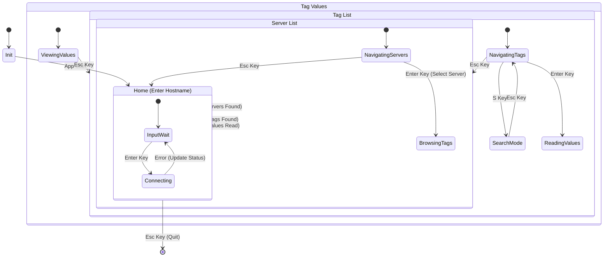

# 🏗️ Architecture: opc-cli

## High-Level Overview
`opc-cli` is a command-line interface tool designed to interact with OPC DA (Data Access) servers. It provides a Terminal User Interface (TUI) for browsing servers and tags, reading values, and monitoring system status.

## Technology Stack
*   **Language**: Rust (2024 Edition)
*   **OS Target**: Windows (Strict) due to OPC DA reliance on COM/DCOM.
*   **TUI Framework**: `ratatui` + `crossterm`.

## Core Components & Crates

### 1. User Interface (TUI)
*   **Crate**: `ratatui`, `crossterm`
*   **Responsibility**: Rendering the interactive UI and handling user input events.
*   **Pattern**: **Elm Architecture (Model-View-Update)**.
    *   **Model**: `AppState` (holds all application data).
    *   **View**: Pure functions rendering `AppState` to `Frame`.
    *   **Update**: Message-passing loop handling `Event` -> `Action` -> `State Mutation`.

### 2. Core Logic & Async Runtime
*   **Crate**: `tokio`
*   **Responsibility**: Driving the main event loop and handling async tasks (though COM interactions are often thread-bound).

### 3. OPC / COM Interaction
*   **Crate**: `opc_da` (Primary), `windows` (Fallback/Low-level)
*   **Responsibility**: Communicating with Local/Remote OPC Servers.
*   **Abstraction**: `trait OpcProvider` (defined in `src/traits.rs`)
    *   Decouples the UI from the specific OPC implementation.
    *   Enables **Testability** via `mockall` (allowing UI development on non-Windows/dev machines).
    *   **Methods:**
        | Method | Purpose |
        | :--- | :--- |
        | `list_servers(host)` | Enumerate OPC DA servers from the registry |
        | `browse_tags(server, max_tags, progress, tags_sink)` | Recursively walk the tag namespace; pushes to a shared sink for partial-result harvesting on timeout |
        | `read_tag_values(server, tag_ids)` | SyncIO read of selected tags, returning value/quality/timestamp |

#### Browse Strategy
The browse implementation handles both flat and hierarchical OPC DA namespaces:
1. `query_organization()` detects namespace type (flat vs hierarchical).
2. **Flat:** Enumerate all `OPC_LEAF` items at root.
3. **Hierarchical:** Recursive depth-first walk via `browse_recursive()`:
   - **Branches first:** Enumerate `OPC_BRANCH` items, navigate down via `change_browse_position(DOWN)`, recurse, then always navigate back `UP` — even if recursion fails — to prevent position corruption.
   - **Leaves second (soft-fail):** Enumerate `OPC_LEAF` items at current position; failures are logged and skipped.
   - **Fully-qualified IDs:** `get_item_id()` converts browse names to item IDs; falls back to browse name if conversion fails.
   - **Iterator bug workaround:** `E_POINTER` (0x80004003) errors from the upstream `opc_da` crate's `StringIterator` are filtered and downgraded to `trace!` level (see [OPC-BUG-001](#opc-bug-001-stringiterator-e_pointer-flood)).
4. **Safety guards:**
   - `max_tags` hard cap (default 10000) to prevent unbounded collection.
   - `MAX_DEPTH` (50) to guard against infinite recursion in malformed namespaces.
   - **300-second timeout** with graceful partial result harvesting. If tags are discovered before the timeout, the application displays the partial list with a warning instead of an error.
   - A shared `tags_sink` (`Arc<Mutex<Vec<String>>>`) allows the main thread to harvest tags mid-browse on timeout.
5. **Non-blocking:** Browse runs as a background `tokio::spawn_blocking` task; progress reported via `Arc<AtomicUsize>` to the Loading screen.

#### TUI Interaction Features
| Feature | Key(s) | Screens | Behavior |
| :--- | :--- | :--- | :--- |
| Navigation | `↑` / `↓` | All lists | Move selection by 1 item |
| Fast Scroll | `PageUp` / `PageDown` | ServerList, TagList, TagValues | Jump by 20 items (clamped) |
| Tag Search | `s` | TagList | Enter modal substring search |
| Search Cycle | `Tab` / `Shift+Tab` | TagList (search mode) | Jump between matches |
| Toggle Select | `Space` | TagList | Check/uncheck tag for reading |
| Read Values | `Enter` | TagList | Read selected tags from server |
| Back | `Esc` | All | Navigate to previous screen |


### 4. Observability
*   **Crate**: `tracing`, `tracing-subscriber`, `tracing-appender`
*   **Responsibility**: Structured logging to **File** (`opc-cli.log`).
    *   **Timing Instrumentation**: Key COM operations (`create_server`, `query_organization`, `browse`) are wrapped in `Instant` timers. Success logs include `elapsed_ms` to identify server performance bottlenecks.
    *   **Context Preservation**: All errors are logged at the point of origin with raw HRESULT codes before being wrapped for the UI.
    *   *Critical*: Since TUI captures stdout/stderr, logs must go to a file for debugging crashes or connection issues.

### 5. Error Handling
*   **Crate**: `anyhow`
*   **Responsibility**: Propagating rich context errors to the UI logic for display in the Status Bar or Error Popups.
*   **Strategy**: 
    1.  **Friendly Hints**: A mapping engine in `opc_impl.rs` translates common technical codes (like licensing or RPC errors) into plain-English advice.
    2.  **Display Chain**: The UI uses `{:#}` formatting to show the full breadcrumb trail of a failure to the user.

## Application State Flow

The application follows a strict state machine to manage user context and navigation.



## Data Flow
```mermaid
graph TD
    User[User Input] --> |Key/Mouse Event| EventLoop[Main Event Loop]
    EventLoop --> |Dispatch| AppUpdate[App::update()]
    
    subgraph Core Logic
        AppUpdate --> |Request Data| OpcProvider[Trait: OpcProvider]
        OpcProvider --> |Call| OpcDa[opc_da Crate / COM]
        OpcDa --> |RPC/DCOM| Server[OPC Server]
        Server --> |Data| OpcDa
        OpcDa --> |Result| AppUpdate
        AppUpdate --> |Mutate| AppState[App State Model]
    end
    
    subgraph Rendering
        AppState --> |Read| View[UI Render Functions]
        View --> |Draw| Terminal[Ratatui / Crossterm]
    end

    subgraph Logging
        AppUpdate --> |Log| Tracing
        OpcProvider --> |Log| Tracing
        Tracing --> |Write| LogFile[opc-cli.log]
    end
```

## Build System

The project uses a dual build system for flexibility:

1.  **Makefile**: The primary entry point for developers on systems with `make`.
    - `make debug`: Fast development build.
    - `make release`: Optimized production build.
    - `make package`: Packages the release build into a ZIP.
2.  **scripts/package.ps1**: A PowerShell script for Windows environments without `make`.
    - Usage: `powershell -File ./scripts/package.ps1 <task>`
    - Supported tasks: `debug`, `release`, `test`, `package`.

## Testing Strategy

The project prioritizes a **Test-Driven Architecture** where the UI and business logic are decoupled from the underlying Windows COM/OPC dependencies.

### 1. Unit Testing (Mock-Based)
*   **Mechanism**: Uses the `mockall` crate to provide a `MockOpcProvider` during tests.
*   **Decoupling**: By abstracting OPC interactions behind the `OpcProvider` trait, the TUI and state transition logic can be verified on any platform (Linux/macOS/Windows) without a physical OPC server.
*   **Coverage** (37 tests as of 2026-02-16):
    *   **UI Logic (`src/app.rs`)**: State transitions, navigation (next/prev/paging), search, tag selection, message ring-buffer, graceful timeout handling, and background task result polling.
    *   **Input Handling (`src/main.rs`)**: Key event processing across all screens, including search mode keys.
    *   **OPC Helpers (`src/opc_impl.rs`)**: HRESULT hint mapping, GUID filtering, FILETIME conversion.

### 2. Integration & Manual Testing
*   **OPC Implementation (`src/opc_impl.rs`)**: Due to its direct reliance on the Windows `opc_da` crate and COM/DCOM registry, this layer is primarily verified through manual end-to-end testing against real OPC servers (e.g., Matrikon, Kepware, or local simulation servers).
*   **Async Boundaries**: Background task spawning and `tokio` timeouts are tested in `src/app.rs` using `#[tokio::test]`.
## Known Upstream Bugs

> [!WARNING]
> These bugs exist in third-party dependencies and cannot be fixed directly. Workarounds are implemented in this project.

### OPC-BUG-001: `StringIterator` E_POINTER Flood

| Field | Value |
| :--- | :--- |
| **Crate** | `opc_da` |
| **Version** | `0.3.1` |
| **Severity** | Medium (log flood, no data loss) |
| **HRESULT** | `0x80004003` (`E_POINTER`) |
| **Workaround** | `is_known_iterator_bug()` in `opc_impl.rs` |

**Root Cause:**
The `StringIterator` in [`opc_da::client::iterator`](https://docs.rs/opc_da/0.3.1/src/opc_da/client/iterator.rs.html#69) initializes its internal cache with 16 `PWSTR::null()` entries and sets `index: 0`. The refill condition (`index == cache.len()`) only triggers at index 16. This means the first 16 calls to `next()` read null pointers, producing `E_POINTER` errors via `RemotePointer::try_into()`.

**How to Reproduce:**
1. Connect to any OPC DA server with a hierarchical namespace.
2. Browse tags (Enter on a server in the Server List).
3. Observe `logs/opc-cli.log` — without the workaround, each `browse_opc_item_ids` call produces exactly 16 `E_POINTER` warnings before real data flows.

**Workaround Applied:**
In `src/opc_impl.rs`, the helper `is_known_iterator_bug()` detects `E_POINTER` (0x80004003) and downgrades the log level from `warn!` to `trace!`. This eliminates the log flood while preserving genuine errors at `warn!` level.

**Upstream Status:** No fix submitted. The crate appears lightly maintained ([Ronbb/rust_opc](https://github.com/Ronbb/rust_opc)).

## Design Principles
1.  **Testability First**: The UI should be verifiable without a running OPC server via mocks.
2.  **Robustness**: The app must not panic on missing COM servers; it should show error states in the UI.
3.  **Observability**: Since we cannot view stdout, file logging is mandatory for debugging.
