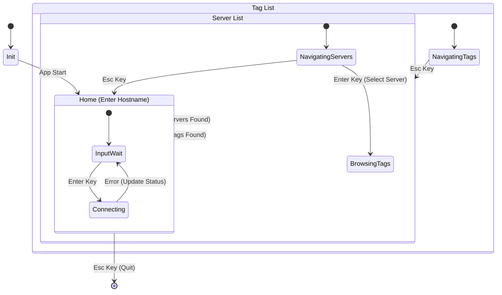

# 🏗️ Architecture: opc-cli

## High-Level Overview
`opc-cli` is a command-line interface tool designed to interact with OPC DA (Data Access) servers. It provides a Terminal User Interface (TUI) for browsing servers and tags, reading values, and monitoring system status.

## Technology Stack
*   **Language**: Rust (2024 Edition)
*   **OS Target**: Windows (Strict) due to OPC DA reliance on COM/DCOM.
*   **TUI Framework**: `ratatui` + `crossterm`.

## Core Components & Crates

### 1. User Interface (TUI)
*   **Crate**: `ratatui`, `crossterm`
*   **Responsibility**: Rendering the interactive UI and handling user input events.
*   **Pattern**: **Elm Architecture (Model-View-Update)**.
    *   **Model**: `AppState` (holds all application data).
    *   **View**: Pure functions rendering `AppState` to `Frame`.
    *   **Update**: Message-passing loop handling `Event` -> `Action` -> `State Mutation`.

### 2. Core Logic & Async Runtime
*   **Crate**: `tokio`
*   **Responsibility**: Driving the main event loop and handling async tasks (though COM interactions are often thread-bound).

### 3. OPC / COM Interaction
*   **Crate**: `opc_da` (Primary), `windows` (Fallback/Low-level)
*   **Responsibility**: Communicating with Local/Remote OPC Servers.
*   **Abstraction**: `trait OpcProvider`
    *   Decouples the UI from the specific OPC implementation.
    *   Enables **Testability** via `mockall` (allowing UI development on non-Windows/dev machines).
    
#### Browse Strategy
The browse implementation handles both flat and hierarchical OPC DA namespaces:
1. `query_organization()` detects namespace type (flat vs hierarchical).
2. **Flat:** Enumerate all `OPC_LEAF` items at root.
3. **Hierarchical:** Recursive depth-first walk using `change_browse_position(DOWN/UP)` + `browse_opc_item_ids(OPC_BRANCH | OPC_LEAF)` + `get_item_id()` for fully-qualified IDs.
4. **Dual safety:** `max_tags` hard cap (500) + 30s timeout to prevent runaway enumeration.
5. **Non-blocking:** Browse runs as a background `tokio::spawn` task; progress reported via `Arc<AtomicUsize>` to the Loading screen.

### 4. Observability
*   **Crate**: `tracing`, `tracing-subscriber`, `tracing-appender`
*   **Responsibility**: Structured logging to **File** (`opc-cli.log`).
    *   **Timing Instrumentation**: Key COM operations (`create_server`, `query_organization`, `browse`) are wrapped in `Instant` timers. Success logs include `elapsed_ms` to identify server performance bottlenecks.
    *   **Context Preservation**: All errors are logged at the point of origin with raw HRESULT codes before being wrapped for the UI.
    *   *Critical*: Since TUI captures stdout/stderr, logs must go to a file for debugging crashes or connection issues.

### 5. Error Handling
*   **Crate**: `anyhow`
*   **Responsibility**: Propagating rich context errors to the UI logic for display in the Status Bar or Error Popups.
*   **Strategy**: 
    1.  **Friendly Hints**: A mapping engine in `opc_impl.rs` translates common technical codes (like licensing or RPC errors) into plain-English advice.
    2.  **Display Chain**: The UI uses `{:#}` formatting to show the full breadcrumb trail of a failure to the user.

## Application State Flow

The application follows a strict state machine to manage user context and navigation.



## Data Flow
```mermaid
graph TD
    User[User Input] --> |Key/Mouse Event| EventLoop[Main Event Loop]
    EventLoop --> |Dispatch| AppUpdate[App::update()]
    
    subgraph Core Logic
        AppUpdate --> |Request Data| OpcProvider[Trait: OpcProvider]
        OpcProvider --> |Call| OpcDa[opc_da Crate / COM]
        OpcDa --> |RPC/DCOM| Server[OPC Server]
        Server --> |Data| OpcDa
        OpcDa --> |Result| AppUpdate
        AppUpdate --> |Mutate| AppState[App State Model]
    end
    
    subgraph Rendering
        AppState --> |Read| View[UI Render Functions]
        View --> |Draw| Terminal[Ratatui / Crossterm]
    end

    subgraph Logging
        AppUpdate --> |Log| Tracing
        OpcProvider --> |Log| Tracing
        Tracing --> |Write| LogFile[opc-cli.log]
    end
```

## Build System

The project uses a dual build system for flexibility:

1.  **Makefile**: The primary entry point for developers on systems with `make`.
    - `make debug`: Fast development build.
    - `make release`: Optimized production build.
    - `make package`: Packages the release build into a ZIP.
2.  **scripts/package.ps1**: A PowerShell script for Windows environments without `make`.
    - Usage: `powershell -File ./scripts/package.ps1 <task>`
    - Supported tasks: `debug`, `release`, `test`, `package`.

## Design Principles
1.  **Testability First**: The UI should be verifiable without a running OPC server via mocks.
2.  **Robustness**: The app must not panic on missing COM servers; it should show error states in the UI.
3.  **Observability**: Since we cannot view stdout, file logging is mandatory for debugging.
