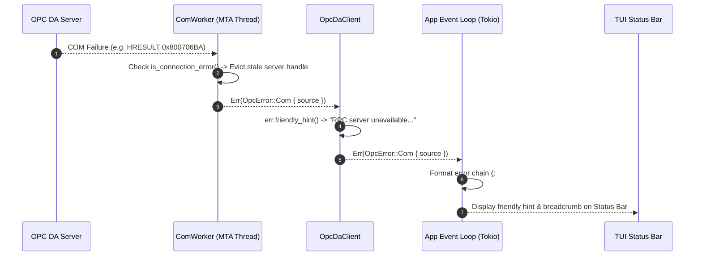

# 🏗️ Architecture: opc-cli

## 1. Project Overview
`opc-cli` is a high-performance, asynchronous Terminal User Interface (TUI) application designed for interacting with OPC DA (Data Access) 2.05a/3.0 servers on Windows. It combines a responsive terminal workspace (`ratatui` + `crossterm`) with a native Windows COM client library (`opc-da-client`) to discover OPC DA servers, recursively browse tag namespaces, monitor real-time value changes, and perform typed tag writes.

## 2. Project Objectives & Key Features

### Primary Objectives
- **Zero-Crash Reliability**: Maintain non-blocking async operation with safe COM thread-apartment isolation so TUI rendering never freezes during slow network or server operations.
- **Legacy Operating System Compatibility**: Full deployment support for legacy NT 6.1 industrial control systems (Windows 7 SP1 / Windows Server 2008 R2 SP1) alongside modern Windows 10/11/Server 2022 targets.
- **Cross-Platform Testability**: Abstract all OPC interactions behind mockable Rust traits so UI state transitions and application logic can be 100% verified on any operating system without a live COM server.

### Key Features
- **Server Discovery**: Enumerate local or remote OPC DA servers registered in the Windows COM registry.
- **Namespace Browsing**: Fast-path flat address space browsing (`OPC_FLAT`) with recursive depth-first fallback and partial-result harvesting on timeout.
- **Real-Time Tag Monitoring**: Continuous 1-second background auto-refresh with value, quality bitmask, and timestamp formatting.
- **Typed Tag Writing**: Interactive write mode supporting `String`, `Int` (`VT_I4`), `Float` (`VT_R8`), and `Bool` (`VT_BOOL`) values.
- **Rich COM Diagnostics**: Automated HRESULT mapping (`OpcError::friendly_hint(&self)`) providing human-readable explanations for cryptic DCOM and OPC error codes.

### Target Users / Audience
- **Control Engineers & Automation Technicians**: Inspecting live OPC DA server tags during commissioning and troubleshooting on shop-floor control systems.
- **SCADA Developers**: Validating server connectivity, item ID syntax, and read/write permissions.
- **Industrial Systems Administrators**: Deploying lightweight diagnostics into air-gapped legacy Windows 7 environments without requiring full SCADA installations or VC++ redistributable packages.

### Non-Goals
- **OPC UA Support**: `opc-cli` explicitly focuses on classic OPC DA (COM/DCOM). OPC UA (TCP/binary) is out of scope.
- **Historical Data Access (OPC HDA)** or **Alarms & Events (OPC A&E)**: Out of scope.

## 3. Language & Runtime
* **Language**: Rust (Edition 2024, MSRV 1.93.1).
* **OS Target**: Windows (Strict) due to OPC DA reliance on Windows COM/DCOM (`windows` crate 0.61.3).
* **Async Runtime**: `tokio` (Multi-thread runtime).
* **TUI Engine**: `ratatui` (v0.29) + `crossterm` (v0.28).
* **Published Crates**: `opc-cli` v0.2.1, `opc-da-client` v0.2.0 (crates.io).

## 4. Project Layout

```
opc-cli/
├── Cargo.toml                  # Workspace root configuration & shared dependencies
├── CHANGELOG.md                # Workspace release history and changelog
├── Makefile                    # Unified CLI frontend for developers (delegates to scripts/)
├── README.md                   # Workspace repository documentation
├── architecture.md             # Technical Source of Truth & architecture specifications
├── context.md                  # Historical decisions & TARS interaction log
├── spec.md                     # Behavioral contracts (if workspace-level)
├── opc-cli/                    # Interactive TUI Application Crate
│   ├── Cargo.toml              # App dependencies (ratatui, crossterm, clap)
│   └── src/
│       ├── main.rs             # Application entrypoint & CLI argument parsing
│       ├── app.rs              # App state machine, event loop & background task polling
│       └── ui.rs               # Ratatui view render functions
├── opc-da-client/              # Native OPC DA Client Library Crate
│   ├── Cargo.toml              # Library dependencies (windows, thiserror)
│   ├── README.md               # Crate documentation for crates.io
│   ├── architecture.md         # Library technical architecture specification
│   ├── spec.md                 # Library behavioral contracts
│   └── src/
│       ├── lib.rs              # Library root & public re-exports (zero unreachables, Default MockOpcDaClient)
│       ├── provider.rs         # OpcProvider trait (read_tag_value, write_tag_values), TagValue, WriteResult, TagCollector (re-exports OpcValue)
│       ├── types.rs            # Canonical domain types (OpcValue, OpcQuality with FromStr), handles (GroupHandle, ItemHandle), ServerIdentifier, browse enums
│       ├── errors.rs           # Canonical OpcError (is_connection_error), OpcResult, OpcOperation, and log_opc_err!
│       ├── com/                # COM subsystem (feature: opc-da-backend)
│       │   ├── mod.rs          # COM module root & re-exports
│       │   ├── client.rs       # OpcDaClient implementation
│       │   ├── connector.rs    # Slim coordinator facade (pure connector submodules, zero raw::memory leak)
│       │   ├── connector/      # Dedicated single-responsibility connector submodules
│       │   │   ├── traits.rs   # Core traits (ServerConnector, ConnectedServer, ConnectedGroup), GroupConfig::ephemeral, pure-Rust DTOs
│       │   │   ├── server.rs   # Win32 COM server connection & namespace navigation (ComConnector, ComServer)
│       │   │   ├── group.rs    # Win32 COM group item registration & I/O (ComGroup) with RAII ItemResultsBlobGuard & VARIANT guards
│       │   │   └── mock.rs     # Pure-Rust mock infrastructure (MockServerConnector, MockConnectedServer, MockConnectedGroup) with fluent builders
│       │   ├── discovery.rs    # Server discovery, OpcServerListCatalog, registry inspection, guid_to_progid
│       │   ├── guard.rs        # RAII COM initialization/teardown (ComGuard), group cleanup (GroupGuard), and browse cursor protection (BrowsePositionGuard)
│       │   ├── iterator.rs     # COM enumerators (StringIterator with RAII drop cleanup, GuidIterator)
│       │   ├── security.rs     # Dynamic DCOM proxy blanketing, RPC authentication level selection, CLSID_OPC_SERVER_LIST
│       │   ├── variant.rs      # Win32 VARIANT & SafeArray conversion, ItemStatesGuard (VariantClear iff ok), ScopedVariant
│       │   ├── worker.rs       # Slim worker facade & ComRequest event loop (ComWorker) with 2-tier catch_unwind & request prioritization
│       │   └── worker/         # Dedicated single-responsibility worker engines
│       │       ├── pool.rs     # Connection caching, active group reuse, eviction & retry dispatch (dispatch_with_retry)
│       │       ├── read.rs     # Synchronous tag reading engine with in-place mutation and zip iteration (handle_read)
│       │       ├── write.rs    # Synchronous tag writing engine with error mapping and ephemeral group config (handle_write)
│       │       ├── browse.rs   # Flat/hierarchical namespace traversal with cooperative chunking & TagCollector::harvest (handle_browse)
│       │       └── tests.rs    # Dedicated worker test suite & mock fixtures (panic recovery tests, 0 warnings)
│       └── raw/                # Crate-internal low-level FFI subsystem (pub(crate))
│           ├── mod.rs          # Raw module root
│           ├── bindings/       # Frozen COM bindings (windgen output, read-only: da, comn)
│           ├── hresult.rs      # Strongly-typed Win32 HRESULT constants & classification
│           ├── memory.rs       # Safe unmanaged COM memory management (RemotePointer, RemoteArray)
│           └── bridge.rs       # Preserved dormant COM bridge structures
├── compat/                     # Windows 7 / NT 6.1 Polyfill DLL Crates (#![no_std])
│   ├── bcrypt-polyfill/       # ProcessPrng -> RtlGenRandom polyfill
│   ├── synch-polyfill/        # WaitOnAddress 1ms Sleep polling polyfill
│   └── winrt-error-polyfill/  # RoOriginateError S_OK stub polyfill
└── scripts/                    # Automation & Quality Gate Pipelines
    ├── package.ps1             # Universal task dispatcher (single source of truth)
    ├── package-win7.ps1        # Standalone NT 6.1 legacy release pipeline & PE patcher
    ├── verify.ps1              # 9-gate quality pipeline runner
    ├── check-logs.ps1           # Log inspector & statistical analyzer
    ├── commit.ps1             # Quality-gated commit & push pipeline
    └── Merge-ToMain.ps1        # Clean release merger dev -> main
```

## 5. Module Boundaries

### `opc-cli` (TUI Application)
- **Owns**: Terminal UI rendering, keyboard input handling, navigation state machine (`CurrentScreen`), background async task spawning (`tokio::spawn`), status bar notifications, and context-aware write parsing with boolean coercion (`App::resolve_write_value`).
- **Does NOT Own**: Raw COM initialization, registry enumeration, OPC group creation, HRESULT interpretation logic.
- **Trait Interfaces**: Consumes `dyn OpcProvider` asynchronously.
- **Mock Availability**: Fully mockable via `MockOpcProvider` (compiled when `feature = "test-support"` is active in `opc-da-client`).

### `opc-da-client` (Core Client Library)
- **Owns**: Public API (`OpcProvider` with `read_tag_value` and `write_tag_values` defaults), canonical domain types in `types.rs` (`OpcValue`, `OpcQuality` with `FromStr`, `ServerIdentifier`, encapsulated `GroupHandle` and `ItemHandle`), data structs (`TagValue` with `error: Option<OpcError>`, `WriteResult`, `TagCollector` with $O(1)$ `harvest`, `TagBatch` enum, `IntoTags` trait, `TagValues` collection with lenient typed extractions and numeric coercion, `TagExtractError`), error definitions (`OpcError::is_connection_error`), inherent diagnostic method (`OpcError::friendly_hint`), RAII group and cursor management (`GroupGuard`, `BrowsePositionGuard`), server discovery (`com::discovery`), and modular connector coordinator facade (`com::connector`).
- **Does NOT Own**: Terminal rendering, direct COM worker loop implementation.
- **Trait Interfaces**: Exports `OpcProvider`.
- **Mock Availability**: Provides `MockOpcProvider` via `mockall`, and exports `MockOpcDaClient` type alias and `Default` implementation under `all(feature = "test-support", feature = "opc-da-backend")`.

### `opc-da-client::com::client` (Public Client Implementation)
- **Owns**: Public concrete `OpcDaClient` struct implementing `OpcProvider`, fluent builder `OpcDaClientBuilder` (`builder()`), server-bound constructors (`connect`, `connect_remote`), inherent async readers and writers (`read_tag_values`, `read_f64`, `read_i32`, `read_bool`, `read_string`, `write`, `write_batch`), remote server discovery (`list_servers_on`), Layer 2 subscription polling stream (`subscribe`), request dispatch channel management (`mpsc::Sender<ComRequest>`), and public constructors (`OpcDaClient::new`).
- **Does NOT Own**: In-apartment Win32 COM operations, unmanaged memory pointers, or direct FFI calls (all delegated across channels to `ComWorker`).
- **Trait Interfaces**: Implements `OpcProvider`.
- **Mock Availability**: `MockOpcDaClient` alias available under `all(feature = "test-support", feature = "opc-da-backend")`.

### `opc-da-client::com::iterator` (Safe COM Enumerators)
- **Owns**: Safe RAII wrapper for native Windows COM `IEnumString` enumerator with internal batch zeroing, null-PWSTR skipping, and clean drop memory deallocation, plus in-memory simulated vectors (`from_vec`) for mock testing.
- **Does NOT Own**: COM apartment management or worker thread scheduling.
- **Trait Interfaces**: `Iterator<Item = OpcResult<String>>`.
- **Mock Availability**: Fully tested via pure in-memory `from_vec` test fixtures.

### `opc-da-client::com::security` (DCOM Security & Blanketing)
- **Owns**: Dynamic DCOM proxy security blanketing (`apply_proxy_blanket`), RPC authentication level selection (`authn_level_for`), standard OPCEnum CLSID constant (`CLSID_OPC_SERVER_LIST`), and Win32 RPC security constants (`RPC_C_*`).
- **Does NOT Own**: Server connection management (`com::connector::server`), catalog traversal (`com::discovery`), or COM message loop (`com::worker`).
- **Trait Interfaces**: Pure functional security procedures.
- **Mock Availability**: N/A (stateless helpers operating on Win32 COM interfaces).

### `opc-da-client::raw::memory` (Unmanaged COM Memory Allocator)
- **Owns**: RAII wrappers for unmanaged Win32 COM memory allocations (`RemoteArray<T>`, `RemotePointer<T>`, `LocalPointer<T>`), guaranteeing safe deallocation via `CoTaskMemFree` on `Drop`, move-only ownership, and zero-allocation slice projections.
- **Does NOT Own**: Higher-level COM abstractions, domain models, or thread synchronization.
- **Trait Interfaces**: `TryFromNative`, `TryToNative`.
- **Mock Availability**: N/A (sealed internal FFI memory abstraction, verified by co-located unit tests).

### `opc-da-client::raw::bridge` (C-ABI Translation Records)
- **Owns**: Low-level C-compatible struct representations of Win32 OPC DA items (`tagOPCITEMDEF`, `tagOPCITEMRESULT`, `tagOPCITEMSTATE`), conversion traits, and safe RAII blob deallocators (`ItemResultsBlobGuard`).
- **Does NOT Own**: Domain types, COM interface dispatch, or public API exports.
- **Trait Interfaces**: `IntoBridge`, `TryFromNative`.
- **Mock Availability**: N/A (sealed internal FFI structures).

### `ComWorker` (MTA Worker Thread Pool)
- **Owns**: Dedicated OS background thread, 2-tier `catch_unwind` panic resilience with priority queue dispatch favoring reads and writes over background browses, `CoInitializeEx(MTA)` lifecycle (`ComGuard`), connection pool caching keyed by `ServerIdentifier` with active group reuse (`PooledServer`), 5-second failure cooldown circuit breaker, native batch writes (`handle_write_batch`), transparent stale connection eviction on RPC errors (`0x800706BA`), and modular worker dispatch engines (`pool::dispatch_with_retry`, `read::handle_read`, `write::handle_write`, `browse::handle_browse`).
- **Does NOT Own**: TUI state, UI rendering, high-level task timeouts.
- **Trait Interfaces**: Uses internal `ServerConnector` trait and connector submodules (`com::connector::{traits, server, group, mock}`).
- **Mock Availability**: Fully unit-tested via modular `MockServerConnector` (exported under `feature = "test-support"`).

### `compat/*` (NT 6.1 Polyfill Crates)
- **Owns**: C-ABI DLL exports for missing Windows 8+ APIs (`WaitOnAddress`, `ProcessPrng`, `RoOriginateError`).
- **Does NOT Own**: Standard Rust library (`#![no_std]`), workspace Cargo builds (excluded from workspace).
- **Trait Interfaces**: C-ABI Exported DLL functions.
- **Mock Availability**: Tested via `verify.ps1` standalone release builds.

## 6. Dependency Direction Rules

| Module | May Import | Must NOT Import |
|:---|:---|:---|
| `opc-cli` (Core App: `app.rs`, `ui.rs`) | `opc-da-client` (`OpcProvider` trait, `OpcValue`, `TagValue`, `WriteResult`, `TagCollector`, `OpcError`), `ratatui`, `crossterm`, `tokio`, `tracing` (Note: `opc-cli/src/main.rs` serves as Composition Root wiring concrete client or mocks) | Direct Windows COM APIs (`windows::Win32::System::Com`), `com::client` / `com::worker` concrete types |
| `opc-da-client::provider` | `types`, `errors`, `chrono`, `thiserror`, `async-trait`, `windows-core` (`GUID`) | `windows`, `ratatui`, `crossterm`, `tokio`, `com`, `raw`, `serde` |
| `opc-da-client::types` | `errors`, `windows-core` (`GUID`) | `provider`, `com`, `raw`, `windows` |
| `opc-da-client::errors` | `windows-core` (HRESULT), `raw::hresult` | `provider`, `types`, `com` |
| `opc-da-client::com::client` | `provider`, `types`, `errors`, `com::worker` | `raw` |
| `opc-da-client::com::worker` | `types`, `errors`, `com::connector`, `com::variant`, `com::guard`, `tokio::sync` | `raw` |
| `opc-da-client::com::connector` | `types`, `errors`, `com::variant`, `com::discovery` (`guid_to_progid`), `com::security`, `raw`, `windows` | `provider` |
| `opc-da-client::com::security` | `errors`, `windows` | `com::connector`, `com::discovery`, `com::worker`, `com::client` |
| `opc-da-client::com::discovery` | `types`, `errors`, `com::security`, `com::iterator`, `raw`, `windows` | `com::client`, `com::worker`, `com::connector` |
| `opc-da-client::com::guard` | `com::connector`, `types`, `errors`, `windows` | `provider`, `raw` |
| `opc-da-client::com::iterator` | `raw::memory`, `raw::hresult`, `types`, `errors`, `windows` | `provider`, `com::worker` |
| `opc-da-client::com::variant` | `types` (`OpcValue`), `raw::hresult`, `windows` | `com::client`, `com::worker`, `com::connector` |
| `opc-da-client::raw` | `windows-core`, `types`, `errors` | `com`, `provider` |
| `compat/*` (Polyfills) | `core`, `windows-sys` / raw Win32 FFI | `std`, `tokio`, `opc-cli`, `opc-da-client` |

## 7. Toolchain

The project uses a unified dual-interface build system:

1. **Makefile**: The primary CLI entry point for developers. All complex multi-step workflows delegate directly to PowerShell scripts.
   - `make debug`: Fast development build (`cargo build`).
   - `make release` / `make build`: Optimized production build (`cargo build --release`).
   - `make test`: Quick unit test run (`cargo test`).
   - `make verify`: Executes 9-gate quality pipeline (`pwsh scripts/verify.ps1`).
   - `make package`: Builds modern (Win10+) release bundle into `dist/opc-cli-x64.zip`.
   - `make package-win7`: Builds legacy (Win7/Server 2008 R2) release bundle into `dist/opc-cli-win7-x64.zip`.
   - `make logs`: Runs log inspector (`pwsh scripts/check-logs.ps1`).
   - `make commit MSG="..."`: Runs quality gate, commits, and pushes to remote (`pwsh scripts/commit.ps1`).
   - `make release-merge`: Clean release merge from `dev` to `main` (`pwsh scripts/Merge-ToMain.ps1`).
   - `make clean`: Cleans build artifacts and `dist/` directory.

2. **scripts/package.ps1**: Single PowerShell task dispatcher for all workspace operations.
   - Usage: `pwsh -File ./scripts/package.ps1 -Task <task>`
   - Supported tasks: `debug`, `release`, `build`, `test`, `verify`, `package`, `package-win7`, `logs`, `commit`, `release-merge`.

3. **scripts/package-win7.ps1**: Dedicated legacy packaging pipeline that compiles polyfills, PE-patches the binary, and bundles redistributables.
4. **scripts/verify.ps1**: Universal 9-gate quality pipeline (formatter, linter, doc-tests, workspace tests, feature independence check, polyfill compilation, AST-grep scan, forbidden pattern scanner, PowerShell script syntax & strict mode check).
5. **scripts/check-logs.ps1**: Log inspector and deep analysis utility.
6. **scripts/commit.ps1**: Quality-gated commit & push pipeline.
7. **scripts/Merge-ToMain.ps1**: Automated clean release merge tool.

## 8. Error Handling Strategy

- **Library Domain Errors**: `OpcError` (defined in `opc-da-client`) handles domain failures via `thiserror` across 7 structured variants: `Com`, `Connection`, `Server`, `Conversion`, `InvalidState`, `NotImplemented`, and `Internal`.
- **Connection Failure Factory & Predicates**: `OpcError::connection_failed(source)` constructs actionable connection failures, while `OpcError::is_connection_error(&self)` identifies recoverable transport/RPC dropouts.
- **Friendly Hint Engine**: `OpcError::friendly_hint(&self)` and `raw::hresult::friendly_hresult_hint` map technical HRESULT codes (e.g. `0x800706BA` RPC Unavailable, `0x80070005` DCOM Access Denied) to actionable plain-English text.
- **RAII Resource & Cursor Management (`GroupGuard`, `BrowsePositionGuard`)**: Temporary COM groups created during `read_tag_values` and `write_tag_value` are guarded by `GroupGuard<'_, S: ConnectedServer>`, guaranteeing deterministic `remove_group(handle, true)` invocation on `Drop` across all return paths, `?` operator exits, and thread panics. Namespace browsing uses `BrowsePositionGuard` to deterministically restore parent cursor position (`BrowseDirection::Up`) across error returns and thread panics.
- **RAII Memory Safety Guards (`ScopedVariant`, `ItemStatesGuard`, `ItemResultsBlobGuard`)**: Win32 COM `VARIANT` allocations are strictly encapsulated in RAII drop guards: `ScopedVariant` guarantees deterministic `VariantClear` on `Drop` across tag write paths; `ItemStatesGuard` wraps `tagOPCITEMSTATE` slices across read paths, ensuring `VariantClear` is executed across all element variants before unmanaged memory is freed; `ItemResultsBlobGuard` wraps `tagOPCITEMRESULT` arrays and cleans up allocated blob pointers on `Drop`.
- **Breadcrumb Chains**: TUI uses `anyhow` displaying `{:#}` full error chains in status popups.
- **No Swallowed Errors**: All fallible COM and background task operations propagate `Result<T, OpcError>`.

## 9. Observability & Logging

- **Framework**: `tracing` + `tracing-subscriber` + `tracing-appender-localtime`.
- **Target**: Rolling log file `logs/opc-cli.log` (stdout is reserved for Ratatui TUI rendering).
- **Instrumentation**: Function-level tracing spans (`#[tracing::instrument]`) are uniformly applied across all architectural tiers:
  - **COM Gateway & FFI (`connector.rs`, `guard.rs`, `discovery.rs`)**: MTA apartment initialization (`ComGuard::new`), server enumeration, server connection, group creation, registry inspection (`inspect_local_registration`), and item read/write with automatic error recording (`err`).
  - **Worker Dispatch & Traversal (`worker.rs`)**: Request dispatch with connection retry (`dispatch_with_retry`), group management, reading, writing, and hierarchical/flat namespace browsing (`browse_recursive`).
  - **Public Provider (`client.rs`)**: Public `OpcProvider` trait methods (`list_servers`, `list_server_details`, `browse_tags`, `read_tag_values`, `write_tag_value`).
  - **Application Layer (`app.rs`)**: User actions (`start_fetch_servers`, `start_browse_tags`, `start_read_values`, `start_write_value`).
  - High-volume payload vectors (`tag_ids`, `items`, `server_handles`, `values`) are explicitly skipped in instrumentation attributes to eliminate serialization overhead during high-frequency polling.
- **Two-Tier Diagnostics**:
  - **Dynamic Field Tier**: Runtime verbosity count flags `-v` (debug) / `-vv` (trace) mapped to `EnvFilter` levels to dynamically control logging without recompilation.
  - **Compile-Time Dev Tier**: Opt-in `dev-diagnostics` Cargo feature that compiles verbose trace-level MTA request/response argument dumps into `ComWorker` method executions.
- **Structured Error Logging**: Strongly-typed `OpcOperation` enum and `log_opc_err!` macro emit unified machine-parseable `tracing::error!` events containing `operation`, `hresult`, `hint`, `chain`, and contextual fields (`server`, `tag`, `value`, `depth`, `branch`). Eliminates duplicate double logging and stringly-typed operation identifiers.
- **State Audits**: Centralized screen transition auditing hook (`App::log_transition()`) logs all transitions with named info fields.
- **Log Inspector**: `scripts/check-logs.ps1` provides log scanning, severity filtering, timing statistics, and deep analysis modes:
  - **§E: HRESULT Aggregation**: Accumulates top 10 HRESULT failure codes.
  - **§F: State Transition Sequence Validation**: Analyzes screen transition sequence integrity against an allowed state flow whitelist.

## 10. Testing Strategy

- **Unit Testing**: Mock-based testing using `MockOpcProvider` (`mockall`). TUI navigation flow, state transitions (`CurrentScreen`), search cycling, context-aware write parsing with boolean coercion (`App::resolve_write_value`), and ring-buffer logic are verified without Windows COM dependencies (39 unit tests in `opc-cli`).
- **COM Worker & Memory Safety Testing**: `ComWorker`, `com/discovery.rs`, `com/variant.rs` (`ScopedVariant`, `ItemStatesGuard`), `com/connector/` submodules (`traits.rs`, `server.rs`, `group.rs`, `mock.rs`), `com/security.rs`, `raw/memory.rs`, and `raw/bridge.rs` unit tests use `MockServerConnector` and synthetic allocations to test write paths, tag browsing (flat, hierarchical, cancellation, capacity limits), server connection pooling, active group caching, stale connection eviction, 2-tier panic isolation and recovery (`test_worker_thread_recovery_after_panic`), worker drop behaviors, tracing instrumentation execution, `GroupGuard` automatic drop cleanup on `add_items` failure, registry inspection validation, non-cloneable remote pointer safe drop, safe slice copying, blob guard double-free prevention, and zero-leak COM memory guards (150 unit tests in `opc-da-client`, 189 total workspace unit tests).
- **Doc Testing**: Public API items include runnable doc tests verified via `cargo test --doc -p opc-da-client --all-features` (33 doc-tests, including pure-Rust mocking examples in `README.md`, `types.rs`, and `com/client.rs`).
- **Polyfill Build Gates**: Independent compilation of `compat/*` polyfill crates inside `scripts/verify.ps1`.
- **AST-Grep Structural Safety Gates**: `sg scan` enforcement of zero unwrap/expect in production library code and mandatory `// SAFETY:` rationale on all unsafe blocks. Rules are validated via ast-grep unit tests before static scans.
- **Forbidden Macro Scanner**: Automated `rg` scan ensuring zero `println!`, `dbg!`, or `todo!` macros in `opc-da-client/src/`.

## 11. Documentation Conventions

- **Rustdoc Comments**: All public types and methods require `///` doc comments detailing purpose, arguments, returns, and errors. Crate roots require `//!` module overviews.
- **Behavioral Contracts**: `spec.md` files (e.g. `opc-da-client/spec.md`) maintain the behavioral contracts for public traits and structs, verified against source code via `> Last verified against: <hash>`.
- **Architecture Sync**: `architecture.md` serves as the Technical Source of Truth for system layout and design patterns.

## 12. Dependencies & External Systems

- **Windows COM/DCOM**: Core OS dependency for OPC DA. Requires registered OPC Core Components (`opcproxy.dll`, `opccomn_ps.dll`).
- **`windows` crate (0.61.3)**: Windows Win32 API bindings (`Win32_System_Com`, `Win32_System_Variant`, `Win32_System_Ole`).
- **`ratatui` (0.29.0) / `crossterm` (0.28.1)**: Terminal user interface framework.
- **Cargo Feature Flags**: `dev-diagnostics` — opt-in trace-level diagnostic dumps for development builds. See `spec.md` § Feature Flags for the full feature matrix.

## 13. Architecture Diagrams

### Application State Flow
```mermaid
stateDiagram-v2
    [*] --> Init
    Init --> Home : App Start
    
    state "Home (Enter Hostname)" as Home {
        [*] --> InputWait
        InputWait --> Loading : Enter Key (Fetch Servers)
        InputWait --> Exiting : Esc Key / Ctrl+C
    }

    state "Loading (Background Async Task)" as Loading {
        [*] --> InFlight
        InFlight --> ServerList : Fetch Servers Complete
        InFlight --> TagValues : Read Values Complete
        InFlight --> TagValues : Write Value Complete
        InFlight --> Home : Error / Cancel (Esc)
    }

    state "Server List" as ServerList {
        [*] --> NavigatingServers
        NavigatingServers --> TagList : Enter Key (Select Server & Browse)
        NavigatingServers --> Home : Esc Key
    }

    state "Tag List" as TagList {
        [*] --> NavigatingTags
        NavigatingTags --> SearchMode : S Key
        SearchMode --> NavigatingTags : Esc Key
        NavigatingTags --> Loading : Enter Key (Read Selected)
        NavigatingTags --> ServerList : Esc Key
    }

    state "Tag Values" as TagValues {
        [*] --> ViewingValues
        ViewingValues --> WriteInput : W Key
        ViewingValues --> TagList : Esc Key
        ViewingValues --> Loading : R Key (Manual Refresh)
    }

    state "Write Input" as WriteInput {
        [*] --> EnteringValue
        EnteringValue --> Loading : Enter Key (Contextual Parse & Send)
        EnteringValue --> TagValues : Esc Key
    }

    Home --> Exiting : Esc Key (Quit)
    Exiting --> [*]
```

### Data Flow
```mermaid
graph TD
    User[User Input] --> |Key/Mouse Event| EventLoop[Main Event Loop]
    EventLoop --> |Dispatch| AppUpdate[App::update()]
    
    subgraph Core Logic
        AppUpdate --> |Request Data| OpcProvider[Trait: OpcProvider]
        OpcProvider --> |Call| Lib[opc-da-client]
        Lib --> |COM/DCOM| Server[OPC Server]
        Server --> |Data| Lib
        Lib --> |Result| AppUpdate
        AppUpdate --> |Mutate| AppState[App State Model]
    end
    CLI["opc-cli (Composition Root in main.rs)"]
    subgraph "opc-da-client"
        Provider["trait OpcProvider"]
        Client["com::client (OpcDaClient)"]
        Worker["com::worker (ComWorker MTA)"]
        Connector["com::connector (ServerConnector / ComConnector)"]
        Discovery["com::discovery (OpcServerListCatalog)"]
        Security["com::security (apply_proxy_blanket)"]
        Bindings["raw::bindings (OPCDA/OPCCOMN)"]
    end
    CLI --> Provider --> Client --> Worker --> Connector
    Connector --> Discovery
    Connector --> Security
    Discovery --> Security
    Connector --> Bindings --> WinCOM["Windows COM/DCOM"]
    Discovery --> Bindings
    
    subgraph Rendering
        AppState --> |Read| View[UI Render Functions]
        View --> |Draw| Terminal[Ratatui / Crossterm]
    end

    subgraph Logging
        AppUpdate --> |Log| Tracing
        OpcProvider --> |Log| Tracing
        Tracing --> |Write| LogFile[logs/opc-cli.log]
    end
```

### Error Propagation Flow

```mermaid
sequenceDiagram
    autonumber
    participant Server as OPC DA Server
    participant Worker as ComWorker (MTA Thread)
    participant Client as OpcDaClient
    participant App as App Event Loop (Tokio)
    participant UI as TUI Status Bar

    Server-->>Worker: COM Failure (e.g. HRESULT 0x800706BA)
    Worker->>Worker: Check is_connection_error() -> Evict stale server handle
    Worker-->>Client: Err(OpcError::Com { source })
    Client->>Client: err.friendly_hint() -> "RPC server unavailable..."
    Client-->>App: Err(OpcError::Com { source })
    App->>App: Format error chain {:#}
    App-->>UI: Display friendly hint & breadcrumb on Status Bar
```

## 14. Known Constraints & Technical Debt

- **NT 6.1 Import Patching**: Windows 7 lacks `GetSystemTimePreciseAsFileTime`. `scripts/package-win7.ps1` binary-patches the import table to `GetSystemTimeAsFileTime`.
- **StringIterator Bug Workaround (OPC-BUG-001)**: Handled internally by `StringIterator` zeroing cache and skipping null `PWSTR` entries.
- **Windows COM Single-Threaded Apartment Constraints**: Managed by routing all COM operations through `ComWorker` on a dedicated MTA thread.
- **Tag Browsing Cooperative Cancellation**: Long-running tag browses cooperatively check `TagCollector::is_cancelled()` across recursion and chunk boundaries, preventing async timeout worker thread starvation.
- **DCOM Packet Integrity Hardening (Windows KB5004442)**: Modern Windows releases enforce RPC packet integrity authentication (`RPC_C_AUTHN_LEVEL_PKT_INTEGRITY`) for DCOM activations. `opc-da-client` automatically applies security proxy blankets (`apply_proxy_blanket`) using packet integrity. For legacy environments (e.g. Windows 7 SP1 / Server 2008 R2), call `.with_legacy_dcom(true)` to fall back to `RPC_C_AUTHN_LEVEL_CONNECT`.
- **Dual-Phase Failure Cooldown Circuit Breaker**: Unresponsive remote host endpoints trigger a 5-second failure cooldown recorded in `ConnectionPool::failure_cooldowns`. Subsequent connection or reconnect attempts within the 5-second window immediately short-circuit with a cached connection error, preventing RPC thread freezes and reconnection storms.
- **Collision-Proof Group Naming**: Active and ephemeral OPC group names are generated using the process ID combined with an atomic sequence counter (`format!("opc-{:x}-{:x}", pid, seq)`). This eliminates COM group name collisions across multiple client instances or rapid reconnection cycles.

## 15. Data Model
- Application state is managed in-memory via `App` struct model. No persistent database or SQL storage is required.

## 16. Environment Configuration
- Local Windows console execution. Configuration parameters (target hostname, max tags, timeouts) are supplied via CLI flags (`clap`) or UI prompt input.
