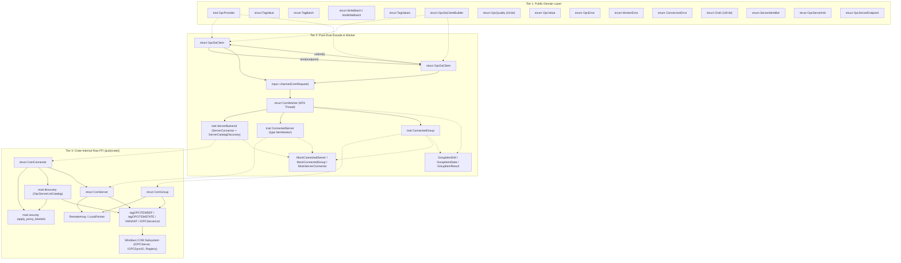
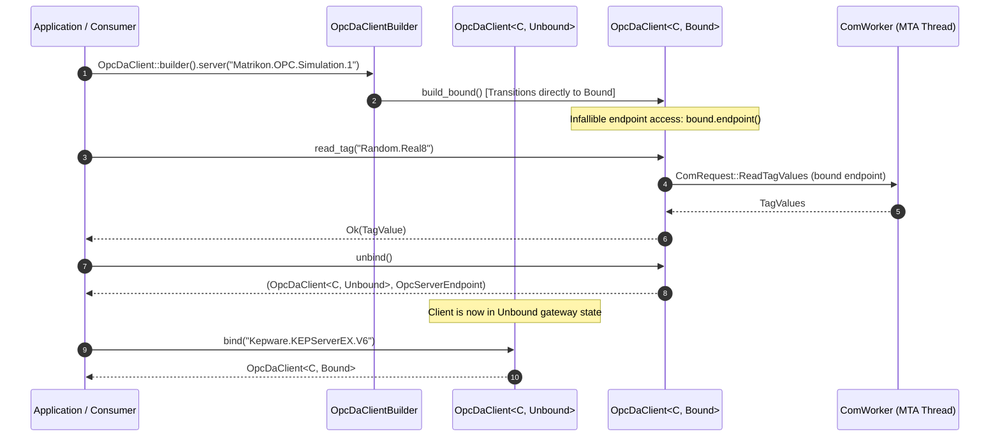
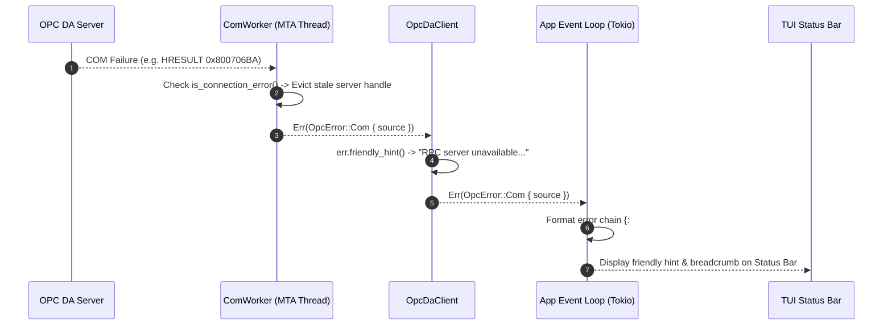

# 🏗️ Architecture: opc-cli

## 1. Project Overview
`opc-cli` is a high-performance, asynchronous Terminal User Interface (TUI) application designed for interacting with OPC DA (Data Access) 2.05a/3.0 servers on Windows. It combines a responsive terminal workspace (`ratatui` + `crossterm`) with a native Windows COM client library (`opc-da-client`) to discover OPC DA servers, recursively browse tag namespaces, monitor real-time value changes, and perform typed tag writes.

## 2. Project Objectives & Key Features

### Primary Objectives
- **Zero-Crash Reliability**: Maintain non-blocking async operation with safe COM thread-apartment isolation so TUI rendering never freezes during slow network or server operations.
- **Legacy Operating System Compatibility**: Full deployment support for legacy NT 6.1 industrial control systems (Windows 7 SP1 / Windows Server 2008 R2 SP1) alongside modern Windows 10/11/Server 2022 targets.
- **Cross-Platform Testability**: Abstract all OPC interactions behind mockable Rust traits so UI state transitions and application logic can be 100% verified on any operating system without a live COM server.

### Key Features
- **Server Discovery**: Enumerate local or remote OPC DA servers registered in the Windows COM registry.
- **Namespace Browsing**: Fast-path flat address space browsing (`OPC_FLAT`) with recursive depth-first fallback and partial-result harvesting on timeout.
- **Real-Time Tag Monitoring**: Continuous 1-second background auto-refresh with value, quality bitmask, and timestamp formatting.
- **Typed Tag Writing**: Interactive write mode supporting `String`, `Int` (`VT_I4`), `Float` (`VT_R8`), and `Bool` (`VT_BOOL`) values.
- **Rich COM Diagnostics**: Automated HRESULT mapping (`OpcError::friendly_hint(&self)`) providing human-readable explanations for cryptic DCOM and OPC error codes.

### Target Users / Audience
- **Control Engineers & Automation Technicians**: Inspecting live OPC DA server tags during commissioning and troubleshooting on shop-floor control systems.
- **SCADA Developers**: Validating server connectivity, item ID syntax, and read/write permissions.
- **Industrial Systems Administrators**: Deploying lightweight diagnostics into air-gapped legacy Windows 7 environments without requiring full SCADA installations or VC++ redistributable packages.

### Non-Goals
- **OPC UA Support**: `opc-cli` explicitly focuses on classic OPC DA (COM/DCOM). OPC UA (TCP/binary) is out of scope.
- **Historical Data Access (OPC HDA)** or **Alarms & Events (OPC A&E)**: Out of scope.

## 3. Language & Runtime
* **Language**: Rust (Edition 2024, MSRV 1.93.1).
* **OS Target**: Windows (Strict) due to OPC DA reliance on Windows COM/DCOM (`windows` crate 0.61.3).
* **Async Runtime**: `tokio` (Multi-thread runtime).
* **Async Traits**: Rust 2024 native async trait methods returning `impl Future<Output = ...> + Send` (zero-allocation AFIT, completely eliminating `async-trait` dependency and `Pin<Box<dyn Future>>` heap indirection).
* **TUI Engine**: `ratatui` (v0.29) + `crossterm` (v0.28).
* **Published Crates**: `opc-cli` v0.2.1, `opc-da-client` v0.2.0 (crates.io).

## 4. Project Layout

```
opc-cli/
├── Cargo.toml                  # Workspace root configuration & shared dependencies
├── CHANGELOG.md                # Workspace release history and changelog
├── Makefile                    # Unified CLI frontend for developers (delegates to scripts/)
├── README.md                   # Workspace repository documentation
├── architecture.md             # Technical Source of Truth & architecture specifications
├── context.md                  # Historical decisions & TARS interaction log
├── .ast-grep/                  # Structural AST lint rules (no-panic-or-unwrap, require-safety-comment, etc.)
├── opc-cli/                    # Interactive TUI Application Crate
│   ├── Cargo.toml              # App dependencies (ratatui, crossterm, clap)
│   ├── tests/                  # Integration tests (app_deref_regression)
│   └── src/
│       ├── main.rs             # Application entrypoint & CLI argument parsing
│       ├── lib.rs              # Re-export root and test harness definitions
│       ├── app.rs              # App state machine (6 sub-states: Navigation, Dialog, AutoRefresh, Tasks, Search, View), AppAction & background task polling
│       └── ui.rs               # Ratatui view render functions (zero-allocation [Cell; 4] stack rows)
├── opc-da-client/              # Native OPC DA Client Library Crate
│   ├── Cargo.toml              # Library dependencies (windows, thiserror)
│   ├── README.md               # Crate documentation for crates.io
│   ├── architecture.md         # Library technical architecture specification
│   ├── spec.md                 # Library behavioral contracts
│   ├── tests/                  # Integration test suites (batch_write, handle_type_safety, mock_contract, typestate_client)
│   └── src/
│       ├── lib.rs              # Library root & public re-exports (zero unreachables, Default MockOpcDaClient)
│       ├── provider.rs         # Segregated role traits (ServerDiscovery, TagBrowser, TagReader, TagWriter) & composite OpcProvider (AFIT native async), TagValue, WriteResult, TagCollector
│       ├── types.rs            # Re-export parent module for domain types
│       ├── client/             # Typestate client subsystem (Unbound gateway vs Bound session)
│       │   ├── mod.rs          # Subsystem root, OpcDaClient, re-exports
│       │   ├── builder.rs      # Fluent builder (OpcDaClientBuilder)
│       │   ├── typestate.rs    # Compile-time typestates (Unbound, Bound)
│       │   ├── session.rs      # Inherent session methods sealed to Bound (read, write, subscribe)
│       │   ├── subscription.rs # Subscription polling stream with shareable tag batches
│       │   ├── gateway.rs      # Gateway operations for Unbound client (bind, bind_remote, list_servers, list_server_details)
│       │   └── tests.rs        # Comprehensive client facade unit tests
│       ├── types/              # Decomposed modular domain types subsystem
│       │   ├── clsid.rs        # Clsid 128-bit COM Class ID representation with ParseClsidError
│       │   ├── handles.rs      # Type-safe handles (ClientGroupHandle, ServerGroupHandle, ClientItemHandle, ServerItemHandle)
│       │   ├── value.rs        # OpcValue and zero-allocation display adapters
│       │   ├── quality.rs      # Strongly-typed OpcQuality, QualityMajor, QualityLimit, QualitySubstatus
│       │   ├── browse.rs       # BrowseType, BrowseDirection, NamespaceType with Win32 discriminants
│       │   ├── vartype.rs      # VarType and BaseVarType strongly-typed COM Automation type discriminants
│       │   ├── server.rs       # ServerIdentifier, OpcServerEndpoint, OpcServerInfo, ServerStatus, GroupState
│       │   ├── batch.rs        # TagBatch zero-allocation batching and into_shareable
│       │   ├── collection.rs   # TagValue, TagSuccess, TagFailure, TagResult, TagValues collection
│       │   ├── collector.rs    # TagCollector with RwLock concurrency and zero-copy harvest
│       │   ├── write_batch.rs  # WriteBatch 5-variant layout + 31-byte stack SSO, IntoWriteBatch, WriteBatchIter, WriteResult
│       │   └── tests.rs        # Domain type test suite
│       ├── errors/             # Hierarchical error subsystem
│       │   ├── hresult.rs      # Unconditional Win32 COM HRESULT constants & classification
│       │   ├── worker.rs       # WorkerError (thread panic, channel closures, init failure)
│       │   └── conversion.rs   # ConversionError (browse types, endpoints, type mismatch)
│       ├── errors.rs           # Canonical composite OpcError (wrapping WorkerError, ConversionError), OpcResult, and log_opc_err!
│       ├── connector.rs        # Pure-Rust Tier 2 SPI connector module root (unconditional re-exports)
│       ├── connector/          # Pure-Rust Tier 2 SPI connector subsystem (compiles offline on Linux/macOS)
│       │   ├── traits.rs       # Core SPI traits (ServerConnector, ConnectedServer with associated ItemIterator, ConnectedGroup)
│       │   ├── guard.rs        # Pure-Rust SPI resource guards (GroupGuard, BrowsePositionGuard)
│       │   └── mock/           # Pure-Rust mock infrastructure submodules (state, group, server, connector)
│       ├── com/                # COM subsystem (sealed pub(crate) mod com; gated behind opc-da-backend)
│       │   ├── mod.rs          # COM module root & re-exports
│       │   ├── connector.rs    # Slim coordinator facade (pure connector submodules, zero raw::memory leak)
│       │   ├── connector/      # Dedicated COM connector implementations & SPI routing
│       │   │   ├── server.rs   # Win32 COM server connection & namespace navigation (ComConnector, ComServer)
│       │   │   └── group.rs    # Win32 COM group item registration & I/O (ComGroup) with RAII ItemResultsBlobGuard & VARIANT guards
│       │   ├── discovery.rs    # Server discovery, OpcServerListCatalog, registry inspection, guid_to_progid
│       │   ├── guard.rs        # RAII COM initialization/teardown (ComGuard)
│       │   ├── iterator.rs     # COM enumerators (StringIterator with RAII drop cleanup, GuidIterator)
│       │   ├── security.rs     # Generic DCOM activation (create_remote_instance<T>), dynamic proxy blanketing, RPC authn levels
│       │   ├── variant.rs      # Win32 VARIANT & SafeArray conversion, ItemStatesGuard (VariantClear iff ok), ScopedVariant
│       │   ├── worker.rs       # Slim worker facade & ComRequest event loop (ComWorker) with 2-tier catch_unwind & request prioritization
│       │   └── worker/         # Dedicated single-responsibility worker engines (pub(crate))
│       │       ├── pool.rs     # Connection caching, active group reuse, eviction & retry dispatch (dispatch_with_retry)
│       │       ├── read.rs     # Synchronous tag reading engine with in-place mutation and zip iteration (handle_read)
│       │       ├── write.rs    # Synchronous tag writing engine with error mapping and ephemeral group config (handle_write)
│       │       ├── browse.rs   # Flat/hierarchical namespace traversal with cooperative chunking & TagCollector::harvest (handle_browse)
│       │       └── tests.rs    # Dedicated worker test suite & mock fixtures (panic recovery tests, 0 warnings)
│       └── raw/                # Crate-internal low-level FFI subsystem (pub(crate))
│           ├── mod.rs          # Raw module root
│           ├── bindings/       # Frozen COM bindings (windgen output, read-only: da, comn)
│           └── memory.rs       # Safe unmanaged COM memory management (RemotePointer, RemoteArray)
├── compat/                     # Windows 7 / NT 6.1 Polyfill DLL Crates (#![no_std], std unit-tested)
│   ├── bcrypt-polyfill/       # ProcessPrng -> RtlGenRandom polyfill (256 MiB chunking, null-safe)
│   ├── synch-polyfill/        # WaitOnAddress polling polyfill (naturally aligned, volatile reads)
│   └── winrt-error-polyfill/  # RoOriginateError S_OK stub polyfill
└── scripts/                    # Automation & Quality Gate Pipelines
    ├── package.ps1             # Universal task dispatcher (single source of truth)
    ├── package-win7.ps1        # Standalone NT 6.1 legacy release pipeline & PE patcher
    ├── verify.ps1              # 9-gate quality pipeline runner
    ├── check-logs.ps1           # Log inspector & statistical analyzer
    ├── commit.ps1             # Quality-gated commit & push pipeline
    └── Merge-ToMain.ps1        # Clean release merger dev -> main
```

## 5. Module Boundaries

### `opc-cli` (TUI Application)
- **Owns**: Terminal UI rendering (`ui.rs`), keyboard input handling (`main.rs`), and decomposed application state machine (`app.rs`):
  - `NavigationState`: Screen navigation (`CurrentScreen`), history tracking (`previous_screen`), and cursor indexes for server and tag lists.
  - `DialogState`: Contextual input buffers (`host_input`, `write_input`) for prompt dialogs.
  - `AutoRefresher`: Auto-refresh timer, interval configuration, and active monitored tag set tracking.
  - `TaskManager`: Asynchronous background task tracking (`ActiveTask`), cooperative cancellation on `Esc` key during loading, centralized channel draining (`poll_channel`), and task deduplication (`spawn_read_task`).
  - `SearchEngine`: $O(1)$ search matching mask, case-insensitive substring searching without per-keystroke allocations, and tag filter navigation.
  - `ViewState`: Server list, tag list, monitored values (`TagValues`), selection set (`HashSet<String>`), status message ring buffer, and cursor pagination math.
- **Architectural Invariants & Encapsulation**:
  - **No Deref Anti-Pattern**: Strict ban on `Deref` and `DerefMut` implementations targeting `ViewState` on `App` (enforced via AST-grep rule `no-deref-on-app`). All view state fields are explicitly accessed via `self.view.*`.
  - **Encapsulated Event Handling**: Key handling is cleanly encapsulated in `App::handle_key(&mut self, key: KeyEvent) -> AppAction`, returning an `AppAction` enum (`None`, `Quit`, `Spawn(ActiveTask)`) to decouple raw terminal events from the event loop.
  - **Zero-Allocation Table Rows**: Table row rendering in `ui.rs` uses stack-allocated `[Cell; 4]` arrays with ANSI highlight styling, eliminating heap allocations in hot render frames.
  - **Status Bar Telemetry**: Separate counters track fatal read/write transport or COM errors (`error_count`) versus data quality anomalies (`bad_quality_count`), ensuring transparent visibility into communication versus signal health.
  - **Static Monomorphization**: `App<P: OpcProvider = OpcDaClient>` is generic over the OPC provider and stores `Arc<P>`, completely eliminating `Box<dyn OpcProvider>` dynamic dispatch overhead across UI renders and background tasks while retaining 100% test mockability with `MockOpcProvider`.
- **Does NOT Own**: Raw COM initialization, registry enumeration, OPC group creation, HRESULT interpretation logic.
- **Trait Interfaces**: Consumes composite `OpcProvider` (or sub-traits `ServerDiscovery`, `TagBrowser`, `TagReader`, `TagWriter`) asynchronously.
- **Mock Availability**: Fully mockable via `MockOpcProvider` (compiled when `feature = "test-support"` is active in `opc-da-client`) and unit test fixtures (`test_app()`, `TestAppBuilder`).

### `opc-da-client` (Core Client Library)
- **Owns**: Public API:
  - Segregated role traits in `provider.rs`: `ServerDiscovery`, `TagBrowser`, `TagReader`, `TagWriter`, and composite `pub trait OpcProvider: ServerDiscovery + TagBrowser + TagReader + TagWriter`.
  - Canonical domain types in `types/`:
    - `OpcValue`: Expanded enum supporting `Int(i64)`, `UInt(u64)`, `Float(f64)`, `String(String)`, `Bool(bool)`, `Empty`, `Null`.
    - `OpcQuality`: Strongly-typed 16-bit OPC quality word with private fields and getter methods (`major()`, `substatus()`, `limit()`, `raw()`).
    - `TagValue`: Result-like outcome facade (`Result<OpcValue, OpcError>`) with `.outcome()`, `.value()`, `.error()`, preventing incoherent state.
    - `TagValues`: Collection wrapper for tag values with $O(1)$ indexing, `contains()`, case-insensitive lookups, and lenient typed extractions.
    - `TagBatch`: Zero-allocation polymorphic tag batching (`InlineSingle`, `Borrowed`, `Static`, `Shared`, `Owned`).
    - `TagCollector`: Thread-safe accumulator with `RwLock<Vec<String>>` concurrency, `push`, `push_batch`, and zero-copy `harvest()`.
    - `WriteBatch`: Encapsulated 72-byte struct with 5-variant representation (`StaticSingle`, `InlineSingle` with 31-byte stack SSO, `OwnedSingle`, `Shared`, `Owned`) and streaming `WriteBatchIter`.
    - `Clsid`: Pure 128-bit Windows COM Class ID representation with `#[repr(C)]` layout identical to `GUID`, big-endian `u128` arithmetic, zero heap allocations, multibyte UTF-8 guard, and `ParseClsidError`.
    - `ServerIdentifier`: Strongly-typed identifier referencing an OPC DA server either by ProgID or CLSID (`Clsid`) with semantic `matches()`.
    - `OpcServerEndpoint`: Strongly-typed endpoint descriptor with UNC parsing, localhost normalization, and semantic `matches()`.
    - `handles`: Distinct typestates: `ClientGroupHandle`, `ServerGroupHandle`, `ClientItemHandle`, `ServerItemHandle`.
    - `vartype`: Strongly-typed `VarType` and `BaseVarType` COM Automation type discriminants.
    - `server`: `ServerIdentifier`, `OpcServerEndpoint`, `OpcServerInfo`, `ServerStatus`, `GroupState`.
  - Error definitions in `errors.rs`: `OpcError`, `OpcResult`, and `log_opc_err!`.
  - RAII guards: `ComGuard`, `GroupGuard` with `.disarm()`, `BrowsePositionGuard`, `ItemStatesGuard`, `ScopedVariant`.
  - Modular connector SPI: Pure-Rust `connector::{traits, guard, mock}` and Win32 COM `com::connector::{server, group}` with `ItemWrite` pairs and `GroupRemovalMode`.
- **Does NOT Own**: Terminal rendering, direct COM worker loop implementation.
- **Trait Interfaces**: Exports `OpcProvider`, `ServerDiscovery`, `TagBrowser`, `TagReader`, `TagWriter`.
- **Mock Availability**: Provides `MockOpcProvider` via `mockall`, and exports `MockOpcDaClient` type alias and `Default` implementation under `all(feature = "test-support", feature = "opc-da-backend")`.

### `opc-da-client::provider` (Public Role Traits)
- **Owns**: Segregated role traits: `ServerDiscovery`, `TagBrowser`, `TagReader`, `TagWriter`, and composite `pub trait OpcProvider: ServerDiscovery + TagBrowser + TagReader + TagWriter` with default implementations (`list_server_details`, `read_tag_value`, `write_tag_batch`).
- **Does NOT Own**: Concrete COM execution or transport marshalling.
- **Trait Interfaces**: `ServerDiscovery`, `TagBrowser`, `TagReader`, `TagWriter`, `OpcProvider`.
- **Mock Availability**: Fully mockable via `MockOpcProvider` (compiled when `feature = "test-support"` is active).

### `opc-da-client::types` (Canonical Domain Types)
- **Owns**: Domain models across `types/`:
  - `OpcValue`: Expanded enum supporting `Int(i64)`, `UInt(u64)`, `Float(f64)`, `String(String)`, `Bool(bool)`, `Empty`, `Null`.
  - `OpcQuality`: Strongly-typed 16-bit OPC quality word (`major()`, `substatus()`, `limit()`, `raw()`).
  - `TagValue`: Result-like outcome facade (`Result<OpcValue, OpcError>`) preventing incoherent states.
  - `TagValues`: Collection wrapper for tag values with $O(1)$ indexing, `contains()`, and typed conversions.
  - `TagBatch`: Zero-allocation polymorphic tag batching (`InlineSingle`, `Borrowed`, `Static`, `StaticSingle`, `Shared`, `Owned`, `OwnedSingle`).
  - `TagCollector`: Thread-safe accumulator with `RwLock<Vec<String>>` concurrency, `push`, `push_batch`, and zero-copy `harvest()` for cooperative chunking.
  - `WriteBatch`: Encapsulated 72-byte struct with 5-variant representation (`StaticSingle`, `InlineSingle` with 31-byte stack SSO, `OwnedSingle`, `Shared`, `Owned`) and streaming `WriteBatchIter`.
  - `Clsid`: Pure 128-bit Windows COM Class ID representation with `#[repr(C)]` layout identical to `GUID`, big-endian `u128` arithmetic, zero heap allocations, multibyte UTF-8 guard, and `ParseClsidError`.
  - `ServerIdentifier`: Strongly-typed identifier referencing an OPC DA server either by ProgID or CLSID (`Clsid`) with semantic `matches()`.
  - `OpcServerEndpoint`: Strongly-typed endpoint descriptor with UNC parsing, localhost normalization, and semantic `matches()`.
  - `OpcServerInfo`: Canonical structured server record with ProgID, `Clsid`, user type description, and host.
  - `handles`: Distinct typestates `ClientGroupHandle`, `ServerGroupHandle`, `ClientItemHandle`, `ServerItemHandle`.
  - `browse`: `BrowseType`, `BrowseDirection`, `NamespaceType` with Win32 discriminants.
  - `vartype`: `VarType` (transparent `u16` newtype with bitmask flags `VT_ARRAY`, `VT_BYREF`, `VT_VECTOR`) and `BaseVarType` algebraic enum.
- **Does NOT Own**: Wire protocols, COM apartment scheduling, or GUI state.
- **Trait Interfaces**: Pure domain models and converters.
- **Mock Availability**: N/A (pure domain types).

### `opc-da-client::errors` (Domain Error Hierarchy)
- **Owns**: Composite `OpcError` enum wrapping dedicated subsystem errors:
  - `Worker(WorkerError)`: Dedicated worker thread lifecycle, thread panics, channel closures, init disconnects, and mutex lock poisoning.
  - `Conversion(ConversionError)`: Structured data conversion, browse discriminants, endpoint parsing, and type mismatches with zero upstream coupling to `types/`.
  - Leaf domain variants: `Com`, `Connection`, `Server`, `IntConversion`, `InvalidState`, `NotImplemented`, `Timeout(Duration)`, and `Internal`.
  - Unconditional Win32 HRESULT diagnostic constants and friendly hints in `errors::hresult` (inverting leaf-to-FFI dependency).
  - Inherent diagnostic methods (`is_connection_error`, `friendly_hint`) and `log_opc_err!`.
- **Does NOT Own**: UI error formatting or transport retries.
- **Trait Interfaces**: `std::error::Error`, `thiserror`.
- **Mock Availability**: N/A (pure error definitions).

### `opc-da-client::client` (Public Client Facade & Typestate Subsystem)
- **Owns**: Modular client subsystem in `src/client/` (`mod.rs`, `builder.rs`, `typestate.rs`, `session.rs`, `subscription.rs`, `gateway.rs`, `tests.rs`):
  - Public concrete `OpcDaClient<C, State>` struct implementing `OpcProvider`.
  - Fluent builder `OpcDaClientBuilder` (`builder()`).
  - Typestate transitions (`bind`, `bind_remote`, `unbind`) between compile-time `Unbound` (gateway) and `Bound` (session) states.
  - Client constructors (`bind_new`, `bind_new_remote`, `new`) and eager connection initiator (`connect_eager` on `Bound`).
  - Inherent async readers and writers sealed to `Bound` (`read_tag`, `read_tags`, `read_single_typed`, `read_f64`, `read_i32`, `read_bool`, `read_string`, `read_f32`, `read_i64`, `read_u32`, `read_u64`, `write_tag`, `write_tags`, `browse`, `subscribe`).
  - Remote server discovery (`list_servers`, `list_server_details`) and gateway reads/writes on `Unbound`.
  - Layer 2 subscription polling stream (`subscribe` with zero-allocation shareable batch clones).
  - Request dispatch channel management (`mpsc::Sender<ComRequest>`) and public constructors (`OpcDaClient::new`, `bind_new`, `bind_new_remote`).
  - `OpcDaClient`, `OpcDaClientBuilder`, and typestates are re-exported at the crate root.
- **Does NOT Own**: In-apartment Win32 COM operations, unmanaged memory pointers, or direct FFI calls (all delegated across channels to `ComWorker`).
- **Trait Interfaces**: Implements `OpcProvider`, `ServerDiscovery`, `TagBrowser`, `TagReader`, `TagWriter`.
- **Mock Availability**: `MockOpcDaClient` alias available under `all(feature = "test-support", feature = "opc-da-backend")`.

### `opc-da-client::connector` (Pure-Rust Tier 2 SPI Connector)
- **Owns**: Unconditional pure-Rust Tier 2 Service Provider Interface (SPI) root (`connector.rs`) and modular submodules (`src/connector/`):
  - `connector::traits`: Decoupled SPI contracts:
    - `ServerConnector`: Establishes connections to OPC DA server endpoints, returning a `ConnectedServer` implementation.
    - `ConnectedServer`: Represents an active server connection with associated item iterator (`type ItemIterator: Iterator<Item = OpcResult<String>>`), group creation (`add_group`), namespace query, server ping (`ping`), and CLSID resolution (`get_item_id`).
    - `ConnectedGroup`: Represents an active OPC DA group with item registration (`add_items`), item removal (`remove_items`), synchronous reading (`read`), and synchronous writing (`write`).
    - Pure-Rust DTOs: `GroupItemDef`, `GroupItemResult` (with strongly-typed `canonical_type: VarType`), `GroupItemState`, `DataSource`, `GroupConfig::ephemeral`, `CreatedGroup`.
  - `connector::guard`: Pure-Rust RAII lifecycle drop guards:
    - `GroupGuard<'_, S: ConnectedServer>`: Dedicated RAII group lifecycle guard guaranteeing deterministic `remove_group` on `Drop` across all return and unwind paths, protected by `catch_unwind` against double panics.
    - `BrowsePositionGuard<'_, S: ConnectedServer>`: Hierarchical namespace cursor position guard guaranteeing `BrowseDirection::Up` navigation on `Drop` with branch retention and structured warning logging.
  - `connector::mock`: Pure-Rust mock infrastructure (`MockServerConnector`, `MockConnectedServer`, `MockConnectedGroup`, `MockState`) and test handler closures (`MockAddItemsFn`, `MockReadFn`, `MockWriteFn`), enabling 100% offline unit and integration testing on any operating system (Linux, macOS, Windows) without requiring the `opc-da-backend` feature or Windows COM runtimes.
- **Does NOT Own**: Low-level Win32 FFI bindings, unmanaged memory management, COM apartment scheduling, or client state machines.
- **Trait Interfaces**: `ServerConnector`, `ConnectedServer`, `ConnectedGroup`.
- **Mock Availability**: Pure mock implementations exist natively in `connector::mock` (exported under `feature = "test-support"`).

### `opc-da-client::com::connector` (Modular COM Connector SPI)
- **Owns**: Native Win32 COM implementation of Tier 2 SPI traits and slim coordinator facade (`connector.rs`) with modular submodules:
  - `com::connector::server`: Win32 COM server connection (`ComConnector`), namespace navigation (`ComServer`), direct CLSID and remote DCOM instantiation (`connect_server_endpoint` with `CoCreateInstanceEx`, `COSERVERINFO`, `COAUTHINFO`, and proxy blanketing).
  - `com::connector::group`: Win32 COM group item registration and synchronous read/write (`ComGroup`) protected by RAII memory safety guards (`ItemResultsBlobGuard`).
- **Does NOT Own**: Channel communication, connection caching (owned by `com::worker::pool`), low-level unmanaged allocations, or SPI trait/mock definitions (routed directly to pure `crate::connector::*`).
- **Trait Interfaces**: `ServerCatalogDiscovery`, `ServerConnector`, `ServerBackend`, `ConnectedServer`, `ConnectedGroup`.
- **Mock Availability**: `MockServerConnector`, `MockConnectedServer`, `MockConnectedGroup` (exported under `feature = "test-support"`).

### `opc-da-client::com::discovery` (Server Catalog & Dual-View Registry)
- **Owns**: 3-tier server catalog query adapter (`OpcServerListCatalog` adapting `IOPCServerList2` and `IOPCServerList`), dual-view Windows Registry inspection (`inspect_local_registration` via native and `KEY_WOW64_32KEY` with consolidated `open_reg_key`), dynamic buffer reallocation on `ERROR_MORE_DATA`, environment variable expansion (`ExpandEnvironmentStringsW` for `REG_EXPAND_SZ`), server execution model classification (`OpcServerType`, `OpcServerRegistration`), binary path sanitization (`sanitize_binary_path`), and canonical ProgID resolution (`guid_to_progid`).
- **Does NOT Own**: Direct COM worker lifecycle management, group operations, tag reading/writing, or public domain trait definitions.
- **Trait Interfaces**: Internal catalog adapter; feeds into `ServerConnector::enumerate_server_details`.
- **Mock Availability**: Fully mocked via `MockServerConnector::with_server_details` and `MockServerConnector::enumerate_server_details`.

### `opc-da-client::com::guard` (RAII Lifetime Guards)
- **Owns**: Thread-level COM runtime initialization (`CoInitializeEx` MTA) and automatic teardown (`CoUninitialize`) via `ComGuard`.
- **Does NOT Own**: Long-lived connection pooling, channel communication, or pure-Rust SPI lifecycle guards (`GroupGuard` and `BrowsePositionGuard` are owned by `connector::guard`).
- **Trait Interfaces**: Pure RAII drop guard wrapper.
- **Mock Availability**: N/A (tested via live COM initialization tests).

### `opc-da-client::com::iterator` (Safe COM Enumerators)
- **Owns**: Safe RAII wrapper for native Windows COM `IEnumString` enumerator with internal batch zeroing, null-PWSTR skipping, and clean drop memory deallocation, plus in-memory simulated vectors (`from_vec`) for mock testing.
- **Does NOT Own**: COM apartment management or worker thread scheduling.
- **Trait Interfaces**: `Iterator<Item = OpcResult<String>>`.
- **Mock Availability**: Fully tested via pure in-memory `from_vec` test fixtures.

### `opc-da-client::com::security` (DCOM Security & Blanketing)
- **Owns**: Generic remote COM activation (`create_remote_instance<T: Interface>`), dynamic DCOM proxy security blanketing (`apply_proxy_blanket`), RPC authentication level selection (`authn_level_for`), standard OPCEnum CLSID constant (`CLSID_OPC_SERVER_LIST`), and Win32 RPC security constants (`RPC_C_*`).
- **Does NOT Own**: Server connection management (`com::connector::server`), catalog traversal (`com::discovery`), or COM message loop (`com::worker`).
- **Trait Interfaces**: Pure functional security procedures.
- **Mock Availability**: N/A (stateless helpers operating on Win32 COM interfaces).

### `opc-da-client::com::variant` (Safe VARIANT & SafeArray Marshalling)
- **Owns**: Safe conversion routines between Win32 `VARIANT` / `SafeArray` buffers and pure-Rust types (`variant_to_opc_value`, `opc_value_to_variant`, `variant_to_string`, `ole_date_to_string`, `decode_scalar_variant` helper with `i64` widening), and RAII memory safety guards:
  - `ScopedVariant`: Transparent `VARIANT` wrapper ensuring deterministic `VariantClear` on Drop across write paths.
  - `ItemStatesGuard`: Sized slice wrapper ensuring deterministic `VariantClear` across all read item states on Drop.
- **Does NOT Own**: Direct COM interface dispatching, memory allocation, or public domain exports (`pub(crate)` only).
- **Trait Interfaces**: Pure conversion functions & RAII memory guards.
- **Mock Availability**: N/A (tested via exhaustive co-located unit tests).

### `opc-da-client::raw::memory` (Unmanaged COM Memory Allocator)
- **Owns**: RAII wrappers for unmanaged Win32 COM memory allocations (`RemoteArray<T>`, `RemotePointer<T>`, `LocalPointer<T>`, `CoTaskPwstr`), safe borrowing via `decode_borrowed_pwstr`, guaranteeing safe deallocation via `CoTaskMemFree` on `Drop`, move-only ownership, and zero-allocation slice projections. `RemotePointer::from_raw` is strictly `unsafe`. Unmanaged types are crate-private and unexported from `lib.rs`.
- **Does NOT Own**: Higher-level COM abstractions, domain models, or thread synchronization.
- **Trait Interfaces**: Pure FFI memory allocation wrappers.
- **Mock Availability**: N/A (sealed internal FFI memory abstraction, verified by co-located unit tests).

### `opc-da-client::raw::bindings` (Frozen Native COM Bindings)
- **Owns**: Frozen Win32 COM interface bindings (`da`, `comn`) defining COM vtables and structures (`IOPCServer`, `IOPCItemMgt`, `IOPCSyncIO`, `IOPCServerList`, `IEnumString`).
- **Does NOT Own**: Memory management logic, error translation, or business logic.
- **Trait Interfaces**: Native COM interface declarations.
- **Mock Availability**: N/A.

### `ComWorker` (MTA Worker Thread Pool)
- **Owns**: Dedicated OS background thread, 2-tier `catch_unwind` panic resilience with priority queue dispatch favoring reads and writes over background browses (`PriorityRequestQueue`), `CoInitializeEx(MTA)` lifecycle (`ComGuard`), connection pool caching keyed by `ServerIdentifier` with active group reuse (`PooledServer`), 5-second failure cooldown circuit breaker bounded to `MAX_COOLDOWNS = 256` with LRU eviction, native batch writes (`handle_write_batch`), generic `dispatch_pooled_request` with transparent stale connection eviction on RPC errors (`0x800706BA`), and modular worker dispatch engines (`pool::dispatch_with_retry`, `read::handle_read`, `write::handle_write`, `browse::handle_browse`).
- **Does NOT Own**: TUI state, UI rendering, high-level task timeouts.
- **Trait Interfaces**: Uses Tier 2 SPI traits (`connector::{ServerConnector, ConnectedServer, ConnectedGroup}`) and concrete COM facades (`com::connector::{server, group}`).
- **Mock Availability**: Fully unit-tested via modular `MockServerConnector` in `connector::mock` (exported under `feature = "test-support"`).

### `compat/*` (NT 6.1 Polyfill Crates)
- **Owns**: C-ABI DLL exports for missing Windows 8+ APIs (`WaitOnAddress`, `ProcessPrng`, `RoOriginateError`).
- **Does NOT Own**: Standard Rust library (`#![no_std]`), workspace Cargo builds (excluded from workspace).
- **Trait Interfaces**: C-ABI Exported DLL functions.
- **Mock Availability**: Tested via `verify.ps1` standalone release builds.

## 6. Dependency Direction Rules

| Module | May Import | Must NOT Import |
|:---|:---|:---|
| `opc-cli` (Core App: `app.rs`, `ui.rs`) | `opc-da-client` (`OpcProvider` trait, `OpcValue`, `TagValue`, `WriteResult`, `TagCollector`, `OpcError`), `ratatui`, `crossterm`, `tokio`, `tracing` (Note: `opc-cli/src/main.rs` serves as Composition Root wiring concrete client or mocks) | Direct Windows COM APIs (`windows::Win32::System::Com`), `client` / `com::worker` concrete types |
| `opc-da-client::provider` | `types`, `errors`, `thiserror`, `tokio::sync`, `tracing` | `windows`, `chrono`, `async-trait`, `ratatui`, `crossterm`, `com`, `raw`, `serde` |
| `opc-da-client::types` | `errors` (uses self-contained 128-bit `Clsid`) | `provider`, `com`, `raw`, `windows` |
| `opc-da-client::errors` | `windows-core` (`HRESULT`) | `provider`, `types`, `com`, `raw` |
| `opc-da-client::connector` | `types`, `errors`, `thiserror`, `tokio::sync` | `com`, `raw`, `windows`, `provider`, `ratatui`, `crossterm` |
| `opc-da-client::client` | `provider` (role traits only), `types`, `errors`, `connector`, `com::worker`, `com::connector` | `raw`, `windows` |
| `opc-da-client::com::worker` | `types`, `errors`, `connector`, `com::connector`, `com::variant`, `tokio::sync` | `raw` |
| `opc-da-client::com::connector` | `types`, `errors`, `connector`, `com::variant`, `com::discovery` (`guid_to_progid`), `com::security`, `com::iterator`, `raw`, `windows` | `provider` |
| `opc-da-client::com::security` | `errors`, `windows` | `com::connector`, `com::discovery`, `com::worker`, `client` |
| `opc-da-client::com::discovery` | `types`, `errors`, `com::security`, `com::iterator`, `raw`, `windows` | `client`, `com::worker`, `com::connector` |
| `opc-da-client::com::guard` | `errors`, `windows` | `provider`, `raw` |
| `opc-da-client::com::iterator` | `raw::memory`, `errors::hresult`, `types`, `errors`, `windows` | `provider`, `com::worker` |
| `opc-da-client::com::variant` | `types` (`OpcValue`), `errors::hresult`, `windows` | `client`, `com::worker`, `com::connector` |
| `opc-da-client::raw` | `windows-core`, `types`, `errors` (`errors::hresult`) | `com`, `provider`, `connector` |
| `compat/*` (Polyfills) | `core`, `windows-sys` / raw Win32 FFI | `std`, `tokio`, `opc-cli`, `opc-da-client` |

## 7. Toolchain

The project uses a unified dual-interface build system:

1. **Makefile**: The primary CLI entry point for developers. All complex multi-step workflows delegate directly to PowerShell scripts.
   - `make debug`: Fast development build (`cargo build`).
   - `make release` / `make build`: Optimized production build (`cargo build --release`).
   - `make test`: Quick unit test run (`cargo test`).
   - `make verify`: Executes 9-gate quality pipeline (`pwsh scripts/verify.ps1`).
   - `make package`: Builds modern (Win10+) release bundle into `dist/opc-cli-x64.zip`.
   - `make package-win7`: Builds legacy (Win7/Server 2008 R2) release bundle into `dist/opc-cli-win7-x64.zip`.
   - `make logs`: Runs log inspector (`pwsh scripts/check-logs.ps1`).
   - `make search-todos`: Scans workspace for active `TODO`, `FIXME`, and `HACK` markers.
   - `make commit MSG="..."`: Runs quality gate, commits, and pushes to remote (`pwsh scripts/commit.ps1`).
   - `make release-merge`: Clean release merge from `dev` to `main` (`pwsh scripts/Merge-ToMain.ps1`).
   - `make clean`: Cleans build artifacts and `dist/` directory.

2. **scripts/package.ps1**: Single PowerShell task dispatcher for all workspace operations.
   - Usage: `pwsh -File ./scripts/package.ps1 -Task <task>`
   - Supported tasks: `debug`, `release`, `build`, `test`, `verify`, `package`, `package-win7`, `logs`, `search-todos`, `commit`, `release-merge`.

3. **scripts/package-win7.ps1**: Dedicated legacy packaging pipeline that compiles polyfills, PE-patches the binary, and bundles redistributables.
4. **scripts/verify.ps1**: Universal 9-gate quality pipeline:
   - **Gate 1**: Code formatting (`cargo fmt --all -- --check`).
   - **Gate 2**: Linter & clippy checks (`cargo clippy --workspace --all-targets --all-features -- -D warnings`).
   - **Gate 3**: Doc test verification (`cargo test --doc --workspace --all-features`).
   - **Gate 4**: Full workspace test suite execution (`cargo test --workspace`).
   - **Gate 4b**: Feature independence check (`cargo check -p opc-da-client --no-default-features`).
   - **Gate 5**: NT 6.1 polyfill compilation & unit testing (`cargo test --features std` in `compat/synch-polyfill` and `compat/bcrypt-polyfill`).
   - **Gate 6**: AST-grep structural architectural safety scans:
     - `no-panic-or-unwrap`: Zero unwrap/expect in production library code.
     - `require-safety-comment`: Mandatory `// SAFETY:` rationale on all unsafe blocks.
     - `no-deref-on-app`: Bans `Deref` and `DerefMut` implementations targeting `ViewState` on `App`.
     - `no-raw-unaligned-deref`: Bans unaligned raw pointer dereferencing in polyfill crates.
   - **Gate 7**: Forbidden pattern scanner (zero `println!`, `dbg!`, `todo!`, or `unimplemented!` in library and CLI code).
   - **Gate 7b**: Library anyhow guard (zero `anyhow` usage in `opc-da-client/src`).
   - **Gate 7c**: Library `Box<dyn Error>` guard (zero `Box<dyn Error>` usage in `opc-da-client/src` or `README.md`).
   - **Gate 8**: PowerShell script AST syntax validation and strict mode compliance.
5. **scripts/check-logs.ps1**: Log inspector and deep analysis utility.
6. **scripts/commit.ps1**: Quality-gated commit & push pipeline.
7. **scripts/Merge-ToMain.ps1**: Automated clean release merge tool.

## 8. Error Handling Strategy

- **Library Domain Errors**: `OpcError` (defined in `opc-da-client`) handles domain failures via `thiserror` as a composite enum wrapping specialized subsystem error enums (`Worker(WorkerError)`, `Conversion(ConversionError)`) alongside domain variants (`Com`, `Connection`, `Server`, `IntConversion`, `InvalidState`, `NotImplemented`, `Timeout(Duration)`, and `Internal`).
- **Connection Failure Factory & Predicates**: `OpcError::connection_failed(source)` constructs actionable connection failures, while `OpcError::is_connection_error(&self)` identifies recoverable transport/RPC dropouts, delegating across underlying HRESULT codes and `WorkerError::is_connection_error()`.
- **Friendly Hint Engine**: `OpcError::friendly_hint(&self)` and `errors::hresult::friendly_hresult_hint` map technical HRESULT codes (e.g. `0x800706BA` RPC Unavailable, `0x80070005` DCOM Access Denied) to actionable plain-English text. Relocating HRESULT diagnostics to unconditional `errors::hresult` remediates DAG inversion, removing any dependency from `errors` to `raw`.
- **Coherent Tag Outcomes (`TagValue`)**: `TagValue` encapsulates reading outcomes as `Result<OpcValue, OpcError>`, accessed via `.outcome()`, `.value()`, and `.error()` accessors, completely eradicating invalid states (such as simultaneous `Some(val)` and `Some(err)` or both `None`).
- **RAII Resource & Cursor Management (`GroupGuard`, `BrowsePositionGuard`)**: Temporary COM groups created during `read_tag_values` and `write_tag_value` are guarded by `GroupGuard<'_, S: ConnectedServer>` supporting `.disarm()`, guaranteeing deterministic `remove_group(handle, true)` invocation on `Drop` across all return paths, `?` operator exits, and thread panics. Namespace browsing uses `BrowsePositionGuard` to deterministically restore parent cursor position (`BrowseDirection::Up`) across error returns and thread panics.
- **RAII Memory Safety Guards (`ScopedVariant`, `ItemStatesGuard`, `ItemResultsBlobGuard`, `CoTaskPwstr`)**: Win32 COM `VARIANT` allocations are strictly encapsulated in RAII drop guards: `ScopedVariant` guarantees deterministic `VariantClear` on `Drop` across tag write paths; `ItemStatesGuard` wraps `tagOPCITEMSTATE` slices across read paths, ensuring `VariantClear` is executed across all element variants before unmanaged memory is freed; `ItemResultsBlobGuard` wraps `tagOPCITEMRESULT` arrays and cleans up allocated blob pointers on `Drop`; `CoTaskPwstr` ensures dynamically allocated COM `PWSTR` strings are freed deterministically via `CoTaskMemFree` on `Drop`.
- **Breadcrumb Chains**: TUI uses `anyhow` displaying `{:#}` full error chains in status popups.
- **No Swallowed Errors**: All fallible COM and background task operations propagate `Result<T, OpcError>`.

## 9. Observability & Logging

- **Framework**: `tracing` + `tracing-subscriber` + `tracing-appender-localtime`.
- **Target**: Rolling log file `logs/opc-cli.log` (stdout is reserved for Ratatui TUI rendering).
- **Instrumentation**: Function-level tracing spans (`#[tracing::instrument]`) are uniformly applied across all architectural tiers:
  - **COM Gateway & FFI (`connector.rs`, `guard.rs`, `discovery.rs`)**: MTA apartment initialization (`ComGuard::new`), server enumeration, server connection, group creation, registry inspection (`inspect_local_registration`), and item read/write with automatic error recording (`err`).
  - **Worker Dispatch & Traversal (`worker.rs`)**: Request dispatch with connection retry (`dispatch_with_retry`), group management, reading, writing, and hierarchical/flat namespace browsing (`browse_recursive`).
  - **Public Provider (`client.rs`)**: Public `OpcProvider` trait methods (`list_servers`, `list_server_details`, `browse_tags`, `read_tag_values`, `write_tag_value`).
  - **Application Layer (`app.rs`)**: User actions (`start_fetch_servers`, `start_browse_tags`, `start_read_values`, `start_write_value`).
  - High-volume payload vectors (`tag_ids`, `items`, `server_handles`, `values`) are explicitly skipped in instrumentation attributes to eliminate serialization overhead during high-frequency polling.
- **Two-Tier Diagnostics**:
  - **Dynamic Field Tier**: Runtime verbosity count flags `-v` (debug) / `-vv` (trace) mapped to `EnvFilter` levels to dynamically control logging without recompilation.
  - **Compile-Time Dev Tier**: Opt-in `dev-diagnostics` Cargo feature that compiles verbose trace-level MTA request/response argument dumps into `ComWorker` method executions.
- **Structured Error Logging**: The `log_opc_err!` macro emits unified machine-parseable `tracing::error!` events containing `operation`, `hresult`, `hint`, `chain`, and contextual fields (`server`, `tag`, `value`, `depth`, `branch`), eliminating duplicate double logging.
- **State Audits**: Centralized screen transition auditing hook (`App::log_transition()`) logs all transitions with named info fields.
- **Log Inspector**: `scripts/check-logs.ps1` provides log scanning, severity filtering, timing statistics, and deep analysis modes:
  - **§E: HRESULT Aggregation**: Accumulates top 10 HRESULT failure codes.
  - **§F: State Transition Sequence Validation**: Analyzes screen transition sequence integrity against an allowed state flow whitelist.

## 10. Testing Strategy

- **Unit Testing**: Mock-based testing using `MockOpcProvider` (`mockall`). TUI navigation flow, state transitions (`CurrentScreen`), loading cancellation on `Esc`, search cycling, `App::handle_key` returning `AppAction`, `DialogState` buffering, `AutoRefresher` tick mechanics, zero-allocation `[Cell; 4]` table row rendering, and telemetry counters (`error_count` vs `bad_quality_count`) are verified without Windows COM dependencies (56 CLI unit tests in `opc-cli`).
- **CLI Integration Testing**: `tests/app_deref_regression.rs` verifies that view state operations do not rely on implicit `Deref` anti-patterns (1 CLI integration test).
- **Client & Worker Unit Testing**: `ComWorker`, `com/discovery.rs`, `com/variant.rs` (`ScopedVariant`, `ItemStatesGuard`), `connector/` submodules (`traits.rs`, `guard.rs`, `mock/`), `com/connector/` submodules (`server.rs`, `group.rs`), `com/security.rs`, `raw/memory.rs`, and bindings unit tests use `MockServerConnector` and synthetic allocations to test write paths, tag browsing (flat, hierarchical, cancellation, capacity limits), server connection pooling, active group caching & auto-recovery, stale connection eviction, 2-tier panic isolation and recovery (`test_worker_thread_recovery_after_panic`), worker drop behaviors, tracing instrumentation execution, `GroupGuard` automatic drop cleanup on `add_items` failure, registry inspection validation, non-cloneable remote pointer safe drop, safe slice copying, blob guard double-free prevention, and zero-leak COM memory guards (368 unit tests in `opc-da-client`).
- **Client Integration Test Suites**: 8 dedicated integration test suites in `opc-da-client/tests/` (`batch_write_test`, `domain_pipeline_test`, `resilience_and_pool_integration_test`, `server_discovery_integration_test`, `subscription_integration_test`, `tag_browsing_integration_test`, `tag_io_integration_test`, `typestate_client_test`) containing 47 integration tests validating multi-item atomic writes, domain pipelines, resilience & connection pooling, server catalog discovery, subscription streams, namespace traversal, tag I/O, and typestate transitions (`Unbound` to `Bound`).
- **Polyfill Unit Testing**: 2 standalone unit tests verifying unaligned address reads in `compat/synch-polyfill` and chunking in `compat/bcrypt-polyfill` (total workspace compiled test suite: 474 compiled tests: 56 CLI unit + 1 CLI integration + 368 client unit + 47 client integration + 2 polyfill).
- **Doc Testing**: Public API items include runnable and compile-fail doc tests verified via `cargo test --doc --workspace` (154 doc-tests in `opc-da-client`: 152 passed, 2 ignored, 2 compile-fail, covering typestate client methods, numeric scalar accessors, and UNC endpoint parsing).
- **Total Test Inventory**: 628 automated tests (474 compiled + 154 doctests).
- **Polyfill Build Gates**: Independent compilation of `compat/*` polyfill crates inside `scripts/verify.ps1`.
- **AST-Grep Structural Safety Gates**: `sg scan` enforcement of zero unwrap/expect in production library code (`no-panic-or-unwrap`), mandatory `// SAFETY:` rationale on all unsafe blocks (`require-safety-comment`), strict ban on `Deref`/`DerefMut` to `ViewState` on `App` (`no-deref-on-app`), and unaligned pointer dereferencing ban (`no-raw-unaligned-deref`). Rules are validated via ast-grep unit tests before static scans.
- **Forbidden Pattern Scanner**: Automated `rg` scan ensuring zero `println!`, `dbg!`, `todo!`, or `unimplemented!` macros in library and CLI code.

## 11. Documentation Conventions

- **Rustdoc Comments**: All public types and methods require `///` doc comments detailing purpose, arguments, returns, and errors. Crate roots require `//!` module overviews.
- **Behavioral Contracts**: `spec.md` files (e.g. `opc-da-client/spec.md`) maintain the behavioral contracts for public traits and structs, verified against source code via `> Last verified against: <hash>`.
- **Architecture Sync**: `architecture.md` serves as the Technical Source of Truth for system layout and design patterns.

## 12. Dependencies & External Systems

- **Windows COM/DCOM**: Core OS dependency for OPC DA. Requires registered OPC Core Components (`opcproxy.dll`, `opccomn_ps.dll`).
- **`windows` crate (0.61.3)**: Windows Win32 API bindings (`Win32_System_Com`, `Win32_System_Variant`, `Win32_System_Ole`).
- **`ratatui` (0.29.0) / `crossterm` (0.28.1)**: Terminal user interface framework.
- **Cargo Feature Flags**: `dev-diagnostics` — opt-in trace-level diagnostic dumps for development builds. See `spec.md` § Feature Flags for the full feature matrix.

## 13. Architecture Diagrams

### 3-Tier Layered Architecture & Boundary Isolation


```mermaid
graph TD
    subgraph PublicDomain ["Tier 1: Public Domain Layer"]
        ProviderTrait["trait OpcProvider"]
        TagValue["struct TagValue"]
        TagBatch["enum TagBatch"]
        WriteBatch["struct WriteBatch / IntoWriteBatch"]
        TagValues["struct TagValues"]
        Builder["struct OpcDaClientBuilder"]
        OpcQuality["struct OpcQuality (16-bit)"]
        OpcValue["enum OpcValue"]
        OpcError["enum OpcError"]
        WorkerError["enum WorkerError"]
        ConversionError["enum ConversionError"]
        Clsid["struct Clsid (128-bit)"]
        ServerIdentifier["enum ServerIdentifier"]
        OpcServerInfo["struct OpcServerInfo"]
        OpcServerEndpoint["struct OpcServerEndpoint"]
    end

    subgraph FacadeWorker ["Tier 2: Pure-Rust Facade & Worker"]
        ClientUnbound["struct OpcDaClient<C, Unbound>"]
        ClientBound["struct OpcDaClient<C, Bound>"]
        Worker["struct ComWorker (MTA Thread)"]
        ReqChan["mpsc::channel(ComRequest)"]
        ServerBackendTrait["trait ServerBackend (ServerConnector + ServerCatalogDiscovery)"]
        ConnServerTrait["trait ConnectedServer (type ItemIterator)"]
        ConnGroupTrait["trait ConnectedGroup"]
        PureDTOs["GroupItemDef / GroupItemState / GroupItemResult"]
        Mocks["MockConnectedServer / MockConnectedGroup / MockServerConnector"]
    end

    subgraph RawFFI ["Tier 3: Crate-Internal Raw FFI (pub(crate))"]
        ComConnector["struct ComConnector"]
        ComServer["struct ComServer"]
        ComGroup["struct ComGroup"]
        Security["mod security (apply_proxy_blanket)"]
        Discovery["mod discovery (OpcServerListCatalog)"]
        RawMemory["RemoteArray / LocalPointer"]
        RawBindings["tagOPCITEMDEF / tagOPCITEMSTATE / VARIANT / IOPCServerList"]
        WinCOM["Windows COM Subsystem (IOPCServer, IOPCSyncIO, Registry)"]
    end

    ProviderTrait -.-> ClientUnbound
    ProviderTrait -.-> ClientBound
    Builder -.-> ClientUnbound
    Builder -.-> ClientBound
    ClientUnbound -- "bind(endpoint)" --> ClientBound
    ClientBound -- "unbind()" --> ClientUnbound
    ClientUnbound --> ReqChan
    ClientBound --> ReqChan
    ReqChan --> Worker
    Worker --> ServerBackendTrait
    ServerBackendTrait -.-> ComConnector
    ServerBackendTrait -.-> Mocks
    ComConnector --> Security
    ComConnector --> Discovery
    ComConnector --> ComServer
    Discovery --> Security
    Worker --> ConnServerTrait
    Worker --> ConnGroupTrait
    ConnServerTrait -.-> ComServer
    ConnGroupTrait -.-> ComGroup
    ConnServerTrait -.-> Mocks
    ConnGroupTrait -.-> Mocks
    ComServer --> RawMemory
    ComGroup --> RawMemory
    ComServer --> RawBindings
    ComGroup --> RawBindings
    Discovery --> RawBindings
    RawBindings --> WinCOM

    Worker -.-> PureDTOs
    ConnGroupTrait -.-> PureDTOs
```

### Typestate Transition & Bound Session Lifecycle


```mermaid
sequenceDiagram
    autonumber
    participant Caller as Application / Consumer
    participant Builder as OpcDaClientBuilder
    participant Unbound as OpcDaClient<C, Unbound>
    participant Bound as OpcDaClient<C, Bound>
    participant Worker as ComWorker (MTA Thread)

    Caller->>Builder: OpcDaClient::builder().server("Matrikon.OPC.Simulation.1")
    Builder->>Bound: build_bound() [Transitions directly to Bound]
    Note over Bound: Infallible endpoint access: bound.endpoint()

    Caller->>Bound: read_tag("Random.Real8")
    Bound->>Worker: ComRequest::ReadTagValues (bound endpoint)
    Worker-->>Bound: TagValues
    Bound-->>Caller: Ok(TagValue)

    Caller->>Bound: unbind()
    Bound-->>Caller: (OpcDaClient<C, Unbound>, OpcServerEndpoint)
    Note over Unbound: Client is now in Unbound gateway state

    Caller->>Unbound: bind("Kepware.KEPServerEX.V6")
    Unbound-->>Caller: OpcDaClient<C, Bound>
```

### Application State Flow
```mermaid
stateDiagram-v2
    [*] --> Init
    Init --> Home : App Start
    
    state "Home (Enter Hostname)" as Home {
        [*] --> InputWait
        InputWait --> Loading : Enter Key (Fetch Servers)
        InputWait --> Exiting : Esc Key / Ctrl+C
    }

    state "Loading (Background Async Task)" as Loading {
        [*] --> InFlight
        InFlight --> ServerList : Fetch Servers Complete
        InFlight --> TagValues : Read Values Complete
        InFlight --> TagValues : Write Value Complete
        InFlight --> Home : Error / Cancel (Esc)
    }

    state "Server List" as ServerList {
        [*] --> NavigatingServers
        NavigatingServers --> TagList : Enter Key (Select Server & Browse)
        NavigatingServers --> Home : Esc Key
    }

    state "Tag List" as TagList {
        [*] --> NavigatingTags
        NavigatingTags --> SearchMode : S Key
        SearchMode --> NavigatingTags : Esc Key
        NavigatingTags --> Loading : Enter Key (Read Selected)
        NavigatingTags --> ServerList : Esc Key
    }

    state "Tag Values" as TagValues {
        [*] --> ViewingValues
        ViewingValues --> WriteInput : W Key
        ViewingValues --> TagList : Esc Key
        ViewingValues --> Loading : R Key (Manual Refresh)
    }

    state "Write Input" as WriteInput {
        [*] --> EnteringValue
        EnteringValue --> Loading : Enter Key (Contextual Parse & Send)
        EnteringValue --> TagValues : Esc Key
    }

    Home --> Exiting : Esc Key (Quit)
    Exiting --> [*]
```

### Data Flow
```mermaid
graph TD
    User[User Input] --> |Key/Mouse Event| EventLoop[Main Event Loop in main.rs]
    EventLoop --> |Route Events| App[App Coordinator]
    
    subgraph "App Decomposed State Model (opc-cli)"
        App --> Nav[NavigationState]
        App --> Dialog[DialogState: Contextual Text Buffers]
        App --> Auto[AutoRefresher: Polling Timer & Monitored Tags]
        App --> Tasks[TaskManager: Cooperative Esc Cancellation]
        App --> Search[SearchEngine: O(1) Match Mask]
        App --> View[ViewState: Monitored TagValues & Selected Tags]
    end

    subgraph "Service Trait Segregation (opc-da-client)"
        Tasks --> |Dispatch Async| Provider["trait OpcProvider"]
        Provider --> Discovery["ServerDiscovery"]
        Provider --> Browser["TagBrowser"]
        Provider --> Reader["TagReader"]
        Provider --> Writer["TagWriter"]
    end

    subgraph "MTA Worker & Hardware Abstraction"
        Reader & Writer & Browser & Discovery --> Client["client (OpcDaClient)"]
        Client --> Worker["com::worker (ComWorker MTA)"]
        Worker --> Connector["com::connector (ServerConnector SPI)"]
        Connector --> NativeCOM["Windows COM/DCOM Server"]
    end
    
    subgraph Rendering
        View & Nav & Search --> |Read| UIRender[UI Render in ui.rs]
        UIRender --> |Draw| Terminal[Ratatui / Crossterm]
    end

    subgraph Logging
        AppUpdate --> |Log| Tracing
        OpcProvider --> |Log| Tracing
        Tracing --> |Write| LogFile[logs/opc-cli.log]
    end
```

### Error Propagation Flow

```mermaid
sequenceDiagram
    autonumber
    participant Server as OPC DA Server
    participant Worker as ComWorker (MTA Thread)
    participant Client as OpcDaClient
    participant App as App Event Loop (Tokio)
    participant UI as TUI Status Bar

    Server-->>Worker: COM Failure (e.g. HRESULT 0x800706BA)
    Worker->>Worker: Check is_connection_error() -> Evict stale server handle
    Worker-->>Client: Err(OpcError::Com { source })
    Client->>Client: err.friendly_hint() -> "RPC server unavailable..."
    Client-->>App: Err(OpcError::Com { source })
    App->>App: Format error chain {:#}
    App-->>UI: Display friendly hint & breadcrumb on Status Bar
```

## 14. Known Constraints & Technical Debt

- **NT 6.1 Import Patching**: Windows 7 lacks `GetSystemTimePreciseAsFileTime`. `scripts/package-win7.ps1` binary-patches the import table to `GetSystemTimeAsFileTime`.
- **StringIterator Bug Workaround (OPC-BUG-001)**: Handled internally by `StringIterator` zeroing cache and skipping null `PWSTR` entries.
- **Windows COM Single-Threaded Apartment Constraints**: Managed by routing all COM operations through `ComWorker` on a dedicated MTA thread.
- **Tag Browsing Cooperative Cancellation**: Long-running tag browses cooperatively check `TagCollector::is_cancelled()` across recursion and chunk boundaries, preventing async timeout worker thread starvation.
- **DCOM Packet Integrity Hardening (Windows KB5004442)**: Modern Windows releases enforce RPC packet integrity authentication (`RPC_C_AUTHN_LEVEL_PKT_INTEGRITY`) for DCOM activations. `opc-da-client` automatically applies security proxy blankets (`apply_proxy_blanket`) using packet integrity. For legacy environments (e.g. Windows 7 SP1 / Server 2008 R2), call `.with_legacy_dcom(true)` to fall back to `RPC_C_AUTHN_LEVEL_CONNECT`.
- **Dual-Phase Failure Cooldown Circuit Breaker**: Unresponsive remote host endpoints trigger a 5-second failure cooldown recorded in `ConnectionPool::failure_cooldowns`. Subsequent connection or reconnect attempts within the 5-second window immediately short-circuit with a cached connection error, preventing RPC thread freezes and reconnection storms. The cooldown table is strictly bounded to `MAX_COOLDOWNS = 256` with automatic expired and LRU eviction.
- **Worker Priority Queue Preemption**: The COM worker employs a dual-tier `PriorityRequestQueue` (split into `high` and `low` `VecDeque` queues), guaranteeing immediate FIFO preemption for interactive reads and writes over background polling tasks without starvation.
- **Collector Batch Accumulation**: `TagCollector::push_batch` allows batch insertion of discovered tag IDs under a single mutex lock acquisition, eliminating thread lock contention during high-volume recursive namespace browsing.
- **SafeArray Bounds Arithmetic Overflow Protection**: SafeArray element count calculation widens `lLbound` and `cElements` to signed `i64` prior to boundary verification, eliminating arithmetic wrap-around vulnerabilities on malicious 32-bit bound descriptors.
- **Zero-Allocation UI List Rendering**: `render_tag_list` uses disjoint destructuring of `ViewState` (`tags`, `selected_tags`, `list_state`) to feed `ratatui::widgets::List` with on-the-fly item iterators, completely avoiding per-frame heap allocations of `Vec<ListItem>`.
- **Collision-Proof Group Naming**: Active and ephemeral OPC group names are generated using the process ID combined with an atomic sequence counter (`format!("opc-{:x}-{:x}", pid, seq)`). This eliminates COM group name collisions across multiple client instances or rapid reconnection cycles.

## 15. Data Model
- Application state is managed in-memory via `App` struct model. No persistent database or SQL storage is required.

## 16. Environment Configuration
- Local Windows console execution. Configuration parameters (target hostname, max tags, timeouts) are supplied via CLI flags (`clap`) or UI prompt input.

