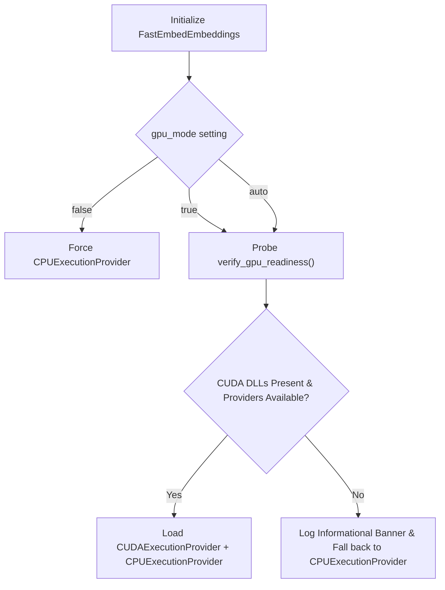

# Ingestion & Embedding Pipeline

> **Document Focus:** Multi-format document parsing, semantic chunking algorithms, FastEmbed ONNX inference pipeline, and tokenizer padding invariants.

---

## 1. Document Ingestion & Format Parsers

The ingestion engine is encapsulated within `DocumentParser` (`ingestion.py`). It processes raw filesystem files into standardized, structured `Document` objects.

### 1.1 Format Dispatch Table

`DocumentParser` supports 18 document formats via an internal parser dispatch table:

| Extension | Parser Handler | Extraction Mechanism | Extracted Metadata |
|:---|:---|:---|:---|
| `.md` | `_parse_markdown` | Native text extraction + heading regex | Header hierarchy, code block flags, size |
| `.txt` | `_parse_text` | UTF-8 decode with fallback replacements | Line count, word count, character count |
| `.pdf` | `_parse_pdf` | `pymupdf` (fitz) or `pypdf` fallback | Page count, PDF title, author, producer |
| `.py`, `.c`, `.h`, `.cpp`, `.js`, `.ts` | `_parse_code` | Comment stripping & AST-friendly chunking | Function/class signatures, language type |
| `.json` | `_parse_json` | JSON recursive structure flattening | Schema keys, record counts |
| `.xml` | `_parse_xml` | ElementTree traversal | Root tag, attribute namespaces |
| `.docx`, `.pptx`, `.xlsx` | Office Parsers | `python-docx`, `python-pptx`, `openpyxl` | Slide/sheet count, table structures |
| `.csv` | `_parse_csv` | Delimiter sniffing (`csv.Sniffer`) | Column names, row count |
| `.ipynb` | `_parse_notebook` | JSON cell extraction (markdown + code) | Cell execution count, code/text ratio |

### 1.2 Markdown Heading Extraction

For `.md` files, `DocumentParser` extracts the heading structure to retain contextual hierarchy:
```python
# Regex matching Markdown headers
header_pattern = re.compile(r"^(#{1,6})\s+(.+)$", re.MULTILINE)
for match in header_pattern.finditer(content):
    level = len(match.group(1))
    title = match.group(2).strip()
    headers.append({"level": level, "title": title})
```

---

## 2. Chunking Strategies

A major failure mode in RAG systems is arbitrary text splitting that bisects code blocks, equations, or structural context. `knowledge-rag` implements two distinct chunking paths:

```mermaid
graph TD
    A["Raw Document Content"] --> B{"File Type?"}
    B -->|Markdown (.md)| C["_chunk_markdown()"]
    B -->|All Other Formats| D["_chunk_text()"]
    
    C --> E["Split by Header Boundaries (#, ##, ###)"]
    E --> F{"Section > chunk_size (1000 chars)?"}
    F -->|Yes| G["Sliding Window Split with Overlap (200 chars)"]
    F -->|No| H["Preserve Complete Semantic Section"]
    G --> I["Prepend Parent Header Breadcrumbs"]
    H --> I
    
    D --> J["Sliding Window Split by Paragraphs/Sentences"]
    J --> K["Append Chunk Index & Character Offsets"]
    I --> L["Deduplicate Chunks by SHA256 Prefix"]
    K --> L
```

### 2.1 Configuration Parameters
* **`chunk_size`**: Target character length per chunk (default: `1000` characters, ~250 tokens).
* **`chunk_overlap`**: Sliding window overlap (default: `200` characters, ~50 tokens).

### 2.2 Markdown-Aware Chunking (`_chunk_markdown`)
1. **Section Isolation:** Content is broken into logical sections delimited by Markdown headings (`#`, `##`, `###`).
2. **Context Inheritance:** If a subsection is smaller than `chunk_size`, it is preserved as a single atomic unit. If it exceeds `chunk_size`, it is sliced using the sliding window algorithm, with the section's heading breadcrumbs prepended to each subsequent sub-chunk.
3. **Code Block Preservation:** Slicing avoids splitting within triple-backtick fences (```` ``` ````) whenever possible.

### 2.3 Chunk Deduplication (`_dedup_chunks`)
Before passing chunks to the embedding model or ChromaDB, each chunk is hashed using a 20-character SHA256 prefix:
```python
content_hash = hashlib.sha256(chunk.content.encode("utf-8")).hexdigest()[:20]
```
If duplicate chunks appear within the same document (e.g. repeated boilerplates or license disclaimers), the duplicates are skipped (`dedup_skipped += 1`), reducing index bloat.

---

## 3. FastEmbed ONNX Pipeline

### 3.1 Model Architecture
`knowledge-rag` defaults to the `BAAI/bge-small-en-v1.5` dense embedding model:
* **Architecture:** BERT-based dense vector encoder.
* **Vector Dimension:** 384 dimensions.
* **Max Context:** 512 tokens.
* **Format:** Optimized ONNX binary executed via `onnxruntime`.

### 3.2 Hardware Acceleration & GPU Auto-Probing
In `FastEmbedEmbeddings._route_load`, the engine probes the host machine for CUDA capabilities:



When running on standard Windows workstations without CUDA runtime libraries (`nvcuda.dll`, `cudnn64_8.dll`), the system issues an informational banner and gracefully falls back to optimized multi-threaded CPU execution with zero downtime.

### 3.3 Prefix Application Strategy
Asymmetric embedding models (like BGE and E5) require distinct prefixes depending on whether text is being indexed or queried:
* **Passage Prefix (Indexing):** In `__call__(input)` or `_embed_documents()`, `config.passage_prefix` is prepended (default profile uses `""` for compact BGE models).
* **Query Prefix (Retrieval):** In `embed_query(query)`, `config.query_prefix` (e.g., `"Represent this sentence for searching relevant passages: "`) is prepended to ensure query vectors align with passage spaces.

### 3.4 Batching & Parallelism Dynamics
In `_add_chunks_batched()`:
* **`_CHROMA_BATCH_SIZE`**: Set to `500` chunks per ChromaDB insertion batch.
* **Parallel Workers (`config.parallel_workers > 1`)**: When enabled, SQLite database writes for batch $N$ overlap with ONNX vector inference for batch $N+1$. ONNX vector inference itself runs serially within the ONNX runtime kernel, ensuring CPU cache locality.

---

## 4. The Tokenizer Invariant: Truncation vs. Padding

### 4.1 The Anomaly (Why Inhomogeneous Array Errors Occur)

During batch embedding, FastEmbed converts tokenized strings into NumPy matrices:
```python
# onnx_text_model.py
encoded = self.tokenize(documents, **kwargs)
input_ids = np.array([e.ids for e in encoded])
```

For NumPy to construct a 2D array from a Python list of lists, **every sub-list must have the exact same length**.

### 4.2 The Hard-Coded Padding Trap

Many pre-exported ONNX models ship with `tokenizer.json` containing:
```json
"truncation": { "max_length": 128 },
"padding": { "strategy": { "Fixed": 128 } }
```

When FastEmbed's `preprocessor_utils.py` initializes the model, it overrides the truncation context to `512` (the true max context of BGE-small):
```python
tokenizer.enable_truncation(max_length=512)
if not tokenizer.padding: # <--- Evaluates to FALSE because Fixed 128 is present!
    tokenizer.enable_padding(...)
```

This creates an asymmetric invariant conflict:
1. **Truncation** is relaxed to `512`.
2. **Padding** remains frozen at `Fixed: 128`.
3. If Chunk A has **50 tokens**: it is padded up to length **128**.
4. If Chunk B has **250 tokens**: it is not truncated (250 < 512) and not padded (250 > 128), remaining at length **250**.
5. When `np.array([128_tokens, 250_tokens])` is constructed:
   ```text
   ValueError: setting an array element with a sequence. The requested array has an inhomogeneous shape after 1 dimensions.
   ```

### 4.3 The Architectural Fix

To permanently resolve this invariant in any implementation of FastEmbed:
* In `tokenizer.json`, set `"strategy": "BatchLongest"`.
* Or call `tokenizer.enable_padding()` dynamically with no fixed length argument immediately upon loading the model. This guarantees that all sequences within a single batch are padded to the length of the longest item in that specific batch, preserving NumPy array shape homogeneity.
