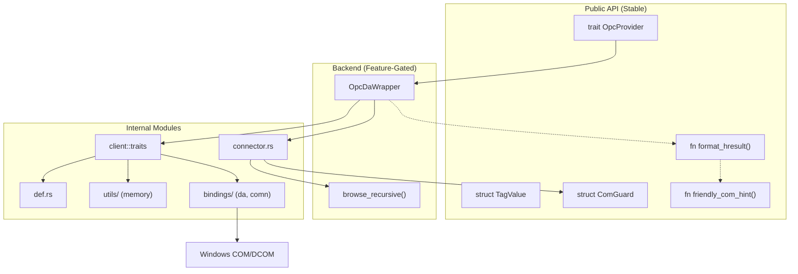

# Architecture: opc-da-client

## 1. Project Overview

| Field | Value |
| :--- | :--- |
| **Crate** | `opc-da-client` |
| **Version** | `0.1.1` |
| **Purpose** | Backend-agnostic Rust library for interacting with OPC DA (Data Access) servers |
| **Spec** | [spec.md](file:///c:/Users/WSALIGAN/code/opc-cli/opc-da-client/spec.md) |

The library provides an async, trait-based API that abstracts away the complexities of Windows COM/DCOM and the underlying OPC implementation. It follows a layered architecture: a **stable public API** (trait + data types) and **feature-gated backend implementations** that can be swapped without affecting consumer code.

---

## 2. Language & Runtime

| Aspect | Value |
| :--- | :--- |
| Language | Rust (2024 Edition) |
| Async Runtime | `tokio` (features: `rt`, `sync`) |
| Platform | **Windows-only** — COM/DCOM is a Windows technology |
| Trait Async | `async-trait` crate |

---

## 3. Project Layout

```
opc-da-client/
├── Cargo.toml              # Crate manifest with feature flags
├── README.md               # Crate documentation for crates.io
├── architecture.md         # This file — Technical Source of Truth
├── spec.md                 # Behavioral contracts — Behavioral Source of Truth
└── src/
    ├── lib.rs              # Crate root: module declarations, public re-exports
    ├── com_guard.rs        # RAII guard for COM init/teardown (ComGuard)
    ├── provider.rs         # OpcProvider trait + TagValue struct
    ├── helpers.rs          # COM utilities: friendly_com_hint, variant/quality/time converters
    ├── opc_da/             # Merged from vendor/opc_da (Phase 2)
    │   ├── mod.rs          # Module root with lint allows
    │   ├── def.rs          # OPC DA type definitions (GroupState, ServerStatus, etc.)
    │   ├── utils/          # COM memory management (RemoteArray, RemotePointer, etc.)
    │   └── client/         # Client traits, versions (v1/v2/v3), iterator
    ├── bindings/           # Frozen COM bindings (Phase 3)
    │   ├── da/             # OPCDA.winmd bindgen output
    │   └── comn/           # OPCCOMN.winmd bindgen output
    └── backend/
        ├── mod.rs          # Backend module gate (feature-conditional)
        ├── connector.rs    # ServerConnector trait (Mock & Real COM backend decoupling)
        └── opc_da.rs       # OpcDaWrapper: concrete OpcProvider using opc_da module
```

---

## 4. Toolchain

All commands are run from the **workspace root** (`opc-cli/`).

| Tool | Command |
| :--- | :--- |
| Formatter | `cargo fmt --all -- --check` |
| Linter | `cargo clippy --workspace -- -D warnings` |
| Tests | `cargo test --workspace` |
| Verification Script | `pwsh -File scripts/verify.ps1` |
| Documentation | `cargo doc --no-deps --package opc-da-client` |

The verification script ([verify.ps1](file:///c:/Users/WSALIGAN/code/opc-cli/scripts/verify.ps1)) runs all three gates sequentially and prepends the portable MSVC toolchain to `PATH`.

---

## 5. Error Handling Strategy

| Pattern | Details |
| :--- | :--- |
| Return type | `anyhow::Result<T>` for all fallible functions |
| Context wrapping | `.context()` / `.with_context()` at every propagation layer |
| Logging before propagation | `map_err(\|e\| { tracing::error!(...); e })` **before** `.context()` to preserve raw HRESULTs in logs |
| User-facing hints | `friendly_com_hint()` maps known HRESULT codes to actionable strings; `format_hresult()` wraps this into a consistent `0xHHHHHHHH: <hint>` format for error messages |
| Prohibited | `unwrap()`, `expect()`, and raw panics in production code |

---

## 6. Observability & Logging

| Aspect | Details |
| :--- | :--- |
| Framework | `tracing` crate |
| Output | File-based (TUI captures stdout/stderr) — see parent `opc-cli` for subscriber setup |
| Timing | `std::time::Instant` wrapping major COM calls (`create_server`, `query_organization`, `browse`); `elapsed_ms` logged on success |

### Log Level Usage

| Level | Usage |
| :--- | :--- |
| `error!` | COM failures, browse position corruption |
| `warn!` | Skipped branches/leaves, max depth reached, handled COM operation failures (e.g., read/write rejections) |
| `info!` | High-level milestones (server connected, browse complete) |
| `debug!` | Internal state, GUID resolution details |
| `trace!` | Known upstream bugs, iterator noise |

---

## 7. Testing Strategy

### Unit Tests
- **Location**: Co-located `#[cfg(test)] mod tests` in `helpers.rs`.
- **Coverage**: `friendly_com_hint` mappings, `filetime_to_string` edge cases, `opc_value_to_variant`, `variant_to_string` roundtrips (including `VT_CY`), and `StringIterator` self-healing behavior.

### Mock-Based Tests
- **Mechanism**: `mockall` crate, gated behind `test-support` feature.
- **Export**: `MockOpcProvider` — allows downstream consumers (`opc-cli`) to test UI and state logic without a live OPC server on any OS.

### Mock-Backend Integration Tests
- **Location**: Co-located `#[cfg(test)] mod tests` in `backend/opc_da.rs`.
- **Mechanism**: In-process `MockGroup` / `MockServer` / `MockConnector` implementing `ConnectedGroup`, `ConnectedServer`, and `ServerConnector` traits.
- **Coverage**: `read_tag_values` (happy, partial reject, all reject), `write_tag_value` (happy, add fail), `list_servers` (happy).

### Doc Tests
- `friendly_com_hint()` — runnable doctest in `helpers.rs`.
- `ComGuard::new()` — `no_run` compile-check doctest in `com_guard.rs`.

### Integration / Manual
- Tested against real OPC servers (Matrikon, ABB, Kepware) on Windows.
- See [spec.md § Required Test Coverage](file:///c:/Users/WSALIGAN/code/opc-cli/opc-da-client/spec.md) for the full checklist.

---

## 8. Documentation Conventions

| Convention | Standard |
| :--- | :--- |
| Public items | Rustdoc `///` with `# Errors` section on all fallible functions |
| Module-level | `//!` at the top of each file |
| Tool | `cargo doc --no-deps` |
| Examples | Runnable doctests for stable public API functions |

---

## 9. Dependencies & External Systems

### Core Dependencies (always included)

| Crate | Version | Purpose |
| :--- | :--- | :--- |
| `anyhow` | 1.0.95 | Error handling with context chains |
| `async-trait` | 0.1.86 | Async methods in traits |
| `chrono` | 0.4.43 | FILETIME → local time conversion |
| `tokio` | 1.43.0 | Async runtime (`rt`, `sync` features) |
| `tracing` | 0.1.41 | Structured logging |
| `windows` | 0.61.3 | Win32 COM/DCOM/Foundation/Variant APIs |

### Backend: `opc-da-backend` (default feature)

*No external dependencies. The COM bindings are included natively in `src/bindings/`.*

### Test Support: `test-support` (optional feature)

| Crate | Version | Purpose |
| :--- | :--- | :--- |
| `mockall` | 0.13.1 | Auto-generate `MockOpcProvider` |

---

## 10. Architecture Diagrams

### Layered Architecture



### COM Threading Model

OPC DA relies on Windows COM, which requires per-thread initialization.
The `OpcDaWrapper` implementation handles this via the `ComGuard` RAII pattern:
1. Using `tokio::task::spawn_blocking` to move COM work to a dedicated thread pool.
2. Creating a `ComGuard` (`ComGuard::new()`) at the start of each blocking task to initialize COM in MTA mode.
3. `ComGuard`'s `Drop` impl calls `CoUninitialize` automatically when the task completes — **regardless of success or failure**.

### Browse Strategy

The library handles both flat and hierarchical OPC DA namespaces:

1. `query_organization()` detects namespace type (flat vs hierarchical).
2. **Flat:** Enumerate all `OPC_LEAF` items at root.
3. **Hierarchical:** Recursive depth-first walk via `browse_recursive()`:
   - **Branches first:** Enumerate `OPC_BRANCH` items, navigate down via `change_browse_position(DOWN)`, recurse, then **always** navigate back `UP` — even if recursion fails — to prevent position corruption.
   - **Leaves second (soft-fail):** Enumerate `OPC_LEAF` items at current position; failures are logged and skipped.
   - **Fully-qualified IDs:** `get_item_id()` converts browse names to item IDs; falls back to browse name if conversion fails.
   - **Iterator bug handled:** The upstream `StringIterator` bug (OPC-BUG-001) is handled internally via cache zeroing.
4. **Safety guards:**
   - `max_tags` hard cap (default 10,000) to prevent unbounded collection.
   - `MAX_DEPTH` (50) to guard against infinite recursion in malformed namespaces.
   - A shared `tags_sink` (`Arc<Mutex<Vec<String>>>`) allows the caller to harvest tags mid-browse on timeout.
   - `progress` (`Arc<AtomicUsize>`) reports discovered tag count in real-time.

---

## 11. Known Constraints & Bugs

### Platform Constraint

This library is **Windows-only** as it depends on Windows COM/DCOM for OPC DA interaction. It cannot be compiled or executed on Linux or macOS.

### OPC-BUG-001

**E_POINTER Flood from `StringIterator` — FIXED**

The upstream `opc_da` `StringIterator` had a bug where null `PWSTR` entries in the batch cache were converted to `E_POINTER` errors by `RemotePointer`. This produced up to 16 phantom errors per iterator cycle.

**Fix:** `StringIterator::next()` now zeroes the cache before each `IEnumString::Next()` call, and silently skips null `PWSTR` entries with a `debug!` log. The caller-side `is_known_iterator_bug()` workaround has been removed.

### DCOM Filter Omission (Intentional)

The `Client` implementation intentionally does **not** filter for `CATID_OPCDAServer10` or `CATID_OPCDAServer20` to avoid missing servers with incomplete registry metadata. This may result in non-OPC-DA GUIDs appearing in enumeration, which are filtered out by the `guid_to_progid` conversion step.
