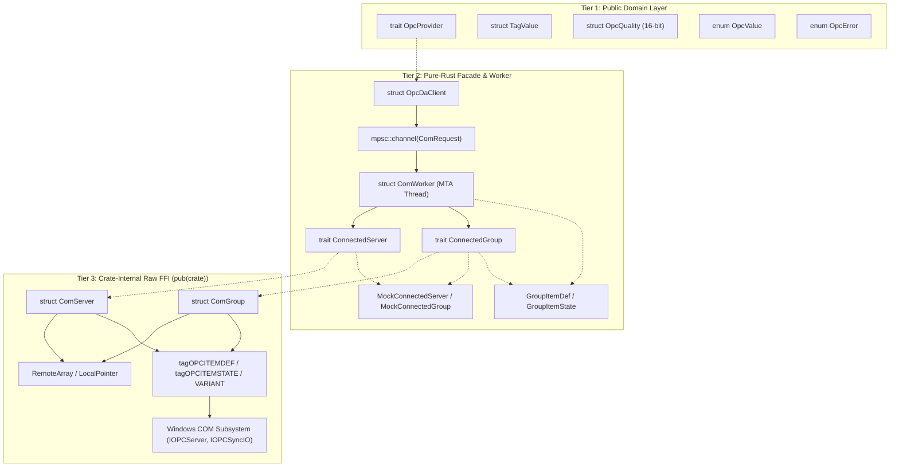
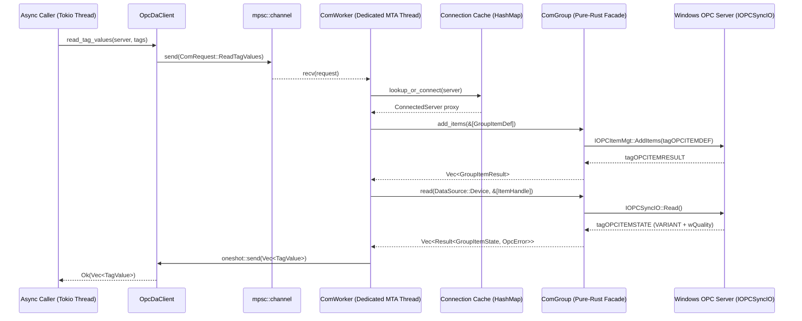

# Architecture: opc-da-client

## 1. Project Overview

| Field | Value |
| :--- | :--- |
| **Crate** | `opc-da-client` |
| **Version** | `0.2.0` |
| **Purpose** | Backend-agnostic Rust library for interacting with OPC DA (Data Access) servers |
| **Spec** | [spec.md](file:///c:/Users/WSALIGAN/code/opc-cli/opc-da-client/spec.md) |
| **Status** | ✅ 0.2.0 baseline (Crates.io) |

The `opc-da-client` library provides an async, trait-based API that abstracts away the complexities of Windows COM/DCOM and legacy OPC Data Access 2.05a / 3.0 protocols. It follows a strict 3-tier decoupled architecture:
1. **Public Domain API (`provider.rs`, `types.rs`)**: High-level async trait (`OpcProvider`), canonical types (`TagValue`, `OpcValue`, `WriteResult`, `TagCollector`), and zero-allocation quality word (`OpcQuality`).
2. **Pure-Rust Facade & Worker (`com::client`, `com::worker`, `com::connector`)**: Dedicated background COM worker thread with request/response channels, connection pooling, and pure-Rust connector traits (`ConnectedServer`, `ConnectedGroup`).
3. **Crate-Internal Low-Level FFI Subsystem (`raw/`)**: Frozen Win32 COM bindings, unsafe COM allocators, and dormant bridge types sealed behind `pub(crate) mod raw;`.

---

## 2. Project Objectives & Key Features

### Primary Objectives
- **Modern Rust Ergonomics**: Provide an async, type-safe, backend-agnostic Rust abstraction over legacy Windows OPC DA servers.
- **Strict Boundary Isolation**: Sever all raw Win32 COM pointers, `tagOPCITEMDEF` structs, and Win32 `VARIANT` buffers from public domain models and high-level worker logic.
- **Industrial Telemetry Precision**: Deliver zero-allocation, decomposed 16-bit OPC DA quality inspection (`OpcQuality`) formatted with rich substatus and limit diagnostics.
- **Robust Runtime Resilience**: Manage COM MTA apartments, thread affinity, and connection recovery transparently without leaking unsafe pointers to callers.
- **Frictionless Mockability**: Enable full end-to-end testing of client logic and downstream applications without requiring physical Windows DCOM runtimes.

### Key Features
- **Async/Await Trait Abstraction**: Canonical `OpcProvider` trait built on `tokio` and `async-trait`.
- **Pure-Rust Connector Facade**: `ConnectedServer` and `ConnectedGroup` traits operating strictly on pure-Rust DTOs (`GroupItemDef`, `GroupItemResult`, `GroupItemState`, `DataSource`).
- **Zero-Allocation 16-Bit Quality Word**: `OpcQuality` decomposes the full OPC DA 2.05a specification into `QualityMajor`, `QualitySubstatus`, `QualityLimit`, and raw bits with rich `Display` diagnostics.
- **Typesafe Read & Write Domain Models**: `TagValue` exposes `Option<OpcValue>` and `Option<std::time::SystemTime>` ensuring lossless, zero-allocation typed access on read results with standard `Display` formatting and helper methods (`display_value()`, `formatted_timestamp()`, `is_error()`).
- **Thread-Affinity & Connection Pooling**: Dedicated `ComWorker` thread maintains MTA apartment state and pools active server connections with automatic eviction and retry on stale proxies.
- **Reusable Pure-Rust Mocks**: Built-in `MockConnectedServer`, `MockConnectedGroup`, and `MockServerConnector` (under `#[cfg(test)]`) eliminating `CoTaskMemAlloc` and unsafe code from tests.
- **Self-Healing Enumeration**: Built-in null-PWSTR filtering and batch cache zeroing preventing phantom `E_POINTER` errors in `StringIterator`.

### Target Users / Audience
- Industrial automation and SCADA engineers building telemetry collectors on Windows.
- Edge gateway and data acquisition system developers integrating legacy plant equipment with modern Rust services.
- Application developers using the `opc-cli` TUI.

### Non-Goals
- **Cross-Platform OPC DA**: OPC DA 2.05a / 3.0 is fundamentally coupled to Windows COM/DCOM; non-Windows OS targets cannot be supported.
- **OPC Unified Architecture (OPC UA)**: Handled by dedicated OPC UA stacks (e.g. `opcua-client`); `opc-da-client` is strictly focused on classic OPC DA.
- **UI & Presentation Formatting**: Terminal rendering and user interaction are owned by consumer crates (such as `opc-cli`).

---

## 3. Language & Runtime

| Aspect | Value |
| :--- | :--- |
| Language | Rust (2024 Edition) |
| Minimum Supported Rust Version | `1.93.1` |
| Async Runtime | `tokio` (features: `rt`, `sync`, `rt-multi-thread`) |
| Platform Target | **Windows-only** (`x86_64-pc-windows-msvc`, `i686-pc-windows-msvc`) |
| COM Threading Model | Dedicated background Multi-Threaded Apartment (MTA) worker thread |
| Trait Async | `async-trait` crate |

---

## 4. Project Layout

```
opc-da-client/
├── Cargo.toml              # Crate manifest with feature flags
├── README.md               # Crate documentation for crates.io
├── architecture.md         # This file — Technical Source of Truth
├── spec.md                 # Behavioral contracts — Behavioral Source of Truth
└── src/
    ├── lib.rs              # Crate root: module declarations, public re-exports
    ├── provider.rs         # OpcProvider trait + TagValue, OpcValue, WriteResult, TagCollector
    ├── types.rs            # Canonical domain types & handles (GroupHandle, ItemHandle, OpcQuality, ...)
    ├── errors.rs           # OpcError, OpcResult, HRESULT hints, structured error logging
    ├── helpers.rs          # Formatters & conversions: variant_to_opc_value, filetime_to_string, etc.
    ├── com/                # COM subsystem (feature-gated: opc-da-backend)
    │   ├── mod.rs          # Module declarations & internal re-exports
    │   ├── client.rs       # OpcDaClient: concrete OpcProvider implementation
    │   ├── connector.rs    # Pure-Rust connector traits, ComServer/ComGroup, and test mocks
    │   ├── guard.rs        # RAII COM initialization/teardown (ComGuard)
    │   ├── iterator.rs     # Safe wrappers for IEnumString and IEnumGUID
    │   └── worker.rs       # Dedicated worker thread & request state machine (ComWorker)
    └── raw/                # STRICTLY CRATE-INTERNAL (pub(crate) mod raw;)
        ├── mod.rs          # Module declarations
        ├── bindings/       # Frozen Win32 COM interfaces (da, comn)
        ├── memory.rs       # Unsafe COM memory management (RemoteArray, RemotePointer, LocalPointer)
        └── bridge.rs       # Preserved dormant COM bridge structures (ItemDef, ItemState, etc.)
```

---

## 5. Module Boundaries

### `provider`
- **Owns**: The primary public `OpcProvider` async trait, canonical DTOs (`TagValue`, `OpcValue`, `WriteResult`), tag accumulation container (`TagCollector`).
- **Does NOT own**: COM apartment management, channel dispatching, Win32 VARIANTs, or protocol encoding.
- **Trait Interfaces**: `OpcProvider`.
- **Mock Availability**: `MockOpcProvider` (exported under `test-support` feature via `mockall`).

### `types`
- **Owns**: Canonical domain types, opaque handle newtypes (`GroupHandle`, `ItemHandle`), quality decomposition (`OpcQuality`, `QualityMajor`, `QualitySubstatus`, `QualityLimit`), browse enums (`BrowseType`, `BrowseDirection`), and server status structs (`ServerState`, `ServerStatus`).
- **Does NOT own**: Raw Win32 COM types, dormant bridge types, raw pointers, or allocator logic.
- **Trait Interfaces**: Pure domain data structures.
- **Mock Availability**: N/A (data types).

### `errors`
- **Owns**: Canonical error enumeration `OpcError`, `OpcResult<T>` type alias, formatted HRESULT helpers (`format_hresult`), user-friendly hints (`friendly_com_hint`), and structured error logging (`log_opc_error`).
- **Does NOT own**: Upstream business logic or retry policy.
- **Trait Interfaces**: `std::error::Error`.
- **Mock Availability**: N/A.

### `helpers`
- **Owns**: Safe utility conversions between Win32 types (`FILETIME`, `VARIANT`) and pure-Rust types (`SystemTime`, `OpcValue`, `String`).
- **Does NOT own**: Direct COM interface dispatching or memory allocation.
- **Trait Interfaces**: Pure conversion functions.
- **Mock Availability**: N/A.

### `com`
- **Owns**: COM apartment lifecycle (`ComGuard`), dedicated background worker thread (`ComWorker`), request channels (`ComRequest`), connector traits and pure-Rust DTOs (`ConnectedServer`, `ConnectedGroup`, `GroupItemDef`, `GroupItemState`), and string iterators (`StringIterator`).
- **Does NOT own**: Domain DTO definitions (`provider`), low-level raw FFI structs (`raw`).
- **Trait Interfaces**: `ServerConnector`, `ConnectedServer`, `ConnectedGroup`.
- **Mock Availability**: `MockServerConnector`, `MockConnectedServer`, `MockConnectedGroup` (`#[cfg(test)]` in `connector.rs`).

### `raw`
- **Owns**: Crate-internal Win32 COM interface bindings (`da`, `comn`), low-level COM memory allocators (`memory.rs`), and legacy dormant bridge types (`bridge.rs`).
- **Does NOT own**: Any public API exposure, high-level business logic, or domain error mapping.
- **Trait Interfaces**: `IntoBridge`, `TryFromNative`, `TryToNative`.
- **Mock Availability**: N/A (sealed low-level FFI; mocked cleanly at the `com::connector` boundary).

---

## 6. Dependency Direction Rules

The codebase strictly enforces unidirectional dependency flow:

```
[provider] ───► [types] ◄─── [errors]
    ▲             ▲             ▲
    │             │             │
[com::client] ──► [com::worker] ──► [com::connector] ──► [raw]
                                           ▲
                                    [helpers]
```

| Module | May Import | Must NOT Import | Rationale |
| :--- | :--- | :--- | :--- |
| `provider` | `types`, `errors` | `com`, `raw`, `helpers` | Public domain interface must be backend-agnostic |
| `types` | `errors` | `provider`, `com`, `raw`, `helpers` | Canonical domain models must never depend on implementation details |
| `errors` | `windows-core` (for HRESULT) | `provider`, `types`, `com`, `raw` | Domain errors are foundational and self-contained |
| `helpers` | `types`, `errors`, `raw` | `com`, `provider` | Pure conversion helpers between raw and domain types |
| `com::client` | `provider`, `types`, `errors`, `com::worker` | `raw` | Consumer facade dispatches requests to the worker |
| `com::worker` | `types`, `errors`, `com::connector`, `helpers` | `raw` | Worker communicates exclusively via pure-Rust connector facade |
| `com::connector` | `types`, `errors`, `helpers`, `raw` | `provider` | Encapsulates all raw Win32 COM FFI marshalling |
| `raw` | `windows-core`, `types` | `com`, `provider` | Crate-internal low-level FFI subsystem |

---

## 7. Toolchain

All commands are run from the **workspace root** (`opc-cli/`).

| Tool | Command | Purpose |
| :--- | :--- | :--- |
| Formatter | `cargo fmt --all -- --check` | Verify standard rustfmt formatting |
| Linter | `cargo clippy --workspace --all-targets -- -D warnings` | Strict lint gating (zero warnings allowed) |
| Tests | `cargo test --workspace` | Execute all workspace unit & integration tests |
| Doc Tests | `cargo test --doc -p opc-da-client` | Verify runnable documentation code samples |
| Verification Script | `pwsh -File scripts/verify.ps1` | Automated 8-gate compliance pipeline |
| Release Merge Script | `powershell -File scripts/Merge-ToMain.ps1` | Clean release merging into `main` |
| Documentation | `cargo doc --no-deps --package opc-da-client` | Render crate rustdocs |

The verification script ([verify.ps1](file:///c:/Users/WSALIGAN/code/opc-cli/scripts/verify.ps1)) sequentially runs format checks, strict clippy, doctests, unit/integration tests, polyfill builds, AST-grep rules, forbidden pattern scans, and PowerShell syntax validation.

---

## 8. Error Handling Strategy

| Pattern | Details |
| :--- | :--- |
| Primary Return Type | `OpcResult<T>` (`Result<T, OpcError>`) across all fallible boundaries |
| Domain Error Enum | `thiserror` based `OpcError` with structured variants (`Com`, `ConnectionFailed`, `ServerNotFound`, `TagNotFound`, `InvalidState`, `Conversion`, `Internal`, `NotImplemented`) |
| HRESULT Hints | `friendly_com_hint(hresult)` translates raw Windows error codes into human-readable hints; `format_hresult()` yields standard `0xHHHHHHHH: <hint>` strings |
| Structured Logging | `log_opc_error(operation, error)` logs errors at `warn!` (per-item) or `error!` (fatal) with structured metadata |
| Prohibited Patterns | `unwrap()`, `expect()`, and raw panics in production code |

---

## 9. Observability & Logging

| Aspect | Details |
| :--- | :--- |
| Framework | `tracing` crate |
| Output Target | Dedicated rolling file loggers (TUI captures stdout/stderr) |
| Latency Instrumentation | `std::time::Instant` tracks major operations (`create_server`, `query_organization`, `browse`, `read_tag_values`); `elapsed_ms` logged on success |

### Log Level Guidelines
| Level | Usage |
| :--- | :--- |
| `error!` | Fatal COM failures, thread panics, browse position corruption |
| `warn!` | Handled per-item read/write rejections, skipped branches/leaves, connection retry attempts |
| `info!` | High-level milestones (server connected, browse completed, group created) |
| `debug!` | Internal state transitions, ProgID/GUID resolutions, null iterator entry skips |
| `trace!` | Granular buffer offsets and verbose COM parameter dumps |

---

## 10. Testing Strategy

### 1. Co-Located Unit Tests
- **`helpers.rs`**: FILETIME conversions, VARIANT parsing, string conversions, currency (VT_CY) formatting.
- **`types.rs`**: 16-bit `OpcQuality` decomposition, major/substatus/limit roundtrips, string parsing, handle semantics.
- **`com::iterator`**: `StringIterator` null-PWSTR skipping, empty streams, error handling.

### 2. Pure-Rust Connector Mocks
- **Location**: Co-located in `com/connector.rs` under `#[cfg(test)]`.
- **Artifacts**: `MockConnectedServer`, `MockConnectedGroup`, `MockServerConnector`.
- **Benefit**: Pluggable closures for adding items, reading, and writing; **zero** `CoTaskMemAlloc` calls and **zero** unsafe code required in test cases.

### 3. Worker Integration Tests
- **Location**: Co-located in `com/worker.rs` under `#[cfg(test)]`.
- **Coverage**: Connection cache reuse, stale connection eviction and automatic reconnect, worker thread panic propagation, per-item read quality decoding, and length mismatch defensive guards.

### 4. Downstream Provider Mocks
- **Location**: Gated behind `test-support` feature flag.
- **Artifact**: `MockOpcProvider` via `mockall`, allowing downstream consumers (`opc-cli`) to mock the entire OPC DA backend on any OS without COM dependencies.

### 5. Documentation Tests
- Verified with `cargo test --doc -p opc-da-client`.

---

## 11. Documentation Conventions

| Convention | Standard |
| :--- | :--- |
| Public API Items | Rustdoc `///` with `# Arguments`, `# Returns`, and `# Errors` sections |
| Module-Level Docs | `//!` at the top of each file explaining responsibility and architecture |
| Drift Detection | `spec.md` records `> Last verified against: <hash>` tracking source commit parity |
| Synchronized Overviews | Semantic equivalence across `Cargo.toml [package.description]`, `src/lib.rs //!`, and `README.md` |

---

## 12. Dependencies & External Systems

### Core Dependencies
| Crate | Version | Purpose |
| :--- | :--- | :--- |
| `thiserror` | 2.0 | Domain error definition |
| `async-trait` | 0.1.86 | Async method declarations in traits |
| `chrono` | 0.4.43 | FILETIME → local time conversions |
| `tokio` | 1.43.0 | Async runtime (`rt`, `sync`, `rt-multi-thread`) |
| `tracing` | 0.1.41 | Structured diagnostics and logging |
| `windows` | 0.61.3 | Win32 COM, OLE, Variant, and Foundation APIs |
| `windows-core` | 0.61.2 | Core Windows COM runtime types (HRESULT, PWSTR) |

### Backend Subsystem (`opc-da-backend`)
- Self-contained; frozen native Win32 COM bindings are maintained directly in `src/raw/bindings/`.

### Test Support (`test-support`)
| Crate | Version | Purpose |
| :--- | :--- | :--- |
| `mockall` | 0.13.1 | Auto-generate `MockOpcProvider` |

---

## 13. Architecture Diagrams

### 3-Tier Layered Architecture & Boundary Isolation


```mermaid
graph TD
    subgraph PublicDomain ["Tier 1: Public Domain Layer"]
        ProviderTrait["trait OpcProvider"]
        TagValue["struct TagValue"]
        OpcQuality["struct OpcQuality (16-bit)"]
        OpcValue["enum OpcValue"]
        OpcError["enum OpcError"]
    end

    subgraph FacadeWorker ["Tier 2: Pure-Rust Facade & Worker"]
        Client["struct OpcDaClient"]
        Worker["struct ComWorker (MTA Thread)"]
        ReqChan["mpsc::channel(ComRequest)"]
        ConnServerTrait["trait ConnectedServer"]
        ConnGroupTrait["trait ConnectedGroup"]
        PureDTOs["GroupItemDef / GroupItemState"]
        Mocks["MockConnectedServer / MockConnectedGroup"]
    end

    subgraph RawFFI ["Tier 3: Crate-Internal Raw FFI (pub(crate))"]
        ComServer["struct ComServer"]
        ComGroup["struct ComGroup"]
        RawMemory["RemoteArray / LocalPointer"]
        RawBindings["tagOPCITEMDEF / tagOPCITEMSTATE / VARIANT"]
        WinCOM["Windows COM Subsystem (IOPCServer, IOPCSyncIO)"]
    end

    ProviderTrait -.-> Client
    Client --> ReqChan
    ReqChan --> Worker
    Worker --> ConnServerTrait
    Worker --> ConnGroupTrait
    ConnServerTrait -.-> ComServer
    ConnGroupTrait -.-> ComGroup
    ConnServerTrait -.-> Mocks
    ConnGroupTrait -.-> Mocks
    ComServer --> RawMemory
    ComGroup --> RawMemory
    ComServer --> RawBindings
    ComGroup --> RawBindings
    RawBindings --> WinCOM

    Worker -.-> PureDTOs
    ConnGroupTrait -.-> PureDTOs
```

### COM Threading Model & Request Flow


```mermaid
sequenceDiagram
    participant AsyncCaller as Async Caller (Tokio Thread)
    participant Client as OpcDaClient
    participant Channel as mpsc::channel
    participant Worker as ComWorker (Dedicated MTA Thread)
    participant ServerCache as Connection Cache (HashMap)
    participant ComGroup as ComGroup (Pure-Rust Facade)
    participant Win32 as Windows OPC Server (IOPCSyncIO)

    AsyncCaller->>Client: read_tag_values(server, tags)
    Client->>Channel: send(ComRequest::ReadTagValues)
    Channel-->>Worker: recv(request)
    Worker->>ServerCache: lookup_or_connect(server)
    ServerCache-->>Worker: ConnectedServer proxy
    Worker->>ComGroup: add_items(&[GroupItemDef])
    ComGroup->>Win32: IOPCItemMgt::AddItems(tagOPCITEMDEF)
    Win32-->>ComGroup: tagOPCITEMRESULT
    ComGroup-->>Worker: Vec<GroupItemResult>
    Worker->>ComGroup: read(DataSource::Device, &[ItemHandle])
    ComGroup->>Win32: IOPCSyncIO::Read()
    Win32-->>ComGroup: tagOPCITEMSTATE (VARIANT + wQuality)
    ComGroup-->>Worker: Vec<Result<GroupItemState, OpcError>>
    Worker->>Client: oneshot::send(Vec<TagValue>)
    Client-->>AsyncCaller: Ok(Vec<TagValue>)
```

### Browse Strategy


```mermaid
graph TD
    Start(["browse_tags(server)"]) --> QueryOrg["query_organization()"]
    QueryOrg --> FlatCheck{"Namespace Type?"}
    
    FlatCheck -- Flat --> RootLeaf["Browse root OPC_LEAF items"]
    RootLeaf --> Complete(["Complete"])

    FlatCheck -- Hierarchical --> TryFastPath["Try OPC_FLAT Fast Path at Root"]
    TryFastPath --> FastSuccess{"Items returned?"}
    
    FastSuccess -- Yes --> Complete
    FastSuccess -- No / Err --> Recurse["browse_recursive(depth = 0)"]
    
    Recurse --> MaxDepth{"depth > 50 or tags >= max?"}
    MaxDepth -- Yes --> ReturnBack["Return Ok"]
    MaxDepth -- No --> EnumBranches["Enumerate OPC_BRANCH items"]
    
    EnumBranches --> Down["ChangeBrowsePosition(Down)"]
    Down --> RecurseChild["browse_recursive(depth + 1)"]
    RecurseChild --> AlwaysUp["ALWAYS ChangeBrowsePosition(Up)"]
    
    AlwaysUp --> EnumLeaves["Enumerate OPC_LEAF items (soft-fail)"]
    EnumLeaves --> GetIDs["get_item_id() -> Fully-Qualified ID"]
    GetIDs --> PushSinks["Push to tags & tags_sink; inc progress"]
    PushSinks --> ReturnBack
```

---

## 14. Known Constraints & Technical Debt

### Platform Constraint
This library is strictly **Windows-only** as it interfaces with Windows COM/DCOM for OPC DA interaction. It cannot be compiled or executed on Linux or macOS.

### OPC-BUG-001 (Resolved)
The upstream `opc_da` `StringIterator` had a defect where null `PWSTR` entries in the batch cache were converted into `E_POINTER` errors by `RemotePointer`, emitting up to 16 phantom errors per iteration.
- **Resolution:** `StringIterator::next()` now zeroes the batch cache prior to each `IEnumString::Next()` call, and skips null `PWSTR` entries with a `debug!` log. The caller-side workaround has been removed.

### DCOM Filter Omission (Intentional)
Server enumeration intentionally does not filter exclusively for `CATID_OPCDAServer10` or `CATID_OPCDAServer20` categories to avoid dropping legitimate servers configured with incomplete registry category entries. Non-OPC GUIDs are discarded during the subsequent `guid_to_progid` lookup phase.
