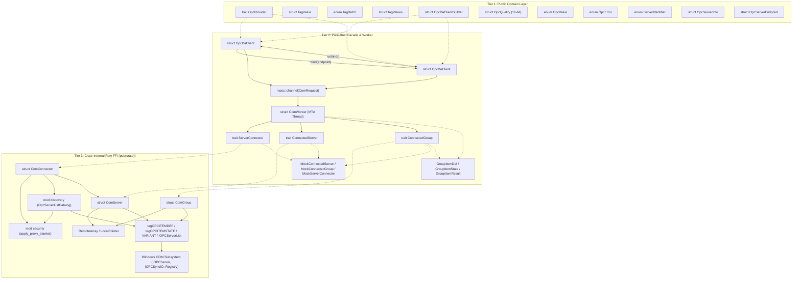
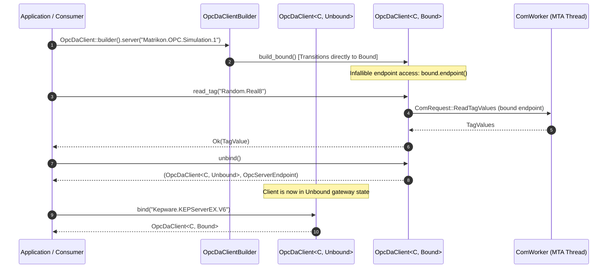
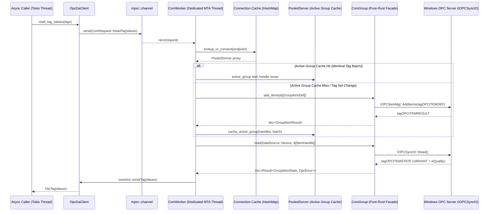
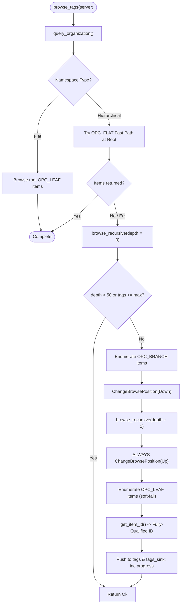

# Architecture: opc-da-client

## 1. Project Overview

| Field | Value |
| :--- | :--- |
| **Crate** | `opc-da-client` |
| **Version** | `0.2.0` |
| **Purpose** | Backend-agnostic Rust library for interacting with OPC DA (Data Access) servers |
| **Spec** | [spec.md](file:///c:/Users/WSALIGAN/code/opc-cli/opc-da-client/spec.md) |
| **Status** | ✅ 0.2.0 baseline (Crates.io) |

The `opc-da-client` library provides an async, trait-based API that abstracts away the complexities of Windows COM/DCOM and legacy OPC Data Access 2.05a / 3.0 protocols. It follows a strict 3-tier decoupled architecture:
1. **Public Domain API (`provider.rs`, `types.rs`)**: High-level async trait (`OpcProvider`), canonical identity types (`ServerIdentifier`, `OpcServerInfo`, `OpcServerEndpoint`), typed data models (`TagValue`, `OpcValue`, `WriteResult`, `TagCollector`), zero-allocation quality word (`OpcQuality`), and generic collection extractor `TagValues::get_as<T>`.
2. **Pure-Rust Facade & Worker (`com::client`, `com::worker`, `com::connector`, `com::discovery`)**: Dedicated background COM worker thread with request/response channels, compile-time typestate client facade `OpcDaClient<C, State>` (`Unbound` gateway vs `Bound` session), connection pooling keyed by `ServerIdentifier` with synchronized group eviction, shared `register_item_group` worker engine deduplication, pure-Rust connector traits (`ConnectedServer`, `ConnectedGroup`), and 3-tier server catalog / registry discovery (`OpcServerListCatalog`, `inspect_local_registration`, `OpcServerRegistration`).
3. **Crate-Internal Low-Level FFI Subsystem (`raw/`)**: Frozen Win32 COM bindings, unsafe COM allocators with arithmetic overflow prevention, and dormant bridge types sealed behind `pub(crate) mod raw;`.

---

## 2. Project Objectives & Key Features

### Primary Objectives
- **Modern Rust Ergonomics**: Provide an async, type-safe, backend-agnostic Rust abstraction over legacy Windows OPC DA servers.
- **Strict Boundary Isolation**: Sever all raw Win32 COM pointers, `tagOPCITEMDEF` structs, and Win32 `VARIANT` buffers from public domain models and high-level worker logic.
- **Industrial Telemetry Precision**: Deliver zero-allocation, decomposed 16-bit OPC DA quality inspection (`OpcQuality`) formatted with rich substatus and limit diagnostics.
- **Robust Runtime Resilience**: Manage COM MTA apartments, thread affinity, and connection recovery transparently without leaking unsafe pointers to callers.
- **Frictionless Mockability**: Enable full end-to-end testing of client logic and downstream applications without requiring physical Windows DCOM runtimes.

### Key Features
- **Async/Await Trait Abstraction**: Canonical `OpcProvider` trait built on `tokio` and `async-trait`.
- **Compile-Time Typestate Client**: `OpcDaClient<C, State>` with zero-cost `Unbound` (gateway) and `Bound` (session) states, guaranteeing infallible server endpoint access during active sessions.
- **Structured Server Discovery**: Enumerate OPC DA servers with rich metadata (`ProgID`, `CLSID`, user-readable description) via `OpcServerListCatalog` (adapting `IOPCServerList2` and `IOPCServerList`) and `OpcProvider::list_server_details`.
- **Direct CLSID Connectivity**: Seamlessly connect to OPC servers using either human-readable ProgIDs or direct 128-bit COM Class IDs via `ServerIdentifier`.
- **Dual-View Windows Registry Diagnostics**: Deep diagnostic inspection of server registrations (`inspect_local_registration`) querying both native and 32-bit (`KEY_WOW64_32KEY`) registry views to identify executable vs DLL execution models (`OpcServerType`) and binary disk paths.
- **Pure-Rust Connector Facade**: `ConnectedServer` and `ConnectedGroup` traits operating strictly on pure-Rust DTOs (`GroupItemDef`, `GroupItemResult`, `GroupItemState`, `DataSource`).
- **Zero-Allocation 16-Bit Quality Word**: `OpcQuality` decomposes the full OPC DA 2.05a specification into `QualityMajor`, `QualitySubstatus`, `QualityLimit`, and raw bits with rich `Display` diagnostics.
- **Typesafe Read & Write Domain Models**: `TagValue` encapsulates `Result<OpcValue, OpcError>`, quality, and timestamp, with generic lossless extraction via `TagValues::get_as<T>` and numeric getters (`get_u32`, `get_u64`, `get_i64`, `get_f32`, `get_f64`).
- **Thread-Affinity & Connection Pooling**: Dedicated `ComWorker` thread maintains MTA apartment state and pools active server connections keyed by `ServerIdentifier` with automatic eviction and retry on stale proxies.
- **Reusable Pure-Rust Mocks**: Built-in `MockConnectedServer`, `MockConnectedGroup`, and `MockServerConnector` (under `#[cfg(test)]`) supporting `with_server_details` and eliminating `CoTaskMemAlloc` and unsafe code from tests.
- **Self-Healing Enumeration**: Built-in null-PWSTR filtering and batch cache zeroing preventing phantom `E_POINTER` errors in `StringIterator`.

### Target Users / Audience
- Industrial automation and SCADA engineers building telemetry collectors on Windows.
- Edge gateway and data acquisition system developers integrating legacy plant equipment with modern Rust services.
- Application developers using the `opc-cli` TUI.

### Non-Goals
- **Cross-Platform OPC DA**: OPC DA 2.05a / 3.0 is fundamentally coupled to Windows COM/DCOM; non-Windows OS targets cannot be supported.
- **OPC Unified Architecture (OPC UA)**: Handled by dedicated OPC UA stacks (e.g. `opcua-client`); `opc-da-client` is strictly focused on classic OPC DA.
- **UI & Presentation Formatting**: Terminal rendering and user interaction are owned by consumer crates (such as `opc-cli`).

---

## 3. Language & Runtime

| Aspect | Value |
| :--- | :--- |
| Language | Rust (2024 Edition) |
| Minimum Supported Rust Version | `1.93.1` |
| Async Runtime | `tokio` (features: `rt`, `sync`, `rt-multi-thread`) |
| Platform Target | **Windows-only** (`x86_64-pc-windows-msvc`, `i686-pc-windows-msvc`) |
| COM Threading Model | Dedicated background Multi-Threaded Apartment (MTA) worker thread |
| Trait Async | `async-trait` crate |

---

## 4. Project Layout

```
opc-da-client/
├── Cargo.toml              # Crate manifest with feature flags
├── README.md               # Crate documentation for crates.io
├── architecture.md         # This file — Technical Source of Truth
├── spec.md                 # Behavioral contracts — Behavioral Source of Truth
└── src/
    ├── lib.rs              # Crate root: module declarations, public re-exports (zero unreachables, Default MockOpcDaClient)
    ├── provider.rs         # OpcProvider trait (with read_tag_value & write_tag_values defaults), TagValue, WriteResult, TagCollector (re-exports OpcValue)
    ├── types.rs            # Canonical domain types (OpcValue, OpcQuality with FromStr), handles (GroupHandle, ItemHandle), ServerIdentifier, browse enums
    ├── errors.rs           # OpcError (is_connection_error), OpcResult, OpcOperation, inherent friendly_hint diagnostics
    ├── com/                # COM subsystem (feature-gated: opc-da-backend)
    │   ├── mod.rs          # Module declarations & internal re-exports
    │   ├── client.rs       # OpcDaClient<C, State>: compile-time typestate facade (Unbound vs Bound) & session helpers
    │   ├── connector.rs    # Slim coordinator facade (pure connector re-exports, zero raw::memory leak)
    │   ├── connector/      # Dedicated single-responsibility connector submodules
    │   │   ├── traits.rs   # Core traits (ServerConnector, ConnectedServer, ConnectedGroup), GroupConfig::ephemeral & pure-Rust DTOs
    │   │   ├── server.rs   # Win32 COM server connection & namespace navigation (ComConnector, ComServer)
    │   │   ├── group.rs    # Win32 COM group item registration & I/O (ComGroup) with RAII ItemResultsBlobGuard & VARIANT guards
    │   │   └── mock.rs     # Pure-Rust mock infrastructure (MockServerConnector, MockConnectedServer, MockConnectedGroup) with fluent builders
    │   ├── discovery.rs    # 3-tier catalog adapter, dual-view registry inspection (OpcServerRegistration), guid_to_progid
    │   ├── guard.rs        # RAII COM initialization/teardown (ComGuard), group cleanup (GroupGuard), and browse cursor protection (BrowsePositionGuard)
    │   ├── iterator.rs     # Safe wrappers for IEnumString (with RAII drop memory cleanup) and IEnumGUID
    │   ├── security.rs     # Dynamic DCOM proxy blanketing, RPC authentication level selection, CLSID_OPC_SERVER_LIST
    │   ├── variant.rs      # Win32 VARIANT & SafeArray conversion, decode_scalar_variant helper, ItemStatesGuard, ScopedVariant
    │   ├── worker.rs       # Slim worker facade & ComRequest event loop (ComWorker) with 2-tier catch_unwind & request prioritization
    │   └── worker/         # Dedicated single-responsibility worker engines
    │       ├── pool.rs     # Connection caching, active group reuse, synchronized cache eviction & retry dispatch (dispatch_with_retry)
    │       ├── read.rs     # Synchronous tag reading engine using register_item_group helper & zip iteration (handle_read)
    │       ├── write.rs    # Synchronous tag writing engine using register_item_group helper (handle_write)
    │       ├── browse.rs   # Flat/hierarchical namespace traversal with cooperative chunking & TagCollector::harvest (handle_browse)
    │       └── tests.rs    # Dedicated worker test suite & mock fixtures (panic recovery tests, 0 warnings)
    └── raw/                # STRICTLY CRATE-INTERNAL (pub(crate) mod raw;)
        ├── mod.rs          # Module declarations
        ├── bindings/       # Frozen Win32 COM interfaces (da, comn)
        ├── hresult.rs      # Strongly-typed Win32 HRESULT constants, classification helpers, hints
        ├── memory.rs       # Unsafe COM memory management (RemoteArray, RemotePointer, LocalPointer, safe FILETIME arithmetic)
        └── bridge.rs       # Preserved dormant COM bridge structures (ItemDef, ItemState, etc.)
```

---

## 5. Module Boundaries

### `provider`
- **Owns**: The primary public `OpcProvider` async trait (including default `list_server_details`, `read_tag_value`, and `write_tag_values` implementations), canonical DTOs (`TagValue`, `WriteResult`), re-exported `OpcValue` (defined in `types.rs`), tag accumulation container (`TagCollector` with $O(1)$ `harvest`), and zero-allocation display adapters (`DisplayOptionOpcValue`, `DisplayOptionTimestamp`, `OpcValueOptionExt`, `SystemTimeOptionExt`).
- **Does NOT own**: COM apartment management, channel dispatching, Win32 VARIANTs, or protocol encoding.
- **Trait Interfaces**: `OpcProvider`.
- **Mock Availability**: `MockOpcProvider` (exported under `test-support` feature via `mockall`).

### `types`
- **Owns**: Canonical domain types, strongly-typed server identifiers (`ServerIdentifier` ProgID vs direct CLSID), rich catalog metadata (`OpcServerInfo`), connection endpoints (`OpcServerEndpoint`), canonical `OpcValue` (with `FromStr`, primitive `From<T>`, and typed borrowing accessors), opaque encapsulated handle newtypes (`GroupHandle`, `ItemHandle` with private `.0`), quality decomposition (`OpcQuality` with `FromStr`, `QualityMajor`, `QualitySubstatus`, `QualityLimit`), browse enums (`BrowseType`, `BrowseDirection`), server status structs (`ServerState`, `ServerStatus`), canonical DTOs (`TagValue` with `error: Option<OpcError>`, `new()`, `with_error()`, and `Default`, `WriteResult`, `TagCollector`), zero-allocation `TagBatch` enum and `IntoTags` trait, `TagValues` collection (case-insensitive indexing, lenient typed extractions, numeric coercion, `ReadFailed` preservation), and `TagExtractError`.
- **Does NOT own**: Raw Win32 COM types, dormant bridge types, raw pointers, or allocator logic.
- **Trait Interfaces**: Pure domain data structures.
- **Mock Availability**: N/A (data types).

### `errors`
- **Owns**: Canonical error enumeration `OpcError` (including `connection_failed` factory and `is_connection_error` predicate), `OpcResult<T>` type alias, user-facing diagnostic method `OpcError::friendly_hint(&self)`, and standard `From` error conversions for thread/channel boundaries.
- **Does NOT own**: Raw Win32 HRESULT formatting (`raw::hresult`), upstream business logic, or retry policy.
- **Trait Interfaces**: `std::error::Error`.
- **Mock Availability**: N/A.

### `com::client`
- **Owns**: Concrete public `OpcDaClient<C, State = Unbound>` struct implementing `OpcProvider`, fluent builder `OpcDaClientBuilder` (`builder()`, `host()`, `server()`, `timeout()`, `with_legacy_dcom()`, `with_connector()`, `build()`, `build_bound()`), compile-time typestates `Unbound` (gateway) and `Bound` (session), zero-cost state transitions (`bind`, `bind_remote`, `unbind`), eager connection constructor (`connect_eager`), server-bound constructors (`connect`, `connect_remote`), infallible endpoint borrower (`endpoint(&self) -> &OpcServerEndpoint`) and server ID getter (`server_id(&self) -> std::borrow::Cow<'_, str>`) on `Bound`, inherent session methods (`read_tag`, `read_tags`, `write_tag`, `write_tags`), backward-compatible readers and writers (`read_tag_values`, `read_f64`, `read_i32`, `read_bool`, `read_string`, `write`, `write_batch`), remote server discovery (`list_servers_on`, deprecated in favor of `ServerDiscovery::list_servers`), Layer 2 non-blocking subscription polling stream (`client.subscribe()`), and client-side channel sender management (`mpsc::Sender<ComRequest>`).
- **Does NOT own**: Direct COM worker loop execution, unmanaged pointers, or in-apartment state (delegated across channels to `ComWorker`).
- **Trait Interfaces**: `OpcProvider`.
- **Mock Availability**: `MockOpcDaClient` (exported under `all(feature = "test-support", feature = "opc-da-backend")`).

### `com::iterator`
- **Owns**: Safe RAII wrapper for native Windows COM `IEnumString` enumerator (`StringIterator`) with null-PWSTR filtering, batch zeroing, and safe drop deallocation, plus in-memory mock vectors (`StringIterator::from_vec`).
- **Does NOT own**: COM worker thread execution or apartment initialization.
- **Trait Interfaces**: `Iterator<Item = OpcResult<String>>`.
- **Mock Availability**: Fully tested via pure in-memory `from_vec` test fixtures.

### `com::connector`
- **Owns**: Slim coordinator facade (`connector.rs`, with zero boundary leaks) and modular single-responsibility submodules:
  - `com::connector::traits`: Core abstraction traits (`ServerConnector` with unidirectional `connect_endpoint`, `ConnectedServer`, `ConnectedGroup`) and pure-Rust DTOs (`GroupItemDef`, `GroupItemResult`, `GroupItemState`, `DataSource`, `GroupConfig::ephemeral`, `CreatedGroup`).
  - `com::connector::server`: Win32 COM server connection (`ComConnector`), namespace navigation (`ComServer`), direct CLSID and remote DCOM instantiation (`connect_server_endpoint` with `CoCreateInstanceEx`, `COSERVERINFO`, `COAUTHINFO`, and proxy blanketing).
  - `com::connector::group`: Win32 COM group item registration and synchronous read/write (`ComGroup`) protected by RAII memory safety guards (`ItemResultsBlobGuard`).
  - `com::connector::mock`: Pure-Rust mock suite (`MockServerConnector`, `MockConnectedServer`, `MockConnectedGroup`, `MockState`, handler aliases `MockAddItemsFn`, `MockReadFn`, `MockWriteFn`) with fluent test builders and observability counters.
- **Does NOT own**: Channel communication, connection caching (owned by `com::worker::pool`), or low-level unmanaged allocations.
- **Trait Interfaces**: `ServerConnector`, `ConnectedServer`, `ConnectedGroup`.
- **Mock Availability**: `MockServerConnector`, `MockConnectedServer`, `MockConnectedGroup` (exported under `feature = "test-support"`).

### `com::guard`
- **Owns**: Consolidated RAII resource lifetime drop guards:
  - `ComGuard`: Thread-level COM runtime initialization (`CoInitializeEx` MTA) and automatic teardown (`CoUninitialize`).
  - `GroupGuard<'_, S: ConnectedServer>`: Temporary OPC group lifecycle guard guaranteeing deterministic `remove_group` on `Drop` across all return/panic paths.
  - `BrowsePositionGuard<'_, S: ConnectedServer>`: Hierarchical namespace cursor position guard guaranteeing `BrowseDirection::Up` navigation on `Drop` to restore server browse state upon traversal completion or early exit.
- **Does NOT own**: Long-lived connection pooling or channel communication.
- **Trait Interfaces**: Pure RAII drop guard wrappers.
- **Mock Availability**: Tested against `MockConnectedServer` and `MockConnectedGroup`.

### `com::security`
- **Owns**: Dynamic DCOM proxy security blanketing (`apply_proxy_blanket`), RPC authentication level selection (`authn_level_for`), standard OPCEnum CLSID constant (`CLSID_OPC_SERVER_LIST`), and Win32 RPC security constants (`RPC_C_*`).
- **Does NOT own**: Server connection management (`com::connector::server`), catalog traversal (`com::discovery`), or COM message loop (`com::worker`).
- **Trait Interfaces**: Pure functional security procedures.
- **Mock Availability**: N/A (stateless helpers operating on Win32 COM interfaces).

### `com::worker`
- **Owns**: Dedicated background COM MTA thread runner (`ComWorker`) utilizing a dual-tier `PriorityRequestQueue` (`VecDeque` for high and low priorities) ensuring immediate preemption of interactive reads/writes over background polling, structured as a lightweight request-dispatching facade coordinating private single-responsibility submodules:
  - `com::worker::pool`: Connection cache management (`HashMap<ServerIdentifier, PooledServer<Server>>`), embedded active group caching on identical tag sets, synchronized cache eviction (purging invalid group handles and proxy state when connections drop), 5-second `failure_cooldowns` circuit breaker map bounded to `MAX_COOLDOWNS = 256` with LRU/expired eviction, and reconnection dispatch (`dispatch_with_retry`).
  - `com::worker::read`: Synchronous tag reading engine (`handle_read`) utilizing the shared `register_item_group` helper, in-place `TagValue` slot population, flat UTF-16 arena encoding, and per-item error preservation.
  - `com::worker::write`: Synchronous native batch tag writing engine (`handle_write_batch`, with `handle_write` delegating to it) utilizing the shared `register_item_group` helper and structured `WriteResult` error mapping.
  - `com::worker::browse`: Namespace exploration engine (`handle_browse`) supporting fast flat enumeration and recursive branch traversal protected by `BrowsePositionGuard`.
  - `com::worker::tests`: Dedicated worker test suite containing mock fixtures and comprehensive panic recovery tests.
- **Does NOT own**: Win32 COM FFI marshalling (delegated to `connector/server.rs` and `connector/group.rs`) or public client traits (delegated to `client.rs`).
- **Trait Interfaces**: Pure-Rust worker request-handling facade.
- **Mock Availability**: Exhaustive unit test coverage with pure-Rust connector mocks.

### `com::discovery`
- **Owns**: 3-tier server catalog query adapter (`OpcServerListCatalog` adapting `IOPCServerList2` and `IOPCServerList`), dual-view Windows Registry inspection (`inspect_local_registration` via native and `KEY_WOW64_32KEY` with consolidated `open_reg_key`), dynamic buffer reallocation on `ERROR_MORE_DATA`, environment variable expansion (`windows::Win32::System::Environment::ExpandEnvironmentStringsW` for `REG_EXPAND_SZ` with slice bounds checking), server execution model classification (`OpcServerType`, `OpcServerRegistration`), binary path sanitization (`sanitize_binary_path`), and canonical ProgID resolution (`guid_to_progid`).
- **Does NOT own**: Direct COM worker lifecycle management, group operations, tag reading/writing, or public domain trait definitions.
- **Trait Interfaces**: Internal catalog adapter; feeds into `ServerConnector::enumerate_server_details`.
- **Mock Availability**: Fully mocked via `MockServerConnector::with_server_details` and `MockServerConnector::enumerate_server_details`.

### `com::variant`
- **Owns**: Safe conversion routines between Win32 `VARIANT` / `SafeArray` buffers and pure-Rust types (`variant_to_opc_value`, `opc_value_to_variant`, `variant_to_string`, `ole_date_to_string`, `decode_scalar_variant` helper), and RAII memory safety guards:
  - `ScopedVariant`: Transparent `VARIANT` wrapper ensuring deterministic `VariantClear` on Drop across write paths.
  - `ItemStatesGuard`: Sized slice wrapper ensuring deterministic `VariantClear` across all read item states on Drop.
- **Does NOT own**: Direct COM interface dispatching, memory allocation, or public domain exports (`pub(crate)` only).
- **Trait Interfaces**: Pure conversion functions & RAII memory guards.
- **Mock Availability**: N/A (tested via exhaustive co-located unit tests).

### `raw::memory`
- **Owns**: Low-level RAII memory allocators and wrappers for unmanaged COM memory (`RemoteArray<T>`, `RemotePointer<T>`, `LocalPointer<T>`), guaranteeing zero leaks via `CoTaskMemFree` on `Drop`, move-only semantics, slice projections, and overflow-safe Win32 `FILETIME` conversion using quotient/remainder arithmetic.
- **Does NOT own**: Domain types, COM interface dispatch, or higher-level business logic.
- **Trait Interfaces**: `TryFromNative`.
- **Mock Availability**: N/A (tested via co-located unit tests).

### `raw::bridge`
- **Owns**: Dormant C-struct bridge representations (`ItemDef`, `ItemResult`, `ItemState`), safe RAII blob guards (`ItemResultsBlobGuard`, `BlobGuard`), and conversions to native COM structs.
- **Does NOT own**: Public domain models or COM apartment lifecycles.
- **Trait Interfaces**: `TryFromNative`.
- **Mock Availability**: N/A (internal FFI structures).

### `raw::bindings`
- **Owns**: Frozen Win32 COM interface bindings (`da`, `comn`) defining COM vtables and structures (`IOPCServer`, `IOPCItemMgt`, `IOPCSyncIO`, `IOPCServerList`, `IEnumString`).
- **Does NOT own**: Memory management logic, error translation, or business logic.
- **Trait Interfaces**: Native COM interface declarations.
- **Mock Availability**: N/A.

### `raw::hresult`
- **Owns**: Strongly-typed Win32 HRESULT constants (`E_POINTER`, `RPC_S_*`, `OPC_E_*`), HRESULT classification (`is_connection_hresult`), diagnostic hint lookup (`friendly_hresult_hint`), and hex string formatting (`format_hresult`).
- **Does NOT own**: Public domain errors (`errors::OpcError`) or high-level error logging.
- **Trait Interfaces**: Pure functional classification & formatting helpers.
- **Mock Availability**: N/A (tested via co-located unit tests).

---

## 6. Dependency Direction Rules

The codebase strictly enforces unidirectional dependency flow:

```
[provider] ───► [types] ◄─── [errors]
    ▲             ▲             ▲
    │             │             │
[com::client] ──► [com::worker] ──► [com::connector] ──► [com::security]
                        │               │    │             ▲
                        │               ▼    └──► [com::discovery]
                        ▼         [com::variant] ──────────┤
                  [com::guard] ─────────┘                  │
                  [com::iterator] ─────────────────────────┘
```

| Module | May Import | Must NOT Import | Rationale |
| :--- | :--- | :--- | :--- |
| `provider` | `types`, `errors`, `chrono`, `thiserror`, `async-trait`, `windows-core` (`GUID`) | `com`, `raw`, `serde` | Public domain interface must be backend-agnostic |
| `types` | `errors`, `windows-core` (`GUID`) | `provider`, `com`, `raw`, `windows` | Canonical domain models must never depend on implementation details |
| `errors` | `windows-core` (for HRESULT), `raw::hresult` (internal) | `provider`, `types`, `com` | Domain errors are foundational and self-contained |
| `com::client` | `provider`, `types`, `errors`, `com::worker` | `raw` | Consumer facade dispatches requests to the worker |
| `com::worker` | `types`, `errors`, `com::connector`, `com::variant`, `com::guard`, `tokio::sync` | `raw` | Worker communicates exclusively via pure-Rust connector facade |
| `com::connector` | `types`, `errors`, `com::variant`, `com::discovery` (`guid_to_progid`), `com::security`, `raw`, `windows` | `provider` | Encapsulates all raw Win32 COM FFI marshalling |
| `com::security` | `errors`, `windows` | `com::connector`, `com::discovery`, `com::worker`, `com::client` | Shared DCOM security blanketing and authentication level selection |
| `com::discovery` | `types`, `errors`, `com::security`, `com::iterator`, `raw`, `windows` | `com::client`, `com::worker`, `com::connector` | Crate-internal server catalog and registry discovery |
| `com::guard` | `com::connector`, `types`, `errors`, `windows` | `provider`, `raw` | RAII drop guards for COM runtime, group cleanup, and browse cursor |
| `com::iterator` | `raw::memory`, `raw::hresult`, `types`, `errors`, `windows` | `provider`, `com::worker` | Safe COM enumeration wrapper with RAII cleanup |
| `com::variant` | `types` (`OpcValue`), `raw::hresult`, `windows` | `com::client`, `com::worker`, `com::connector` | Pure Win32 VARIANT marshaling helper for COM connector |
| `raw::memory` | `windows-core`, `types`, `errors` | `com`, `provider` | Low-level COM memory allocation abstraction |
| `raw::bridge` | `raw::bindings`, `raw::memory`, `types`, `errors` | `com`, `provider` | Dormant C-struct bridge representations |
| `raw::bindings` | `windows-core` | `com`, `provider` | Frozen COM interface vtable bindings |
| `raw::hresult` | `windows-core` | `provider`, `types`, `com` | Foundational Win32 HRESULT constants and formatters |

---

## 7. Toolchain

All commands are run from the **workspace root** (`opc-cli/`).

| Tool | Command | Purpose |
| :--- | :--- | :--- |
| Formatter | `cargo fmt --all -- --check` | Verify standard rustfmt formatting |
| Linter | `cargo clippy --workspace --all-targets -- -D warnings` | Strict lint gating (zero warnings allowed) |
| Tests | `cargo test --workspace` | Execute all workspace unit & integration tests |
| Doc Tests | `cargo test --doc -p opc-da-client --all-features` | Verify runnable documentation code samples |
| Verification Script | `pwsh -File scripts/verify.ps1` | Automated 9-gate compliance pipeline (incorporating Gate 4b Feature Independence Check) |
| Release Merge Script | `powershell -File scripts/Merge-ToMain.ps1` | Clean release merging into `main` |
| Documentation | `cargo doc --no-deps --package opc-da-client` | Render crate rustdocs |

The verification script ([verify.ps1](file:///c:/Users/WSALIGAN/code/opc-cli/scripts/verify.ps1)) sequentially runs format checks, strict clippy, doctests, unit/integration tests, feature independence check (`--no-default-features`), polyfill builds, AST-grep rules, forbidden pattern scans, and PowerShell syntax validation.

---

## 8. Error Handling Strategy

| Pattern | Details |
| :--- | :--- |
| Primary Return Type | `OpcResult<T>` (`Result<T, OpcError>`) across all fallible boundaries |
| Domain Error Enum | `thiserror` based `OpcError` with structured variants (`Com`, `Connection`, `Server`, `Conversion`, `InvalidState`, `NotImplemented`, `Internal`), `OpcError::connection_failed` factory, and `OpcError::is_connection_error` predicate |
| HRESULT Hints | Inherent method `OpcError::friendly_hint(&self)` translates raw Windows error codes into human-readable hints; `raw::hresult::format_hresult()` yields standard `0xHHHHHHHH: <hint>` strings |
| RAII Resource Management (`GroupGuard`, `BrowsePositionGuard`) | Temporary COM groups created during `read_tag_values` and `write_tag_value` are guarded by `GroupGuard<'_, S: ConnectedServer>`, guaranteeing deterministic `remove_group(handle, true)` invocation on `Drop` across all return paths, `?` operator exits, and thread panics; `BrowsePositionGuard` guarantees parent position restoration on Drop |
| RAII Memory Safety Guards (`ScopedVariant`, `ItemStatesGuard`, `ItemResultsBlobGuard`) | `ScopedVariant` encapsulates Win32 `VARIANT` lifecycle across tag write paths, guaranteeing deterministic `VariantClear` on `Drop`; `ItemStatesGuard` encapsulates `tagOPCITEMSTATE` slices across read paths, guaranteeing deterministic `VariantClear` on all element variants before memory deallocation on `Drop`; `ItemResultsBlobGuard` safely cleans up unmanaged `tagOPCITEMRESULT` blob memory on Drop |
| Safe FILETIME Arithmetic | Win32 `FILETIME` conversion uses integer quotient and remainder (`ft / 10_000_000` and `(ft % 10_000_000) * 100`), eliminating integer multiplication overflow on sentinel timestamps |
| Polyfill Memory Safety | `WaitOnAddress` polyfill enforces natural pointer alignment checks and volatile loop reads (`core::ptr::read_volatile`), avoiding loop optimization deadlocks; `ProcessPrng` polyfill verifies null pointers and processes buffers in 256 MiB chunks to eliminate 32-bit truncation hazards |
| Registry Diagnostics Error Mapping | `inspect_local_registration` maps non-existent CLSID registry keys to canonical COM error `OpcError::Com(REGDB_E_CLASSNOTREG)` (`0x80040154`), distinguishing uninstalled classes from corrupted configuration |
| Standard `From` Conversions | `OpcError` implements `From` for channel/sync primitives (`std::sync::mpsc::RecvError`, `tokio::sync::oneshot::error::RecvError`, `tokio::sync::mpsc::error::SendError<T>`, `std::sync::PoisonError<T>`), enabling native `?` propagation |
| Structured Logging | Unified macro `log_opc_err!(e, operation, ...)` logs errors at `error!` with structured contextual fields (`operation`, `hresult`, `hint`, `chain`, `server`, `tag`, `value`) |
| Prohibited Patterns | `unwrap()`, `expect()`, raw panics, and ad-hoc `map_err` closures across the COM subsystem |

---

## 9. Observability & Logging

| Aspect | Details |
| :--- | :--- |
| Framework | `tracing` crate |
| Output Target | Dedicated rolling file loggers (TUI captures stdout/stderr) |
| Instrumentation | Uniform function-level tracing spans (`#[tracing::instrument]`) across low-level COM FFI gateway methods, background worker dispatch routines, and public provider methods |

### Function-Level Instrumentation Tiers
- **COM Gateway & FFI (`connector.rs`, `guard.rs`, `discovery.rs`)**: MTA apartment initialization (`ComGuard::new`), server enumeration, server connection (`connect_server_identifier`), registry diagnostics (`inspect_local_registration`), group creation, and item read/write with automatic error recording.
- **Worker Dispatch & Traversal (`worker.rs`)**: Request dispatch with connection retry (`dispatch_with_retry`), group management, reading, writing, and hierarchical/flat namespace browsing (`browse_recursive`).
- **Public Provider (`client.rs`)**: Public `OpcProvider` trait methods (`list_servers`, `list_server_details`, `browse_tags`, `read_tag_values`, `write_tag_value`).
- High-volume payload vectors (`tag_ids`, `items`, `server_handles`, `values`) are explicitly skipped in instrumentation attributes to eliminate serialization overhead during polling.

### Structured Error Telemetry
Strongly-typed `OpcOperation` enum and `log_opc_err!` macro emit unified machine-parseable `tracing::error!` events containing `operation`, `hresult`, `hint`, `chain`, and contextual fields (`server`, `tag`, `value`, `depth`, `branch`). Eliminates duplicate double logging, ad-hoc stringly-typed operation identifiers, and side-effect closures inside error mappings.

### Two-Tier Diagnostics
- **Dynamic Field Tier**: Runtime verbosity count flags (`-v` debug, `-vv` trace) mapped to `EnvFilter` levels to dynamically control logging without recompilation.
- **Compile-Time Dev Tier**: Opt-in `dev-diagnostics` Cargo feature that compiles verbose trace-level MTA request/response argument dumps into `ComWorker` method executions.

### Log Level Guidelines
| Level | Usage |
| :--- | :--- |
| `error!` | Fatal COM failures, thread panics, browse position corruption, failed worker requests |
| `warn!` | Handled per-item read/write rejections, skipped unresolvable server classes, connection retry attempts, failed environment string expansion in registry |
| `info!` | High-level milestones (server connected, browse completed, group created, client initialized) |
| `debug!` | Internal state transitions, ProgID/GUID resolutions, null iterator entry skips |
| `trace!` | Granular buffer offsets and verbose COM parameter dumps |

---

## 10. Testing Strategy

### 1. Co-Located Unit Tests (173 Tests in `opc-da-client`)
- **`com::discovery.rs`**: Remote host rejection, quote and trailing flag path sanitization (`sanitize_binary_path`), `OpcServerType` display formatting, invalid registry key query failure (`test_open_reg_key_invalid`), environment variable token expansion and comprehensive stress testing with dynamic allocation fallback (`test_expand_environment_string`), local registration non-existent CLSID mapping to `REGDB_E_CLASSNOTREG` (`test_inspect_local_registration_nonexistent_returns_classnotreg`), and ProgID resolution (`guid_to_progid`).
- **`com::client.rs`**: `OpcDaClient::list_server_details` dispatch and mock record verification.
- **`com::variant.rs`**: SafeArray 1D/2D conversion, VARIANT types (integers, floats, bools, strings, VT_DATE, VT_CY), error decoding, roundtrip serialization, and RAII memory safety guards (`ScopedVariant` and `ItemStatesGuard` drop verification, SafeArray bounds clamping).
- **`com::connector`**: Win32 GUID layout static assertions, rich metadata enumeration (`enumerate_server_details`), pure-Rust server connection mocks, and mock handler closures.
- **`raw::hresult.rs`**: Strongly-typed Win32 HRESULT constants, signed cast verification, `is_connection_hresult` classification, and `format_hresult` output.
- **`raw::memory.rs` & `raw::bridge.rs`**: Remote array invariants, remote pointer string conversion, safe slice copying, blob guard double-free prevention (`test_bridge_borrowed_blob_no_double_free`), and safe `FILETIME` duration calculation.
- **`errors.rs`**: `OpcError::friendly_hint(&self)` mapping across known COM error codes, non-COM variants returning `None`, standard `From` conversions, `is_connection_error` predicate, and `log_opc_err!` macro verification.
- **`types.rs`**: `ServerIdentifier` conversion and display, `OpcServerInfo` display names and endpoints, UNC endpoint parsing (`OpcServerEndpoint`), 16-bit `OpcQuality` decomposition, major/substatus/limit roundtrips, string parsing, bracketed GUID formatting (`format_guid_bracketed`), numeric getters and `get_as<T>` extraction in `TagValues`, and handle semantics.
- **`lib.rs`**: Re-export verification (`test_parse_quality_error_reexport`).
- **`com::iterator`**: `StringIterator` null-PWSTR skipping, empty streams, error handling, RAII drop cleanup, and in-memory test vectors.
- **`com::guard.rs`**: Thread COM initialization result type assertions, `GroupGuard` drop cleanup and disarm behavior, and `BrowsePositionGuard` position restoration on drop and disarm behavior.

### 2. Integration Test Suites (4 Suites in `opc-da-client/tests/`)
- **`batch_write_test`**: Validates multi-item atomic COM group batch write transactions, partial item error handling, and `WriteResult` status mapping.
- **`handle_type_safety_test`**: Validates opaque newtype wrappers `ServerGroupHandle`, `ServerItemHandle`, `ClientGroupHandle`, `ClientItemHandle` enforcing strict compile-time non-interchangeability.
- **`mock_contract_stability_test`**: Validates `MockOpcProvider` and `MockServerConnector` contract fidelity across all segregated role traits (`ServerDiscovery`, `TagBrowser`, `TagReader`, `TagWriter`).
- **`typestate_client_test`**: Validates compile-time `OpcDaClient<C, Unbound>` to `OpcDaClient<C, Bound>` state transitions via `bind`, `bind_remote`, and `unbind`, verifying infallible endpoint access on `Bound`.

### 3. Pure-Rust Connector Mocks
- **Location**: Co-located in `com/connector/mock.rs` under `#[cfg(any(test, feature = "test-support"))]`.
- **Artifacts**: `MockConnectedServer`, `MockConnectedGroup`, `MockServerConnector`, `MockState`. Also provides `MockOpcDaClient` under `all(feature = "test-support", feature = "opc-da-backend")`.
- **Benefit**: Pluggable closures for adding items, reading, writing, and server metadata discovery (`with_server_details`); **zero** `CoTaskMemAlloc` calls and **zero** unsafe code required in test cases.

### 4. Worker Unit and Integration Tests
- **Location**: Dedicated test module in `com/worker/tests.rs` under `#[cfg(test)]` (22 unit tests).
- **Coverage**: Connection cache reuse keyed by `ServerIdentifier`, stale connection eviction and automatic reconnect, `ComRequest::ListServerDetails` dispatch, worker thread panic propagation and recovery (`test_worker_thread_recovery_after_panic`), per-item read quality decoding, and length mismatch defensive guards.

### 5. Downstream Provider Mocks
- **Location**: Gated behind `test-support` feature flag.
- **Artifact**: `MockOpcProvider` via `mockall`, allowing downstream consumers (`opc-cli`) to mock the entire OPC DA backend on any OS without COM dependencies.

### 6. Documentation Tests
- Verified with `cargo test --doc -p opc-da-client --all-features` (78 doc-tests: 77 passed, 1 ignored, 2 compile-fail). Total workspace test suite: 228 tests (49 CLI unit + 173 client unit + 4 integration + 2 polyfill).

---

## 11. Documentation Conventions

| Convention | Standard |
| :--- | :--- |
| Public API Items | Rustdoc `///` with `# Arguments`, `# Returns`, and `# Errors` sections |
| Module-Level Docs | `//!` at the top of each file explaining responsibility and architecture |
| Drift Detection | `spec.md` records `> Last verified against: <hash>` tracking source commit parity |
| Synchronized Overviews | Semantic equivalence across `Cargo.toml [package.description]`, `src/lib.rs //!`, and `README.md` |

---

## 12. Dependencies & External Systems

### Core Dependencies
| Crate | Version | Purpose |
| :--- | :--- | :--- |
| `thiserror` | 2.0 | Domain error definition |
| `async-trait` | 0.1.86 | Async method declarations in traits |
| `chrono` | 0.4.43 | FILETIME → local time conversions |
| `tokio` | 1.43.0 | Async runtime (`rt`, `sync`, `rt-multi-thread`) |
| `tracing` | 0.1.41 | Structured diagnostics and logging |
| `windows` | 0.61.3 | Win32 COM, OLE, Variant, Foundation, Registry, and Environment APIs |
| `windows-core` | 0.61.2 | Core Windows COM runtime types (HRESULT, PWSTR) |

### Backend Subsystem (`opc-da-backend`)
- Self-contained; frozen native Win32 COM bindings are maintained directly in `src/raw/bindings/`.

### Test Support (`test-support`)
| Crate | Version | Purpose |
| :--- | :--- | :--- |
| `mockall` | 0.13.1 | Auto-generate `MockOpcProvider` |

---

## 13. Architecture Diagrams

### 3-Tier Layered Architecture & Boundary Isolation


```mermaid
graph TD
    subgraph PublicDomain ["Tier 1: Public Domain Layer"]
        ProviderTrait["trait OpcProvider"]
        TagValue["struct TagValue"]
        TagBatch["enum TagBatch"]
        TagValues["struct TagValues"]
        Builder["struct OpcDaClientBuilder"]
        OpcQuality["struct OpcQuality (16-bit)"]
        OpcValue["enum OpcValue"]
        OpcError["enum OpcError"]
        ServerIdentifier["enum ServerIdentifier"]
        OpcServerInfo["struct OpcServerInfo"]
        OpcServerEndpoint["struct OpcServerEndpoint"]
    end

    subgraph FacadeWorker ["Tier 2: Pure-Rust Facade & Worker"]
        ClientUnbound["struct OpcDaClient<C, Unbound>"]
        ClientBound["struct OpcDaClient<C, Bound>"]
        Worker["struct ComWorker (MTA Thread)"]
        ReqChan["mpsc::channel(ComRequest)"]
        ServerConnectorTrait["trait ServerConnector"]
        ConnServerTrait["trait ConnectedServer"]
        ConnGroupTrait["trait ConnectedGroup"]
        PureDTOs["GroupItemDef / GroupItemState / GroupItemResult"]
        Mocks["MockConnectedServer / MockConnectedGroup / MockServerConnector"]
    end

    subgraph RawFFI ["Tier 3: Crate-Internal Raw FFI (pub(crate))"]
        ComConnector["struct ComConnector"]
        ComServer["struct ComServer"]
        ComGroup["struct ComGroup"]
        Security["mod security (apply_proxy_blanket)"]
        Discovery["mod discovery (OpcServerListCatalog)"]
        RawMemory["RemoteArray / LocalPointer"]
        RawBindings["tagOPCITEMDEF / tagOPCITEMSTATE / VARIANT / IOPCServerList"]
        WinCOM["Windows COM Subsystem (IOPCServer, IOPCSyncIO, Registry)"]
    end

    ProviderTrait -.-> ClientUnbound
    ProviderTrait -.-> ClientBound
    Builder -.-> ClientUnbound
    Builder -.-> ClientBound
    ClientUnbound -- "bind(endpoint)" --> ClientBound
    ClientBound -- "unbind()" --> ClientUnbound
    ClientUnbound --> ReqChan
    ClientBound --> ReqChan
    ReqChan --> Worker
    Worker --> ServerConnectorTrait
    ServerConnectorTrait -.-> ComConnector
    ServerConnectorTrait -.-> Mocks
    ComConnector --> Security
    ComConnector --> Discovery
    ComConnector --> ComServer
    Discovery --> Security
    Worker --> ConnServerTrait
    Worker --> ConnGroupTrait
    ConnServerTrait -.-> ComServer
    ConnGroupTrait -.-> ComGroup
    ConnServerTrait -.-> Mocks
    ConnGroupTrait -.-> Mocks
    ComServer --> RawMemory
    ComGroup --> RawMemory
    ComServer --> RawBindings
    ComGroup --> RawBindings
    Discovery --> RawBindings
    RawBindings --> WinCOM

    Worker -.-> PureDTOs
    ConnGroupTrait -.-> PureDTOs
```

### Typestate Transition & Bound Session Lifecycle


```mermaid
sequenceDiagram
    autonumber
    participant Caller as Application / Consumer
    participant Builder as OpcDaClientBuilder
    participant Unbound as OpcDaClient<C, Unbound>
    participant Bound as OpcDaClient<C, Bound>
    participant Worker as ComWorker (MTA Thread)

    Caller->>Builder: OpcDaClient::builder().server("Matrikon.OPC.Simulation.1")
    Builder->>Bound: build_bound() [Transitions directly to Bound]
    Note over Bound: Infallible endpoint access: bound.endpoint()

    Caller->>Bound: read_tag("Random.Real8")
    Bound->>Worker: ComRequest::ReadTagValues (bound endpoint)
    Worker-->>Bound: TagValues
    Bound-->>Caller: Ok(TagValue)

    Caller->>Bound: unbind()
    Bound-->>Caller: (OpcDaClient<C, Unbound>, OpcServerEndpoint)
    Note over Unbound: Client is now in Unbound gateway state

    Caller->>Unbound: bind("Kepware.KEPServerEX.V6")
    Unbound-->>Caller: OpcDaClient<C, Bound>
```

### COM Threading Model & Request Flow


```mermaid
sequenceDiagram
    participant AsyncCaller as Async Caller (Tokio Thread)
    participant Client as OpcDaClient
    participant Channel as mpsc::channel
    participant Worker as ComWorker (Dedicated MTA Thread)
    participant ServerCache as Connection Cache (HashMap)
    participant PooledServer as PooledServer (Active Group Cache)
    participant ComGroup as ComGroup (Pure-Rust Facade)
    participant Win32 as Windows OPC Server (IOPCSyncIO)

    AsyncCaller->>Client: read_tag_values(tags)
    Client->>Channel: send(ComRequest::ReadTagValues)
    Channel-->>Worker: recv(request)
    Worker->>ServerCache: lookup_or_connect(endpoint)
    ServerCache-->>Worker: PooledServer proxy
    
    alt Active Group Cache Hit (Identical Tag Batch)
        Worker->>PooledServer: active_group item handle reuse
    else Active Group Cache Miss / Tag Set Change
        Worker->>ComGroup: add_items(&[GroupItemDef])
        ComGroup->>Win32: IOPCItemMgt::AddItems(tagOPCITEMDEF)
        Win32-->>ComGroup: tagOPCITEMRESULT
        ComGroup-->>Worker: Vec<GroupItemResult>
        Worker->>PooledServer: cache_active_group(handles, batch)
    end

    Worker->>ComGroup: read(DataSource::Device, &[ItemHandle])
    ComGroup->>Win32: IOPCSyncIO::Read()
    Win32-->>ComGroup: tagOPCITEMSTATE (VARIANT + wQuality)
    ComGroup-->>Worker: Vec<Result<GroupItemState, OpcError>>
    Worker->>Client: oneshot::send(TagValues)
    Client-->>AsyncCaller: Ok(TagValues)
```

### Browse Strategy


```mermaid
graph TD
    Start(["browse_tags(server)"]) --> QueryOrg["query_organization()"]
    QueryOrg --> FlatCheck{"Namespace Type?"}
    
    FlatCheck -- Flat --> RootLeaf["Browse root OPC_LEAF items"]
    RootLeaf --> Complete(["Complete"])

    FlatCheck -- Hierarchical --> TryFastPath["Try OPC_FLAT Fast Path at Root"]
    TryFastPath --> FastSuccess{"Items returned?"}
    
    FastSuccess -- Yes --> Complete
    FastSuccess -- No / Err --> Recurse["browse_recursive(depth = 0)"]
    
    Recurse --> MaxDepth{"depth > 50 or tags >= max?"}
    MaxDepth -- Yes --> ReturnBack["Return Ok"]
    MaxDepth -- No --> EnumBranches["Enumerate OPC_BRANCH items"]
    
    EnumBranches --> Down["ChangeBrowsePosition(Down)"]
    Down --> RecurseChild["browse_recursive(depth + 1)"]
    RecurseChild --> AlwaysUp["ALWAYS ChangeBrowsePosition(Up)"]
    
    AlwaysUp --> EnumLeaves["Enumerate OPC_LEAF items (soft-fail)"]
    EnumLeaves --> GetIDs["get_item_id() -> Fully-Qualified ID"]
    GetIDs --> PushSinks["Push to tags & tags_sink; inc progress"]
    PushSinks --> ReturnBack
```

---

## 14. Known Constraints & Technical Debt

### Platform Constraint
This library is strictly **Windows-only** as it interfaces with Windows COM/DCOM for OPC DA interaction. It cannot be compiled or executed on Linux or macOS.

### Remote Machine Registry Inspection (Constraint)
Querying remote machine Windows registries via `inspect_local_registration` is rejected with `OpcError::NotImplemented` because remote registry querying requires Win32 `RegConnectRegistryW` and administrative DCOM RPC credentials.

### Tag Browsing Cooperative Cancellation
Long-running namespace browsing operations cooperatively check `TagCollector::is_cancelled()` across recursion and branch boundaries, preventing worker thread starvation on async task timeouts.

### OPC-BUG-001 (Resolved)
The upstream `opc_da` `StringIterator` had a defect where null `PWSTR` entries in the batch cache were converted into `E_POINTER` errors by `RemotePointer`, emitting up to 16 phantom errors per iteration.
- **Resolution:** `StringIterator::next()` now zeroes the batch cache prior to each `IEnumString::Next()` call, and skips null `PWSTR` entries with a `debug!` log. The caller-side workaround has been removed.

### DCOM Filter Omission (Intentional)
Server enumeration intentionally does not filter exclusively for `CATID_OPCDAServer10` or `CATID_OPCDAServer20` categories to avoid dropping legitimate servers configured with incomplete registry category entries. Non-OPC GUIDs are discarded during the subsequent `guid_to_progid` lookup phase.

### DCOM Packet Integrity Hardening (Windows KB5004442)
Modern Windows releases enforce RPC packet integrity authentication (`RPC_C_AUTHN_LEVEL_PKT_INTEGRITY`) for DCOM activations. `opc-da-client` automatically applies security proxy blankets (`apply_proxy_blanket`) using packet integrity. For legacy environments (e.g. Windows 7 SP1 / Server 2008 R2), call `.with_legacy_dcom(true)` to fall back to `RPC_C_AUTHN_LEVEL_CONNECT`.

### Dual-Phase Failure Cooldown Circuit Breaker
Unresponsive remote host endpoints trigger a 5-second failure cooldown recorded in `ConnectionPool::failure_cooldowns`. Subsequent connection or reconnect attempts within the 5-second window immediately short-circuit with a cached connection error, preventing RPC thread freezes and reconnection storms.

### Collision-Proof Group Naming
Active and ephemeral OPC group names are generated using the process ID combined with an atomic sequence counter (`format!("opc-{:x}-{:x}", pid, seq)`). This eliminates COM group name collisions across multiple client instances or rapid reconnection cycles.

---

## 15. Data Model
The `opc-da-client` library does not use persistent SQL/NoSQL databases or file-based storage. All protocol states, connection pools, and item values are held in-memory via domain structures (`TagValue`, `TagCollector`, `OpcServerInfo`, `OpcServerRegistration`).

---

## 16. Environment Configuration
As a library crate, `opc-da-client` relies on runtime configuration passed directly via method arguments (`host`, `max_tags`) and Cargo feature flags (`opc-da-backend`, `test-support`, `dev-diagnostics`). Environment variable handling, command-line flags, and UI configurations are owned by consuming applications such as `opc-cli`.
