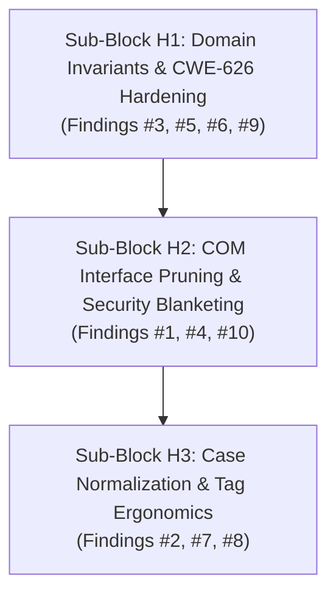

# Cycle 2 Qualitative Architecture & Code Quality Review: Block H

> **Document Status:** Active Engineering Review Report & Planning Foundation  
> **Workspace:** `opc-cli`  
> **Target Crate:** `opc-da-client` (v0.2.0 $\rightarrow$ v0.3.0 Release Candidate)  
> **Evaluation Date:** 2026-09-16  
> **Reference Document:** [`refactor/cycle2_review.md`](file:///c:/Users/WSALIGAN/code/opc-cli/refactor/cycle2_review.md)  
> **Review Scope:** Block H Subsystems (`src/types/server.rs`, `src/types/batch.rs`, `src/raw/memory.rs`, `src/com/security.rs`, `src/com/connector/server.rs`, `src/com/connector/group.rs`, `src/com/worker/pool.rs`, `src/client/mod.rs`, `src/client/builder.rs`, `src/client/gateway.rs`)  
> **Review Pipeline:** Subagent-Orchestrated Multi-Lens Audit (5 Specialized Lens Subagents: Logic, Design, Performance, Security, API)  
> **User Interview Alignment & Consensuses:**
> 1. **Sub-block Decomposition:** Approved 3-Sub-Block Split:
>    - **Sub-block H1:** Domain Invariants & CWE-626 Hardening (Findings #3, #5, #6, #9)
>    - **Sub-block H2:** COM Resource & Dead Code Pruning (Findings #1, #4, #10, plus KB5004442 DCOM proxy blanket fix)
>    - **Sub-block H3:** Case Normalization & Tag Ergonomics (Findings #2, #7, #8)
> 2. **Input Validation Strategy (Finding #2):** Clean Slate Strict. Completely remove infallible `From<&str>` / `From<String>` for `ServerIdentifier` and `OpcServerEndpoint`. Require `TryFrom<&str>` or `.parse::<ServerIdentifier>()`, and enforce fallible validation in `bind_new` and `builder.server` returning `OpcResult`.
> 3. **Unread COM Interfaces (Finding #7):** Full Clean Slate Pruning. Completely delete the 6 unread COM interface fields from `ComGroup` and 3 from `ComServer`, remove `connect_server_identifier`, and purge `#[allow(dead_code)]`.
> 4. **Finding #12 Placement:** Retained in Block H (assigned to Sub-block H3 alongside Findings #9 and #21).

---

## 1. Review Summary

- **Scope:** Block H across domain type invariants, COM connector abstractions, memory conversions, worker pooling, and typestate facades in `opc-da-client`.
- **Active Lenses:** Logic, Design, Performance, Security, API (All 5 Lenses Active).
- **Date:** 2026-09-16
- **Review Model:** Subagent-orchestrated multi-lens audit (5 specialized subagents dispatched in parallel).
- **Findings Breakdown:** **10 Consolidated Findings**
  * 🔴 **Critical:** 2 (DCOM proxy blanketing transient pointer drop, spurious active group LRU cache thrashing)
  * 🟠 **Major:** 4 (Hyphen heuristic discrimination flaw, infallible `From` validation bypass, unread COM interface mandatory casts, CWE-626 interior null bytes)
  * 🟡 **Minor:** 3 (`IntoTags` lifetime over-constraint, case-sensitive hostname checks, fail-late worker thread initialization)
  * ⚪ **Nitpick:** 1 (Residual uncalled helper functions and obsolete impersonation constant)
- **Health Assessment:** **Needs Attention** (While foundational safety is high, Block H harbors critical DCOM security and caching performance defects that will cause runtime failures under Windows KB5004442 and degraded IPC throughput if not resolved before planning).
- **Multi-Lens Hotspots:**
  1. [`src/com/security.rs:97`](file:///c:/Users/WSALIGAN/code/opc-cli/opc-da-client/src/com/security.rs#L97) (Flagged across **Logic** and **Security** for applying DCOM proxy blanket to a dropped temporary `IUnknown`, leaving actual target proxies unblanketed).
  2. [`src/types/server.rs:225-280`](file:///c:/Users/WSALIGAN/code/opc-cli/opc-da-client/src/types/server.rs#L225-L280) (Flagged across **API**, **Security**, **Design**, and **Logic** for hyphen heuristic ProgID misclassification and infallible `From<&str>` validation bypass).
  3. [`src/com/connector/group.rs:91-102`](file:///c:/Users/WSALIGAN/code/opc-cli/opc-da-client/src/com/connector/group.rs#L91-L102) & [`src/com/connector/server.rs:173-275`](file:///c:/Users/WSALIGAN/code/opc-cli/opc-da-client/src/com/connector/server.rs#L173-L275) (Flagged across **Design**, **Performance**, and **Logic** for storing 9 unused COM interfaces, incurring up to 12 redundant DCOM IPC round-trips, and aborting on standard servers lacking optional interfaces).
  4. [`src/com/worker/pool.rs:64-68`](file:///c:/Users/WSALIGAN/code/opc-cli/opc-da-client/src/com/worker/pool.rs#L64-L68) (Flagged across **Performance**, **Logic**, and **Design** for case-sensitive byte equality on case-insensitive OPC tag identifiers, degrading pooling into continuous group creation, item re-registration, and group removal).

---

## 2. Unified Findings Matrix

| # | Severity | Category | File:Line | Function / Symbol Signature | Summary | Source Lenses |
|:---:|:---|:---|:---|:---|:---|:---:|
| **1** | 🔴 Critical | Security / Logic | [`src/com/security.rs:97`](file:///c:/Users/WSALIGAN/code/opc-cli/opc-da-client/src/com/security.rs#L97) | `apply_proxy_blanket<T: Interface>(proxy: &T, legacy_dcom: bool) -> OpcResult<()>` | Proxy blanket applied to dropped temporary `IUnknown` pointer created via `.cast()`, leaving target interface proxy unblanketed and causing `0x80070005` Access Denied under KB5004442. | Logic, Security |
| **2** | 🔴 Critical | Performance / Logic | [`src/com/worker/pool.rs:64`](file:///c:/Users/WSALIGAN/code/opc-cli/opc-da-client/src/com/worker/pool.rs#L64) | `PooledServer::find_active_group_idx(&self, tags: &TagBatch) -> Option<usize>` | Active group cache matching uses byte-exact equality (`a == b`) on case-insensitive OPC tags, causing spurious cache misses, redundant COM group creation, item registration, and LRU thrashing. | Performance, Logic, Design |
| **3** | 🟠 Major | Security / API / Logic | [`src/types/server.rs:225`](file:///c:/Users/WSALIGAN/code/opc-cli/opc-da-client/src/types/server.rs#L225)<br>[`src/types/server.rs:270`](file:///c:/Users/WSALIGAN/code/opc-cli/opc-da-client/src/types/server.rs#L270) | `<ServerIdentifier as FromStr>::from_str`<br>`<ServerIdentifier as From<&str>>::from` | Hyphen heuristic (`trimmed.contains('-')`) breaks valid industrial ProgIDs; infallible `From<&str>` uses `unwrap_or_else` to swallow syntax errors into invalid `ProgId` variants (CWE-20). | API, Security, Design, Logic |
| **4** | 🟠 Major | Design / Logic / Perf | [`src/com/connector/group.rs:91`](file:///c:/Users/WSALIGAN/code/opc-cli/opc-da-client/src/com/connector/group.rs#L91)<br>[`src/com/connector/server.rs:173`](file:///c:/Users/WSALIGAN/code/opc-cli/opc-da-client/src/com/connector/server.rs#L173) | `struct ComGroup`<br>`struct ComServer` | ISP violation: storing 6 unread COM interfaces in `ComGroup` and 3 in `ComServer`; mandatory fallible casts (`?`) cause connection aborts on compliant servers; adds 12 redundant DCOM IPC round-trips. | Design, Logic, Performance |
| **5** | 🟠 Major | Security | [`src/raw/memory.rs:625`](file:///c:/Users/WSALIGAN/code/opc-cli/opc-da-client/src/raw/memory.rs#L625)<br>[`src/types/server.rs:21`](file:///c:/Users/WSALIGAN/code/opc-cli/opc-da-client/src/types/server.rs#L21) | `<LocalPointer<Vec<u16>> as From<S>>::from`<br>`normalize_host_str` | Unchecked interior null bytes in UTF-16 wide pointer conversion and host normalization cause Win32 string truncation in DCOM `CoCreateInstanceEx` and `CLSIDFromProgID` (CWE-626). | Security, Design |
| **6** | 🟠 Major | API / Logic | [`src/types/server.rs:634`](file:///c:/Users/WSALIGAN/code/opc-cli/opc-da-client/src/types/server.rs#L634)<br>[`src/client/mod.rs:93`](file:///c:/Users/WSALIGAN/code/opc-cli/opc-da-client/src/client/mod.rs#L93) | `<OpcServerEndpoint as From<&str>>::from`<br>`OpcDaClient::bind_new` | Infallible `From<&str>` on `OpcServerEndpoint` silently falls back to `local(s)`, masking invalid endpoint syntax; `bind_new` discards UNC/URI remote paths. | API, Logic |
| **7** | 🟡 Minor | API / Perf | [`src/types/batch.rs:343`](file:///c:/Users/WSALIGAN/code/opc-cli/opc-da-client/src/types/batch.rs#L343) | `<&'static [&'static str] as IntoTags>::into_tag_batch` | Lifetime over-constraint (`'static`) in `IntoTags` prevents dynamic borrowed slices (`&'a [&'a str]`) and `&str` from converting into `TagBatch` without manual `Vec<String>` heap allocations. | API, Performance, Design |
| **8** | 🟡 Minor | Logic / API | [`src/client/gateway.rs:376`](file:///c:/Users/WSALIGAN/code/opc-cli/opc-da-client/src/client/gateway.rs#L376)<br>[`src/com/worker/pool.rs:191`](file:///c:/Users/WSALIGAN/code/opc-cli/opc-da-client/src/com/worker/pool.rs#L191) | `OpcDaClient::validate_bound_server`<br>`struct ConnectionPool` | Case-sensitive hostname and ProgID comparisons trigger false-positive `InvalidState` rejections for differing casing (e.g. `SRV1` vs `srv1`) and duplicate connection pool entries. | Logic, API, Performance |
| **9** | 🟡 Minor | Design / Security | [`src/client/mod.rs:93`](file:///c:/Users/WSALIGAN/code/opc-cli/opc-da-client/src/client/mod.rs#L93)<br>[`src/client/builder.rs:232`](file:///c:/Users/WSALIGAN/code/opc-cli/opc-da-client/src/client/builder.rs#L232) | `OpcDaClient::bind_new`<br>`OpcDaClientBuilder::build_bound` | Fail-late validation: client constructors eagerly spawn OS threads and initialize COM MTA apartments before validating server endpoint invariants. | Design, Security |
| **10** | ⚪ Nitpick | Design / Security | [`src/com/connector/server.rs:79`](file:///c:/Users/WSALIGAN/code/opc-cli/opc-da-client/src/com/connector/server.rs#L79)<br>[`src/com/security.rs:32`](file:///c:/Users/WSALIGAN/code/opc-cli/opc-da-client/src/com/security.rs#L32) | `connect_server_identifier`<br>`RPC_C_IMP_LEVEL_IMPERSONATE` | Uncalled dead free function bypassing security settings and obsolete impersonation constant retained under `#[allow(dead_code)]`. | Design, Security, Logic |

---

## 3. Detailed Findings

### Finding 1: [Critical] [Security / Logic] — DCOM Proxy Blanket Applied to Dropped Temporary Proxy
- **Severity:** 🔴 Critical
- **Category:** Security / Logic
- **File & Line:** [`src/com/security.rs:92-112`](file:///c:/Users/WSALIGAN/code/opc-cli/opc-da-client/src/com/security.rs#L92-L112)
- **Function Signature:** `apply_proxy_blanket<T: Interface>(proxy: &T, legacy_dcom: bool) -> OpcResult<()>`
- **Source Lens:** Logic, Security
- **Detail:**
  In `apply_proxy_blanket`, line 97 executes:
  ```rust
  let unk: windows::core::IUnknown = proxy.cast().map_err(crate::errors::OpcError::from)?;
  unsafe {
      CoSetProxyBlanket(
          &unk,
          RPC_C_AUTHN_WINNT,
          RPC_C_AUTHZ_NONE,
          None,
          RPC_C_AUTHN_LEVEL(authn_level),
          RPC_C_IMP_LEVEL(RPC_C_IMP_LEVEL_IDENTIFY),
          None,
          EOAC_NONE,
      )
  }
  ```
  In Windows COM / DCOM architecture, security proxy blankets are bound to a **specific interface proxy pointer**; they are not shared across sibling interface pointers on the same COM identity. In `windows-core`, `.cast::<U>()` executes `QueryInterface(&IUnknown::IID)` to produce a distinct, newly allocated COM proxy pointer. `CoSetProxyBlanket(&unk, ...)` configures security *only on that temporary `IUnknown` pointer*. When `apply_proxy_blanket` returns, `unk` is dropped and released.
  
  The caller's actual interface proxy (`proxy: &T`, representing `IOPCServer`, `IOPCSyncIO`, etc.) **remains unblanketed** with default OS credentials. On modern Windows releases enforcing KB5004442 DCOM packet integrity (`RPC_C_AUTHN_LEVEL_PKT_INTEGRITY`), subsequent remote method calls on `proxy` fail immediately with HRESULT `0x80070005` (`E_ACCESSDENIED`).
- **Suggestion:**
  Do not call `QueryInterface`. Because all COM interfaces in `windows-core` are `#[repr(transparent)]` wrappers around raw vtable pointers and inherit from `IUnknown`, borrow the proxy directly as `&windows::core::IUnknown` using `std::mem::transmute` or `std::mem::ManuallyDrop`:
  ```rust
  pub fn apply_proxy_blanket<T: Interface>(
      proxy: &T,
      legacy_dcom: bool,
  ) -> crate::errors::OpcResult<()> {
      let authn_level = authn_level_for(legacy_dcom);
      // SAFETY: Interface implementations in windows-core are #[repr(transparent)] wrappers
      // around *mut c_void. All COM interfaces inherit from IUnknown, so borrowing the raw pointer
      // as IUnknown without QueryInterface ensures CoSetProxyBlanket configures this exact proxy
      // pointer rather than an ephemeral sibling proxy.
      let unk: &windows::core::IUnknown = unsafe { std::mem::transmute(proxy) };
      unsafe {
          CoSetProxyBlanket(
              unk,
              RPC_C_AUTHN_WINNT,
              RPC_C_AUTHZ_NONE,
              None,
              RPC_C_AUTHN_LEVEL(authn_level),
              RPC_C_IMP_LEVEL(RPC_C_IMP_LEVEL_IDENTIFY),
              None,
              EOAC_NONE,
          )
      }
      .map_err(crate::errors::OpcError::from)
  }
  ```

---

### Finding 2: [Critical] [Performance / Logic] — Spurious Active Group Cache Misses and Redundant COM IPC Round-Trips
- **Severity:** 🔴 Critical
- **Category:** Performance / Logic
- **File & Line:** [`src/com/worker/pool.rs:64-68`](file:///c:/Users/WSALIGAN/code/opc-cli/opc-da-client/src/com/worker/pool.rs#L64-L68)
- **Function Signature:** `PooledServer::find_active_group_idx(&self, tags: &TagBatch) -> Option<usize>`
- **Source Lens:** Performance, Logic, Design
- **Detail:**
  In `PooledServer::find_active_group_idx`, matching tags are compared using exact byte equality:
  ```rust
  self.active_groups.iter().position(|g| {
      g.tags.len() == tags.len() && g.tags.iter().zip(tags.iter_str()).all(|(a, b)| a == b)
  })
  ```
  According to the OPC DA 2.05a and 3.0 standards, OPC tag ItemIDs are case-insensitive. Lookups in `TagValues::get` ([`src/types/collection.rs:422`](file:///c:/Users/WSALIGAN/code/opc-cli/opc-da-client/src/types/collection.rs#L422)) correctly use `eq_ignore_ascii_case`.
  
  When an application polls tags where the casing differs across cycles or configuration sources (e.g. `"Device1.Temp"` vs `"device1.temp"`), `a == b` fails. This produces a false cache miss in the 4-slot active group LRU cache (`MAX_ACTIVE_GROUPS = 4`), triggering a heavy sequence of cold-path operations in `read.rs:130-165`:
  1. Allocation of a fresh `Vec<String>` ($N$ heap allocations).
  2. Synchronous Win32 COM IPC round-trip to `server.add_group(...)`.
  3. $N$ wide-character string allocations and a synchronous Win32 COM IPC round-trip to `group.add_items(...)`.
  4. If `active_groups.len() >= 4`, eviction of the least-recently-used group via a synchronous `server.remove_group(...)` round-trip.
  
  Over DCOM network connections, these 2–3 blocking RPC round-trips introduce 30–300 ms of artificial latency per poll cycle on an operation that should be an immediate sub-microsecond cache hit.
- **Suggestion:**
  Compare tag identifiers case-insensitively using `eq_ignore_ascii_case`:
  ```rust
  pub(crate) fn find_active_group_idx(&self, tags: &TagBatch) -> Option<usize> {
      self.active_groups.iter().position(|g| {
          g.tags.len() == tags.len()
              && g.tags
                  .iter()
                  .zip(tags.iter_str())
                  .all(|(a, b)| a.eq_ignore_ascii_case(b))
      })
  }
  ```

---

### Finding 3: [Major] [Security / API / Logic] — Invariant Bypass and Hyphen Discrimination Flaw in `ServerIdentifier`
- **Severity:** 🟠 Major
- **Category:** Security / API / Logic
- **File & Line:** [`src/types/server.rs:225-245`](file:///c:/Users/WSALIGAN/code/opc-cli/opc-da-client/src/types/server.rs#L225-L245), [`src/types/server.rs:270-286`](file:///c:/Users/WSALIGAN/code/opc-cli/opc-da-client/src/types/server.rs#L270-L286)
- **Function Signature:**
  - `<ServerIdentifier as FromStr>::from_str(s: &str) -> Result<ServerIdentifier, ParseServerIdError>`
  - `<ServerIdentifier as From<&str>>::from(s: &str) -> ServerIdentifier`
- **Source Lens:** API, Security, Design, Logic
- **Detail:**
  1. **Hyphen Heuristic Diverts Valid Industrial ProgIDs:** In `from_str`, line 231 tests `if trimmed.starts_with('{') || trimmed.contains('-')` to discriminate CLSIDs. However, industrial ProgIDs regularly contain hyphens (e.g., `"KEPServerEX-V6.1"`, `"Schneider-OpcServer.1"`, `"ABB.IndustrialIT-Server.1"`), and `validate_prog_id` explicitly permits hyphens (`b == b'-'`). Because of `trimmed.contains('-')`, valid hyphenated ProgIDs are diverted into `Clsid::from_str`, which fails and returns `ParseServerIdError::InvalidClsid`.
  2. **Infallible `From` Error Swallowing (CWE-20):** `<ServerIdentifier as From<&str>>::from` catches parse errors with `unwrap_or_else`:
     ```rust
     s.parse().unwrap_or_else(|_| {
         if let Some(clsid) = Clsid::parse(s) {
             Self::Clsid(clsid)
         } else {
             Self::ProgId(s.to_string())
         }
     })
     ```
     When malformed strings (control characters, tabs, interior nulls, spaces, or consecutive dots) are passed, `s.parse()` fails, and `unwrap_or_else` unconditionally wraps the invalid payload into `ServerIdentifier::ProgId`. This allows malformed ProgIDs to enter the `Bound` client session unvalidated, violating CWE-20 boundaries.
- **Suggestion:**
  1. Use zero-allocation `Clsid::parse(trimmed)` to discriminate CLSIDs without hyphen false-positives:
     ```rust
     impl FromStr for ServerIdentifier {
         type Err = ParseServerIdError;

         fn from_str(s: &str) -> Result<Self, Self::Err> {
             let trimmed = s.trim();
             if trimmed.is_empty() {
                 return Err(ParseServerIdError::Empty);
             }

             if let Some(clsid) = Clsid::parse(trimmed) {
                 Ok(Self::Clsid(clsid))
             } else if trimmed.starts_with('{') {
                 let clsid = Clsid::from_str(trimmed).map_err(ParseServerIdError::InvalidClsid)?;
                 Ok(Self::Clsid(clsid))
             } else {
                 validate_prog_id(trimmed)?;
                 Ok(Self::ProgId(trimmed.to_string()))
             }
         }
     }
     ```
  2. In alignment with the user interview decision, completely remove infallible `From<&str>` and `From<String>`. Implement `TryFrom<&str>` and `TryFrom<String>` returning `Result<ServerIdentifier, ParseServerIdError>`.

---

### Finding 4: [Major] [Design / Logic / Perf] — Unread COM Interfaces and Mandatory Cast Failures in `ComGroup` & `ComServer`
- **Severity:** 🟠 Major
- **Category:** Design / Logic / Performance
- **File & Line:** [`src/com/connector/group.rs:91-102, 274-289`](file:///c:/Users/WSALIGAN/code/opc-cli/opc-da-client/src/com/connector/group.rs#L91-L102), [`src/com/connector/server.rs:171-218, 266-276`](file:///c:/Users/WSALIGAN/code/opc-cli/opc-da-client/src/com/connector/server.rs#L171-L218)
- **Function Signature:** `struct ComGroup`, `struct ComServer`, `ComGroup::try_from`, `connect_endpoint_with_legacy`
- **Source Lens:** Design, Logic, Performance
- **Detail:**
  `ComGroup` queries and stores 8 COM interfaces, but `ConnectedGroup` only ever uses two:
  - `item_mgt: IOPCItemMgt` (in `add_items`)
  - `sync_io: IOPCSyncIO` (in `read` and `write`)
  The remaining 6 interfaces (`group_state_mgt`, `public_group_state_mgt`, `async_io`, `async_io2`, `connection_point_container`, `data_object`) are never read anywhere in the codebase.
  
  In `ComGroup::try_from`, `group_state_mgt`, `async_io2`, and `connection_point_container` are queried using mandatory `cast()?`. If an OPC DA server only supports synchronous I/O and omits connection points or async interfaces, group creation **aborts with `E_NOINTERFACE`**, breaking connectivity with legitimate industrial servers.
  
  Similarly, `ComServer` queries and blanket-secures `common`, `item_properties`, and `server_public_groups`, none of which are ever called. These 9 unused interfaces add up to 12 redundant DCOM IPC round-trips per connection and group lifecycle, increment server reference counts, and required adding `#[allow(dead_code)]` to both structs.
- **Suggestion:**
  Prune unused interface fields from `ComGroup` and `ComServer`. Remove `#[allow(dead_code)]`:
  ```rust
  pub struct ComGroup {
      pub(crate) item_mgt: crate::raw::bindings::da::IOPCItemMgt,
      pub(crate) sync_io: crate::raw::bindings::da::IOPCSyncIO,
  }

  impl TryFrom<windows::core::IUnknown> for ComGroup {
      type Error = windows::core::Error;

      fn try_from(unknown: windows::core::IUnknown) -> Result<Self, Self::Error> {
          Ok(Self {
              item_mgt: unknown.cast()?,
              sync_io: unknown.cast()?,
          })
      }
  }

  pub struct ComServer {
      pub(crate) server: crate::raw::bindings::da::IOPCServer,
      pub(crate) browse_server_address_space:
          Option<crate::raw::bindings::da::IOPCBrowseServerAddressSpace>,
      pub(crate) legacy_dcom: bool,
  }
  ```

---

### Finding 5: [Major] [Security] — CWE-626 Interior Null-Byte Truncation in `LocalPointer` and `normalize_host_str`
- **Severity:** 🟠 Major
- **Category:** Security
- **File & Line:** [`src/raw/memory.rs:622-628`](file:///c:/Users/WSALIGAN/code/opc-cli/opc-da-client/src/raw/memory.rs#L622-L628), [`src/types/server.rs:21-28`](file:///c:/Users/WSALIGAN/code/opc-cli/opc-da-client/src/types/server.rs#L21-L28), [`src/com/security.rs:135`](file:///c:/Users/WSALIGAN/code/opc-cli/opc-da-client/src/com/security.rs#L135)
- **Function Signature:** `<LocalPointer<Vec<u16>> as From<S>>::from`, `normalize_host_str`
- **Source Lens:** Security, Design
- **Detail:**
  `LocalPointer<Vec<u16>>::from` converts string slices via `s.as_ref().encode_utf16().chain(Some(0)).collect()` without verifying the absence of interior null (`\0`) bytes. In `create_remote_instance`, the remote `host` parameter is passed via `LocalPointer::from(host)` to `COSERVERINFO.pwszName` for Win32 `CoCreateInstanceEx`. If an untrusted host string contains an interior null (e.g. `"victim-host\0.evil.com"`), Win32 RPC truncates the string at the null terminator (CWE-626), leading to hostname confusion and unintended remote target activations.
- **Suggestion:**
  1. Add interior null validation to `normalize_host_str` in `src/types/server.rs`:
     ```rust
     pub(crate) fn normalize_host_str(host: Option<&str>) -> Option<&str> {
         let h = host?.trim();
         if h.is_empty()
             || h.contains('\0')
             || h.eq_ignore_ascii_case("localhost")
             || h == "127.0.0.1"
             || h == "::1"
         {
             None
         } else {
             Some(h)
         }
     }
     ```
  2. Implement fallible constructor `LocalPointer::try_from_str(s: &str) -> OpcResult<Self>` returning `OpcError::InvalidState` if interior nulls are detected.

---

### Finding 6: [Major] [API / Logic] — Infallible `From<&str>` for `OpcServerEndpoint` and Remote Path Handling in `bind_new`
- **Severity:** 🟠 Major
- **Category:** API / Logic
- **File & Line:** [`src/types/server.rs:634-644`](file:///c:/Users/WSALIGAN/code/opc-cli/opc-da-client/src/types/server.rs#L634-L644), [`src/client/mod.rs:93-100`](file:///c:/Users/WSALIGAN/code/opc-cli/opc-da-client/src/client/mod.rs#L93-L100)
- **Function Signature:** `<OpcServerEndpoint as From<&str>>::from`, `OpcDaClient::bind_new`
- **Source Lens:** API, Logic
- **Detail:**
  1. `<OpcServerEndpoint as From<&str>>::from` executes `s.parse().unwrap_or_else(|_| Self::local(s))`. When a caller supplies an invalid UNC path (e.g. `r"\\host\"`), parsing fails, and `from` silently creates a local endpoint with the raw invalid path as a ProgID.
  2. [`README.md:290`](file:///c:/Users/WSALIGAN/code/opc-cli/opc-da-client/README.md#L290) documents passing UNC paths directly to `bind_new`: `OpcDaClient::bind_new(r"\\192.168.1.50\{GUID}")?`. But because `bind_new` accepts `impl Into<ServerIdentifier>`, UNC strings are forced into `ServerIdentifier` with `host = None`.
- **Suggestion:**
  1. Replace `From<&str>` and `From<String>` on `OpcServerEndpoint` with `TryFrom<&str>` and `TryFrom<String>`.
  2. Generalize `bind_new` to accept `impl TryInto<OpcServerEndpoint, Error: Into<OpcError>>`. Because `OpcServerEndpoint::from_str` parses both local identifiers and UNC paths (`\\host\server`), this safely unifies local and remote string binding.

---

### Finding 7: [Minor] [API / Perf] — Overly Restrictive `'static` Lifetime Bounds on `IntoTags`
- **Severity:** 🟡 Minor
- **Category:** API / Performance
- **File & Line:** [`src/types/batch.rs:343-392`](file:///c:/Users/WSALIGAN/code/opc-cli/opc-da-client/src/types/batch.rs#L343-L392)
- **Function Signature:** `<&'static [&'static str] as IntoTags>::into_tag_batch`
- **Source Lens:** API, Performance, Design
- **Detail:**
  `IntoTags` is implemented exclusively for `'static` string slices. When callers hold dynamically borrowed slices (`&'a [&'a str]`, `&'a [&'static str]`) or non-static `&str` references (such as formatted strings or CLI arguments), the compiler rejects `slice.into_tag_batch()`. Callers are forced to allocate an owned `Vec<String>`.
- **Suggestion:**
  Implement `IntoTags` for `&str` (leveraging `TagBatch::from_str_lenient` for zero-allocation 31-byte stack SSO) and for borrowed slices `&'a [&'a str]`:
  ```rust
  impl IntoTags for &str {
      #[inline]
      fn into_tag_batch(self) -> TagBatch {
          TagBatch::from_str_lenient(self)
      }
  }

  impl<'a> IntoTags for &'a [&'a str] {
      #[inline]
      fn into_tag_batch(self) -> TagBatch {
          TagBatch {
              repr: TagBatchRepr::Owned(self.iter().map(|&s| s.to_string()).collect()),
          }
      }
  }
  ```

---

### Finding 8: [Minor] [Logic / API] — Case-Sensitive Hostname and ProgID Comparison in `validate_bound_server`
- **Severity:** 🟡 Minor
- **Category:** Logic / API
- **File & Line:** [`src/client/gateway.rs:376-392`](file:///c:/Users/WSALIGAN/code/opc-cli/opc-da-client/src/client/gateway.rs#L376-L392), [`src/com/worker/pool.rs:191`](file:///c:/Users/WSALIGAN/code/opc-cli/opc-da-client/src/com/worker/pool.rs#L191)
- **Function Signature:** `OpcDaClient::validate_bound_server`, `ConnectionPool`
- **Source Lens:** Logic, API, Performance
- **Detail:**
  In `validate_bound_server`, equality checks use case-sensitive comparisons (`!=`). NetBIOS/DNS hostnames and Windows COM ProgIDs in the registry are case-insensitive. A client bound to `"host1/Matrikon.OPC"` will reject requests targeting `"HOST1/Matrikon.OPC"` with `OpcError::InvalidState`. Furthermore, `ConnectionPool` hashes `OpcServerEndpoint` with raw casing, creating duplicate connection entries for varying host casing.
- **Suggestion:**
  1. Add `ServerIdentifier::matches(&self, other: &Self) -> bool` performing case-insensitive matching for `ProgId` and exact matching for `Clsid`.
  2. Use `eq_ignore_ascii_case` for hostname comparisons in `validate_bound_server`.
  3. Lowercase hostnames in `normalize_host` / `normalize_host_str` so `OpcServerEndpoint` instances share a canonical lowercase host representation.

---

### Finding 9: [Minor] [Design / Security] — Fail-Late Domain Invariant Validation in Client Facades & Builder
- **Severity:** 🟡 Minor
- **Category:** Design / Security
- **File & Line:** [`src/client/mod.rs:93-100`](file:///c:/Users/WSALIGAN/code/opc-cli/opc-da-client/src/client/mod.rs#L93-L100), [`src/client/builder.rs:232-246`](file:///c:/Users/WSALIGAN/code/opc-cli/opc-da-client/src/client/builder.rs#L232-L246)
- **Function Signature:** `OpcDaClient::bind_new`, `OpcDaClientBuilder::build_bound`
- **Source Lens:** Design, Security
- **Detail:**
  `OpcDaClient::bind_new` and `OpcDaClientBuilder::build_bound` eagerly initialize the MTA background worker thread (`ComWorker::start`) and spawn an OS thread before verifying whether the target server identifier or endpoint is valid. If input is invalid, an OS thread is spawned wastefully before returning an error.
- **Suggestion:**
  Validate the identifier or endpoint at the entrypoint prior to invoking `Self::new(...)` or `self.build()?`.

---

### Finding 10: [Nitpick] [Design / Security] — Residual Dead Helper Function and Obsolete Impersonation Constant
- **Severity:** ⚪ Nitpick
- **Category:** Design / Security
- **File & Line:** [`src/com/connector/server.rs:77-86`](file:///c:/Users/WSALIGAN/code/opc-cli/opc-da-client/src/com/connector/server.rs#L77-L86), [`src/com/security.rs:32-33`](file:///c:/Users/WSALIGAN/code/opc-cli/opc-da-client/src/com/security.rs#L32-L33)
- **Function Signature:** `connect_server_identifier`, `RPC_C_IMP_LEVEL_IMPERSONATE`
- **Source Lens:** Design, Security, Logic
- **Detail:**
  `connect_server_identifier` is an uncalled free function in `com/connector/server.rs` that hardcodes `legacy_dcom: false`, bypassing connector-configured DCOM security settings. `RPC_C_IMP_LEVEL_IMPERSONATE` in `com/security.rs` is an unused constant presenting a privilege escalation hazard. Both are marked with `#[allow(dead_code)]`.
- **Suggestion:**
  Delete `connect_server_identifier` and `RPC_C_IMP_LEVEL_IMPERSONATE`, and remove their `#[allow(dead_code)]` suppressions.

---

## 4. Architectural Synthesis & High-Level Changes

### 4.1 Sub-Block Decomposition Architecture (H1, H2, H3)

In accordance with user interview guidance, Block H is structured into **3 manageable, highly cohesive sub-blocks**:



#### Sub-Block H1: Domain Invariants & CWE-626 Security Hardening (Findings #3, #5, #6, #9)
- **Core Focus:** Establishing airtight type-system invariants at public input boundaries and preventing memory/string truncation bugs.
- **Key Deliverables:**
  1. **ProgID Hyphen Heuristic Fix:** Modernize `ServerIdentifier::from_str` to evaluate `Clsid::parse(trimmed)` directly. Allow valid industrial ProgIDs with hyphens (e.g. `KEPServerEX-V6.1`) to proceed to `validate_prog_id`.
  2. **Clean Slate Infallible Conversion Removal:** Delete `From<&str>` and `From<String>` for `ServerIdentifier` and `OpcServerEndpoint`. Implement `TryFrom<&str>` and `TryFrom<String>`.
  3. **Constructor Validation & Ergonomics:** Update `OpcDaClient::bind_new` to accept `impl TryInto<OpcServerEndpoint, Error: Into<OpcError>>` and `bind_new_remote` to accept `impl TryInto<ServerIdentifier, Error: Into<OpcError>>`. Enforce validation before worker thread initialization.
  4. **Builder Deferred Error Accumulation:** Update `OpcDaClientBuilder::server` to accept `impl TryInto<ServerIdentifier, Error: Into<OpcError>>`, accumulating errors internally and failing gracefully in `build()` and `build_bound()`.
  5. **CWE-626 Null-Byte Rejection:** Add interior null checks to `normalize_host_str` and introduce fallible `LocalPointer::try_from_str`.

#### Sub-Block H2: COM Interface Pruning & Security Blanketing (Findings #1, #4, #10)
- **Core Focus:** Windows COM/DCOM FFI cleanup, elimination of unneeded IPC round-trips, and fixing DCOM security proxy blanketing.
- **Key Deliverables:**
  1. **Direct Proxy Blanket Fix:** Update `apply_proxy_blanket` to borrow the proxy's own vtable pointer directly as `&windows::core::IUnknown` without invoking `.cast::<IUnknown>()`, ensuring `CoSetProxyBlanket` configures the actual dispatch proxy under Windows KB5004442.
  2. **Unread COM Interface Pruning:**
     - Prune 6 unused interface fields from `ComGroup` (`group_state_mgt`, `public_group_state_mgt`, `async_io`, `async_io2`, `connection_point_container`, `data_object`), retaining only `item_mgt` and `sync_io`. Prune `try_from` to query only those two interfaces.
     - Prune 3 unused interface fields from `ComServer` (`common`, `item_properties`, `server_public_groups`), retaining only `server` and `browse_server_address_space`.
  3. **Dead Code Elimination:** Delete uncalled `connect_server_identifier` and obsolete `RPC_C_IMP_LEVEL_IMPERSONATE`, achieving zero `#[allow(dead_code)]` annotations in connector modules.

#### Sub-Block H3: Case Normalization & Tag Ergonomics (Findings #2, #7, #8)
- **Core Focus:** Runtime cache hit optimization, case-insensitive identity matching, and zero-allocation tag slice conversions.
- **Key Deliverables:**
  1. **Case-Insensitive Active Group Cache:** Update `PooledServer::find_active_group_idx` to compare tag ItemIDs using `a.eq_ignore_ascii_case(b)`, eliminating redundant COM group recreations and LRU evictions.
  2. **Case-Insensitive Server Validation:** Implement `ServerIdentifier::matches` and update `validate_bound_server` to compare hostnames and ProgIDs case-insensitively (`eq_ignore_ascii_case`).
  3. **Canonical Lowercase Host Normalization:** Lowercase hostnames in `normalize_host_str` to guarantee consistent hash keying in `ConnectionPool`.
  4. **`IntoTags` Lifetime Relaxation:** Implement `IntoTags` for `&str` (leveraging 31-byte stack SSO via `from_str_lenient`) and for borrowed slices `&'a [&'a str]`, enabling zero-allocation borrowed tag batches.

---

### 4.2 Inter-Block Dependency Flow & Execution Rationale

The dependency ordering is strictly sequential: **H1 $\rightarrow$ H2 $\rightarrow$ H3**.

1. **H1 Precedes H2:** Establishing airtight domain types (`ServerIdentifier`, `OpcServerEndpoint`) ensures that invalid or null-injected strings are rejected at the client boundary before reaching the Win32 COM connectors modified in H2.
2. **H2 Precedes H3:** Stabilizing the pruned `ComServer` and `ComGroup` structs ensures that worker pooling and group caching in H3 interact only with the clean, finalized COM interface layout.
3. **H3 Finalizes Block H:** Adding case-insensitive matching and relaxed `IntoTags` lifetimes acts as the runtime optimization layer on top of verified domain invariants and streamlined COM interfaces.

---

### 4.3 Blast Radius & Downstream Compatibility

- **`opc-cli` Crate:**
  Codebase analysis confirms that `opc-cli` does not invoke `ServerIdentifier::from(&str)` or pass unvalidated strings to `bind_new`. In `opc-cli/src/app.rs`, server names are passed as strings to `OpcProvider` trait methods (`read_tag_value`, `read_tag_values`, `browse_tags`), which accept `&str`.
  Therefore, all breaking changes in Block H (removal of `From<&str>`, introduction of `TryFrom<&str>`) will produce **zero compilation errors in `opc-cli`**.
- **`opc-da-client` Crate:**
  Internal tests and mock harnesses in `tests/` currently construct `ServerIdentifier::from("...")` or call `bind_new("...")`. Updating them to `s.parse().unwrap()` or passing valid string slices into `TryInto` constructors is straightforward and covered by standard TDD steps.

---

## 5. Next Steps & Planning Readiness Gate

This qualitative review confirms that Block H is fully understood, decomposed, and ready for formal implementation planning under the TARS protocol.

### Recommended Phased Planning Order:
1. `/plan-making` $\rightarrow$ **Block H1: Domain Invariants & CWE-626 Hardening** (Findings #3, #5, #6, #9)
2. `/plan-making` $\rightarrow$ **Block H2: COM Interface Pruning & Security Blanketing** (Findings #1, #4, #10)
3. `/plan-making` $\rightarrow$ **Block H3: Case Normalization & Tag Ergonomics** (Findings #2, #7, #8)

---

📄 **Artifact Location:** [`refactor/cycle2_blockH_review.md`](file:///c:/Users/WSALIGAN/code/opc-cli/refactor/cycle2_blockH_review.md)
