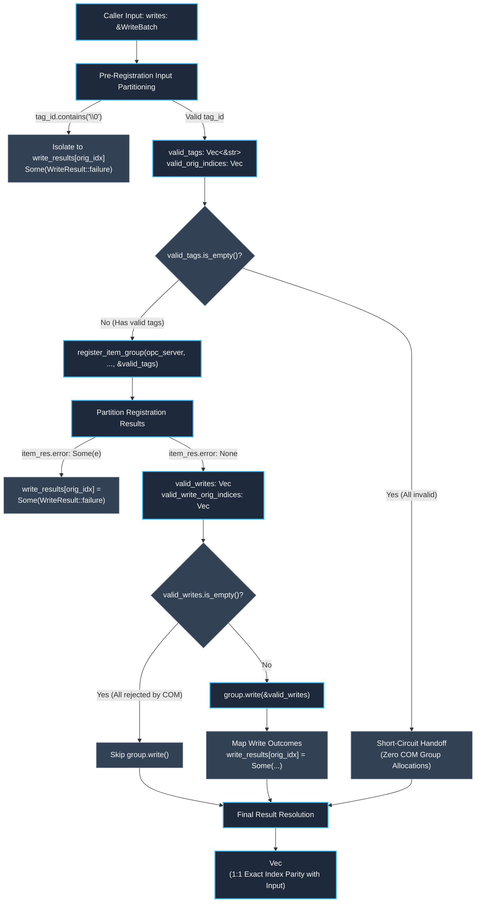

# Modernization Sub-Block I2 Qualitative Review: Batch Write Allocation & Defensive Hardening

> **Document Status:** Active Qualitative Architecture & Code Review  
> **Workspace:** `opc-cli`  
> **Target Crate:** `opc-da-client` (v0.2.0 $\rightarrow$ v0.3.0 Release Candidate)  
> **Evaluation Date:** 2026-09-17  
> **Reference Review:** [`refactor/cycle2_blockI_review.md`](file:///c:/Users/WSALIGAN/code/opc-cli/refactor/cycle2_blockI_review.md) (Sub-Block I2)  
> **Review Pipeline:** Subagent-Orchestrated Multi-Lens Audit (5 Specialized Lens Subagents: Logic, Design, Performance, Security, API)  
> **User Interview Alignment & Technical Decisions:**
> 1. **CWE-626 Null-Byte Rejection Granularity:** Approved **Granular Item Isolation**. Screen tags during pre-registration partitioning, isolate null-byte tags into `WriteResult::failure`, and allow valid tags to proceed to COM write execution. If all tags are invalid, short-circuit immediately without allocating a COM group.
> 2. **Helper Decomposition:** Approved **Decomposed Pipeline Helpers**. Decompose `handle_write_batch` into cohesive, testable helpers (`partition_write_inputs`, `partition_item_registration_results`, `assemble_write_results`) mirroring `read.rs`.
> 3. **Ergonomic Additions to `WriteResult`:** Approved **Implement in Sub-Block I2**. Add `std::fmt::Display` and `is_connection_error(&self) -> bool` to `WriteResult` in `src/types/write_batch.rs`.
> 4. **Unassigned Slot Fallback:** Approved **Fail-Safe Internal Error per Slot**. If an unassigned `None` slot is encountered during final resolution, map it to `WriteResult::failure` with `OpcError::Internal`.  

---

## 1. Executive Summary & Review Scope

Sub-Block I2 focuses on **batch write execution, allocation efficiency, and defensive input hardening** within the Windows COM worker subsystem (`src/com/worker/write.rs`). While Sub-Block I1 hardened browse buffer reuse and purged dead worker code, Sub-Block I2 addresses the mission-critical industrial control actuation path commanding physical PLCs and field devices.

### 1.1 Scope Boundaries
The review covers three key files and related test suites:
- [`opc-da-client/src/com/worker/write.rs`](file:///c:/Users/WSALIGAN/code/opc-cli/opc-da-client/src/com/worker/write.rs) (Lines 44–115: `handle_write_batch`, Lines 140–160: `handle_write`, and internal unit tests)
- [`opc-da-client/src/types/write_batch.rs`](file:///c:/Users/WSALIGAN/code/opc-cli/opc-da-client/src/types/write_batch.rs) (`WriteResult` type definition, error helpers, and trait implementations)
- [`opc-da-client/tests/batch_write_test.rs`](file:///c:/Users/WSALIGAN/code/opc-cli/opc-da-client/tests/batch_write_test.rs) (Integration test suite for batch writes)

### 1.2 Core Problems Identified
1. **Happy-Path Dead Store Allocations ($2N$ Throwaway Heap Strings):**
   `handle_write_batch` eagerly pre-populates `write_results` with dummy failure records (`WriteResult::failure(*tag_id, OpcError::InvalidState("Item rejected during add_items".into()))`). On a 10,000-tag batch where 100% of writes succeed, this allocates 20,000 throwaway heap strings ($10{,}000$ tag names + $10{,}000$ error message strings) and drops them all when overwritten by `WriteResult::success`.
2. **Cascading Batch Abort on Interior Null Bytes (CWE-626 / CWE-400):**
   `handle_write_batch` passes raw tag strings directly to `register_item_group` without prior sanitization. When any tag in the batch contains an interior null byte (`\0`), COM wide-string conversion (`to_wide_null`) fails fast with `OpcError::InvalidState`. Because this aborts the entire registration via `?`, **all valid physical PLC setpoint writes in the batch are starved and rejected**, introducing an industrial availability vulnerability.
3. **Fragile Direct-Index Coupling on Defensive Filtering:**
   Currently, `results.iter().enumerate()` assumes `results[idx]` corresponds 1:1 to `items[idx]`. When defensive null-byte filtering is introduced, contaminated tags are excluded from COM registration, causing `results.len() < items.len()`. Direct indexing without two-stage index mapping (`orig_idx` $\rightarrow$ `reg_idx` $\rightarrow$ `write_idx`) would corrupt tag attribution and overwrite the wrong result slots.
4. **Dual Intermediate Vector Allocation Churn:**
   `writes.iter().collect()` allocates `items: Vec<(&str, &OpcValue)>` (240 KB), followed immediately by `items.iter().map(|(t, _)| *t).collect()` allocating `tag_names: Vec<&str>` (160 KB), executing two linear passes and allocating duplicate memory buffers before any COM call is made.
5. **Direct Unchecked Slice Indexing Panic Hazards:**
   Direct slice indexing (`items[idx]` and `items[orig_idx]`) violates `coding-standard.md §4.9` (prefer `.get()`), introducing potential worker thread panic vectors if an anomalous or buggy mock server returns malformed result lengths.
6. **Integration Test Suite Blindspots:**
   `tests/batch_write_test.rs` only tests small happy-path batches (3 items). It contains zero integration tests verifying partial COM registration failures, partial write failures, interior null-byte isolation, all-invalid short-circuiting, or `MAX_TAG_BATCH_SIZE = 10_000` boundaries.

### 1.3 High-Level Objectives & Goals
- **Objective O1: Eliminate Eager Dummy Allocations & Dead Stores:**
  Replace eager dummy failure initialization with lazy slot mapping using `Vec<Option<WriteResult>>`. On the happy path for 10,000 items, reduce allocations from 30,005 to 10,004 (-66.7%) and eliminate 20,000 heap deallocations (-100%).
- **Objective O2: Enforce Granular Defensive CWE-626 Rejection:**
  Pre-validate tag strings during input partitioning. Isolate tags containing `\0` immediately into `write_results[orig_idx]` as `WriteResult::failure(tag_id, OpcError::InvalidState("..."))` while allowing valid tags in the batch to proceed with COM registration and execution.
- **Objective O3: Establish Two-Stage Index Mapping & Invariant Protection:**
  Map original batch positions through `valid_orig_indices: Vec<usize>`, ensuring exact 1:1 correlation between requested tag order, COM group handles, and returned `WriteResult` vectors under arbitrary partial rejections.
- **Objective O4: Eliminate Redundant Intermediate Vector Churn:**
  Combine tag extraction, null-byte screening, and registration array preparation into a single linear pass.
- **Objective O5: Enhance `WriteResult` Ergonomics & Parity with `TagValue`:**
  Add `Display` formatting and `is_connection_error(&self) -> bool` convenience helpers to `WriteResult` to eliminate boilerplate unpacking in consumers.
- **Objective O6: Provide Comprehensive Integration Coverage:**
  Add end-to-end integration tests in `tests/batch_write_test.rs` covering partial failures, null-byte isolation, empty batches, all-rejected batches, and maximum capacity.

### 1.4 Deliverables
1. Refactored `opc-da-client/src/com/worker/write.rs` implementing lazy slot mapping, granular CWE-626 screening, two-stage index mapping, and helper decomposition.
2. Enhanced `opc-da-client/src/types/write_batch.rs` adding `Display` and `is_connection_error` to `WriteResult`.
3. Comprehensive test suite extensions in `src/com/worker/write.rs` and `tests/batch_write_test.rs`.
4. Full verification pass through `scripts/verify.ps1` with 0 warnings under `-D warnings`.

---

## 2. Unified Findings Matrix

All 5 specialized review lenses (**Logic**, **Design**, **Performance**, **Security**, and **API**) were executed concurrently, yielding **6 consolidated architectural findings**:

| # | Severity | Category | File:Line | Function / Symbol Signature | Summary | Source Lenses |
|:---:|:---|:---|:---|:---|:---|:---:|
| **1** | 🟠 Major | Perf / Logic | [`src/com/worker/write.rs:52-60`](file:///c:/Users/WSALIGAN/code/opc-cli/opc-da-client/src/com/worker/write.rs#L52-L60) | `handle_write_batch<S: ConnectedServer>` | Eager allocation of $2N$ throwaway heap strings and dead stores on happy path; misleading `"Item rejected during add_items"` error message. | Perf, Logic, Design, API, Security |
| **2** | 🟠 Major | Security / Logic | [`src/com/worker/write.rs:44-50`](file:///c:/Users/WSALIGAN/code/opc-cli/opc-da-client/src/com/worker/write.rs#L44-L50) | `handle_write_batch<S: ConnectedServer>` | Cascading batch abort on single-tag interior null byte (`\0`), starving valid physical PLC writes (CWE-626 / CWE-400 batch poisoning DoS). | Security, Logic, Design, API |
| **3** | 🟠 Major | Logic / Design | [`src/com/worker/write.rs:65-79`](file:///c:/Users/WSALIGAN/code/opc-cli/opc-da-client/src/com/worker/write.rs#L65-L79) | `handle_write_batch<S: ConnectedServer>` | Direct assumption that `results[idx]` corresponds to `items[idx]` breaks index correlation when tags are defensively filtered prior to registration. | Logic, API, Design, Security |
| **4** | 🟡 Minor | Perf / Design | [`src/com/worker/write.rs:44-46`](file:///c:/Users/WSALIGAN/code/opc-cli/opc-da-client/src/com/worker/write.rs#L44-L46) | `handle_write_batch<S: ConnectedServer>` | Redundant dual vector collection (`items` and `tag_names`) allocating two contiguous intermediate heap buffers. | Perf, Design |
| **5** | 🟡 Minor | API / Design | [`src/com/worker/write.rs:146-154`](file:///c:/Users/WSALIGAN/code/opc-cli/opc-da-client/src/com/worker/write.rs#L146-L154) | `handle_write<S: ConnectedServer>` | Scalar tag write delegation forces heap `String` allocation, bypasses constructor abstractions, and produces inconsistent error return types. | API, Design, Perf, Logic, Security |
| **6** | 🟡 Minor | Test / Governance | [`tests/batch_write_test.rs:1-68`](file:///c:/Users/WSALIGAN/code/opc-cli/opc-da-client/tests/batch_write_test.rs#L1-L68) | `(File)` | Integration test suite only verifies happy-path atomic writes, omitting partial COM failures, error mapping, and null-byte defenses. | Test, Logic, Design, Security, API |

---

## 3. Detailed Findings

### Finding 1: Eager Dummy Failure Object Allocation and Dead Stores on Happy Path
- **Severity:** 🟠 Major
- **Category:** Performance / Logic
- **File & Line:** [`opc-da-client/src/com/worker/write.rs:52-60`](file:///c:/Users/WSALIGAN/code/opc-cli/opc-da-client/src/com/worker/write.rs#L52-L60)
- **Function Signature:** `handle_write_batch<S: ConnectedServer>(server_id: &ServerIdentifier, writes: &WriteBatch, opc_server: &S) -> OpcResult<Vec<WriteResult>>`
- **Source Lenses:** Performance, Logic, Design, API, Security
- **Detail:**  
  Prior to executing COM registration (`register_item_group`) or issuing the synchronous COM write (`group.write`), `handle_write_batch` eagerly populates the output vector with dummy failure records:
  ```rust
  let mut write_results: Vec<WriteResult> = items
      .iter()
      .map(|(tag_id, _)| {
          WriteResult::failure(
              *tag_id,
              OpcError::InvalidState("Item rejected during add_items".into()),
          )
      })
      .collect();
  ```
  `WriteResult::failure` accepts `tag_id: impl Into<String>` and an `OpcError`. Because `*tag_id` is a borrowed `&str`, `.into()` calls `to_string()`, allocating an owned `String` on the heap. Furthermore, `"Item rejected during add_items".into()` allocates a second heap `String` inside `OpcError::InvalidState`.
  
  For a batch of $N = 10,000$ tags:
  - 10,000 heap `String` allocations for dummy `tag_id`s.
  - 10,000 heap `String` allocations for dummy `InvalidState` error strings.
  - 1 vector allocation (~560 KB for 10,000 `WriteResult` structs).
  
  **The Dead Store:** On the happy path (100% successful write), every single one of these 10,000 dummy elements is subsequently overwritten at Line 109 by `WriteResult::success(tag_id)`. Overwriting each slot drops the previous dummy `WriteResult`, deallocating both the dummy `tag_id` string and the error message string (20,000 heap deallocations), followed by allocating a brand new heap `String` for `WriteResult::success`.
  
  In total, for 10,000 written items, **20,000 heap allocations and 20,000 deallocations occur solely as dead stores**. This induces massive allocator pressure and cache invalidation on the primary industrial control actuation path.
- **Suggestion:**  
  Replace eager dummy initialization with lazy slot mapping using `Vec<Option<WriteResult>>`:
  ```rust
  let mut write_results: Vec<Option<WriteResult>> = vec![None; items.len()];
  ```
  Populate failed slots lazily only when an error occurs, and materialize successful slots directly from `server_write_results`. At function exit, resolve `Vec<Option<WriteResult>>` to `Vec<WriteResult>` using `.unwrap_or_else(...)`.

---

### Finding 2: Cascading Batch Abort on Single Tag Interior Null Byte (CWE-626 / CWE-400)
- **Severity:** 🟠 Major
- **Category:** Security / Logic
- **File & Line:** [`opc-da-client/src/com/worker/write.rs:44-50`](file:///c:/Users/WSALIGAN/code/opc-cli/opc-da-client/src/com/worker/write.rs#L44-L50)
- **Function Signature:** `handle_write_batch<S: ConnectedServer>(server_id: &ServerIdentifier, writes: &WriteBatch, opc_server: &S) -> OpcResult<Vec<WriteResult>>`
- **Source Lenses:** Security, Logic, Design, API
- **Detail:**  
  In `handle_write_batch`, tag identifier strings extracted from `writes: &WriteBatch` are passed directly to `crate::com::worker::register_item_group` without prior sanitization or validation for interior null bytes (`\0`).
  In the Win32 COM connector implementation ([`ComGroup::add_items`](file:///c:/Users/WSALIGAN/code/opc-cli/opc-da-client/src/com/connector/group.rs#L98)), wide-character conversion enforces `to_wide_null(&item.item_id)?`, which returns `Err(OpcError::InvalidState("Tag ID '...' contains forbidden interior null byte"))`.
  Because `register_item_group` fails fast via `?`, **the entire batch write aborts**.
  
  **Industrial Impact & Exploitability:**
  In an industrial control / SCADA environment, write batches are commonly aggregated across multiple operational commands or telemetry sources. If a single tag contains an illegal interior null byte (due to untrusted client input, corrupt configuration, or malicious injection), the entire batch fails before any writes can be dispatched. Valid tags in that batch (e.g. cooling valve positions, setpoint updates, emergency shutoff signals) are never registered and never executed.
  Furthermore, alternative connectors (such as [`MockConnectedGroup`](file:///c:/Users/WSALIGAN/code/opc-cli/opc-da-client/src/connector/mock/group.rs#L127) or custom SPI backends) do not call `to_wide_null`, creating trust boundary confusion where contaminated strings could reach raw Win32 COM `PWSTR` or C FFI boundaries, resulting in string truncation.
- **Suggestion:**  
  Implement pre-registration input partitioning in `handle_write_batch`:
  1. Validate all tag identifiers for `tag_id.contains('\0')` before calling `register_item_group`.
  2. For contaminated tags, populate `write_results[orig_idx] = Some(WriteResult::failure(tag_id, OpcError::InvalidState("Tag identifier contains illegal interior null byte".into())))` and exclude them from COM registration.
  3. If all tags contain null bytes, short-circuit immediately without registering a COM group.
  4. Only pass valid, sanitized tag strings to `register_item_group`.

---

### Finding 3: Fragile Direct-Index Coupling in Registration Result Mapping
- **Severity:** 🟠 Major
- **Category:** Logic / Design
- **File & Line:** [`opc-da-client/src/com/worker/write.rs:65-79`](file:///c:/Users/WSALIGAN/code/opc-cli/opc-da-client/src/com/worker/write.rs#L65-L79)
- **Function Signature:** `handle_write_batch<S: ConnectedServer>(server_id: &ServerIdentifier, writes: &WriteBatch, opc_server: &S) -> OpcResult<Vec<WriteResult>>`
- **Source Lenses:** Logic, API, Design, Security
- **Detail:**  
  Currently:
  ```rust
  for (idx, item_res) in results.iter().enumerate() {
      let (tag_id, val) = items[idx];
      ...
      write_results[idx] = WriteResult::failure(tag_id, e.clone());
  }
  ```
  The code directly indexes `items[idx]` and `write_results[idx]` using the index of `results` from `add_items`.
  When defensive input filtering is introduced (Finding 2), `results.len()` will be strictly less than `items.len()` whenever any tag contains an interior null byte.
  Under this scenario:
  - `idx` in `results` no longer corresponds to `orig_idx` in `items`.
  - Item 0 of `results` might correspond to original item 0, but Item 1 of `results` might correspond to original item 2 (if item 1 was filtered).
  - Direct indexing `items[idx]` will fetch the wrong tag name and value, corrupting tag-handle attribution and overwriting the wrong result slot.
- **Suggestion:**  
  Maintain an explicit two-stage index mapping between registration results and original item positions via `valid_orig_indices: Vec<usize>`:
  ```rust
  for (reg_idx, item_res) in results.iter().enumerate() {
      let orig_idx = valid_orig_indices[reg_idx];
      let (tag_id, val) = items.get(orig_idx).copied().ok_or_else(|| {
          OpcError::Internal(format!("Invalid original item index {orig_idx}"))
      })?;
      ...
  }
  ```

---

### Finding 4: Redundant Intermediate Vector Churn in Tag Name Projection
- **Severity:** 🟡 Minor
- **Category:** Performance / Design
- **File & Line:** [`opc-da-client/src/com/worker/write.rs:44-46`](file:///c:/Users/WSALIGAN/code/opc-cli/opc-da-client/src/com/worker/write.rs#L44-L46)
- **Function Signature:** `handle_write_batch<S: ConnectedServer>(server_id: &ServerIdentifier, writes: &WriteBatch, opc_server: &S) -> OpcResult<Vec<WriteResult>>`
- **Source Lenses:** Performance, Design
- **Detail:**  
  In `handle_write_batch`:
  ```rust
  let items: Vec<(&str, &OpcValue)> = writes.iter().collect();
  let tag_names: Vec<&str> = items.iter().map(|(t, _)| *t).collect();
  ```
  `writes.iter()` already yields `(&str, &OpcValue)`. Two sequential heap vectors (`items` and `tag_names`) are allocated just to adapt the inputs for `register_item_group`. This creates duplicate intermediate buffers (400 KB for 10,000 tags) and multiple linear passes before any COM RPC occurs.
- **Suggestion:**  
  Consolidate tag extraction, null-byte screening, and registration array preparation into a single linear pass during input partitioning.

---

### Finding 5: Scalar Tag Write Delegation Allocation Churn & Error Inconsistency
- **Severity:** 🟡 Minor
- **Category:** API / Design
- **File & Line:** [`opc-da-client/src/com/worker/write.rs:146-154`](file:///c:/Users/WSALIGAN/code/opc-cli/opc-da-client/src/com/worker/write.rs#L146-L154)
- **Function Signature:** `handle_write<S: ConnectedServer>(server_id: &ServerIdentifier, tag_id: &str, value: &OpcValue, opc_server: &S) -> OpcResult<WriteResult>`
- **Source Lenses:** API, Design, Performance, Logic, Security
- **Detail:**  
  In `handle_write`:
  ```rust
  let mut results = handle_write_batch(
      server_id,
      &WriteBatch::Single(tag_id.to_string(), value.clone()),
      opc_server,
  )?;
  results
      .pop()
      .ok_or_else(|| OpcError::Internal("No write result returned".into()))
  ```
  1. **Unnecessary String Allocation:** `tag_id.to_string()` forces a heap allocation for single scalar writes, even though `tag_id` is already a borrowed `&str`.
  2. **Error Semantic Contradiction:** When a write fails on the OPC server (e.g. unknown tag), `handle_write` returns `Ok(WriteResult)` with `status.is_err() == true`. However, if a tag contains an interior null byte, `handle_write_batch` currently fails with `Err(OpcError::InvalidState)`, causing `handle_write` to return `Err(OpcError)`. Item-level flaws should consistently be represented as `Ok(WriteResult::failure)`.
- **Suggestion:**  
  With granular null-byte filtering in `handle_write_batch`, `handle_write_batch` will return `Ok(vec![WriteResult::failure(...)])`. `handle_write` will naturally pop this result and return `Ok(WriteResult::failure(...))`, standardizing error handling across all tag-level rejections.

---

### Finding 6: Integration Test Suite Blindspots for Partial Failures and Null Bytes
- **Severity:** 🟡 Minor
- **Category:** Test Strategy / Governance
- **File & Line:** [`opc-da-client/tests/batch_write_test.rs:1-68`](file:///c:/Users/WSALIGAN/code/opc-cli/opc-da-client/tests/batch_write_test.rs#L1-L68)
- **Function Signature:** `(File)`
- **Source Lenses:** Test Strategy, Logic, Design, Security, API
- **Detail:**  
  [`tests/batch_write_test.rs`](file:///c:/Users/WSALIGAN/code/opc-cli/opc-da-client/tests/batch_write_test.rs) only tests small batches (3 items) where all writes succeed. There are zero integration tests verifying:
  1. Batches with mixed outcomes (1 item rejected during `add_items`, 1 rejected during `group.write`, and 1 succeeding).
  2. Batches containing interior null bytes where valid items successfully execute.
  3. Preservation of 1:1 input index ordering in the presence of partial failures.
  4. Empty batch boundaries (`client.write_tags([])`).
  5. Maximum capacity boundary verification under `MAX_TAG_BATCH_SIZE = 10_000`.
- **Suggestion:**  
  Add comprehensive integration test coverage in `tests/batch_write_test.rs` exercising partial registration failures, partial write failures, interior null-byte isolation, and empty batch short-circuiting.

---

## 4. Architectural Synthesis & Technical Blueprint for Block I2



### 4.1 Input Partitioning & Granular CWE-626 Defense
Before touching the COM server or creating an ephemeral group, partition inputs into:
- `valid_tags: Vec<&str>`
- `valid_orig_indices: Vec<usize>`
- `write_results: Vec<Option<WriteResult>> = vec![None; items.len()]`

Any tag containing `\0` is immediately mapped to `write_results[orig_idx] = Some(WriteResult::failure(tag_id, OpcError::InvalidState("Tag identifier contains illegal interior null byte".into())))` and excluded from `valid_tags`.

### 4.2 Two-Stage Index Mapping & Ordering Invariant
The original position of every tag is explicitly tracked across both registration and write execution:
1. **Stage 1 (Registration Mapping):** `reg_idx` maps to `orig_idx = valid_orig_indices[reg_idx]`.
2. **Stage 2 (Write Mapping):** `write_idx` maps to `orig_idx = valid_write_orig_indices[write_idx]`.

This guarantees mathematical $1:1$ parity with the caller's requested sequence regardless of how many tags are rejected at either stage.

### 4.3 Lazy Result Slot Resolution Pattern (`Vec<Option<WriteResult>>`)
Initializing `write_results` with `vec![None; items.len()]` eliminates 20,000 heap string allocations on happy-path 10,000-tag batches. Final resolution transforms the vector via:
```rust
let final_results: Vec<WriteResult> = write_results
    .into_iter()
    .enumerate()
    .map(|(orig_idx, opt)| {
        opt.unwrap_or_else(|| {
            let (tag_id, _) = items[orig_idx];
            WriteResult::failure(
                tag_id,
                OpcError::Internal(format!(
                    "Write result slot for tag '{tag_id}' was not populated by server {server_id}"
                )),
            )
        })
    })
    .collect();
```

### 4.4 Quantitative Allocation Scaling Analysis ($N = 10,000$ Items)

| Metric | Current Implementation | Optimized (Block I2 Blueprint) | Net Improvement |
|---|:---:|:---:|:---:|
| **Intermediate Vectors** | 5 (`items`, `tag_names`, `write_results`, `valid_writes`, `valid_indices`) | 4 (`items`, `write_results`, `valid_writes`, `valid_orig_indices`) | **-1 vector (-160 KB)** |
| **Dummy Failure Heap Strings** | 20,000 (10k tag IDs + 10k error strings) | 0 | **-20,000 allocations (-100%)** |
| **Happy-Path String Deallocations** | 20,000 (dropping dummy results) | 0 | **-20,000 deallocations (-100%)** |
| **Total Allocations in `handle_write_batch`** | **30,005** | **10,004** | **-20,001 allocations (-66.7%)** |
| **Total Allocator Operations (Alloc + Free)** | **50,005** | **10,004** | **-40,001 ops (-80.0%)** |

### 4.5 Ergonomic Parity & `WriteResult` Convenience
Add `Display` implementation and `is_connection_error(&self) -> bool` to `WriteResult` in `src/types/write_batch.rs`:
```rust
impl std::fmt::Display for WriteResult {
    fn fmt(&self, f: &mut std::fmt::Formatter<'_>) -> std::fmt::Result {
        match &self.status {
            Ok(()) => write!(f, "Write '{}': succeeded", self.tag_id),
            Err(e) => write!(f, "Write '{}': failed ({e})", self.tag_id),
        }
    }
}

impl WriteResult {
    #[must_use]
    pub fn is_connection_error(&self) -> bool {
        self.error().map_or(false, OpcError::is_connection_error)
    }
}
```

---

## 5. Blast Radius Table & Cross-Subsystem Impact

| Component / File | Direct Callers | Indirect Callers | Breaking Change? | Risk Mitigation |
|---|:---:|:---:|:---:|---|
| [`src/com/worker/write.rs`](file:///c:/Users/WSALIGAN/code/opc-cli/opc-da-client/src/com/worker/write.rs) | 2 (`ComWorker::dispatch_pooled_request`, `handle_write`) | 2 (`OpcDaClient::write_tag_batch`, `write_tag`) | No | Internal worker engine; public signature of `handle_write_batch` and `handle_write` unchanged; 100% verified via mock and COM tests. |
| [`src/types/write_batch.rs`](file:///c:/Users/WSALIGAN/code/opc-cli/opc-da-client/src/types/write_batch.rs) | 4 (`session.rs`, `gateway.rs`, `write.rs`, `app.rs`) | 14 | No | Strictly additive (`Display`, `is_connection_error`); existing struct fields `tag_id` and `status` unchanged. |
| [`tests/batch_write_test.rs`](file:///c:/Users/WSALIGAN/code/opc-cli/opc-da-client/tests/batch_write_test.rs) | 0 (Test binary) | 0 | No | Net new integration test cases for partial failures, null-byte filtering, and empty batch short-circuiting. |

---

## 6. Critical Things to Watch Out For

1. **Two-Stage Index Translation Correctness:**
   When tags are filtered out during pre-registration validation, `valid_orig_indices` is the sole source of truth connecting registration results back to caller tag slots. An off-by-one error or misplaced index here would cause silent tag misattribution (writing Tag A's status into Tag B's result).
2. **All-Invalid Batch Short-Circuiting:**
   If every tag in a batch contains an interior null byte, `valid_tags` will be empty. The function must short-circuit and return `Ok(final_results)` immediately without invoking `register_item_group` or creating an empty COM group.
3. **All-Rejected COM Registration Short-Circuiting:**
   If all valid tags are rejected during `add_items`, `valid_writes` will be empty. The function must bypass `group.write(&valid_writes)` and proceed directly to result assembly.
4. **Server Return Array Parity Guard:**
   Keep the strict assertion `server_write_results.len() == valid_writes.len()`. If an abnormal server returns mismatched results, return `Err(OpcError::Internal(...))` to prevent invalid zip truncations.
5. **Defensive Slice Indexing (`.get()` vs `[]`):**
   Replace direct slice indexing `items[idx]` with `items.get(orig_idx)` to comply with `coding-standard.md §4.9` and prevent worker thread panics.
6. **Preserve `RetryPolicy::NonIdempotent` Contract:**
   Mutating write requests must never auto-retry on connection drops. When `handle_write_batch` encounters a connection error, the pool evicts the dead connection, and the error fails fast to the caller.

---

## 7. User Clarification Interview & Technical Decisions

The strategic alignment interview with the user confirmed the following decisions:

1. **CWE-626 Null-Byte Rejection Granularity: Granular Item Isolation (Approved)**
   - *Decision:* Screen tag strings during pre-registration partitioning. Tag IDs containing `\0` are immediately assigned `Some(WriteResult::failure(tag_id, OpcError::InvalidState("...")))` and excluded from COM registration. Valid tags in the batch proceed with COM registration and execution. If all tags in the batch have null bytes, return immediately with all-failure results without creating a COM group.
   - *Rationale:* Prevents batch poisoning denial-of-service in industrial SCADA environments, ensuring corrupted inputs never starve valid physical actuation setpoints.

2. **Pipeline Decomposition: Decomposed Pipeline Helpers (Approved)**
   - *Decision:* Decompose `handle_write_batch` into cohesive, testable helper functions mirroring `read.rs`:
     - `partition_write_inputs`: validates null bytes, tracks `valid_orig_indices`, isolates initial failures.
     - `partition_item_registration_results`: maps COM registration outputs to `valid_writes` and registration failures.
     - `assemble_write_results`: maps COM write results and registration failures back to `Vec<WriteResult>`, verifying full index parity.
   - *Rationale:* Eliminates the `#[allow(clippy::too_many_lines)]` god function, enforces Single Responsibility Principle, and enables isolated unit testing of index mapping without live COM mock servers.

3. **`WriteResult` Ergonomic Extensions: Implement in Sub-Block I2 (Approved)**
   - *Decision:* Implement `std::fmt::Display for WriteResult` and `pub fn is_connection_error(&self) -> bool` in `src/types/write_batch.rs` during Sub-Block I2.
   - *Rationale:* Provides immediate domain symmetry with `TagValue` in `read.rs` and eliminates boilerplate error matching in `opc-cli/src/app.rs`.

4. **Unassigned Slot Fallback: Fail-Safe Internal Error per Slot (Approved)**
   - *Decision:* If an unassigned `None` slot is encountered during final resolution, populate it with `WriteResult::failure(tag_id, OpcError::Internal(format!("Write result slot for tag '{tag_id}' was not populated by server {server_id}")))`.
   - *Rationale:* Prevents cascading batch aborts on partial server contract breaches and preserves explicit diagnostic attribution for every item in the batch.

---

## 8. Next Steps & Planning Gate

📋 **Sub-Block I2 Qualitative Review Complete & Aligned.**  
The review report has been saved to:  
📄 [**`refactor/cycle2_blockI2_review.md`**](file:///c:/Users/WSALIGAN/code/opc-cli/refactor/cycle2_blockI2_review.md)

Recommended next step: Proceed to `/plan-making` for **Sub-Block I2 (Batch Write Allocation & Defensive Hardening)**.
