# Implementation Plan: Sub-Block I3 — Collector Concurrency, Zero-Copy Handoff & Traversal Parity

**Role:** Architect • **Date:** 2026-09-18 • **Tier:** M  
**Scope:** Zero-Copy Terminal Browse Handoff, Reader-Writer Concurrency Upgrade, Recursive Chunking Parity, Idempotent Retry Clean Slate Guard, API Ergonomics & Comprehensive Doc-Tests

---

## Review History & Verdict

| Cycle | Reviewer | Model | Verdict | Adjustments Applied |
|---|---|---|---|---|
| 1 | `plan-reviewer` | `flash` | `Changes Requested` | Cycle 1 Review identified 5 code-level adjustments: (1) Added minimal TDD compilation stubs for `with_capacity` and `clear` in Step 1; (2) Added explicit `PushBatchGuard` RAII and `push_batch` code snippet in Step 2; (3) Explicitly disabled `supports_flat_browse` in recursive chunking test in Step 3; (4) Added `#[allow(clippy::iter_with_drain)]`, preserved log event names (`"browse_recursive:leaf_item"`, `"browse_recursive:get_item_id"`), and added post-drain boundary check in `browse_recursive` in Step 4; (5) Recorded review history for Cycle 2. |
| 2 | `plan-reviewer` | `flash` | `⚠️ Revisions Recommended` | Cycle 2 Review identified 4 code-level adjustments: (1) Un-nested the terminal capacity/cancellation guard in `browse_recursive` so it executes immediately after leaf processing regardless of whether `chunk` had residual items; (2) Updated `handle_browse` clean-slate retry entry logic to separate cancellation, clearing, and capacity checks cleanly; (3) Explicitly instructed the Builder in Step 5 and Step 7 that `assert!(collector.is_full())` and `assert_eq!(collector.len(), N)` must be removed and replaced with `assert!(collector.is_empty())` and `assert_eq!(collector.len(), 0)` because `harvest()` drains the accumulator (verification of capacity truncation via `assert_eq!(tags.len(), max_tags)`); (4) Added `#[must_use]` attribute to `TagCollector::with_capacity` in Interface Contract 1, Step 1 stubs, and Step 2 implementation. |
| 3 | `plan-reviewer` | `flash` | `✅ Approved` | Cycle 3 Review verified all 4 code-level adjustments applied: un-nested terminal recursion guard, sequential retry entry check, post-harvest assertion instructions, and `#[must_use]` on `with_capacity`. Architectural integrity, concurrency safety, and quality gates 100% compliant. |
| 4 | Lead Architect | `claude-opus-4-6-thinking` | `✅ Approved` | Cycle 4 deep review by higher-thinking model. All 4 source files (collector.rs, browse.rs, worker.rs, integration tests), pool.rs retry logic, and mock server verified line-by-line. 5 lenses evaluated: (1) **Factual Accuracy**: All 6 line-number claims confirmed against live code; (2) **Concurrency Correctness**: RwLock upgrade semantics, symmetrical poison recovery (idempotent concurrent resync safe), PushBatchGuard RAII Drop-ordering (drops before write guard — correct), double-checked cancellation — all verified sound; (3) **Architecture**: Clean slate 3-check separation (cancelled→harvest, dirty→clear, full→empty), browse_recursive chunking with un-nested terminal guard, harvest() capacity loss acceptable at terminal call site; (4) **Edge Cases**: PushBatchGuard normal-path return-then-drop semantics (usize Copy — safe), clear() independence from cancel() confirmed, MockConnectedServer `.with_organization(Hierarchy)` redundant but harmless; (5) **Test Coverage**: 42+ test touchpoints, all TDD RED→GREEN gates linearly ordered, 2 cancellation tests already compatible with harvest semantics (correctly excluded from Steps 5-7). **0 issues found.** |

---

## Builder Context
Read before starting:
- [`opc-da-client/src/types/collector.rs`](file:///c:/Users/WSALIGAN/code/opc-cli/opc-da-client/src/types/collector.rs) L1-176 (`TagCollector` and `TagCollectorInner` primitives)
- [`opc-da-client/src/com/worker/browse.rs`](file:///c:/Users/WSALIGAN/code/opc-cli/opc-da-client/src/com/worker/browse.rs) L20-215 (`handle_browse` and `browse_recursive`)
- [`opc-da-client/src/com/worker.rs`](file:///c:/Users/WSALIGAN/code/opc-cli/opc-da-client/src/com/worker.rs) L658-672 (`ComRequest::BrowseTags` dispatch)
- [`opc-da-client/tests/tag_browsing_integration_test.rs`](file:///c:/Users/WSALIGAN/code/opc-cli/opc-da-client/tests/tag_browsing_integration_test.rs) L1-290 (6 integration test assertions)
- [`.agents/rules/coding-standard.md §4.5`](file:///c:/Users/WSALIGAN/code/opc-cli/.agents/rules/coding-standard.md) (Doc-test and documentation rules)

---

## Problem Statement

During the qualitative review of Cycle 2 Block I3 ([`refactor/cycle2_blockI3_review.md`](file:///c:/Users/WSALIGAN/code/opc-cli/refactor/cycle2_blockI3_review.md)), five distinct performance, concurrency, and behavioral parity issues were identified in the tag collection and namespace traversal subsystem:

1. **Terminal Result Deep-Cloning Churn:** In [`src/com/worker/browse.rs:36-38, 56-62`](file:///c:/Users/WSALIGAN/code/opc-cli/opc-da-client/src/com/worker/browse.rs#L36-L38), `handle_browse` returns `collector.snapshot()`. On a standard 10,000-tag namespace, this causes 10,001 heap allocations and ~860 KB of ephemeral memory churn. Crucially, the caller's retained `TagCollector` clone retains all 10,000 strings as "zombie memory" until re-browse.
2. **Reader-Writer Lock Contention:** [`src/types/collector.rs:16-21`](file:///c:/Users/WSALIGAN/code/opc-cli/opc-da-client/src/types/collector.rs#L16-L21) uses an exclusive `Mutex<Vec<String>>`. When concurrent observers (60 FPS TUI render loops, watchdog timers, or metrics loggers) call `snapshot()`, they block the background MTA worker from pushing chunks.
3. **Hierarchical Traversal Progress Starvation (CWE-400):** Unlike flat browsing which flushes leaves every 256 items (`BROWSE_CHUNK_SIZE`), [`browse_recursive` in `browse.rs:182-214`](file:///c:/Users/WSALIGAN/code/opc-cli/opc-da-client/src/com/worker/browse.rs#L182-L214) accumulates all leaves into an unchunked local `Vec::new()`. If a branch contains 5,000 leaves and capacity remaining is 10, the loop executes 5,000 synchronous DCOM queries before pushing, freezing TUI progress and wasting network I/O.
4. **Idempotent Retry Tag Duplication:** In [`worker.rs:668`](file:///c:/Users/WSALIGAN/code/opc-cli/opc-da-client/src/com/worker.rs#L668), `BrowseTags` is dispatched under `RetryPolicy::Idempotent`. If a transient network disconnect occurs midway through traversal, the retry closure re-executes `handle_browse` with the same `collector` reference without clearing partial tags, appending duplicates from root.
5. **Ergonomic Gaps & Missing Doc-Tests:** `TagCollector` lacks a `with_capacity(capacity, max_tags)` constructor (causing up to 4 buffer doublings on 10k tags) and an in-place `clear(&self)` method. Furthermore, 12 of 13 public methods lack runnable `# Examples` doc-tests.

**Constraints:**
- Non-admin Windows environment, shell `pwsh`.
- Zero breaking changes to `TagCollector` public signatures.
- Zero breaking changes to downstream consumers (`opc-cli/src/app.rs`).
- `pwsh scripts/verify.ps1` must pass with zero warnings/errors.

---

## Plan Objectives

| ID | Objective | Success Criteria | Steps |
|---|---|---|---|
| O1 | Zero-Copy Terminal Browse Handoff | `handle_browse` calls `collector.harvest()` instead of `snapshot()`; `rg "collector\.snapshot\(\)" opc-da-client/src/com/worker/browse.rs` yields 0 matches | 3, 4 |
| O2 | Reader-Writer Concurrency & Poison Recovery | `TagCollectorInner.tags` upgraded to `RwLock<Vec<String>>`; symmetrical poison recovery resynchronizes atomic `count`; concurrent reader stress test passes | 1, 2 |
| O3 | Hierarchical Traversal Chunking Parity | `browse_recursive` chunks leaves via `BROWSE_CHUNK_SIZE = 256` and `chunk.drain(..)`; halts queries immediately when `is_full()` or `is_cancelled()` | 4 |
| O4 | Idempotent Retry Clean Slate Entry Guard | `handle_browse` resets dirty collector on entry if not cancelled or full; new unit test `test_handle_browse_retry_cleans_slate` passes | 3, 4 |
| O5 | API Ergonomics & 100% Doc-Test Verification | `with_capacity` and `clear` added; `snapshot()` has `# Performance Warning`; all 13 items have runnable doc-tests; `cargo test -p opc-da-client --doc` passes | 1, 2, 8 |

---

## Negative Scope
**Out of Scope:**
- Do NOT modify `opc-cli/src/app.rs` (verified: app consumes channel payload `Vec<String>`, not `collector.snapshot()`).
- Do NOT modify `src/com/worker.rs` dispatch logic (delegates cleanly to `handle_browse`).
- Do NOT alter `BrowsePositionGuard` RAII navigation logic in `browse.rs`.
- Do NOT introduce external crate dependencies.

---

## Interface Contracts

### 1. `TagCollector::with_capacity(capacity: usize, max_tags: usize) -> Self`
- **Location:** [`opc-da-client/src/types/collector.rs`](file:///c:/Users/WSALIGAN/code/opc-cli/opc-da-client/src/types/collector.rs)
- **Signature:** `#[must_use] pub fn with_capacity(capacity: usize, max_tags: usize) -> Self`
- **Preconditions:** `capacity` and `max_tags` are arbitrary `usize`. Initial allocation clamped to `capacity.min(max_tags)`.
- **Postconditions:** Returns `TagCollector` with `len() == 0`, `is_empty() == true`, `is_cancelled() == false`, and vector capacity $\ge \min(\text{capacity}, \text{max\_tags})$.

### 2. `TagCollector::clear(&self)`
- **Location:** [`opc-da-client/src/types/collector.rs`](file:///c:/Users/WSALIGAN/code/opc-cli/opc-da-client/src/types/collector.rs)
- **Signature:** `pub fn clear(&self)`
- **Preconditions:** Collector may hold arbitrary elements.
- **Postconditions:** Acquires write lock, calls `guard.clear()`, stores `0` in `inner.count` (`Ordering::Release`), preserves vector allocation capacity, leaves `cancelled` untouched.

### 3. `TagCollector::snapshot(&self) -> Vec<String>`
- **Location:** [`opc-da-client/src/types/collector.rs`](file:///c:/Users/WSALIGAN/code/opc-cli/opc-da-client/src/types/collector.rs)
- **Signature:** `#[must_use] pub fn snapshot(&self) -> Vec<String>`
- **Preconditions:** Acquires shared `RwLock::read()`. Multiple readers execute concurrently.
- **Postconditions:** Deep clones strings. Includes `# Performance Warning` documenting $O(N)$ allocation cost and recommending `harvest()` for terminal consumption.

### 4. `TagCollector::harvest(&self) -> Vec<String>`
- **Location:** [`opc-da-client/src/types/collector.rs`](file:///c:/Users/WSALIGAN/code/opc-cli/opc-da-client/src/types/collector.rs)
- **Signature:** `#[must_use] pub fn harvest(&self) -> Vec<String>`
- **Preconditions:** Acquires exclusive `RwLock::write()`.
- **Postconditions:** Transfers ownership via `std::mem::take(&mut *guard)` in $O(1)$ time; resets atomic `count` to 0; leaves collector empty.
- **Traversal & Recursive Termination:** The terminal capacity/cancellation guard in `browse_recursive` must un-nest and execute immediately after leaf processing regardless of whether `chunk` had residual items:
  ```rust
  if !chunk.is_empty() {
      let _ = collector.push_batch(chunk.drain(..));
  }
  if collector.is_cancelled() || collector.is_full() {
      return Ok(());
  }
  ```

### 5. `TagCollector::push(&self, tag: String) -> bool`
- **Location:** [`opc-da-client/src/types/collector.rs`](file:///c:/Users/WSALIGAN/code/opc-cli/opc-da-client/src/types/collector.rs)
- **Signature:** `#[must_use = "Returns false if the collector is full or cancelled"] pub fn push(&self, tag: String) -> bool`
- **Invariants:** Pre-checks cancellation/full lock-free; re-checks both invariants inside write lock. Appends and syncs atomic count.

### 6. `TagCollector::push_batch(&self, tags: impl IntoIterator<Item = String>) -> usize`
- **Location:** [`opc-da-client/src/types/collector.rs`](file:///c:/Users/WSALIGAN/code/opc-cli/opc-da-client/src/types/collector.rs)
- **Signature:** `#[must_use = "Returns the number of tags successfully accepted"] pub fn push_batch(&self, tags: impl IntoIterator<Item = String>) -> usize`
- **Invariants:** Clamps iterator `size_hint().0` pre-reservation to `lower.min(remaining).min(1024)`. Uses `PushBatchGuard` RAII or atomic count resynchronization on panic.

### 7. `handle_browse` Clean Slate Retry Entry Contract
- **Location:** [`opc-da-client/src/com/worker/browse.rs`](file:///c:/Users/WSALIGAN/code/opc-cli/opc-da-client/src/com/worker/browse.rs)
- **Signature:** `pub fn handle_browse<S: ConnectedServer>(server_id: &ServerIdentifier, collector: &TagCollector, server: &S) -> OpcResult<Vec<String>>`
- **Entry Protocol:** The clean slate retry entry logic separates cancellation, clearing, and capacity checks cleanly:
  ```rust
  if collector.is_cancelled() {
      return Ok(collector.harvest());
  }
  if !collector.is_empty() {
      collector.clear();
  }
  if collector.is_full() {
      return Ok(Vec::new());
  }
  ```

---

## Concurrency Model

### 1. Reader-Writer Concurrency & State Inventory
- **Storage Primitive:** `TagCollectorInner.tags` upgraded from `Mutex<Vec<String>>` to `std::sync::RwLock<Vec<String>>`.
- **Access Patterns:**
  - **Shared Read (`tags.read()`):** `snapshot()`.
  - **Exclusive Write (`tags.write()`):** `push()`, `push_batch()`, `harvest()`, `clear()`.
  - **Lock-Free Atomic (`Ordering::Acquire` / `Ordering::Release`):** `len()`, `is_empty()`, `is_full()`, `cancel()`, `is_cancelled()`.

### 2. Symmetrical Poison Recovery & Self-Healing Counter Resynchronization
- Whenever acquiring `read()` or `write()`, unwrap poison symmetrically:
  ```rust
  let mut guard = match self.inner.tags.write() {
      Ok(g) => g,
      Err(poisoned) => {
          let g = poisoned.into_inner();
          self.inner.count.store(g.len(), Ordering::Release);
          g
      }
  };
  ```
- Guarantees that if a panicking thread poisons the lock, subsequent calls automatically heal the lock and resynchronize the lock-free `AtomicUsize` with the true buffer length.

### 3. Double-Checked Cancellation Barrier in `push()`
- Pre-checks `self.is_cancelled()` before acquiring lock.
- Re-checks `self.is_cancelled()` inside `RwLockWriteGuard` before appending, eliminating race condition where cancellation is signaled while waiting for write lock.

### 4. Panic-Resilient Batch Ingestion
- In `push_batch()`, protect the atomic count with an RAII guard `PushBatchGuard` so that even if `iter.next()` panics during ingestion, `count.fetch_add(added, Ordering::Release)` executes during stack unwind.

---

## Performance Constraints

### 1. Hot-Path Zero-Copy Move Handoff
- In `handle_browse` ([`browse.rs:36-38, 56-62`](file:///c:/Users/WSALIGAN/code/opc-cli/opc-da-client/src/com/worker/browse.rs#L36-L38)), replacing `collector.snapshot()` with `collector.harvest()`:
  - Eliminates 10,001 heap allocations on 10,000 tags.
  - Eliminates 860 KB of ephemeral memory allocation churn.
  - $O(1)$ transfer via pointer swap (`std::mem::take`).
  - Drains worker accumulator so zero zombie memory persists in caller's clone.

### 2. Hierarchical Recursive Leaf Chunking Parity
- In `browse_recursive` ([`browse.rs:182-214`](file:///c:/Users/WSALIGAN/code/opc-cli/opc-da-client/src/com/worker/browse.rs#L182-L214)):
  - Replace unchunked `Vec::new()` with `Vec::with_capacity(BROWSE_CHUNK_SIZE)` (256 items).
  - Flush leaves via `collector.push_batch(chunk.drain(..))` every 256 items.
  - Enforce fail-fast capacity bounding: check `if collector.is_cancelled() || collector.is_full() { break; }` at each chunk boundary.
  - Prevents up to 5,000 runaway synchronous DCOM round-trips (CWE-400) and unfreezes TUI loading progress.

### 3. Defensive Pre-Reservation Clamping
- In `push_batch`, clamp iterator pre-reservation to `lower.min(remaining).min(1024)`. Prevents untrusted iterators with rogue `size_hint()` from allocating unbounded memory.

---

## Module Boundaries & Cross-Module Handshakes

### Module Ownership Table

| Module | Owns | Does NOT Own | Allowed Dependencies |
|---|---|---|---|
| [`opc-da-client::types::collector`](file:///c:/Users/WSALIGAN/code/opc-cli/opc-da-client/src/types/collector.rs) | `TagCollector`, `TagCollectorInner`, RwLock synchronization, atomic count/cancellation, buffer lifecycle | Windows COM runtime, RPC transports, UI | Pure Rust standard library ONLY (`std::sync`, `std::sync::atomic`, `std::vec::Vec`, `std::string::String`) |
| [`opc-da-client::com::worker::browse`](file:///c:/Users/WSALIGAN/code/opc-cli/opc-da-client/src/com/worker/browse.rs) | `handle_browse`, namespace traversal orchestration, recursive walk, leaf chunking (256 items), retry clean-slate guard, zero-copy handoff | Lock internals (delegates to `TagCollector`), worker thread scheduling | `crate::connector::{BrowsePositionGuard, ConnectedServer}`, `crate::types::{TagCollector, ...}`, `crate::errors::OpcResult` |
| [`opc-da-client::com::worker`](file:///c:/Users/WSALIGAN/code/opc-cli/opc-da-client/src/com/worker.rs) | Dedicated MTA worker thread loop, request dispatch, idempotent retry loop | Namespace exploration logic (delegates to `browse`), tag memory buffer | `crate::com::worker::browse`, `crate::types::TagCollector`, `tokio::sync::oneshot` |
| [`opc-cli::app`](file:///c:/Users/WSALIGAN/code/opc-cli/opc-cli/src/app.rs) | TUI state machine, user interaction, cancellation trigger, channel payload receipt | Direct post-browse collector retention | `opc_da_client::{OpcDaClient, TagCollector}` |

### Idempotent Retry Clean Slate Sequence Flow

```mermaid
sequenceDiagram
    autonumber
    participant App as opc-cli::app
    participant Pool as worker::pool::dispatch_with_retry
    participant Browse as worker::browse::handle_browse
    participant Col as types::TagCollector
    participant Srv as connector::ConnectedServer

    App->>Col: TagCollector::new(10000)
    App->>Pool: dispatch_with_retry(RetryPolicy::Idempotent)
    
    rect rgb(40, 20, 20)
        note right of Pool: Attempt 1 (Stale Connection Failure)
        Pool->>Browse: handle_browse(&server_id, &collector, &server_1)
        Browse->>Col: is_cancelled() || is_full() -> false
        Browse->>Col: !is_empty() -> false
        Browse->>Srv: browse_opc_item_ids(Leaf)
        Browse->>Col: push_batch(50 tags)
        Srv-->>Browse: Err(RPC_S_SERVER_UNAVAILABLE 0x800706BA)
        Browse-->>Pool: Err(OpcError::Com(...)) [exits via ? without harvest]
    end

    rect rgb(20, 40, 20)
        note right of Pool: Idempotent Retry Clean Slate Entry Guard
        Pool->>Pool: evict stale server_1 & reconnect fresh server_2
        Pool->>Browse: handle_browse(&server_id, &collector, &server_2)
        critical Clean Slate Reset
            Browse->>Col: if collector.is_cancelled() -> return Ok(collector.harvest())
            Browse->>Col: if !collector.is_empty() -> collector.clear()
            Browse->>Col: if collector.is_full() -> return Ok(Vec::new())
        end
        Browse->>Srv: browse_opc_item_ids on fresh server_2
        loop Every 256 Leaves
            Browse->>Col: push_batch(chunk.drain(..))
            Browse->>Col: is_cancelled() || is_full()
        end
        Browse->>Col: collector.harvest() [O(1) mem::take]
        Col-->>Browse: owned Vec<String> (collector drained to 0)
        Browse-->>Pool: Ok(tags)
        Pool-->>App: reply.send(Ok(tags))
    end
    App->>App: self.view.tags = tags (UI updated, collector dropped)
```



---

## Blast Radius Table

| Symbol | File | Direct Callers | Indirect Deps | Test-Only | Cross-Package? |
|---|---|---|---|---|---|
| `TagCollectorInner.tags` | `src/types/collector.rs` | 5 internal methods | 0 | 0 | No (private field) |
| `TagCollector::with_capacity` | `src/types/collector.rs` | 1 internal (`new`) | 0 | New tests | No (new public method) |
| `TagCollector::clear` | `src/types/collector.rs` | 1 (`handle_browse`) | 0 | New tests | No (new public method) |
| `TagCollector::snapshot` | `src/types/collector.rs` | 1 (`handle_browse`), 11 tests | 0 | 11 tests | No (signature unchanged) |
| `TagCollector::harvest` | `src/types/collector.rs` | 1 (`handle_browse`) | 0 | New tests | No (signature unchanged) |
| `handle_browse` | `src/com/worker/browse.rs` | 1 (`worker.rs:668`) | `app.rs` | 6 tests | No (signature unchanged) |
| `browse_recursive` | `src/com/worker/browse.rs` | 1 (`handle_browse`) | 0 | 1 test | No (private helper) |

---

## Edge Cases & Risks

| Risk | Severity | Mitigation |
|---|---|---|
| Unit and integration tests expecting tags inside `collector` post-browse fail | High | Decouple test assertions: assert on the returned `tags: Vec<String>` from `handle_browse` / `browse_tags`, and assert `assert!(collector.is_empty())` and `assert_eq!(collector.len(), 0)` post-harvest. |
| Lock poisoning across thread panic during `push_batch` | Medium | Symmetrical unwrap across all lock acquisitions with count resynchronization: `self.inner.count.store(guard.len(), Ordering::Release)`. |
| Unbounded memory allocation from rogue iterator `size_hint()` | Medium | Clamp `guard.reserve` to `lower.min(remaining).min(1024)`. |
| Reconnection retry tag duplication | Medium | Enforce clean-slate check in `handle_browse`: `if collector.is_cancelled() { return Ok(collector.harvest()); } if !collector.is_empty() { collector.clear(); } if collector.is_full() { return Ok(Vec::new()); }`. |
| Accidental cancellation wipe on clear | Low | `collector.clear()` only resets tags and count; it never clears `cancelled: AtomicBool`. |

---

## Test Plan (TDD)

### 1. Test Matrix
- **Unit Tests (`src/types/collector.rs`):**
  - `test_collector_with_capacity_and_size_hint`: validates initial capacity, clamped bounds, and `size_hint()` reservation.
  - `test_collector_clear_preserves_capacity`: verifies in-place reset to 0 elements while preserving vector capacity.
  - `test_collector_concurrent_rwlock_stress`: 4 concurrent reader threads calling `snapshot()` / `len()` while 2 writer threads push batches.
  - `test_collector_poison_recovery_resync`: induces write poisoning via panicking iterator, verifies subsequent reader/writer recovers via `into_inner()` and count stays in sync.
- **Unit Tests (`src/com/worker/browse.rs`):**
  - Rename `test_handle_browse_preserves_collector` $\rightarrow$ `test_handle_browse_harvests_tags` (verifies move semantics, `collector.is_empty()`).
  - Update lines 302, 319, 339, 357 to assert on returned vector and `collector.is_empty()`.
  - `test_handle_browse_retry_cleans_slate`: verifies pre-populated dirty tags are cleared on retry entry.
  - `test_handle_browse_recursive_chunked_batch_push`: verifies 300 hierarchical leaves chunked across 256 threshold.
- **Unit Tests (`src/com/worker/tests.rs`):**
  - Update line 562 (`test_worker_browse_tags_success`) and line 606 (`test_worker_browse_tags_capacity_cap`) to assert `collector.is_empty()`.
- **Integration Tests (`tests/tag_browsing_integration_test.rs`):**
  - Update all 6 tests (lines 37-38, 74-75, 133-134, 179-181, 229-230, 239, 286) to assert against returned `tags` vector and `collector.is_empty()`.
- **Doc-Tests:**
  - Verify all 13 `# Examples` doc-tests on `TagCollector` via `cargo test -p opc-da-client --doc`.

---

## Global Execution Order

### Step 1: [TEST] `opc-da-client/src/types/collector.rs` — [+] Unit Test Scaffolding
- **Pre:** `ALL`
- **Target:** `src/types/collector.rs` and `mod tests`
- **Action:**
  1. Add minimal method stubs for `TagCollector::with_capacity` and `TagCollector::clear` in `src/types/collector.rs` to satisfy TDD compilation without rustc E0599 per `ipr.md §5`:
     ```rust
     // Minimal stubs in src/types/collector.rs alongside unit tests to satisfy TDD compilation:
     impl TagCollector {
         #[must_use]
         pub fn with_capacity(_capacity: usize, max_tags: usize) -> Self {
             Self::new(max_tags)
         }
         pub fn clear(&self) {}
     }
     ```
  2. Add unit tests for `with_capacity`, `clear`, concurrent RwLock stress, and poison recovery resynchronization in `mod tests`:
  ```rust
  #[test]
  fn test_collector_clear_preserves_capacity() {
      let collector = TagCollector::with_capacity(64, 100);
      assert_eq!(collector.len(), 0);
      assert!(collector.is_empty());
      assert!(collector.push("Alpha".into()));
      assert!(collector.push("Beta".into()));
      assert_eq!(collector.len(), 2);
      collector.clear();
      assert_eq!(collector.len(), 0);
      assert!(collector.is_empty());
      assert!(collector.push("Gamma".into()));
      assert_eq!(collector.len(), 1);
  }

  #[test]
  fn test_collector_with_capacity_and_size_hint() {
      let collector = TagCollector::with_capacity(512, 1000);
      assert_eq!(collector.max_tags(), 1000);
      assert_eq!(collector.len(), 0);
      let tags: Vec<String> = (0..300).map(|i| format!("BulkTag_{i}")).collect();
      let accepted = collector.push_batch(tags.clone());
      assert_eq!(accepted, 300);
      assert_eq!(collector.len(), 300);
      assert_eq!(collector.snapshot(), tags);
  }

  #[test]
  fn test_collector_concurrent_rwlock_stress() {
      let collector = TagCollector::new(1000);
      let mut handles = Vec::new();
      for w in 0..2 {
          let col = collector.clone();
          handles.push(std::thread::spawn(move || {
              for b in 0..50 {
                  let chunk: Vec<String> = (0..10).map(|i| format!("W{w}_B{b}_T{i}")).collect();
                  col.push_batch(chunk);
              }
          }));
      }
      for _ in 0..4 {
          let col = collector.clone();
          handles.push(std::thread::spawn(move || {
              while !col.is_full() && !col.is_cancelled() {
                  let snap = col.snapshot();
                  let current_len = col.len();
                  assert!(snap.len() <= current_len);
                  if current_len >= 1000 { break; }
                  std::thread::yield_now();
              }
          }));
      }
      for h in handles { h.join().expect("thread join"); }
      assert_eq!(collector.len(), 1000);
      let harvested = collector.harvest();
      assert_eq!(harvested.len(), 1000);
      assert_eq!(collector.len(), 0);
  }

  #[test]
  fn test_collector_poison_recovery_resync() {
      struct PanickingIter { yielded: usize, panic_after: usize }
      impl Iterator for PanickingIter {
          type Item = String;
          fn next(&mut self) -> Option<Self::Item> {
              if self.yielded >= self.panic_after { panic!("intentional iterator panic"); }
              self.yielded += 1;
              Some(format!("PanicTag_{}", self.yielded))
          }
      }
      let collector = TagCollector::new(50);
      let col_clone = collector.clone();
      let _ = std::panic::catch_unwind(std::panic::AssertUnwindSafe(move || {
          col_clone.push_batch(PanickingIter { yielded: 0, panic_after: 2 });
      }));
      let snap = collector.snapshot();
      assert_eq!(snap, vec!["PanicTag_1", "PanicTag_2"]);
      assert_eq!(collector.len(), 2);
      assert!(collector.push("PostPoisonTag".into()));
      assert_eq!(collector.len(), 3);
      let harvested = collector.harvest();
      assert_eq!(harvested, vec!["PanicTag_1", "PanicTag_2", "PostPoisonTag"]);
      assert_eq!(collector.len(), 0);
  }
  ```
- **Post:** `RED(test_collector_clear_preserves_capacity)` (compiles cleanly without rustc E0599; fails runtime assertion `assert_eq!(collector.len(), 0)` because minimal `clear(&self)` stub is empty) 🔒

---

### Step 2: [MODIFY] `opc-da-client/src/types/collector.rs` — [~] `TagCollector` Concurrency, Ergonomics & Doc-Tests
- **Pre:** `RED(test_collector_clear_preserves_capacity)`
- **Target:** `TagCollectorInner` and `impl TagCollector` in `src/types/collector.rs` (L15-176)
- **Action:**
  1. Upgrade `TagCollectorInner.tags` to `std::sync::RwLock<Vec<String>>`.
  2. Implement `#[must_use] pub fn with_capacity(capacity: usize, max_tags: usize) -> Self` (allocating `Vec::with_capacity(capacity.min(max_tags))`) and update `new` to delegate to `with_capacity(max_tags.min(1024), max_tags)`.
  3. Implement `clear(&self)` with in-place `guard.clear()` and `self.inner.count.store(0, Ordering::Release)`.
  4. Update `snapshot(&self)` to acquire shared `RwLock::read()`, recover from poisoning with count resync, and add `# Performance Warning` docstring.
  5. Update `harvest(&self)` to acquire exclusive `RwLock::write()`, use `std::mem::take(&mut *guard)`, and reset count to 0.
  6. Update `push(&self)` with double-checked cancellation under write lock and count update.
  7. Implement `PushBatchGuard` and `push_batch` with clamped reservation `lower.min(remaining).min(1024)` and RAII count resynchronization on drop/panic:
     ```rust
     struct PushBatchGuard<'a> {
         count: &'a AtomicUsize,
         added: usize,
     }
     impl<'a> Drop for PushBatchGuard<'a> {
         fn drop(&mut self) {
             if self.added > 0 {
                 self.count.fetch_add(self.added, Ordering::Release);
             }
         }
     }

     #[must_use = "Returns the number of tags successfully accepted"]
     pub fn push_batch(&self, tags: impl IntoIterator<Item = String>) -> usize {
         if self.is_cancelled() || self.is_full() { return 0; }
         let mut guard = match self.inner.tags.write() {
             Ok(g) => g,
             Err(p) => {
                 let g = p.into_inner();
                 self.inner.count.store(g.len(), Ordering::Release);
                 g
             }
         };
         if self.is_cancelled() { return 0; }
         let remaining = self.inner.max_tags.saturating_sub(guard.len());
         if remaining == 0 { return 0; }
         let iter = tags.into_iter();
         let (lower, _) = iter.size_hint();
         let reserve_hint = lower.min(remaining).min(1024);
         if reserve_hint > 0 { guard.reserve(reserve_hint); }
         let mut sync = PushBatchGuard { count: &self.inner.count, added: 0 };
         for tag in iter {
             if sync.added >= remaining || self.is_cancelled() { break; }
             guard.push(tag);
             sync.added += 1;
         }
         sync.added
     }
     ```
  8. Provide complete, runnable `# Examples` doc-tests for all 13 inherent methods and trait impls.
- **Post:** `GREEN(test_collector_clear_preserves_capacity)`, `GREEN(test_collector_concurrent_rwlock_stress)`, `cargo test -p opc-da-client --doc` passes 🔒

---

### Step 3: [TEST] `opc-da-client/src/com/worker/browse.rs` — [+] Retry Slate & Recursive Chunking Tests
- **Pre:** `CHECK`
- **Target:** `mod tests` in `opc-da-client/src/com/worker/browse.rs`
- **Action:** Add `test_handle_browse_retry_cleans_slate` and `test_handle_browse_recursive_chunked_batch_push`:
  ```rust
  #[test]
  fn test_handle_browse_retry_cleans_slate() {
      let server = MockConnectedServer::default();
      let server_id = ServerIdentifier::try_from("Test.Server").unwrap();
      let collector = TagCollector::new(100);
      collector.push("Dirty.Tag.1".into());
      collector.push("Dirty.Tag.2".into());
      assert_eq!(collector.len(), 2);

      let tags = handle_browse(&server_id, &collector, &server)
          .expect("browse retry should succeed");
      assert!(!tags.contains(&"Dirty.Tag.1".to_string()));
      assert!(!tags.contains(&"Dirty.Tag.2".to_string()));
      assert_eq!(tags, vec!["Random.Int4", "Random.Real8", "Random.String"]);
      assert_eq!(collector.len(), 0);
      assert!(collector.is_empty());
  }

  #[test]
  fn test_handle_browse_recursive_chunked_batch_push() {
      let generated_tags: Vec<String> = (0..300).map(|i| format!("BranchTag.{i:04}")).collect();
      let server = MockConnectedServer::default()
          .with_tags(generated_tags.clone())
          .with_organization(NamespaceType::Hierarchy);
      server.supports_flat_browse.store(false, std::sync::atomic::Ordering::Relaxed);
      let server_id = ServerIdentifier::try_from("Test.Server").unwrap();
      let collector = TagCollector::new(500);

      let tags = handle_browse(&server_id, &collector, &server)
          .expect("recursive chunked browse should succeed");
      assert_eq!(tags.len(), 300);
      assert_eq!(tags, generated_tags);
      assert_eq!(collector.len(), 0);
      assert!(collector.is_empty());
  }
  ```
- **Post:** `RED(test_handle_browse_retry_cleans_slate)` (`handle_browse` currently does not clear dirty collector on entry) 🔒

---

### Step 4: [MODIFY] `opc-da-client/src/com/worker/browse.rs` — [~] `handle_browse` Zero-Copy Handoff, Entry Guard & Recursive Chunking
- **Pre:** `RED(test_handle_browse_retry_cleans_slate)`
- **Target:** `handle_browse` (L23-63) and `browse_recursive` (L182-214) in `opc-da-client/src/com/worker/browse.rs`
- **Action:**
  1. In `handle_browse`:
     - Update clean slate retry entry logic to separate cancellation, clearing, and capacity checks cleanly:
       ```rust
       if collector.is_cancelled() {
           return Ok(collector.harvest());
       }
       if !collector.is_empty() {
           collector.clear();
       }
       if collector.is_full() {
           return Ok(Vec::new());
       }
       ```
     - Convert terminal returns at lines 37 and 56 from `collector.snapshot()` to `collector.harvest()`.
  2. In `browse_recursive`:
     - Add `#[allow(clippy::iter_with_drain)]` above `fn browse_recursive`.
     - Replace unchunked `let mut leaf_ids = Vec::new()` with chunk buffer, preserve existing log event names (`"browse_recursive:leaf_item"` and `"browse_recursive:get_item_id"`), and un-nest terminal capacity/cancellation guard so it executes immediately after leaf processing regardless of whether chunk had residual items:
       ```rust
       #[allow(clippy::iter_with_drain)]
       fn browse_recursive<S: ConnectedServer>(
           server: &S,
           collector: &TagCollector,
           depth: usize,
       ) -> OpcResult<()> {
           if depth >= DEFAULT_MAX_BROWSE_DEPTH || collector.is_cancelled() || collector.is_full() {
               return Ok(());
           }

           let leaf_iter = server
               .browse_opc_item_ids(BrowseType::Leaf, Some(""), VarType::EMPTY, 0)
               .inspect_err(|e| {
                   log_opc_err!(e, "browse_recursive:leaves", depth = depth);
               })?;

           let mut chunk = Vec::with_capacity(BROWSE_CHUNK_SIZE);
           for leaf_res in leaf_iter {
               if collector.is_cancelled() || collector.is_full() { break; }
               let leaf_name = match leaf_res {
                   Ok(name) => name,
                   Err(err) => {
                       log_opc_err!(&err, "browse_recursive:leaf_item", depth = depth);
                       continue;
                   }
               };
               let item_id = match server.get_item_id(&leaf_name) {
                   Ok(id) => id,
                   Err(err) => {
                       log_opc_err!(
                           &err,
                           "browse_recursive:get_item_id",
                           depth = depth,
                           leaf = %leaf_name
                       );
                       continue;
                   }
               };
               chunk.push(item_id);
               if chunk.len() >= BROWSE_CHUNK_SIZE {
                   let _ = collector.push_batch(chunk.drain(..));
                   if collector.is_cancelled() || collector.is_full() { break; }
               }
           }
           if !chunk.is_empty() {
               let _ = collector.push_batch(chunk.drain(..));
           }
           if collector.is_cancelled() || collector.is_full() {
               return Ok(());
           }
       ```
- **Post:** `GREEN(test_handle_browse_retry_cleans_slate)`, `GREEN(test_handle_browse_recursive_chunked_batch_push)` 🔒

---

### Step 5: [MODIFY] `opc-da-client/src/com/worker/browse.rs` — [~] Align Co-Located Unit Tests
- **Pre:** `CHECK`
- **Target:** Unit tests in `opc-da-client/src/com/worker/browse.rs` (L269-361)
- **Action:**
  > [!IMPORTANT]
  > **Builder Instruction:** `assert!(collector.is_full())` and `assert_eq!(collector.len(), N)` must be removed and replaced with `assert!(collector.is_empty())` and `assert_eq!(collector.len(), 0)` because `harvest()` drains the accumulator. Verification of capacity truncation is done via `assert_eq!(tags.len(), max_tags)`.
  1. Rename `test_handle_browse_preserves_collector` $\rightarrow$ `test_handle_browse_harvests_tags` and assert `collector.len() == 0` and `collector.is_empty()`.
  2. In `test_handle_browse_flat_chunked_batch_push` (L295-304), assert `collector.len() == 0`, `collector.is_empty()`.
  3. In `test_handle_browse_chunk_draining_preserves_all_tags_across_boundaries` (L307-322), assert `tags.len() == 600`, `collector.is_empty()`.
  4. In `test_handle_browse_flat_namespace_chunk_draining_with_flat_organization` (L325-342), assert `tags.len() == 600`, `collector.is_empty()`.
  5. In `test_handle_browse_chunk_draining_respects_capacity_limits` (L345-360), remove `assert_eq!(collector.len(), 300)` and `assert!(collector.is_full())`, replacing them with `assert_eq!(collector.len(), 0)` and `assert!(collector.is_empty())`. Verification of capacity truncation is done via `assert_eq!(tags.len(), 300)` (where `300 == max_tags`).
- **Post:** `cargo test -p opc-da-client --lib com::worker::browse` passes (all 7 unit tests pass) 🔒

---

### Step 6: [MODIFY] `opc-da-client/src/com/worker/tests.rs` — [~] Align Worker Browse Unit Tests
- **Pre:** `CHECK`
- **Target:** `test_worker_browse_tags_success` (L560-563) and `test_worker_browse_tags_capacity_cap` (L604-607) in `src/com/worker/tests.rs`
- **Action:** Update assertions to verify that post-harvest, `collector.len() == 0` and `assert!(collector.is_empty())`.
- **Post:** `cargo test -p opc-da-client --lib com::worker::tests::test_worker_browse_tags` passes 🔒

---

### Step 7: [MODIFY] `opc-da-client/tests/tag_browsing_integration_test.rs` — [~] Decouple Integration Tests from Legacy Retention
- **Pre:** `CHECK`
- **Target:** `tests/tag_browsing_integration_test.rs` (Lines 36-38, 73-75, 132-134, 177-182, 228-240, 285-287)
- **Action:** Decouple all 6 integration tests from `collector.snapshot()` assertions post-browse:
  > [!IMPORTANT]
  > **Builder Instruction:** `assert!(collector.is_full())` and `assert_eq!(collector.len(), N)` must be removed and replaced with `assert!(collector.is_empty())` and `assert_eq!(collector.len(), 0)` because `harvest()` drains the accumulator. Verification of capacity truncation is done via `assert_eq!(tags.len(), max_tags)`.
  1. `test_tag_browsing_flat_namespace`: assert `tags == expected`, `collector.is_empty()`.
  2. `test_tag_browsing_hierarchical_fast_flat`: assert `tags == expected`, `collector.is_empty()`.
  3. `test_tag_browsing_hierarchical_recursive_walk`: assert `tags == expected`, `collector.is_empty()`.
  4. `test_tag_browsing_collector_limits_and_cancellation` (L177-182): remove `assert_eq!(bounded_collector.len(), 3)` and `assert!(bounded_collector.is_full())`, replacing them with `assert_eq!(bounded_collector.len(), 0)` and `assert!(bounded_collector.is_empty())`. Verification of capacity truncation is done via `assert_eq!(bounded_tags.len(), 3)` (`max_tags`).
  5. `test_tag_browsing_bound_session_facade`: assert `tags == expected`, `collector.is_empty()`.
  6. `test_tag_browsing_guard_unwind_symmetry_and_error_recovery`: assert `result == vec!["Root.Health"]`, `collector.is_empty()`.
- **Post:** `cargo test -p opc-da-client --test tag_browsing_integration_test` passes (all 6 integration tests pass) 🔒

---

### Step 8: [TEST] Verification Pipeline & Doc-Test Suite
- **Pre:** `CHECK`
- **Target:** Full Workspace
- **Action:** Run complete test suite and rustdoc tests:
  - `cargo test -p opc-da-client --doc`
  - `cargo test --workspace`
  - `cargo fmt --all -- --check`
  - `cargo clippy --workspace --all-targets --all-features -- -D warnings`
  - `pwsh scripts/verify.ps1`
- **Post:** `ALL` passes with zero warnings/errors 🔒

---

## Verification Plan

| Type | Command | Expects |
|---|---|---|
| Doc-Tests | `cargo test -p opc-da-client --doc` | exit 0 (13 runnable `# Examples` pass) |
| Collector Unit Tests | `cargo test -p opc-da-client --lib types::collector` | exit 0 (all unit tests pass) |
| Browse Unit Tests | `cargo test -p opc-da-client --lib com::worker::browse` | exit 0 (all 7 unit tests pass) |
| Worker Unit Tests | `cargo test -p opc-da-client --lib com::worker::tests::test_worker_browse_tags` | exit 0 (both worker browse tests pass) |
| Integration Tests | `cargo test -p opc-da-client --test tag_browsing_integration_test` | exit 0 (all 6 integration tests pass) |
| Full Workspace Tests | `cargo test --workspace` | exit 0 (all 381+ tests pass) |
| Workspace Linter | `cargo clippy --workspace --all-targets --all-features -- -D warnings` | exit 0 (0 warnings) |
| Formatter Check | `cargo fmt --all -- --check` | exit 0 |
| Strict Pipeline Verification | `pwsh scripts/verify.ps1` | exit 0 (all 8 quality gates pass) |

---

## Plan Summary

| Metric | Value |
|---|---|
| Tier | M (Feature) |
| Files | 4 (`collector.rs`, `browse.rs`, `worker/tests.rs`, `tag_browsing_integration_test.rs`) |
| Steps | 8 |
| Checkpoints | 8 🔒 |
| Estimated effort | Medium |
