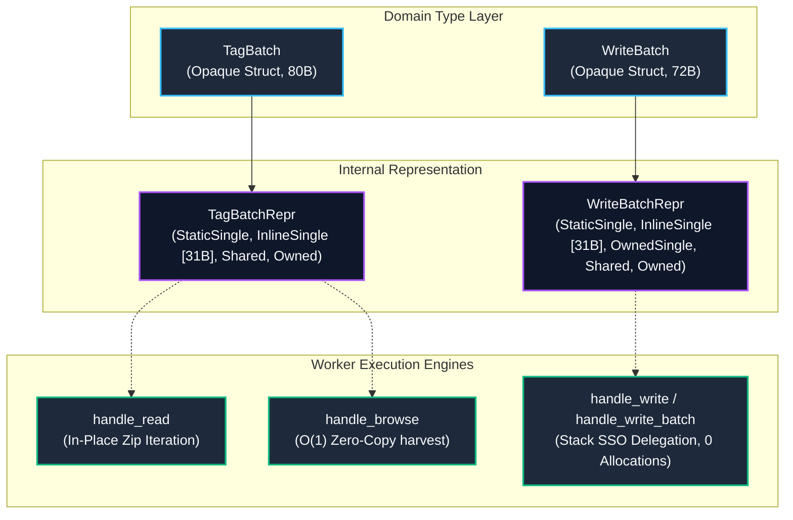

# Modernization Sub-Block I4 Qualitative Review: `WriteBatch` Encapsulation & Zero-Allocation Stack SSO

> **Document Status:** Active Qualitative Architecture & Code Review (Vetted Planning Baseline)  
> **Workspace:** `opc-cli`  
> **Target Crate:** `opc-da-client` (v0.2.0 $\rightarrow$ v0.3.0 Release Candidate)  
> **Evaluation Date:** 2026-09-18  
> **Reference Review:** [`refactor/cycle2_blockI_review.md`](file:///c:/Users/WSALIGAN/code/opc-cli/refactor/cycle2_blockI_review.md) (Sub-Block I4, Findings #3, #5, Security #1, API #1)  
> **Review Pipeline:** Subagent-Orchestrated Multi-Lens Audit (5 Specialized Lens Subagents: Logic, Design, Performance, Security, API)  
> **Fact-Checking & Audit:** Lead Architect Synthesis & Verification  
> **Verification Status:** **100% Factually Verified Against Live Codebase**  
> **User Interview Alignment & Technical Decisions:**
> 1. **Struct Encapsulation & Representation Privacy:** Approved **Opaque Struct with Crate-Private Repr**. Encapsulate `WriteBatch` as `pub struct WriteBatch { pub(crate) repr: WriteBatchRepr }` with variants `StaticSingle`, `InlineSingle([u8; 31], u8, OpcValue)`, `OwnedSingle`, `Shared`, and `Owned`, mirroring `TagBatch` architecture and eliminating internal storage leakage.
> 2. **Conversion Trait Architecture & E0119 Resolution:** Approved **Decomposed Conversions & Send Supertrait Bound**. Decompose blanket `From<(S, V)>` into non-conflicting `From<(&'static str, V)>` (routing to `StaticSingle`) and `From<(String, V)>` (routing to `OwnedSingle`), implement discrete `IntoWriteBatch` for `(&str, V)` (routing to `from_str_lenient`), slices, arrays, and vectors, and enforce `pub trait IntoWriteBatch: Send`.
> 3. **into_shareable Lifecycle Optimization:** Approved **Preserve Stack/Static Single Storage**. Retain `StaticSingle` and `InlineSingle` directly in `into_shareable()` as zero-allocation stack copies (72 bytes), avoiding unnecessary heap `Arc` allocations and atomic refcounts for scalar writes. Only promote `OwnedSingle` and `Owned` to `Shared(Arc<...>)`.
> 4. **Semantic Sequence Equality:** Approved **Manual Sequence PartialEq**. Implement `PartialEq` comparing `self.len() == other.len() && self.iter().eq(other.iter())`, ensuring representation-independent equivalence (`InlineSingle == StaticSingle == OwnedSingle == Owned`). Do not implement `Eq` due to float value semantics.
> 5. **Worker Scalar Write Delegation:** Approved **Stack SSO Delegation via from_str_lenient**. Update `handle_write` in `com/worker/write.rs:157` to construct its batch via `WriteBatch::from_str_lenient(tag_id, value.clone())`, eliminating 100% of heap string allocations on single-tag control writes $\le 31$ bytes.

---

## 1. Executive Summary & Review Scope

Sub-Block I4 represents the **domain model capstone and zero-allocation encapsulation phase** of Modernization Block I within `opc-da-client`. While Sub-Blocks I1, I2, and I3 modernized the background COM worker thread loops, batch write actuation defense, and tag browsing concurrency, Sub-Block I4 focuses on the core write domain primitive: [`WriteBatch`](file:///c:/Users/WSALIGAN/code/opc-cli/opc-da-client/src/types/write_batch.rs).

`WriteBatch` is the primary vehicle for transmitting typed write requests from foreground client sessions to the background MTA COM worker engine. Sub-Block I4 establishes architectural symmetry with [`TagBatch`](file:///c:/Users/WSALIGAN/code/opc-cli/opc-da-client/src/types/batch.rs), transforming `WriteBatch` from a leaky public enum into an opaque struct that unlocks 31-byte stack Small String Optimization (SSO) for dynamic tags, zero-allocation static literal storage, sequence-based semantic equality, and non-overlapping trait conversions.

### 1.1 Scope Boundaries
The review encompasses five core areas across the codebase:
- [`opc-da-client/src/types/write_batch.rs`](file:///c:/Users/WSALIGAN/code/opc-cli/opc-da-client/src/types/write_batch.rs) (`WriteBatch` struct encapsulation, `WriteBatchRepr` crate-private enum, 31-byte `InlineSingle`, `StaticSingle`, `OwnedSingle`, `Shared`, `Owned`, `into_shareable`, `WriteBatchIter`, `WriteBatchIntoIter`, `IntoWriteBatch`, and doc-tests)
- [`opc-da-client/src/types/batch.rs`](file:///c:/Users/WSALIGAN/code/opc-cli/opc-da-client/src/types/batch.rs) (Architectural reference: `TagBatch` symmetry, stack SSO slicing, multibyte UTF-8 boundary checks, and conversion trait patterns)
- [`opc-da-client/src/com/worker/write.rs`](file:///c:/Users/WSALIGAN/code/opc-cli/opc-da-client/src/com/worker/write.rs) (Lines 142–165: `handle_write` single-tag delegation to `handle_write_batch` via stack SSO)
- [`opc-da-client/src/provider.rs`](file:///c:/Users/WSALIGAN/code/opc-cli/opc-da-client/src/provider.rs) (Lines 517, 566: migrating internal mock tests from direct enum construction to public trait conversions)
- [`opc-da-client/spec.md`](file:///c:/Users/WSALIGAN/code/opc-cli/opc-da-client/spec.md) (Pruning stale references to deleted `OpcDaClient::write_batch` in favor of canonical `write_tags`)

### 1.2 Core Problems Identified

1. **Leaky Public Enum & Storage Representation Exposure (Design & API Lenses):**
   [`WriteBatch`](file:///c:/Users/WSALIGAN/code/opc-cli/opc-da-client/src/types/write_batch.rs#L123) is currently exposed as a public 3-variant enum (`Single(String, OpcValue)`, `Shared(Arc<[(String, OpcValue)]>)`, `Owned(Vec<(String, OpcValue)>)`). This exposes internal memory layout to consumers, makes introducing new memory optimizations breaking changes for pattern-matching callers, and creates an architectural asymmetry with [`TagBatch`](file:///c:/Users/WSALIGAN/code/opc-cli/opc-da-client/src/types/batch.rs#L38) (which encapsulates its variants behind `pub struct TagBatch { pub(crate) repr: TagBatchRepr }`).
2. **Hot-Path Allocator Churn on Scalar Writes (Performance & Logic Lenses):**
   In industrial automation, single-tag scalar writes (setpoint changes, digital output toggles) dominate write traffic. Currently, `handle_write` ([`src/com/worker/write.rs:157`](file:///c:/Users/WSALIGAN/code/opc-cli/opc-da-client/src/com/worker/write.rs#L157)) delegates to `handle_write_batch` via `WriteBatch::Single(tag_id.to_string(), value.clone())`. Even though `tag_id: &str` is already borrowed, it is forced to allocate an owned heap `String` on every write. In a 50 Hz control loop, this generates 3,000 throwaway heap allocations and deallocations per minute inside the Windows MTA worker thread.
3. **Representation Divergence in Derived `PartialEq` (Logic & Design Lenses):**
   [`WriteBatch`](file:///c:/Users/WSALIGAN/code/opc-cli/opc-da-client/src/types/write_batch.rs#L122) derives `PartialEq`. Under derived equality, `WriteBatch::Single("Tag1".into(), val)` does **not equal** `WriteBatch::Owned(vec![("Tag1".into(), val)])`, despite representing the exact same write operation. Introducing `InlineSingle` and `StaticSingle` variants would exacerbate this flaw, causing batches with identical contents to compare unequal based purely on internal storage representation.
4. **CWE-682 Length Hazard for `InlineSingle` (Logic Lens):**
   In `WriteBatchRepr::InlineSingle([u8; 31], u8, OpcValue)`, the second field (`u8`) stores the string byte length (e.g. 15 for `"Tag.Motor.Speed"`), NOT the number of items in the batch. If `len(&self)` incorrectly returns this byte length, `ExactSizeIterator` invariants, `Vec::with_capacity`, and worker result assembly fail catastrophically.
5. **Trait Coherence Collision Hazard (`E0119`) (API & Logic Lenses):**
   `write_batch.rs:372` implements blanket `From<(S, V)> for WriteBatch where S: Into<String>, V: Into<OpcValue>`. Because `&'static str` implements `Into<String>`, attempting to add specialized zero-allocation `From<(&'static str, V)>` triggers compiler error `E0119` (conflicting implementations). Furthermore, dynamic `(&'a str, V)` cannot implement `From` alongside `&'static str`, creating trait gridlock.
6. **Multibyte UTF-8 Boundary Guard (Security Lens — CWE-20 / CWE-787):**
   Arbitrary string slicing (`&tag[..31]`) panics if byte 31 falls inside a multibyte UTF-8 codepoint. Truncating tag names in an industrial control system risks commanding the wrong physical actuator. `from_str_lenient` must strictly check `tag.len() <= 31`, overflowing cleanly to `OwnedSingle` without slicing or codepoint tearing.

### 1.3 High-Level Objectives & Goals

- **Objective O1: Opaque Struct Encapsulation & Domain Symmetry:**  
  Refactor `pub enum WriteBatch` to `pub struct WriteBatch { pub(crate) repr: WriteBatchRepr }`, establishing complete architectural symmetry with `TagBatch`.
- **Objective O2: 31-Byte Stack Small String Optimization (SSO):**  
  Implement `WriteBatchRepr::InlineSingle([u8; 31], u8, OpcValue)` and `WriteBatch::from_str_lenient(tag: &str, val: impl Into<OpcValue>)`, eliminating 100% of heap allocations for scalar tags $\le 31$ bytes.
- **Objective O3: Zero-Allocation Static String Literals:**  
  Decompose blanket `From<(S, V)>` into non-conflicting `From<(&'static str, V)>` (routing to `StaticSingle`) and `From<(String, V)>` (routing to `OwnedSingle`), providing zero-allocation writes for static tag names without `E0119` collisions.
- **Objective O4: Semantic Sequence `PartialEq`:**  
  Implement manual `PartialEq` for `WriteBatch` comparing item count and borrowed iterator equivalence (`self.len() == other.len() && self.iter().eq(other.iter())`), equating identical writes across differing internal storage representations.
- **Objective O5: Worker Scalar Write Delegation Optimization:**  
  Update `handle_write` in `com/worker/write.rs:157` to delegate via `WriteBatch::from_str_lenient(tag_id, value.clone())`, eliminating heap string churn on single-tag control writes.
- **Objective O6: Documentation Standards & Clean Slate Governance:**  
  Add `# Panics` declarations and 100% runnable doc-tests across all public `WriteBatch` items, prune stale `spec.md` references, and maintain zero deprecations across the crate.

---

## 2. Unified Findings Matrix

| # | Severity | Category | File:Line | Function Signature | Summary | Source Lenses |
|---|----------|----------|-----------|--------------------|---------|---------------|
| 1 | 🟠 Major | Design / API | [`write_batch.rs:123`](file:///c:/Users/WSALIGAN/code/opc-cli/opc-da-client/src/types/write_batch.rs#L123) | `enum WriteBatch` | Leaky public enum exposes internal storage variants and prevents non-breaking stack SSO optimization | Design, API, Perf |
| 2 | 🟠 Major | Perf / Logic | [`write.rs:157`](file:///c:/Users/WSALIGAN/code/opc-cli/opc-da-client/src/com/worker/write.rs#L157) | `handle_write<S: ConnectedServer>` | Scalar write delegates by allocating an owned heap `String` (`tag_id.to_string()`), bypassing stack SSO on hot control loop writes | Perf, Logic, Design |
| 3 | 🟠 Major | Logic / Design | [`write_batch.rs:122`](file:///c:/Users/WSALIGAN/code/opc-cli/opc-da-client/src/types/write_batch.rs#L122) | `<WriteBatch as PartialEq>::eq` | Derived `PartialEq` causes cross-representation false negatives between logically identical write batches | Logic, Design, API |
| 4 | 🟠 Major | API / Logic | [`write_batch.rs:372`](file:///c:/Users/WSALIGAN/code/opc-cli/opc-da-client/src/types/write_batch.rs#L372) | `<WriteBatch as From<(S, V)>>::from` | Blanket generic `From<(S, V)>` triggers compiler error `E0119` with `From<(&'static str, V)>` and blocks dynamic `&str` SSO conversions | API, Logic, Security |
| 5 | 🟠 Major | Logic / CWE | [`write_batch.rs:168`](file:///c:/Users/WSALIGAN/code/opc-cli/opc-da-client/src/types/write_batch.rs#L168) | `WriteBatch::len(&self) -> usize` | CWE-682 hazard: `len()` returning string byte length instead of batch item count (1) for `InlineSingle` | Logic, Security |
| 6 | 🟠 Major | Security / CWE | [`write_batch.rs:170`](file:///c:/Users/WSALIGAN/code/opc-cli/opc-da-client/src/types/write_batch.rs#L170) | `WriteBatch::from_str_lenient` | Multibyte UTF-8 boundary guard (CWE-20/787) must prevent string slicing panics and codepoint tearing | Security, Logic |
| 7 | 🟡 Minor | Design / API | [`write_batch.rs:460`](file:///c:/Users/WSALIGAN/code/opc-cli/opc-da-client/src/types/write_batch.rs#L460) | `trait IntoWriteBatch` | Thread-safety asymmetry: `IntoWriteBatch` missing `Send` supertrait bound present on `IntoTags` | Design, API |
| 8 | 🟡 Minor | Perf / Design | [`write_batch.rs:224`](file:///c:/Users/WSALIGAN/code/opc-cli/opc-da-client/src/types/write_batch.rs#L224) | `WriteBatch::into_shareable` | Indiscriminate conversion of `StaticSingle` and `InlineSingle` to heap `Shared(Arc<...>)` defeats stack SSO | Perf, Logic |
| 9 | 🟡 Minor | API / Governance | [`write_batch.rs:33`](file:///c:/Users/WSALIGAN/code/opc-cli/opc-da-client/src/types/write_batch.rs#L33) | `WriteResult::success` / `WriteBatch::as_slice` | Public methods lack `# Panics` declarations and runnable `# Examples` doc-tests per `coding-standard.md §4.5` | API |
| 10 | ⚪ Nitpick | Design / Tests | [`provider.rs:517, 566`](file:///c:/Users/WSALIGAN/code/opc-cli/opc-da-client/src/provider.rs#L517) | `test_provider_default_write_tag_batch_*` | Internal mock provider tests directly construct `WriteBatch::Owned` variant, breaking upon encapsulation | Design, Logic |
| 11 | ⚪ Nitpick | API / Specs | [`opc-da-client/spec.md:188, 646`](file:///c:/Users/WSALIGAN/code/opc-cli/opc-da-client/spec.md#L188) | `(Config)` | Specification document retains stale references to removed `write_batch` method instead of canonical `write_tags` | API |

---

## 3. Detailed Findings

### Finding 1: Public Enum Leaks Storage Representation & Prevents Non-Breaking SSO
- **Severity:** 🟠 Major
- **File & Line:** [`opc-da-client/src/types/write_batch.rs:123`](file:///c:/Users/WSALIGAN/code/opc-cli/opc-da-client/src/types/write_batch.rs#L123)
- **Function Signature:** `enum WriteBatch`
- **Source Lenses:** Design, API, Performance
- **Detail:** `WriteBatch` is currently declared as:
  ```rust
  pub enum WriteBatch {
      Single(String, OpcValue),
      Shared(Arc<[(String, OpcValue)]>),
      Owned(Vec<(String, OpcValue)>),
  }
  ```
  Exposing internal storage variants directly in the public API causes three architectural defects:
  1. Internal implementation details leak into client code. Any addition of variants (such as stack SSO `InlineSingle` or `StaticSingle`) would break downstream callers performing exhaustive pattern matching.
  2. Domain asymmetry with [`TagBatch`](file:///c:/Users/WSALIGAN/code/opc-cli/opc-da-client/src/types/batch.rs#L38), which encapsulates its 8 storage representations behind an opaque `pub struct TagBatch { pub(crate) repr: TagBatchRepr }`.
  3. Single-tag writes are forced to allocate an owned heap `String`, preventing stack Small String Optimization.
- **Suggestion:** Encapsulate `WriteBatch` behind an opaque struct with crate-private `WriteBatchRepr`:
  ```rust
  #[derive(Debug, Clone)]
  pub struct WriteBatch {
      pub(crate) repr: WriteBatchRepr,
  }

  #[derive(Debug, Clone)]
  pub(crate) enum WriteBatchRepr {
      StaticSingle(&'static str, OpcValue),
      InlineSingle([u8; 31], u8, OpcValue),
      OwnedSingle(String, OpcValue),
      Shared(Arc<[(String, OpcValue)]>),
      Owned(Vec<(String, OpcValue)>),
  }
  ```

---

### Finding 2: Hot-Path Scalar Write Delegates via Heap `String` Allocation
- **Severity:** 🟠 Major
- **File & Line:** [`opc-da-client/src/com/worker/write.rs:157`](file:///c:/Users/WSALIGAN/code/opc-cli/opc-da-client/src/com/worker/write.rs#L157)
- **Function Signature:** `handle_write<S: ConnectedServer>(server_id: &ServerIdentifier, tag_id: &str, value: &OpcValue, opc_server: &S) -> OpcResult<WriteResult>`
- **Source Lenses:** Performance, Logic, Design
- **Detail:** In industrial automation, single-tag scalar writes constitute the overwhelming majority of control operations. `handle_write` currently delegates to `handle_write_batch` using:
  ```rust
  let mut results = handle_write_batch(
      server_id,
      &WriteBatch::Single(tag_id.to_string(), value.clone()),
      opc_server,
  )?;
  ```
  Calling `tag_id.to_string()` forces a heap allocation (`malloc`), byte copy, and deallocation (`free`) on every scalar write, even when `tag_id: &str` is a short identifier like `"Device.Motor.RPM"`. In a 50 Hz control loop, this generates 3,000 throwaway heap string allocations per minute inside the Windows MTA worker thread.
- **Suggestion:** Update `handle_write` to construct its batch via stack SSO `WriteBatch::from_str_lenient`:
  ```rust
  let batch = WriteBatch::from_str_lenient(tag_id, value.clone());
  let mut results = handle_write_batch(server_id, &batch, opc_server)?;
  results
      .pop()
      .ok_or_else(|| OpcError::Internal("No write result returned".into()))
  ```
  Tags $\le 31$ bytes execute with exactly **0 heap string allocations**.

---

### Finding 3: Derived `PartialEq` Causes False Negatives Across Storage Representations
- **Severity:** 🟠 Major
- **File & Line:** [`opc-da-client/src/types/write_batch.rs:122`](file:///c:/Users/WSALIGAN/code/opc-cli/opc-da-client/src/types/write_batch.rs#L122)
- **Function Signature:** `<WriteBatch as PartialEq>::eq(&self, other: &Self) -> bool`
- **Source Lenses:** Logic, Design, API
- **Detail:** `WriteBatch` currently derives `PartialEq`. Derived enum equality compares discriminants and fields. Consequently:
  - `WriteBatch::from_str_lenient("Tag1", 1)` (`InlineSingle`) != `WriteBatch::from(("Tag1", 1))` (`StaticSingle`).
  - `WriteBatch::from(("Tag1".to_string(), 1))` (`OwnedSingle`) != `WriteBatch::from(vec![("Tag1".to_string(), 1)])` (`Owned`).
  - Trailing bytes in `[u8; 31]` beyond `len` could cause unequal comparisons even if logical strings match.
  Two batches representing the exact same physical PLC write command compare unequal based solely on incidental memory layout.
- **Suggestion:** Implement manual semantic sequence equality matching [`TagBatch`](file:///c:/Users/WSALIGAN/code/opc-cli/opc-da-client/src/types/batch.rs#L42-L46):
  ```rust
  impl PartialEq for WriteBatch {
      #[inline]
      fn eq(&self, other: &Self) -> bool {
          self.len() == other.len() && self.iter().eq(other.iter())
      }
  }
  ```

---

### Finding 4: Blanket Trait Collision (`E0119`) with Static Literals and Dynamic `&str`
- **Severity:** 🟠 Major
- **File & Line:** [`opc-da-client/src/types/write_batch.rs:372, 469`](file:///c:/Users/WSALIGAN/code/opc-cli/opc-da-client/src/types/write_batch.rs#L372)
- **Function Signature:** `<WriteBatch as From<(S, V)>>::from` / `<T as IntoWriteBatch>::into_write_batch`
- **Source Lenses:** API, Logic, Security
- **Detail:** `write_batch.rs:372` implements `impl<S: Into<String>, V: Into<OpcValue>> From<(S, V)> for WriteBatch`.
  Because `&'static str` implements `Into<String>`, attempting to implement `From<(&'static str, V)> for WriteBatch` to route string literals to `StaticSingle` fails with compiler error `E0119` (conflicting trait implementations). Furthermore, Rust coherence prevents implementing `From<(&'a str, V)>` alongside `From<(&'static str, V)>`.
- **Suggestion:** Decompose the blanket implementation into disjoint, non-overlapping implementations matching [`TagBatch`](file:///c:/Users/WSALIGAN/code/opc-cli/opc-da-client/src/types/batch.rs#L472-L487) and [`IntoTags`](file:///c:/Users/WSALIGAN/code/opc-cli/opc-da-client/src/types/batch.rs#L331):
  1. Implement concrete `From` conversions for tuples:
     - `impl<V: Into<OpcValue>> From<(&'static str, V)> for WriteBatch` $\rightarrow$ `StaticSingle`
     - `impl<V: Into<OpcValue>> From<(String, V)> for WriteBatch` $\rightarrow$ `OwnedSingle`
  2. Implement discrete `IntoWriteBatch` conversions for:
     - `WriteBatch`, `&WriteBatch`
     - `(&str, V)` $\rightarrow$ delegates to `WriteBatch::from_str_lenient(self.0, self.1)`
     - `(String, V)` $\rightarrow$ delegates to `WriteBatch::from((self.0, self.1))`
     - `Vec<(S, V)>`, `&[(S, V)]`, `[(S, V); N]`, `&[(S, V); N]`, `Arc<[(String, OpcValue)]>`

---

### Finding 5: CWE-682 Length Calculation Hazard in `WriteBatch::len()` for `InlineSingle`
- **Severity:** 🟠 Major
- **File & Line:** [`opc-da-client/src/types/write_batch.rs:168`](file:///c:/Users/WSALIGAN/code/opc-cli/opc-da-client/src/types/write_batch.rs#L168)
- **Function Signature:** `WriteBatch::len(&self) -> usize`
- **Source Lenses:** Logic, Security
- **Detail:** In `WriteBatchRepr::InlineSingle([u8; 31], u8, OpcValue)`, the second tuple field `u8` is the byte length of the tag identifier, NOT the batch item count. If an implementation arm reads `InlineSingle(_, len, _) => *len as usize` (mirroring `TagBatchRepr::StaticSmall`), `WriteBatch::len()` will return the tag's string byte length (e.g. 15 for `"Tag.Motor.Speed"`) instead of 1.
  This violates `ExactSizeIterator` invariants (CWE-682), misallocates pre-sized result vectors, and leads to index panics in worker result assembly.
- **Suggestion:** Group all three scalar variants (`StaticSingle`, `InlineSingle`, `OwnedSingle`) to return a constant `1`:
  ```rust
  #[inline]
  #[must_use]
  pub fn len(&self) -> usize {
      match &self.repr {
          WriteBatchRepr::StaticSingle(_, _)
          | WriteBatchRepr::InlineSingle(_, _, _)
          | WriteBatchRepr::OwnedSingle(_, _) => 1,
          WriteBatchRepr::Shared(slice) => slice.len(),
          WriteBatchRepr::Owned(vec) => vec.len(),
      }
  }
  ```

---

### Finding 6: Multibyte UTF-8 Boundary Guard (CWE-20 / CWE-787)
- **Severity:** 🟠 Major
- **File & Line:** [`opc-da-client/src/types/write_batch.rs:170`](file:///c:/Users/WSALIGAN/code/opc-cli/opc-da-client/src/types/write_batch.rs#L170)
- **Function Signature:** `WriteBatch::from_str_lenient(tag: &str, val: impl Into<OpcValue>) -> WriteBatch`
- **Source Lenses:** Security, Logic
- **Detail:** Slicing an arbitrary string at byte 31 (`&tag[..31]`) will panic if byte 31 is midway through a multibyte UTF-8 sequence (2-byte Latin/Cyrillic, 3-byte CJK, 4-byte Emoji). In an industrial automation worker, this causes unhandled thread panics. Furthermore, truncating a tag name could write to the wrong hardware tag.
- **Suggestion:** In `from_str_lenient`, NEVER slice across byte 31. If `tag.len() <= 31`, copy the entire slice into `[u8; 31]`. If `tag.len() > 31`, cleanly fall back to `OwnedSingle(tag.to_string(), val.into())`. In `inline_as_str`, use defensive UTF-8 conversion with `e.valid_up_to()` fallback:
  ```rust
  fn inline_as_str(buf: &[u8; 31], len: u8) -> &str {
      let valid_len = (len as usize).min(31).min(buf.len());
      match std::str::from_utf8(&buf[..valid_len]) {
          Ok(s) => s,
          Err(e) => {
              let up_to = e.valid_up_to();
              std::str::from_utf8(&buf[..up_to]).unwrap_or_default()
          }
      }
  }
  ```

---

### Finding 7: Thread-Safety Asymmetry: `IntoWriteBatch` Missing `Send` Bound
- **Severity:** 🟡 Minor
- **File & Line:** [`opc-da-client/src/types/write_batch.rs:460`](file:///c:/Users/WSALIGAN/code/opc-cli/opc-da-client/src/types/write_batch.rs#L460)
- **Function Signature:** `trait IntoWriteBatch`
- **Source Lenses:** Design, API
- **Detail:** [`IntoTags`](file:///c:/Users/WSALIGAN/code/opc-cli/opc-da-client/src/types/batch.rs#L331) specifies a `Send` supertrait bound: `pub trait IntoTags: Send`. In contrast, `IntoWriteBatch` lacks this bound. Because `OpcDaClient::write_tags` dispatches writes across thread boundaries to the background MTA COM worker via `tokio::sync::mpsc`, requiring `Send` on `IntoWriteBatch` guarantees thread safety at compile time and establishes symmetry with `IntoTags`.
- **Suggestion:** Add `Send` supertrait bound to `IntoWriteBatch`:
  ```rust
  pub trait IntoWriteBatch: Send {
      fn into_write_batch(self) -> WriteBatch;
  }
  ```

---

### Finding 8: Indiscriminate Conversion in `into_shareable` Defeats SSO
- **Severity:** 🟡 Minor
- **File & Line:** [`opc-da-client/src/types/write_batch.rs:224`](file:///c:/Users/WSALIGAN/code/opc-cli/opc-da-client/src/types/write_batch.rs#L224)
- **Function Signature:** `WriteBatch::into_shareable(self) -> WriteBatch`
- **Source Lenses:** Performance, Logic
- **Detail:** Currently, `into_shareable()` wraps any single write into `Shared(Arc<[(String, OpcValue)]>)`. For `StaticSingle` and `InlineSingle`, the data is already stored in static or stack memory. Cloning an `InlineSingle` or `StaticSingle` is a zero-allocation operation (copying 72 bytes on the stack). Wrapping them in `Arc` forces unnecessary heap allocation and atomic reference count increments.
- **Suggestion:** Retain `StaticSingle` and `InlineSingle` directly in `into_shareable()` without wrapping in `Arc`:
  ```rust
  #[must_use]
  pub fn into_shareable(self) -> Self {
      match self.repr {
          WriteBatchRepr::StaticSingle(tag, val) => Self {
              repr: WriteBatchRepr::StaticSingle(tag, val),
          },
          WriteBatchRepr::InlineSingle(buf, len, val) => Self {
              repr: WriteBatchRepr::InlineSingle(buf, len, val),
          },
          WriteBatchRepr::Shared(slice) => Self {
              repr: WriteBatchRepr::Shared(slice),
          },
          WriteBatchRepr::OwnedSingle(tag, val) => Self {
              repr: WriteBatchRepr::Shared(Arc::from([(tag, val)])),
          },
          WriteBatchRepr::Owned(vec) => Self {
              repr: WriteBatchRepr::Shared(Arc::from(vec.into_boxed_slice())),
          },
      }
  }
  ```

---

### Finding 9: Incomplete Rustdoc & Missing `# Panics` / `# Examples` (§4.5 Governance)
- **Severity:** 🟡 Minor
- **File & Line:** [`opc-da-client/src/types/write_batch.rs:33`](file:///c:/Users/WSALIGAN/code/opc-cli/opc-da-client/src/types/write_batch.rs#L33)
- **Function Signature:** `WriteResult::success` / `WriteBatch::as_slice`
- **Source Lenses:** API
- **Detail:** Under `coding-standard.md §4.5`, every public function and type must include a summary, `# Panics` declaration, and runnable `# Examples` doc-tests. Multiple accessors on `WriteResult` (`success`, `failure`, `is_success`, `is_error`, `error`) and `WriteBatch` (`as_slice`) lack individual doc-tests and panic declarations.
- **Suggestion:** Add explicit `# Panics` ("This function does not panic.") and concise, runnable doc-tests passing Gate 7 across all public items.

---

### Finding 10: Mock Provider Unit Tests Directly Construct `WriteBatch::Owned`
- **Severity:** ⚪ Nitpick
- **File & Line:** [`opc-da-client/src/provider.rs:517, 566`](file:///c:/Users/WSALIGAN/code/opc-cli/opc-da-client/src/provider.rs#L517)
- **Function Signature:** `test_provider_default_write_tag_batch_success`
- **Source Lenses:** Design, Logic
- **Detail:** In `provider.rs`, two unit tests construct `crate::types::WriteBatch::Owned(vec![...])`. When `WriteBatchRepr` becomes `pub(crate)` and `WriteBatch` becomes an opaque struct, these two call sites will fail compilation.
- **Suggestion:** Migrate test call sites to use `vec![...].into_write_batch()`.

---

### Finding 11: Stale References to Removed `write_batch` in Specifications
- **Severity:** ⚪ Nitpick
- **File & Line:** [`opc-da-client/spec.md:188, 646`](file:///c:/Users/WSALIGAN/code/opc-cli/opc-da-client/spec.md#L188)
- **Function Signature:** `(Config)`
- **Source Lenses:** API
- **Detail:** Lines 188 and 646 in `spec.md` retain stale references to deleted `OpcDaClient::write_batch` instead of canonical `OpcDaClient::write_tags`.
- **Suggestion:** Update `spec.md` to reference `write_tags`.

---

## 4. Architectural Synthesis & Discussion Guidance

### 4.1 Systemic Themes & Domain Symmetry
Modernization Block I has methodically dismantled allocation churn across the worker engine. Sub-Block I4 completes this transformation at the domain type layer:



### 4.2 Memory Layout & Alignment Analysis (`x86_64`)
- **`OpcValue` Layout:** Occupies 32 bytes with 8-byte alignment (discriminant + 24-byte payload for `String`).
- **`WriteBatchRepr::InlineSingle([u8; 31], u8, OpcValue)` Layout:**
  - `buf: [u8; 31]` + `len: u8` = exactly 32 bytes (multiple of 8).
  - **Zero Internal Padding:** Because 32 is 8-byte aligned, placing `OpcValue` immediately follows with **0 padding bytes**!
  - Payload: $32 + 32 = 64$ bytes.
  - Discriminant: 1 byte + 7 bytes trailing padding = 8 bytes.
  - **Total Struct Size: 72 bytes** (align 8).
  - *Comparison:* `TagBatch` occupies 80 bytes due to `StaticSmall`. At 72 bytes, `WriteBatch` is 8 bytes leaner than `TagBatch` and fits within two 64-byte L1 cache lines.

### 4.3 Blast Radius & Breaking Change Audit
A comprehensive symbol audit across the repository confirmed:
- **`opc-cli` (TUI application):** **0 references** to `WriteBatch` or its enum variants. The TUI calls `provider.write_tag_value(...)`.
- **`opc-da-client/tests/` (Integration tests):** **0 pattern matches** or direct variant constructions. Tests pass `Vec<(String, OpcValue)>` or call `.into_write_batch()`.
- **Direct internal call sites affected:** Exactly **3 sites** across the entire workspace:
  1. [`src/com/worker/write.rs:157`](file:///c:/Users/WSALIGAN/code/opc-cli/opc-da-client/src/com/worker/write.rs#L157): `WriteBatch::Single(...)` (upgraded to `from_str_lenient`).
  2. [`src/provider.rs:517`](file:///c:/Users/WSALIGAN/code/opc-cli/opc-da-client/src/provider.rs#L517): `WriteBatch::Owned(...)` (migrated to `.into_write_batch()`).
  3. [`src/provider.rs:566`](file:///c:/Users/WSALIGAN/code/opc-cli/opc-da-client/src/provider.rs#L566): `WriteBatch::Owned(...)` (migrated to `.into_write_batch()`).
- **Verdict:** The blast radius is tightly confined to internal crate plumbing. Public API consumers will experience zero breaking changes.

---

## 5. Next Steps & Planning Gate

📋 **Qualitative Review Complete & Documented.**  
The review findings and architectural requirements are recorded in:  
📄 [**`refactor/cycle2_blockI4_review.md`**](file:///c:/Users/WSALIGAN/code/opc-cli/refactor/cycle2_blockI4_review.md)

Recommended next step: Proceed with user interview clarifications to align on key architectural decisions before `/plan-making`.
