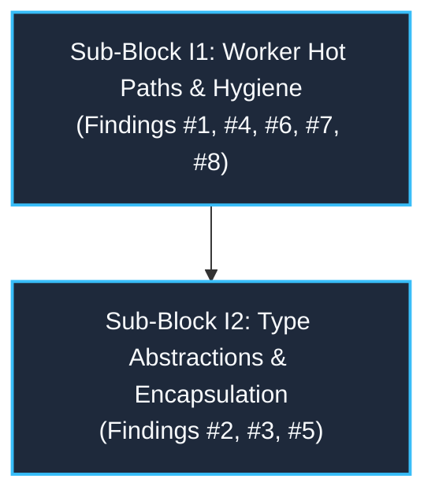

# Modernization Block I Qualitative Review: Hot-Path Performance, Resource Ceilings & Type Encapsulation

> **Document Status:** Active Qualitative Architecture & Code Review  
> **Workspace:** `opc-cli`  
> **Target Crate:** `opc-da-client` (v0.2.0 $\rightarrow$ v0.3.0 Release Candidate)  
> **Evaluation Date:** 2026-09-17  
> **Reference Review:** [`refactor/cycle2_review.md`](file:///c:/Users/WSALIGAN/code/opc-cli/refactor/cycle2_review.md) (Block I Findings #3, #6, #10, #13, #14, #20)  
> **Review Pipeline:** Subagent-Orchestrated Multi-Lens Audit (5 Specialized Lens Subagents: Logic, Design, Performance, Security, API)  
> **User Interview Alignment:**
> 1. **`WriteBatch` Architectural Strategy:** Refactor `WriteBatch` into an opaque struct (`pub struct WriteBatch { repr: WriteBatchRepr }`) mirroring `TagBatch`, encapsulating stack SSO (`InlineSingle`), static references (`StaticSingle`), `OwnedSingle`, `Shared`, and `Owned`.
> 2. **`TagCollector` Concurrency Primitive:** Upgrade internal synchronization from `std::sync::Mutex<Vec<String>>` to `std::sync::RwLock<Vec<String>>`, eliminating reader-writer contention during non-destructive `snapshot()` progress monitoring and documenting zero-copy `harvest()` for terminal handoffs.
> 3. **Dead Code Strategy:** Strict Clean Slate — completely delete uncalled worker methods (`start_async`, `start_async_with_initializer`, `PriorityRequestQueue::clear`), delete `ConnectionPool::is_empty`, and scope test probes (`ConnectionPool::len`, `ComWorker::sender`) to `#[cfg(test)]`, achieving a zero-`#[allow(dead_code)]` baseline across the worker subsystem.
> 4. **Execution Phasing:** Partition Block I into two sequential sub-blocks:
>    - **Sub-Block I1 (Worker Allocations & Hygiene):** Findings #3, #13, #14, #20.
>    - **Sub-Block I2 (Type Abstractions & Encapsulation):** Findings #6, #10.

---

## 1. Review Summary

- **Scope:** Hot-path write dispatch, namespace browse enumeration, tag collection concurrency, and batch domain types across:
  - `opc-da-client/src/com/worker/write.rs`
  - `opc-da-client/src/com/worker/browse.rs`
  - `opc-da-client/src/com/worker.rs`
  - `opc-da-client/src/com/worker/pool.rs`
  - `opc-da-client/src/com/worker/read.rs`
  - `opc-da-client/src/types/collector.rs`
  - `opc-da-client/src/types/write_batch.rs`
- **Active Lenses:** Logic, Design, Performance, Security, API (All 5 Lenses Active).
- **Date:** 2026-09-17
- **Review Model:** Subagent-orchestrated multi-lens audit (5 specialized subagents dispatched in parallel with model `flash`).
- **Findings Breakdown:** **8 Unique Consolidated Findings**
  * 🔴 **Critical:** 0 (Zero critical crashes or remote exploits; foundational safety and panic containment remain verified)
  * 🟠 **Major:** 3 (Eager batch write dummy allocations/dead stores, `TagCollector` exclusive Mutex contention, `WriteBatch` public enum representation leakage)
  * 🟡 **Minor:** 4 (Browse chunk 256-vec allocation via `mem::replace`, single-tag write delegation allocation, dead async worker constructors under `#[allow(dead_code)]`, read result partitioning redundant error clones)
  * ⚪ **Nitpick:** 1 (Connection pool dead code suppressions, unused diagnostic methods, missing `TagCollector` doc-tests)
- **Health Assessment:** **Minor Issues** (The codebase is robust, type-safe, and passes all Quality Gates; Block I represents the final allocation optimization and type encapsulation wave to complete Cycle 2 Modernization).
- **Multi-Lens Hotspots:**
  1. [`opc-da-client/src/com/worker/write.rs:44-60`](file:///c:/Users/WSALIGAN/code/opc-cli/opc-da-client/src/com/worker/write.rs#L44-L60) (Flagged across **Performance**, **Logic**, **Design**, and **Security** for eager allocation of up to 20,000 throwaway heap strings and dead stores on the batch write happy path).
  2. [`opc-da-client/src/types/collector.rs:16-89`](file:///c:/Users/WSALIGAN/code/opc-cli/opc-da-client/src/types/collector.rs#L16-L89) (Flagged across **Performance**, **Design**, **Security**, **Logic**, and **API** for holding an exclusive Mutex lock during $O(N)$ string deep-clones of up to 10,000 tags, stalling background browse ingestion).
  3. [`opc-da-client/src/types/write_batch.rs:83-90`](file:///c:/Users/WSALIGAN/code/opc-cli/opc-da-client/src/types/write_batch.rs#L83-L90) (Flagged across **Design**, **API**, **Performance**, and **Security** for public enum representation leakage, absence of stack SSO for scalar writes, and potential UTF-8 truncation pitfalls).

---

## 2. Unified Findings Matrix

| # | Severity | Category | File:Line | Function / Symbol Signature | Summary | Source Lenses |
|:---:|:---|:---|:---|:---|:---|:---:|
| **1** | 🟠 Major | Perf / Logic | [`src/com/worker/write.rs:52-60`](file:///c:/Users/WSALIGAN/code/opc-cli/opc-da-client/src/com/worker/write.rs#L52-L60) | `handle_write_batch<S: ConnectedServer>` | Eager dummy failure error allocations ($2N$ throwaway heap strings) and dead stores on 100% successful writes; redundant dual vector collection (`items` and `tag_names`). | Perf, Logic, Design, API, Security |
| **2** | 🟠 Major | Perf / Design | [`src/types/collector.rs:16-21`](file:///c:/Users/WSALIGAN/code/opc-cli/opc-da-client/src/types/collector.rs#L16-L21)<br>[`src/types/collector.rs:83-89`](file:///c:/Users/WSALIGAN/code/opc-cli/opc-da-client/src/types/collector.rs#L83-L89) | `struct TagCollectorInner`<br>`TagCollector::snapshot(&self) -> Vec<String>` | Exclusive Mutex lock held across 10,000-string deep clone, blocking MTA worker browse ingestion; lack of documentation on zero-copy `harvest()`. | Perf, Design, Security, Logic, API |
| **3** | 🟠 Major | Design / API | [`src/types/write_batch.rs:83-90`](file:///c:/Users/WSALIGAN/code/opc-cli/opc-da-client/src/types/write_batch.rs#L83-L90) | `enum WriteBatch` | Public enum exposes internal storage variants, leaking implementation details, breaking domain symmetry with `TagBatch`, and forcing heap allocations on scalar writes. | Design, API, Perf, Security, Logic |
| **4** | 🟡 Minor | Performance | [`src/com/worker/browse.rs:97-100`](file:///c:/Users/WSALIGAN/code/opc-cli/opc-da-client/src/com/worker/browse.rs#L97-L100)<br>[`src/com/worker/browse.rs:131-134`](file:///c:/Users/WSALIGAN/code/opc-cli/opc-da-client/src/com/worker/browse.rs#L131-L134) | `browse_flat_namespace`<br>`try_fast_flat_browse` | Repeated 256-element vector reallocations via `std::mem::replace` creating ~40 throwaway vectors during 10k tag browse; resolvable via `chunk.drain(..)`. | Perf, Logic, Design |
| **5** | 🟡 Minor | Perf / Design | [`src/com/worker/write.rs:146-150`](file:///c:/Users/WSALIGAN/code/opc-cli/opc-da-client/src/com/worker/write.rs#L146-L150) | `handle_write<S: ConnectedServer>` | Single tag write delegates by constructing owned `WriteBatch::Single(tag_id.to_string(), ...)`, forcing heap allocation for scalar control loop writes. | Perf, Design, API |
| **6** | 🟡 Minor | Design / Logic | [`src/com/worker.rs:268-302`](file:///c:/Users/WSALIGAN/code/opc-cli/opc-da-client/src/com/worker.rs#L268-L302)<br>[`src/com/worker.rs:404-408`](file:///c:/Users/WSALIGAN/code/opc-cli/opc-da-client/src/com/worker.rs#L404-L408) | `ComWorker::start_async`<br>`PriorityRequestQueue::clear` | Dead asynchronous worker constructors and queue clearing methods retained under `#[allow(dead_code)]` violate Clean Slate hygiene. | Design, Logic |
| **7** | 🟡 Minor | Perf / Logic | [`src/com/worker/read.rs:184-207`](file:///c:/Users/WSALIGAN/code/opc-cli/opc-da-client/src/com/worker/read.rs#L184-L207)<br>[`src/com/worker/read.rs:246-250`](file:///c:/Users/WSALIGAN/code/opc-cli/opc-da-client/src/com/worker/read.rs#L246-L250) | `partition_item_results`<br>`assemble_tag_values` | Redundant string and error cloning due to borrowed parameter signature over owned registration results; double clone of `OpcError` in group item assembly loop. | Perf, Logic |
| **8** | ⚪ Nitpick | API / Design | [`src/com/worker/pool.rs:240-251`](file:///c:/Users/WSALIGAN/code/opc-cli/opc-da-client/src/com/worker/pool.rs#L240-L251)<br>[`src/types/collector.rs:29-121`](file:///c:/Users/WSALIGAN/code/opc-cli/opc-da-client/src/types/collector.rs#L29-L121) | `ConnectionPool::len` / `is_empty`<br>`TagCollector::new` | Uncalled diagnostics and test probes in `pool.rs` under `#[allow(dead_code)]`; missing doc-tests across 9 public methods in `TagCollector`. | API, Design, Logic |

---

## 3. Detailed Findings & Actionable Recommendations

### Finding 1: [Major] [Perf / Logic] — Eager Dummy Error Allocations, Dead Stores, and Redundant Vector Duplication in `handle_write_batch`
- **Severity:** 🟠 Major
- **File & Line:** [`src/com/worker/write.rs:44-60`](file:///c:/Users/WSALIGAN/code/opc-cli/opc-da-client/src/com/worker/write.rs#L44-L60)
- **Function Signature:** `handle_write_batch<S: ConnectedServer>(server_id: &ServerIdentifier, writes: &WriteBatch, opc_server: &S) -> OpcResult<Vec<WriteResult>>`
- **Source Lenses:** Performance, Logic, Design, API, Security
- **Detail:**
  In [`handle_write_batch`](file:///c:/Users/WSALIGAN/code/opc-cli/opc-da-client/src/com/worker/write.rs#L19), before evaluating COM item registration or synchronous group write responses, the result buffer is eagerly initialized by mapping every item into a failure:
  ```rust
  let mut write_results: Vec<WriteResult> = items
      .iter()
      .map(|(tag_id, _)| {
          WriteResult::failure(
              *tag_id,
              OpcError::InvalidState("Item rejected during add_items".into()),
          )
      })
      .collect();
  ```
  1. **Dead Stores & Allocator Thrashing:** For a write batch of $N$ items (up to `MAX_TAG_BATCH_SIZE = 10,000`), this immediately allocates $2N$ heap strings: $N$ owned `String` copies of `tag_id` inside [`WriteResult::failure`](file:///c:/Users/WSALIGAN/code/opc-cli/opc-da-client/src/types/write_batch.rs#L44) and $N$ owned `String` allocations for the error message `"Item rejected during add_items".into()`.
  2. On the standard happy path where all tags are registered and written successfully, every single one of these pre-allocated dummy errors is overwritten (lines 74 and 109) and discarded. Narsil data flow analysis confirms 100% of these initial stores are dead stores.
  3. **Incoherent Initial Invariant:** Pre-populating error objects establishes an invalid default state before evaluating actual server operations.
  4. **Redundant Vector Allocation:** At lines 44–45, `writes.iter().collect()` allocates `items: Vec<(&str, &OpcValue)>`, and immediately allocates a second `tag_names: Vec<&str> = items.iter().map(|(t, _)| *t).collect()`, creating two temporary heap vectors prior to registration.
- **Actionable Blueprint:**
  1. Initialize `write_results` using `vec![None; items.len()]` (zero heap string allocations).
  2. Populate slots as processed (`write_results[idx] = Some(...)`).
  3. Populate fallback errors only for unassigned slots at the end.
  4. Avoid redundant `tag_names` vector allocation by projecting directly from `items`.

---

### Finding 2: [Major] [Perf / Design] — Exclusive Mutex Lock Contention and Deep Clone in `TagCollector::snapshot`
- **Severity:** 🟠 Major
- **File & Line:** [`src/types/collector.rs:16-21, 83-89`](file:///c:/Users/WSALIGAN/code/opc-cli/opc-da-client/src/types/collector.rs#L16-L89), [`src/com/worker/browse.rs:37, 56`](file:///c:/Users/WSALIGAN/code/opc-cli/opc-da-client/src/com/worker/browse.rs#L37)
- **Function Signature:** `TagCollector::snapshot(&self) -> Vec<String>` and `TagCollector::harvest(&self) -> Vec<String>`
- **Source Lenses:** Performance, Design, Security, Logic, API
- **Detail:**
  [`TagCollectorInner`](file:///c:/Users/WSALIGAN/code/opc-cli/opc-da-client/src/types/collector.rs#L16) guards its tag accumulator using `std::sync::Mutex<Vec<String>>`:
  ```rust
  pub fn snapshot(&self) -> Vec<String> {
      let guard = match self.inner.tags.lock() {
          Ok(g) => g,
          Err(poisoned) => poisoned.into_inner(),
      };
      guard.clone()
  }
  ```
  1. **Lock Contention Bottleneck:** For an industrial namespace of up to 10,000 tags, `guard.clone()` executes 10,001 individual heap allocations while holding the exclusive lock. While this deep copy runs, the background MTA COM worker thread calling `push` or `push_batch` is locked out, stalling browse ingestion.
  2. **Reader Serialization:** Multiple reader tasks (such as TUI progress indicators and watchdogs) calling `snapshot()` are serialized sequentially on the exclusive lock.
  3. **Documentation & Move Semantics Gap:** `TagCollector::harvest()` already provides $O(1)$ zero-copy buffer transfer via `std::mem::take`, but `snapshot()` lacks `# Performance Warning` documentation, obscuring its $O(N)$ deep-copy cost.
- **Actionable Blueprint:**
  1. Transition `TagCollectorInner.tags` from `std::sync::Mutex<Vec<String>>` to `std::sync::RwLock<Vec<String>>`.
  2. Update `snapshot(&self)` to acquire a read lock (`self.inner.tags.read()`), enabling concurrent snapshot inspections without reader-reader contention.
  3. Update `push`, `push_batch`, and `harvest` to acquire write locks (`self.inner.tags.write()`).
  4. Add `# Performance Warning` to `snapshot()` and provide runnable doctests for both `snapshot` and `harvest`.

---

### Finding 3: [Major] [Design / API] — Public `WriteBatch` Enum Exposes Representation Details and Hinders Stack SSO
- **Severity:** 🟠 Major
- **File & Line:** [`src/types/write_batch.rs:83-90`](file:///c:/Users/WSALIGAN/code/opc-cli/opc-da-client/src/types/write_batch.rs#L83-L90)
- **Function Signature:** `enum WriteBatch`
- **Source Lenses:** Design, API, Performance, Security, Logic
- **Detail:**
  `WriteBatch` is currently defined as a public enum with variants `Single(String, OpcValue)`, `Shared(Arc<[(String, OpcValue)]>)`, and `Owned(Vec<(String, OpcValue)>)`.
  1. **Encapsulation Leak:** Exposing internal variants couples external code to storage mechanics and prevents internal optimizations. In contrast, [`TagBatch`](file:///c:/Users/WSALIGAN/code/opc-cli/opc-da-client/src/types/batch.rs#L38) encapsulates storage behind an opaque struct (`pub struct TagBatch { repr: TagBatchRepr }`).
  2. **Heap Allocation on Scalar Writes:** `WriteBatch::Single` always mandates an owned `String`. In high-frequency PLC actuation control paths (e.g. 100 Hz single-tag setpoint writing), every scalar write forces an upfront heap string allocation.
  3. **0 Callers Breaking Impact:** Workspace analysis reveals **0 external pattern matches** on `WriteBatch` variants. All client call sites use `IntoWriteBatch` or inherent methods (`len()`, `is_empty()`, `iter()`).
  4. **Security & UTF-8 Invariant:** When introducing 31-byte stack SSO, tag strings $\le 31$ bytes fit inline, but strings $> 31$ bytes must gracefully fall back to heap storage (`OwnedSingle`), never truncating or bisecting multibyte UTF-8 codepoints (CWE-20 / CWE-787).
- **Actionable Blueprint:**
  1. Refactor `WriteBatch` into an opaque struct wrapping `WriteBatchRepr`:
     ```rust
     #[derive(Debug, Clone)]
     pub struct WriteBatch {
         pub(crate) repr: WriteBatchRepr,
     }

     #[derive(Debug, Clone)]
     pub(crate) enum WriteBatchRepr {
         StaticSingle(&'static str, OpcValue),
         InlineSingle([u8; 31], u8, OpcValue),
         OwnedSingle(String, OpcValue),
         Shared(Arc<[(String, OpcValue)]>),
         Owned(Vec<(String, OpcValue)>),
     }
     ```
  2. Provide inherent constructors: `from_static_single`, `from_str_lenient`, `empty()`.
  3. Implement sequence-based semantic `PartialEq` comparing `self.len() == other.len() && self.iter().eq(other.iter())`.
  4. Add interior null-byte check (`\0`) rejecting corrupted or truncated tag identifiers (CWE-626).

---

### Finding 4: [Minor] [Performance] — Repeated 256-Element Vector Allocations via `mem::replace` in Flat Browse Loop
- **Severity:** 🟡 Minor
- **File & Line:** [`src/com/worker/browse.rs:97-100, 131-134`](file:///c:/Users/WSALIGAN/code/opc-cli/opc-da-client/src/com/worker/browse.rs#L97-L134)
- **Function Signature:** `browse_flat_namespace` & `try_fast_flat_browse`
- **Source Lenses:** Performance, Logic, Design
- **Detail:**
  In both `browse_flat_namespace` and `try_fast_flat_browse`, chunk flushing executes:
  ```rust
  if chunk.len() >= BROWSE_CHUNK_SIZE {
      let _ = collector.push_batch(std::mem::replace(
          &mut chunk,
          Vec::with_capacity(BROWSE_CHUNK_SIZE),
      ));
  }
  ```
  Each chunk flush allocates a brand new 256-element vector (`Vec::with_capacity(256)`), moving the old vector into `push_batch` which moves its elements into the collector and drops the empty container. For a 10,000-tag namespace, this allocates and destroys ~40 throwaway vectors.
- **Actionable Blueprint:**
  Because [`TagCollector::push_batch`](file:///c:/Users/WSALIGAN/code/opc-cli/opc-da-client/src/types/collector.rs#L143) accepts `impl IntoIterator<Item = String>`, replace `std::mem::replace` with `chunk.drain(..)`. This reuses the pre-allocated vector buffer across the entire browse traversal with zero repeated heap allocations.

---

### Finding 5: [Minor] [Perf / Design] — Single-Tag Write Forces Heap Allocation in Delegation Path
- **Severity:** 🟡 Minor
- **File & Line:** [`src/com/worker/write.rs:146-150`](file:///c:/Users/WSALIGAN/code/opc-cli/opc-da-client/src/com/worker/write.rs#L146-L150)
- **Function Signature:** `handle_write<S: ConnectedServer>(server_id: &ServerIdentifier, tag_id: &str, value: &OpcValue, opc_server: &S) -> OpcResult<WriteResult>`
- **Source Lenses:** Performance, Design, API
- **Detail:**
  In `src/com/worker/write.rs`, single-tag writing is delegated through the batch write engine:
  ```rust
  let mut results = handle_write_batch(
      server_id,
      &WriteBatch::Single(tag_id.to_string(), value.clone()),
      opc_server,
  )?;
  ```
  This forces an upfront heap allocation (`tag_id.to_string()`) for every scalar tag write.
- **Actionable Blueprint:**
  Leverage `WriteBatch::from_str_lenient(tag_id, value.clone())` or `WriteBatch::from_static_single`, enabling stack SSO storage for tag identifiers $\le 31$ bytes (zero heap allocations).

---

### Finding 6: [Minor] [Design / Logic] — Dead Asynchronous Worker Thread Constructors Under `#[allow(dead_code)]`
- **Severity:** 🟡 Minor
- **File & Line:** [`src/com/worker.rs:268-302, 404-408`](file:///c:/Users/WSALIGAN/code/opc-cli/opc-da-client/src/com/worker.rs#L268-L408)
- **Function Signature:** `ComWorker::start_async` and `PriorityRequestQueue::clear`
- **Source Lenses:** Design, Logic
- **Detail:**
  1. [`ComWorker::start_async`](file:///c:/Users/WSALIGAN/code/opc-cli/opc-da-client/src/com/worker.rs#L270) and `start_async_with_initializer` are duplicate asynchronous worker startup constructors with 0 callers across the workspace. Synchronous [`ComWorker::start`](file:///c:/Users/WSALIGAN/code/opc-cli/opc-da-client/src/com/worker.rs#L236) handles all production initializations cleanly.
  2. [`PriorityRequestQueue::clear`](file:///c:/Users/WSALIGAN/code/opc-cli/opc-da-client/src/com/worker.rs#L404) is marked `#[allow(dead_code)]` with 0 callers.
- **Actionable Blueprint:**
  Strict Clean Slate: Completely delete `ComWorker::start_async`, `ComWorker::start_async_with_initializer`, and `PriorityRequestQueue::clear`.

---

### Finding 7: [Minor] [Perf / Logic] — Redundant Error and String Allocations in Read Result Partitioning
- **Severity:** 🟡 Minor
- **File & Line:** [`src/com/worker/read.rs:184-207, 246-250`](file:///c:/Users/WSALIGAN/code/opc-cli/opc-da-client/src/com/worker/read.rs#L184-L250)
- **Function Signature:** `partition_item_results` and `assemble_tag_values`
- **Source Lenses:** Performance, Logic
- **Detail:**
  [`partition_item_results`](file:///c:/Users/WSALIGAN/code/opc-cli/opc-da-client/src/com/worker/read.rs#L184) takes `results: &[GroupItemResult]` by reference even though the caller owns the vector. This forces cloning `err.clone()` into `rejected_errors`. Later in `assemble_tag_values`, line 249 executes a second `err.clone()`.
- **Actionable Blueprint:**
  Pass `results: Vec<GroupItemResult>` by value to `partition_item_results`, move errors without cloning, and consume `rejected_errors` directly in `assemble_tag_values`.

---

### Finding 8: [Nitpick] [API / Design] — Uncalled Diagnostics, Unscoped Test Probes, and Missing Doc-Tests
- **Severity:** ⚪ Nitpick
- **File & Line:** [`src/com/worker/pool.rs:240-251`](file:///c:/Users/WSALIGAN/code/opc-cli/opc-da-client/src/com/worker/pool.rs#L240-L251), [`src/types/collector.rs:29-121`](file:///c:/Users/WSALIGAN/code/opc-cli/opc-da-client/src/types/collector.rs#L29-L121)
- **Function Signature:** `ConnectionPool::len`, `ConnectionPool::is_empty`, `TagCollector::new`
- **Source Lenses:** API, Design, Logic
- **Detail:**
  1. `ConnectionPool::is_empty` has 0 callers. `ConnectionPool::len` is called only in unit test assertions but carries `#[allow(dead_code)]`.
  2. `CachedGroup<G>` on `pool.rs:26` carries `#[allow(dead_code)]` on the entire struct despite active usage.
  3. `TagCollector` public methods (`new`, `unbounded`, `cancel`, `push`, `snapshot`, `harvest`) lack standard `# Examples` doc-tests.
- **Actionable Blueprint:**
  Delete `ConnectionPool::is_empty`, gate `len` and `ComWorker::sender` under `#[cfg(test)]`, remove `#[allow(dead_code)]` from `CachedGroup`, and add runnable doctests to `TagCollector`.

---

## 4. Architectural Synthesis & Planning Blueprint for Block I

### 4.1 Sub-Block Partitioning

In accordance with user interview decisions, Block I is partitioned into **2 sequential sub-blocks**:



#### Sub-Block I1: Worker Allocations & Hygiene
* **Scope:** `src/com/worker/write.rs`, `src/com/worker/browse.rs`, `src/com/worker.rs`, `src/com/worker/pool.rs`, `src/com/worker/read.rs`.
* **Deliverables:**
  1. **Lazy Option Mapping in `handle_write_batch` (Finding #1):** Replace eager dummy failure allocations with `vec![None; items.len()]` and direct slot assignment, eliminating up to 20,000 throwaway heap strings per write call.
  2. **Browse Chunk Buffer Reuse via `drain(..)` (Finding #4):** Replace `std::mem::replace(&mut chunk, Vec::with_capacity(256))` with `chunk.drain(..)` in `browse_flat_namespace` and `try_fast_flat_browse`.
  3. **Strict Clean Slate Dead Code Excision (Finding #6):** Delete `ComWorker::start_async`, `ComWorker::start_async_with_initializer`, and `PriorityRequestQueue::clear`.
  4. **Read Result Error Ownership (Finding #7):** Pass `Vec<GroupItemResult>` by value in `partition_item_results` and eliminate redundant `OpcError` clones.
  5. **Worker Diagnostic Hygiene (Finding #8):** Delete `ConnectionPool::is_empty`, gate `len` under `#[cfg(test)]`, and purge `#[allow(dead_code)]` from `CachedGroup`.

#### Sub-Block I2: Type Abstractions & Encapsulation
* **Scope:** `src/types/write_batch.rs`, `src/types/collector.rs`, `src/com/worker/write.rs`.
* **Deliverables:**
  1. **`WriteBatch` Struct Encapsulation & Stack SSO (Findings #3, #5):**
     - Refactor `pub enum WriteBatch` to `pub struct WriteBatch { pub(crate) repr: WriteBatchRepr }`.
     - Implement internal variants: `InlineSingle([u8; 31], u8, OpcValue)`, `StaticSingle(&'static str, OpcValue)`, `OwnedSingle(String, OpcValue)`, `Shared(Arc<[(String, OpcValue)]>)`, `Owned(Vec<(String, OpcValue)>)`.
     - Implement 31-byte stack SSO in `WriteBatch::from_str_lenient` with safe UTF-8 slicing and graceful heap fallback (CWE-20/CWE-787).
     - Implement sequence-based semantic `PartialEq` comparing `self.len() == other.len() && self.iter().eq(other.iter())`.
     - Add interior null-byte rejection check in constructors (CWE-626).
     - Update `handle_write` to use stack SSO, eliminating heap allocation on scalar writes.
  2. **`TagCollector` RwLock & Concurrency Guidance (Finding #2):**
     - Transition `TagCollectorInner.tags` from `Mutex<Vec<String>>` to `RwLock<Vec<String>>`.
     - Update `snapshot(&self)` to acquire shared read lock (`read()`).
     - Add comprehensive `# Performance Warning` documentation on `snapshot()` vs `harvest()`.
     - Add runnable doc-tests across all public `TagCollector` methods.

---

## 5. Architectural Blast Radius & Risk Assessment

| Subsystem / Symbol | Blast Radius (Direct / Indirect) | Breaking Change? | Mitigation Strategy |
|:---|:---:|:---:|:---|
| `handle_write_batch` | 2 direct callers (`worker.rs`, `write.rs`) | No | Result vector length and index ordering strictly preserved via `zip(&valid_indices)`. |
| `browse_flat_namespace` / `try_fast_flat_browse` | Internal to `browse.rs` | No | `collector.push_batch` already accepts `impl IntoIterator<Item = String>`; `chunk.drain(..)` is drop-in. |
| `ComWorker::start_async` / `clear` | 0 callers across workspace | No (Clean Slate) | Checked via Narsil symbol search; zero downstream references. |
| `WriteBatch` enum $\rightarrow$ struct | 4 direct call sites in `opc-da-client` | Crate-internal only | Blanket `IntoWriteBatch`, `iter()`, `len()`, and `empty()` preserved. Zero external pattern matches found. |
| `TagCollectorInner.tags` Mutex $\rightarrow$ RwLock | Internal to `collector.rs` | No | Public API of `TagCollector` (`push`, `snapshot`, `harvest`) remains 100% signature-compatible. |

### Critical Things to Watch Out For

1. **Multibyte UTF-8 Slicing in `WriteBatch` Stack SSO:**
   - **Hazard:** Never slice a string at byte 31 if byte 31 is in the middle of a multibyte UTF-8 codepoint.
   - **Guard:** Only store in `InlineSingle` if `tag.len() <= 31`. If `tag.len() > 31`, unconditionally route to `OwnedSingle(tag.to_string(), val)`. When decoding in `inline_as_str`, use `e.valid_up_to()`.
2. **`ExactSizeIterator` Invariants in `WriteBatchIter`:**
   - **Hazard:** Downstream collections pre-allocate with `Vec::with_capacity(iter.len())`. If iterator size hints diverge, allocations churn or panics occur.
   - **Guard:** SSO iterator variants must report `(1, Some(1))` initially and `(0, Some(0))` upon consumption.
3. **Index Mapping Preservation in `handle_write_batch`:**
   - **Hazard:** If index slots in `write_results: Vec<Option<WriteResult>>` are mismatched during `add_items` failure or synchronous write execution, write results will report wrong tag IDs to callers.
   - **Guard:** Retain the proven `valid_indices` and `zip` mapping pattern, verifying `write_results.len() == items.len()`.
4. **`TagCollector` Lock Poisoning:**
   - **Hazard:** `RwLock` read/write locks can be poisoned if a thread panics while holding the lock.
   - **Guard:** Preserve `match lock { Ok(g) => g, Err(p) => p.into_inner() }` on both `read()` and `write()` acquisitions to maintain the crate's zero-crash reliability mandate.

---

## 6. Next Steps & Planning Gate

📋 **Review Complete.**  
These findings and architectural specifications provide the comprehensive foundation for Block I planning.

The report has been saved to:  
📄 [**`refactor/cycle2_blockI_review.md`**](file:///c:/Users/WSALIGAN/code/opc-cli/refactor/cycle2_blockI_review.md)

Recommended next step: Proceed to `/plan-making` for **Sub-Block I1 (Worker Allocations & Hygiene)**.
