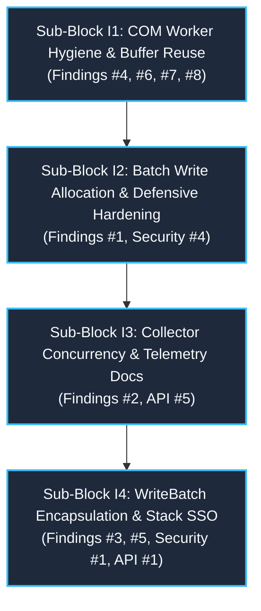

# Modernization Block I Qualitative Review: Hot-Path Performance, Resource Ceilings & Type Encapsulation

> **Document Status:** Active Qualitative Architecture & Code Review  
> **Workspace:** `opc-cli`  
> **Target Crate:** `opc-da-client` (v0.2.0 $\rightarrow$ v0.3.0 Release Candidate)  
> **Evaluation Date:** 2026-09-17  
> **Reference Review:** [`refactor/cycle2_review.md`](file:///c:/Users/WSALIGAN/code/opc-cli/refactor/cycle2_review.md) (Block I Findings #3, #6, #10, #13, #14, #20)  
> **Review Pipeline:** Subagent-Orchestrated Multi-Lens Audit (5 Specialized Lens Subagents: Logic, Design, Performance, Security, API)  
> **User Interview Alignment & Technical Decisions:**
> 1. **Decomposition Strategy:** Approved 4-sub-block natural decomposition partitioned by architectural layer and operational risk (I1: COM Worker Hygiene, I2: Batch Write Defense, I3: Collector Concurrency, I4: WriteBatch Encapsulation).
> 2. **Sub-Block I1 (Worker Allocations in `read.rs`):** Pass `results` by value (`Vec<GroupItemResult>`) into `partition_item_results` to move `OpcError` directly without cloning, and consume `rejected_errors` by value in `assemble_tag_values` on cache misses.
> 3. **Sub-Block I2 (Batch Write Defense on Interior Null Bytes):** Granular item failure — mark only the null-byte contaminated tag as `WriteResult::failure`, allowing valid tags in the batch to proceed with COM registration and write execution.
> 4. **Sub-Block I3 (Collector Concurrency in `handle_browse`):** Switch `handle_browse` to `collector.harvest()` for zero-copy buffer transfer, updating integration tests to assert against the returned vector.
> 5. **Sub-Block I4 (WriteBatch Encapsulation & SSO):** Symmetrical SSO & static literals — `WriteBatch::from_str_lenient` uses `InlineSingle` for len $\le 31$ (with `OwnedSingle` fallback), and implement `From<(&'static str, V)>` routing to `StaticSingle` for zero allocations with string literals.

---

## 1. Executive Summary & Review Scope

Modernization Block I represents the final optimization and encapsulation phase of Cycle 2 in `opc-da-client`. While Blocks G and H overhauled the public API facades, COM connection reliability, DCOM proxy security blanketing, and active group caching, Block I targets the hot-path memory allocator footprint, multi-threaded reader lock contention, dead code eradication, and domain type encapsulation.

### 1.1 Scope Boundaries
The review covers seven core files across the Windows COM worker and domain types subsystems:
- [`opc-da-client/src/com/worker/write.rs`](file:///c:/Users/WSALIGAN/code/opc-cli/opc-da-client/src/com/worker/write.rs) (Batch write execution, index mapping, and allocation hot spots)
- [`opc-da-client/src/com/worker/browse.rs`](file:///c:/Users/WSALIGAN/code/opc-cli/opc-da-client/src/com/worker/browse.rs) (Namespace browsing chunking, memory replace loops, and result handoff)
- [`opc-da-client/src/com/worker.rs`](file:///c:/Users/WSALIGAN/code/opc-cli/opc-da-client/src/com/worker.rs) (MTA worker thread lifecycle, async startup methods, and queue management)
- [`opc-da-client/src/com/worker/pool.rs`](file:///c:/Users/WSALIGAN/code/opc-cli/opc-da-client/src/com/worker/pool.rs) (Connection pool diagnostics, sizing methods, and struct dead code suppressions)
- [`opc-da-client/src/com/worker/read.rs`](file:///c:/Users/WSALIGAN/code/opc-cli/opc-da-client/src/com/worker/read.rs) (Group item result partitioning and `OpcError` cloning in assembly loops)
- [`opc-da-client/src/types/collector.rs`](file:///c:/Users/WSALIGAN/code/opc-cli/opc-da-client/src/types/collector.rs) (Tag accumulator synchronization, `Mutex` vs `RwLock`, `snapshot` vs `harvest`)
- [`opc-da-client/src/types/write_batch.rs`](file:///c:/Users/WSALIGAN/code/opc-cli/opc-da-client/src/types/write_batch.rs) (`WriteBatch` domain representation, public enum leakage, and stack SSO)

### 1.2 High-Level Objectives & Goals
- **Eliminate Throwaway Allocations on Write Hot Paths:** Eradicate eager dummy failure allocations ($2N$ throwaway heap strings) and dead stores in `handle_write_batch`.
- **Eliminate Namespace Browse Allocation Churn:** Replace `std::mem::replace` with `chunk.drain(..)` in `browse.rs`, reusing vector capacity across thousands of browse items.
- **Uncouple Progress Readers from Ingest Workers:** Upgrade `TagCollector` from `Mutex` to `RwLock` to enable parallel non-destructive `snapshot()` reads without stalling background browse ingestion.
- **Enforce Move Semantics for Terminal Browse Handoff:** Switch `handle_browse` from $O(N)$ deep-cloning `snapshot()` to $O(1)$ zero-copy `harvest()`.
- **Encapsulate `WriteBatch` Behind an Opaque Struct:** Symmetrize `WriteBatch` with `TagBatch`, introducing 31-byte stack SSO (`InlineSingle`) and zero-allocation static literals (`StaticSingle`).
- **Strict Clean Slate Compliance:** Purge uncalled async worker constructors and queue clearers, scope test probes to `#[cfg(test)]`, and achieve a 100% zero-`#[allow(dead_code)]` baseline across the worker subsystem.

---

## 2. Unified Findings Matrix

All 5 specialized review lenses (**Logic**, **Design**, **Performance**, **Security**, and **API**) were executed concurrently, yielding **8 unique consolidated findings**:

| # | Severity | Category | File:Line | Function / Symbol Signature | Summary | Source Lenses |
|:---:|:---|:---|:---|:---|:---|:---:|
| **1** | 🟠 Major | Perf / Logic | [`src/com/worker/write.rs:52-60`](file:///c:/Users/WSALIGAN/code/opc-cli/opc-da-client/src/com/worker/write.rs#L52-L60) | `handle_write_batch<S: ConnectedServer>` | Eager dummy failure error allocations ($2N$ throwaway heap strings) and dead stores on 100% successful writes; redundant dual vector collection (`items` and `tag_names`). | Perf, Logic, Design, API, Security |
| **2** | 🟠 Major | Perf / Design | [`src/types/collector.rs:16-89`](file:///c:/Users/WSALIGAN/code/opc-cli/opc-da-client/src/types/collector.rs#L16-L89) | `struct TagCollectorInner`<br>`TagCollector::snapshot` | Exclusive Mutex lock held across 10,000-string deep clone, blocking MTA worker browse ingestion; lack of documentation and usage of zero-copy `harvest()`. | Perf, Design, Security, Logic, API |
| **3** | 🟠 Major | Design / API | [`src/types/write_batch.rs:83-90`](file:///c:/Users/WSALIGAN/code/opc-cli/opc-da-client/src/types/write_batch.rs#L83-L90) | `enum WriteBatch` | Public enum exposes internal storage variants, leaking implementation details, breaking domain symmetry with `TagBatch`, and forcing heap allocations on scalar writes. | Design, API, Perf, Security, Logic |
| **4** | 🟡 Minor | Performance | [`src/com/worker/browse.rs:97-100`](file:///c:/Users/WSALIGAN/code/opc-cli/opc-da-client/src/com/worker/browse.rs#L97-L100)<br>[`src/com/worker/browse.rs:131-134`](file:///c:/Users/WSALIGAN/code/opc-cli/opc-da-client/src/com/worker/browse.rs#L131-L134) | `browse_flat_namespace`<br>`try_fast_flat_browse` | Repeated 256-element vector reallocations via `std::mem::replace` creating ~40 throwaway vectors during 10k tag browse; resolvable via `chunk.drain(..)`. | Perf, Logic, Design |
| **5** | 🟡 Minor | Perf / Design | [`src/com/worker/write.rs:146-150`](file:///c:/Users/WSALIGAN/code/opc-cli/opc-da-client/src/com/worker/write.rs#L146-L150) | `handle_write<S: ConnectedServer>` | Single tag write delegates by constructing owned `WriteBatch::Single(tag_id.to_string(), ...)`, forcing heap allocation for scalar control loop writes. | Perf, Design, API |
| **6** | 🟡 Minor | Design / Logic | [`src/com/worker.rs:268-302`](file:///c:/Users/WSALIGAN/code/opc-cli/opc-da-client/src/com/worker.rs#L268-L302)<br>[`src/com/worker.rs:404-408`](file:///c:/Users/WSALIGAN/code/opc-cli/opc-da-client/src/com/worker.rs#L404-L408) | `ComWorker::start_async`<br>`PriorityRequestQueue::clear` | Dead asynchronous worker constructors and queue clearing methods retained under `#[allow(dead_code)]` violate Clean Slate hygiene. | Design, Logic |
| **7** | 🟡 Minor | Perf / Logic | [`src/com/worker/read.rs:184-250`](file:///c:/Users/WSALIGAN/code/opc-cli/opc-da-client/src/com/worker/read.rs#L184-L250) | `partition_item_results`<br>`assemble_tag_values` | Redundant string and error cloning due to borrowed parameter signature over owned registration results; double clone of `OpcError` in group item assembly loop. | Perf, Logic |
| **8** | ⚪ Nitpick | API / Design | [`src/com/worker/pool.rs:240-251`](file:///c:/Users/WSALIGAN/code/opc-cli/opc-da-client/src/com/worker/pool.rs#L240-L251)<br>[`src/types/collector.rs:29-121`](file:///c:/Users/WSALIGAN/code/opc-cli/opc-da-client/src/types/collector.rs#L29-L121) | `ConnectionPool::len`<br>`TagCollector::new` | Uncalled diagnostics and test probes in `pool.rs` under `#[allow(dead_code)]`; missing doc-tests across 9 public methods in `TagCollector`. | API, Design, Logic |

---

## 3. Natural 4-Sub-Block Decomposition Architecture

A 2-block structure conflated internal worker loops with public type encapsulation and concurrency primitives. The natural architecture separates Block I into **4 distinct, sequential, and highly cohesive sub-blocks**:



---

### Sub-Block I1: COM Worker Hygiene & Buffer Reuse

#### 1. Rationale & Why It Stands Alone
Sub-Block I1 is strictly confined to internal COM worker loop mechanisms and dead code pruning. It makes **zero changes to public APIs, zero changes to domain types, and zero changes to write actuation paths**. By executing I1 first, we clean up the worker foundation, eliminate throwaway browse vectors, and achieve an uncompromised `#[allow(dead_code)]`-free baseline before touching active write dispatch.

#### 2. Scope & Target Files
- [`opc-da-client/src/com/worker/browse.rs`](file:///c:/Users/WSALIGAN/code/opc-cli/opc-da-client/src/com/worker/browse.rs) (Lines 97–100, 131–134)
- [`opc-da-client/src/com/worker/read.rs`](file:///c:/Users/WSALIGAN/code/opc-cli/opc-da-client/src/com/worker/read.rs) (Lines 184–207, 246–250)
- [`opc-da-client/src/com/worker.rs`](file:///c:/Users/WSALIGAN/code/opc-cli/opc-da-client/src/com/worker.rs) (Lines 268–302, 404–408, 229–233)
- [`opc-da-client/src/com/worker/pool.rs`](file:///c:/Users/WSALIGAN/code/opc-cli/opc-da-client/src/com/worker/pool.rs) (Lines 26, 240–251)

#### 3. High-Level Objectives & Technical Blueprint
1. **Browse Chunk Buffer Reuse (Finding #4):**
   - In `browse_flat_namespace` and `try_fast_flat_browse`, replace `std::mem::replace(&mut chunk, Vec::with_capacity(BROWSE_CHUNK_SIZE))` with `chunk.drain(..)`.
   - `TagCollector::push_batch` already accepts `impl IntoIterator<Item = String>`. Draining reuses the pre-allocated 256-element buffer across all ~39 flushes for a 10,000-tag browse, eliminating 240 KB of throwaway heap churn.
2. **Read Error Move Semantics (Finding #7):**
   - In `read.rs`, refactor `partition_item_results` to accept `results: Vec<GroupItemResult>` by value instead of `&[GroupItemResult]`.
   - Move `err` directly into `rejected_errors.push((idx, err))` without cloning.
   - In `assemble_tag_values`, consume `rejected_errors` by value on cache-miss paths, eliminating the second `err.clone()`.
3. **Clean Slate Dead Code Elimination (Finding #6):**
   - Delete `ComWorker::start_async` and `ComWorker::start_async_with_initializer` (0 callers across workspace; synchronous `ComWorker::start` handles all startup paths).
   - Delete uncalled `PriorityRequestQueue::clear`.
4. **Diagnostic Scope Cleanliness (Finding #8):**
   - Delete uncalled `ConnectionPool::is_empty`.
   - Gate `ConnectionPool::len` and `ComWorker::sender` under `#[cfg(test)]`.
   - Remove spurious `#[allow(dead_code)]` from `CachedGroup<G>`.

---

### Sub-Block I2: Batch Write Allocation & Defensive Hardening

#### 1. Rationale & Why It Stands Alone
`handle_write_batch` in `src/com/worker/write.rs` is a mission-critical industrial control path that commands physical PLCs and actuators. Decoupling this sub-block from domain type refactoring allows isolating and verifying:
- Happy-path dead store elimination ($2N$ string allocation removal)
- Index mapping correctness under partial COM item rejections
- Defensive input validation rejecting interior null bytes (CWE-626)  
All changes are verified against the existing `WriteBatch` enum variants before any type definitions change.

#### 2. Scope & Target Files
- [`opc-da-client/src/com/worker/write.rs`](file:///c:/Users/WSALIGAN/code/opc-cli/opc-da-client/src/com/worker/write.rs) (Lines 44–115)

#### 3. High-Level Objectives & Technical Blueprint
1. **Lazy Result Slot Mapping (Finding #1):**
   - Replace eager `let mut write_results: Vec<WriteResult> = items.iter().map(...).collect();` with `let mut write_results: Vec<Option<WriteResult>> = vec![None; items.len()];`.
   - For items rejected during `add_items`, populate directly: `write_results[idx] = Some(WriteResult::failure(tag_id, e.clone()));`.
   - For successfully written items, populate directly from `server_write_results`: `write_results[orig_idx] = Some(match res { Ok(()) => WriteResult::success(tag_id), Err(e) => WriteResult::failure(tag_id, e) });`.
   - Final resolution transforms `Vec<Option<WriteResult>>` into `Vec<WriteResult>`, only instantiating fallback errors for unassigned slots.
   - For a 10,000-item batch, this eliminates 20,000 throwaway heap string allocations and dead stores on the happy path.
2. **Dual Vector Collection Elimination:**
   - Eliminate redundant `tag_names: Vec<&str> = items.iter().map(|(t, _)| *t).collect();` by projecting directly or passing an exact-size iterator to `register_item_group`.
3. **CWE-626 Defensive Interior Null-Byte Check:**
   - In accordance with our interview decision, enforce **granular item failure**: validate tag IDs during input partitioning. If an item contains `\0`, mark that specific item slot as `Some(WriteResult::failure(tag_id, OpcError::InvalidState("Tag identifier contains illegal interior null byte".into())))` and exclude it from COM registration.
   - Valid tags in the batch proceed without interruption, preventing malicious or corrupted inputs from causing Win32 BSTR truncation while maximizing industrial actuation resilience.

---

### Sub-Block I3: Collector Concurrency & Telemetry Documentation

#### 1. Rationale & Why It Stands Alone
`TagCollector` is a cross-thread synchronization and progress monitoring primitive. Upgrading its concurrency model from `Mutex` to `RwLock` and promoting zero-copy `harvest()` changes how reader tasks interact with the collector. Isolating this sub-block allows focused multi-threaded concurrency testing and comprehensive documentation compliance without touching worker loops.

#### 2. Scope & Target Files
- [`opc-da-client/src/types/collector.rs`](file:///c:/Users/WSALIGAN/code/opc-cli/opc-da-client/src/types/collector.rs) (Full file)
- [`opc-da-client/src/com/worker/browse.rs`](file:///c:/Users/WSALIGAN/code/opc-cli/opc-da-client/src/com/worker/browse.rs) (Lines 37, 56)
- [`opc-da-client/tests/`](file:///c:/Users/WSALIGAN/code/opc-cli/opc-da-client/tests/) (Integration test assertions)

#### 3. High-Level Objectives & Technical Blueprint
1. **`RwLock` Concurrency Upgrade (Finding #2):**
   - In `TagCollectorInner`, replace `tags: std::sync::Mutex<Vec<String>>` with `tags: std::sync::RwLock<Vec<String>>`.
   - `TagCollector::snapshot(&self)` acquires a read lock (`self.inner.tags.read()`). Concurrent reader tasks (e.g., TUI monitoring threads) can inspect progress simultaneously without serializing or stalling the background browse worker.
   - `push`, `push_batch`, and `harvest` acquire a write lock (`self.inner.tags.write()`).
   - Poison resilience: preserve `match lock { Ok(g) => g, Err(p) => p.into_inner() }` across both read and write acquisitions.
2. **Zero-Copy Terminal Browse Handoff:**
   - In accordance with our interview decision, update `handle_browse` in `browse.rs:37, 56` to return `collector.harvest()` instead of `collector.snapshot()`.
   - Drains the accumulated 10,000 strings via `std::mem::take` in $O(1)$ time with zero string clones.
   - Update integration test call sites (`tag_browsing_integration_test.rs`) to assert against the returned `Vec<String>`.
3. **Performance Documentation & Doc-Tests (Finding #8):**
   - Add `# Performance Warning` alert to `TagCollector::snapshot` detailing that it is an $O(N)$ deep copy intended strictly for non-destructive progress monitoring.
   - Document `TagCollector::harvest` highlighting its $O(1)$ move semantics.
   - Add runnable `# Examples` doc-tests across all 9 public methods on `TagCollector`.

---

### Sub-Block I4: `WriteBatch` Encapsulation & Zero-Allocation Stack SSO

#### 1. Rationale & Why It Stands Alone
Sub-Block I4 is the domain model capstone of Cycle 2 Modernization. Symmetrizing `WriteBatch` with `TagBatch` transitions `WriteBatch` into an opaque struct, unlocking 31-byte stack Small String Optimization (SSO) for dynamic tags and static storage for string literals. This is an additive, backwards-compatible public type refactoring with its own extensive unit test matrix.

#### 2. Scope & Target Files
- [`opc-da-client/src/types/write_batch.rs`](file:///c:/Users/WSALIGAN/code/opc-cli/opc-da-client/src/types/write_batch.rs) (Full file)
- [`opc-da-client/src/com/worker/write.rs`](file:///c:/Users/WSALIGAN/code/opc-cli/opc-da-client/src/com/worker/write.rs) (`handle_write` delegation at Line 148)

#### 3. High-Level Objectives & Technical Blueprint
1. **Opaque Struct Encapsulation (Finding #3):**
   - Refactor `pub enum WriteBatch` to `pub struct WriteBatch { pub(crate) repr: WriteBatchRepr }`.
   - Internal variants:
     ```rust
     #[derive(Debug, Clone)]
     pub(crate) enum WriteBatchRepr {
         StaticSingle(&'static str, OpcValue),
         InlineSingle([u8; 31], u8, OpcValue),
         OwnedSingle(String, OpcValue),
         Shared(Arc<[(String, OpcValue)]>),
         Owned(Vec<(String, OpcValue)>),
     }
     ```
2. **Stack Small String Optimization & Safe Slicing:**
   - In accordance with our interview decision, provide `WriteBatch::from_str_lenient(tag: &str, val: impl Into<OpcValue>)`:
     - If `tag.len() <= 31`: store in `InlineSingle` (0 heap allocations).
     - If `tag.len() > 31`: store in `OwnedSingle(tag.to_string(), val.into())`.
   - **Multibyte UTF-8 Boundary Guard (CWE-20/787):** Never slice across a UTF-8 codepoint boundary. `inline_as_str` validates using `valid_up_to()` matching `TagBatch`.
3. **Static String Literals & Zero Allocation:**
   - Implement `From<(&'static str, V)> for WriteBatch` routing to `StaticSingle(&'static str, val.into())`, enabling zero-allocation scalar writes when using literal tag names.
4. **Semantic Sequence `PartialEq`:**
   - Implement `PartialEq` for `WriteBatch` by comparing `self.len() == other.len() && self.iter().eq(other.iter())`, equating batches with identical pairs regardless of internal storage representation.
5. **Scalar Write Delegation Optimization (Finding #5):**
   - Update `handle_write` in `write.rs:148` to construct its batch via `WriteBatch::from_str_lenient(tag_id, value.clone())`, eliminating heap string allocations on single-tag control writes $\le 31$ bytes.

---

## 4. Blast Radius Table & Cross-Subsystem Impact

| Sub-Block | Target Subsystem | Files Modified | Direct Callers | Indirect Callers | Breaking Change? | Risk Mitigation |
|:---:|:---|:---|:---:|:---:|:---:|:---|
| **I1** | COM Worker Engine | `browse.rs`, `read.rs`, `worker.rs`, `pool.rs` | 0 (Internal) | 4 | No | Internal refactor; 0 public signatures changed; dead code verified with Narsil symbol search. |
| **I2** | Write Actuation | `com/worker/write.rs` | 2 | 2 | No | Index mapping preserved via `zip(&valid_indices)`; granular error assignment prevents cascading batch aborts. |
| **I3** | Tag Concurrency | `types/collector.rs`, `browse.rs`, `tests/` | 4 | 8 | No | `TagCollector` public API preserved; `RwLock` poison handling retains zero-crash guarantees. |
| **I4** | Batch Domain Model | `types/write_batch.rs`, `write.rs` | 4 | 14 | Crate-Internal | Blanket `IntoWriteBatch`, `iter()`, `len()`, and `empty()` preserved. Zero external pattern matches found. |

---

## 5. Critical Things to Watch Out For

1. **Multibyte UTF-8 Slicing in `WriteBatch` Stack SSO (CWE-20 / CWE-787):**  
   Never slice a string at byte 31 if byte 31 is in the middle of a multibyte UTF-8 codepoint. Strings $> 31$ bytes must gracefully fall back to `OwnedSingle(String, OpcValue)` without truncation.
2. **`ExactSizeIterator` Size Hint Invariants (CWE-682):**  
   `WriteBatchIter` and `WriteBatchIntoIter` must accurately report monotonic `(1, Some(1)) -> (0, Some(0))` size hints for SSO variants.
3. **Index Ordering in `handle_write_batch`:**  
   The correlation between requested tag order, COM handles, and returned `WriteResult`s must be preserved across partial registration and write rejections via `zip(&valid_indices)`.
4. **Lock Poisoning Resilience:**  
   Preserve `match lock { Ok(g) => g, Err(p) => p.into_inner() }` across both `read()` and `write()` acquisitions on `TagCollector`'s `RwLock`.
5. **Granular Null-Byte Rejection Isolation:**  
   When rejecting tags containing `\0`, ensure that only the invalid tag is mapped to failure, and valid tags are accurately registered with COM and written.

---

## 6. Next Steps & Planning Gate

📋 **Review Complete & Roadmap Updated.**  
The 4-sub-block architectural blueprint has been documented in:  
📄 [**`refactor/cycle2_blockI_review.md`**](file:///c:/Users/WSALIGAN/code/opc-cli/refactor/cycle2_blockI_review.md)

Recommended next step: Proceed to `/plan-making` for **Sub-Block I1 (COM Worker Hygiene & Buffer Reuse)**.
