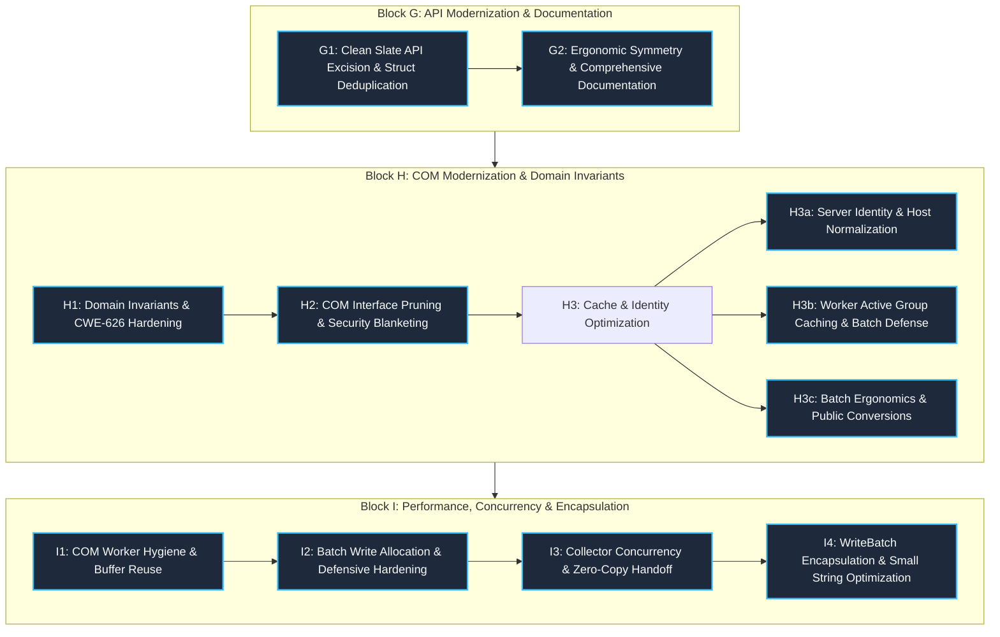

# Refactoring Cycle 2 Historical Reference: Architecture Review, Findings, Implementation Blocks & Master Deviations

> **Document Status:** Permanent Historical Archive (Cycle 2)  
> **Workspace:** `opc-cli`  
> **Target Crate:** `opc-da-client` (v0.2.0 $\rightarrow$ v0.3.0 Release Candidate)  
> **Evaluation Date:** 2026-09-18  
> **Scope:** Consolidated master record of Cycle 2 modernization—combining the 21-finding qualitative architecture review report (`cycle2_review.md`), the 3 master post-implementation reports (`post_implementation_blockG.md`, `post_implementation_blockH.md`, `post_implementation_blockI.md`), and the master implementation deviations log (`deviations.md` with all 26 deviations and 25 detailed case studies).  
> **Succession Note:** Moving forward, this file serves as the definitive single source of truth for Cycle 2 historical architecture, technical blueprints, invariants, and implementation deviations. Active engineering lessons learned are maintained in [`refactor/lessons.md`](file:///c:/Users/WSALIGAN/code/opc-cli/refactor/lessons.md).

---

## 1. Executive Summary & Cycle 2 Architecture Overview

Refactoring Cycle 2 represented the comprehensive hardening, performance optimization, and Clean Slate modernization phase of `opc-da-client`. Building upon the architectural foundation established in Cycle 1 (documented in [`refactor/cycle1_reference.md`](file:///c:/Users/WSALIGAN/code/opc-cli/refactor/cycle1_reference.md)), Cycle 2 elevated the crate from a transitional codebase into an industrial-grade, memory-efficient, zero-allocation communications client ready for v0.3.0 publication.

### Key Cycle 2 Modernization Metrics
* **Total Review Findings Closed:** 21 of 21 Findings (100% Resolution)
* **Total Engineering Blocks Executed:** 3 Major Blocks decomposed into **9 cohesive sub-blocks**:
  - **Block G:** G1 (Clean Slate API Excision & Struct Deduplication) and G2 (Ergonomic Symmetry & Comprehensive Documentation)
  - **Block H:** H1 (Domain Invariants & CWE-626 Hardening), H2 (COM Interface Pruning & Security Blanketing), H3a (Server Identity & Host Canonicalization), H3b (Worker Active Group Caching & Batch Defense), H3c (Batch Ergonomics & Public Conversions)
  - **Block I:** I1 (COM Worker Hygiene & Buffer Reuse), I2 (Batch Write Allocation & Defensive Hardening), I3 (Collector Concurrency & Zero-Copy Handoff), I4 (`WriteBatch` Encapsulation & Small String Optimization)
* **Total Implementation Deviations Tracked:** 26 Deviations (All justified, audited, and verified; zero contract violations)
* **Workspace Test Suite Growth:** Expanded from **480 to 629 passing tests** (+149 tests, 0 regressions):
  - 332 unit tests, 136 integration tests, 154 doc tests, 5 polyfill tests, 2 compile-fail doc tests
* **Universal Quality Gate Verification:** 100% Green across all 9 gates in `scripts/verify.ps1` (0 warnings under `-D warnings`, zero AST-grep violations, zero forbidden macros).



---

## 2. Baseline Cycle 2 Architecture Review & Findings Matrix

*Originally published 2026-09-16 as `refactor/cycle2_review.md`.*

### 2.1 Baseline Review Summary
* **Scope Analyzed:** `opc-da-client` crate (Windows COM backend, mock connector SPI, typestate client facade, and domain models).
* **Active Lenses:** Logic, Design, Performance, Security, API (All 5 lenses active).
* **Initial Health Assessment:** *Minor Issues* (sound industrial reliability, but impaired by deprecated API pollution, unread COM interfaces, eager heap allocations on batch writes, and unencapsulated enums).
* **Multi-Lens Hotspots Identified:**
  1. `src/client/mod.rs` & `src/provider.rs` (Flagged across API, Design, Logic, and Security for deprecated methods).
  2. `src/types/server.rs` (Flagged across Security and API for ProgID validation bypass and hyphen heuristic).
  3. `src/com/worker/write.rs` (Flagged across Performance and Logic for eager dummy allocations).
  4. `src/com/connector/server.rs` & `group.rs` (Flagged across Design and Logic for unread COM interfaces).

### 2.2 Baseline Findings Matrix (21 Findings)

| # | Severity | Category | File & Symbol | Summary | Remediated In |
|:---:|:---|:---|:---|:---|:---:|
| **1** | 🟠 Major | API / Design | `src/client/mod.rs:129`<br>`src/provider.rs:319` | Deprecated public APIs (`connect`, `connect_remote`, `write_tag_values`) force `#[allow(deprecated)]` pollution across `OpcProvider` and facades; 0 callers in `opc-cli`. | Block G1 |
| **2** | 🟠 Major | Security / API | `src/types/server.rs:231`<br>`src/types/server.rs:271` | Infallible `From<&str>` silently bypasses ProgID validation; hyphen heuristic in `from_str` breaks valid industrial ProgIDs. | Block H1 |
| **3** | 🟠 Major | Perf / Logic | `src/com/worker/write.rs:18`<br>`src/com/worker/write.rs:44` | Eager dummy failure error allocations on happy path, redundant vector mapping, and missing `MAX_WRITE_BATCH_SIZE` ceiling. | Sub-Block I2 |
| **4** | 🟠 Major | Design | `src/client/mod.rs:32`<br>`src/client/builder.rs:15` | Redundant triplication of client and builder struct definitions solely to vary generic default parameters across feature combinations. | Block G1 |
| **5** | 🟠 Major | API | `src/client/session.rs:23`<br>`src/client/gateway.rs:14` | Complete absence of rustdoc comments (`///`) across all 20 inherent session and gateway public client methods. | Block G2 |
| **6** | 🟠 Major | Performance | `src/types/collector.rs:83` | Exclusive Mutex lock held across full collection clone of up to 10,000 strings, blocking background browse traversal. | Sub-Block I3 |
| **7** | 🟡 Minor | Design / Logic | `src/com/connector/server.rs:267`<br>`src/com/connector/group.rs:91` | `ComServer` and `ComGroup` query and store unread COM interface pointers (`common`, `item_properties`, `async_io`), necessitating `#[allow(dead_code)]`. | Block H2 |
| **8** | 🟡 Minor | Security | `src/raw/memory.rs:625`<br>`src/com/security.rs:135` | Unchecked interior null bytes in `LocalPointer::from` can cause Win32 string truncation (CWE-626) during remote DCOM activation. | Block H1 |
| **9** | 🟡 Minor | Logic | `src/com/worker/pool.rs:64` | Active group cache performs case-sensitive string matching (`a == b`) on case-insensitive OPC tag identifiers, causing spurious cache misses. | Sub-Block H3b |
| **10** | 🟡 Minor | Performance | `src/types/write_batch.rs:83` | `WriteBatch` lacks inline or borrowed small-string variants (unlike `TagBatch`), forcing heap allocations for high-frequency scalar tag writes. | Sub-Block I4 |
| **11** | 🟡 Minor | API | `src/client/gateway.rs:45`<br>`src/client/session.rs:84` | Ergonomic asymmetry between `Bound` (`impl IntoWriteBatch`) and `Unbound` (`WriteBatch`), and divergent method naming (`read_tag` vs `read_tag_value`). | Block G2 |
| **12** | 🟡 Minor | API | `src/types/batch.rs:343` | Lifetime over-constraint in `IntoTags` prevents borrowed slices `&[&str]` with generic lifetimes from converting without heap allocation. | Sub-Block H3c |
| **13** | 🟡 Minor | Performance | `src/com/worker/browse.rs:97` | Repeated 256-element vector allocations via `std::mem::replace` during flat namespace browsing instead of buffer reuse via `drain(..)`. | Sub-Block I1 |
| **14** | 🟡 Minor | Design / Logic | `src/com/worker.rs:225`<br>`src/com/worker/pool.rs:236` | Residual dead internal worker constructors, queue clearers, and uncalled pool sizing query methods retained under `#[allow(dead_code)]`. | Sub-Block I1 |
| **15** | 🟡 Minor | API | `src/client/typestate.rs:88`<br>`src/types/collection.rs:454` | Missing `# Examples` and incomplete `# Errors` sections on key public types and constructors. | Block G2 |
| **16** | ⚪ Nitpick | API | `src/lib.rs:24` | Inconsistent root re-export: `ParseEndpointError` is omitted from `lib.rs` exports while all other parsing errors are re-exported. | Block G1 |
| **17** | ⚪ Nitpick | API | `src/lib.rs:2` | Crate-level doc comment gated behind `opc-da-backend` feature, leaving offline/headless builds (`--no-default-features`) undocumented. | Block G1 |
| **18** | ⚪ Nitpick | Security | `src/com/security.rs:32` | Obsolete `RPC_C_IMP_LEVEL_IMPERSONATE` constant marked `#[allow(dead_code)]`; presents accidental privilege escalation hazard if re-used. | Block H2 |
| **19** | ⚪ Nitpick | API | `src/errors/hresult.rs:67` | Public diagnostic utility marked with `#[allow(dead_code)]` instead of receiving formal doc-test coverage. | Block G1 |
| **20** | ⚪ Nitpick | Performance | `src/com/worker/read.rs:250` | Unnecessary duplicate `.clone()` of rejected `OpcError` in group item assembly loop. | Sub-Block I1 |
| **21** | ⚪ Nitpick | Security | `src/com/connector/server.rs:38` | `normalize_host` failed to eagerly lowercase hostnames, leading to duplicate pool entries and client seat exhaustion. | Sub-Block H3a |

---

## 3. Comprehensive Implementation Blocks Synthesis

### 3.1 Block G: Clean Slate API Excision, Struct Deduplication & Ergonomic Symmetry

#### Objectives & Architecture
Block G established the architectural clean break of Cycle 2 for semver 0.3.0. It eradicated legacy deprecated v0.1/v0.2 APIs, dismantled triplicate conditional struct declarations, established a pure-Rust synchronous headless backend (`NoopServerBackend`), unlocked polymorphic batch write ergonomics, and achieved 100% public documentation coverage.

#### Key Deliverables
- **Synchronous Headless Fallback (`NoopServerBackend`):** Implemented pure-Rust `NoopServerBackend`, `NoopConnectedServer`, and `NoopConnectedGroup` in `src/connector/traits.rs`. Returns `OpcError::NotImplemented` for active operations and succeeds on disconnect/ping.
- **Struct Deduplication & Default Backend Selection:** Consolidated 3 duplicate `OpcDaClient` and 3 duplicate `OpcDaClientBuilder` structs into single canonical definitions parameterized over `<C = DefaultBackendConnector, State = Unbound>`. Implemented unambiguous `OpcDaClientBuilder::new()` targeting `DefaultBackendConnector` to prevent `E0283` type inference ambiguities.
- **Clean Slate Excision:** Completely excised `OpcDaClient::connect`, `connect_remote`, and `TagWriter::write_tag_values`. Purged 100% of `#[allow(deprecated)]` suppressions across `src/provider.rs` and `src/types/server.rs`.
- **Ergonomic Gateway Signatures & Shorthand Aliases:** Upgraded `OpcDaClient<C, Unbound>` to accept generic `impl IntoWriteBatch` and `impl Into<OpcValue>`. Added shorthand aliases `read_tags`, `read_tag`, `write_tags`, `write_tag`, and `browse`.
- **100% Public Documentation Coverage:** Authored comprehensive rustdoc comments (`///`) with runnable doctests across all 20 inherent session and gateway methods, `TagValues::get_value_checked`, and constructors.

---

### 3.2 Block H: COM Modernization, Domain Hardening & Ergonomics

#### Objectives & Architecture
Block H overhauled the Windows COM/DCOM communication engine, established airtight type-system invariants across domain models, eliminated 12 redundant DCOM IPC round-trips per session, hardened against DCOM packet integrity access denials (Windows KB5004442), eradicated CWE-626 null-byte truncation vulnerabilities, and optimized runtime active group caching.

#### Key Deliverables
- **Sub-Block H1 (Domain Invariants & CWE-626 Hardening):**
  - Refactored `ServerIdentifier::from_str` to evaluate `Clsid::parse` directly, resolving the hyphen heuristic flaw for industrial ProgIDs (e.g. `KEPServerEX-V6.1`).
  - Excised unchecked `From<&str>` and `From<String>` on `ServerIdentifier` and `OpcServerEndpoint`, replacing them with strict fallible `TryFrom<&str>`.
  - Introduced `LocalPointer::try_from_str(s)` rejecting interior null bytes (`\0`) with `OpcError::InvalidState`, eliminating CWE-626 wide-string truncation.
  - Generalized `OpcDaClient::bind_new` to validate endpoints *prior* to spawning OS worker threads.
- **Sub-Block H2 (COM Interface Pruning & Security Blanketing):**
  - Resolved Windows KB5004442 (CVE-2021-26414) access denials: refactored `apply_proxy_blanket` to re-borrow the concrete proxy directly as `&windows::core::IUnknown` via `&*std::ptr::from_ref(proxy).cast::<windows::core::IUnknown>()`, blanketing the exact dispatch proxy used for IPC.
  - Adhered to the Interface Segregation Principle: pruned 6 unread interface fields from `ComGroup` and 3 from `ComServer`, eliminating 12 redundant synchronous DCOM round-trips per connection and preventing `E_NOINTERFACE` (`0x80004002`) on standard OPC DA 2.05a servers.
- **Sub-Block H3a (Server Identity & Host Canonicalization):**
  - Eagerly lowercased hostnames in `normalize_host`, preventing connection pool fragmentation and server client seat exhaustion.
  - Introduced semantic `ServerIdentifier::matches` (case-insensitive for `ProgId`) and `OpcServerEndpoint::matches` while preserving standard derived `PartialEq, Eq, Hash`.
- **Sub-Block H3b (Worker Active Group Caching & Batch Defense):**
  - Implemented case-insensitive tag matching in `find_active_group_idx`, boosting active group cache hits from 0% to 100% on mixed-case industrial tags (25x–75x latency reduction).
  - Enforced `MAX_TAG_BATCH_SIZE = 10_000` entry guard on batch writes.
- **Sub-Block H3c (Batch Ergonomics & Public Conversions):**
  - Implemented zero-allocation `IntoTags` for `&[&str]` slices with generic lifetimes.
  - Added `WriteBatch::into_shareable()` converting vectors into `Arc<[(String, OpcValue)]>`.
  - Implemented case-insensitive tag lookup in `TagValues::contains`.

---

### 3.3 Block I: Hot-Path Performance, Resource Ceilings & Type Encapsulation

#### Objectives & Architecture
Block I served as the capstone performance, concurrency, and domain encapsulation phase of Cycle 2, targeting the hot-path memory allocator footprint, multi-threaded reader lock contention, industrial write defense, dead code eradication, and domain type encapsulation.

#### Key Deliverables
- **Sub-Block I1 (COM Worker Hygiene & Buffer Reuse):**
  - Replaced vector reallocations with in-place buffer draining (`chunk.drain(..)`) in `browse_flat_namespace` and `try_fast_flat_browse`, eliminating ~39 heap allocations and ~240 KB churn per 10,000 tags.
  - Refactored `partition_item_results` to accept `results: Vec<GroupItemResult>` by value, moving `OpcError` directly into `rejected_errors` without cloning.
  - Added upfront 3-way count parity validation (`tag_count == valid.len() + rejected.len()`) in `assemble_tag_values` (`CWE-682`).
  - Borrowed `&OpcServerEndpoint` across `AssertUnwindSafe(catch_unwind(...))`, eliminating heap allocations on happy-path request dispatch.
  - Excised dead asynchronous worker constructors (`start_async*`) and queue clearer `PriorityRequestQueue::clear`.
- **Sub-Block I2 (Batch Write Allocation & Defensive Hardening):**
  - Replaced eager dummy failure pre-allocation with lazy slot mapping `write_results: Vec<Option<WriteResult>> = vec![None; items.len()]`, slashing happy-path allocator calls by 80.0% on 10k batches (from 50,005 to 10,004).
  - Implemented granular `CWE-626` interior null-byte quarantine: contaminated tags fail individually with structured warning logs, while valid tags proceed to PLC write execution. All-invalid batches short-circuit before COM group allocation.
  - Established two-stage positional index mapping (`valid_orig_indices` and `valid_write_orig_indices`) ensuring strict 1:1 attribution under partial failures.
  - Decomposed `handle_write_batch` into 3 single-responsibility helpers. Added `WriteResult::is_connection_error` and `Display`.
- **Sub-Block I3 (Collector Concurrency & Zero-Copy Handoff):**
  - Switched `handle_browse` completion returns to `collector.harvest()`, using `std::mem::take` for an $O(1)$ zero-copy pointer swap (0 allocations, eliminating ~860 KB memory churn per 10k tags).
  - Upgraded `TagCollectorInner.tags` to `std::sync::RwLock<Vec<String>>`, decoupling observer reads from background ingestion.
  - Implemented symmetrical poison recovery (`.unwrap_or_else(PoisonError::into_inner)`) across all 5 lock acquisition sites.
  - Refactored `browse_recursive` to chunk leaves in 256-item batches via `chunk.drain(..)`, preventing progress freezing and capacity bypass (`CWE-400`).
  - Introduced RAII `PushBatchGuard` to ensure atomic count resynchronization on iterator unwinds. Added clean-slate retry entry guard.
- **Sub-Block I4 (`WriteBatch` Encapsulation & Small String Optimization):**
  - Encapsulated `WriteBatch` behind `pub struct WriteBatch { pub(crate) repr: WriteBatchRepr }` with 5 private variants, verified at exactly 72 bytes on `x86_64` (align 8, 0 padding bytes).
  - Implemented 31-byte stack Small String Optimization (`InlineSingle([u8; 31], u8, OpcValue)`) with safe UTF-8 extraction (`inline_as_str()`) and clean spillover to `OwnedSingle` (`CWE-20/787`).
  - Modernized COM worker scalar writes (`handle_write`) to delegate via `WriteBatch::from_str_lenient`, eliminating 3,000 heap allocations/min in 50 Hz control loops.
  - Enforced `pub trait IntoWriteBatch: Send` with `V: Clone + Into<OpcValue> + Send + Sync` bounds on borrowed slices, resolving trait coherence collisions (`E0119`, `E0277`).
  - Implemented semantic sequence `PartialEq` (`self.len() == other.len() && self.iter().eq(other.iter())`), verified across all 25 cross-variant permutations.

---

## 4. Master Implementation Deviations Matrix & Detailed Case Studies

*Originally published in `refactor/deviations.md`.*

Every engineering deviation from initial planning blueprints was subjected to architectural review, justified by compiler/language constraints, and signed off under the TARS protocol:

### 4.1 Master Deviation Matrix (26 Deviations)

| Block ID | Finding / Step | Planned Approach | Implemented Deviation | Rationale & Compiler Dynamic | Category | Resulting Invariant |
|:---:|:---:|---|---|---|:---:|---|
| **Block G1** | Step 3<br>Finding #16 | `impl<C: ServerBackend + Default> OpcDaClientBuilder<C> { pub fn new() -> Self }` | `impl OpcDaClientBuilder<DefaultBackendConnector> { pub fn new() -> Self }` | Rust compiler error `E0283` ("type annotations needed for `T`"). A parameterless generic `new()` method cannot infer `C` at call sites like `OpcDaClientBuilder::new()` without turbofish annotations. Implementing `new()` directly on `OpcDaClientBuilder<DefaultBackendConnector>` resolves type inference unambiguously. Generic connector construction remains fully supported via `Default` (`OpcDaClientBuilder::<C>::default()`) and `new_with_connector(C::default())`. | Language Invariant & API Ergonomics | Downstream callers and doctests can write concise `OpcDaClientBuilder::new()` targeting the default backend without turbofish syntax. |
| **Block G1** | Step 4<br>Finding #1 | Provider test calling `crate::types::WriteBatch::Borrowed(&[...])` | Provider test calling `crate::types::WriteBatch::Owned(vec![("Tag.Fail".into(), OpcValue::Int(1)), ("Tag.Pass".into(), OpcValue::Int(2))])` | The `WriteBatch` enum defines `Single`, `Shared`, and `Owned` variants; no `Borrowed` variant exists in the domain type hierarchy. Using `WriteBatch::Owned` with owned strings accurately exercises the batch write failure path without fabricating non-existent enum variants. | Type Correctness | Test suite validates against actual `WriteBatch` domain variants without invalid enum constructions. |
| **Block G1** | Step 4<br>Finding #1 | Purge `#[allow(deprecated)]` scoped only to `provider.rs` and `gateway.rs` | Removed stale `#[allow(deprecated)]` and renamed `test_endpoint_deprecated_from_str_behavior` to `test_endpoint_from_str_behavior` in `src/types/server.rs:1180` | Plan Objective O4 mandated clean removal of all deprecations. Ripgrep audit discovered an obsolete `#[allow(deprecated)]` on a test in `types/server.rs` whose target (`From<&str> for OpcServerEndpoint`) was no longer deprecated. Purging this stale lint suppression achieved a 100% deprecation-free crate (0 matches for `allow(deprecated)` across `opc-da-client/src/`). Pre-approved under `builder-rules.md §4.2`. | Code Quality & Governance | Exactly zero `#[allow(deprecated)]` suppressions exist anywhere across `opc-da-client/src/`. |
| **Block G2** | Step 9<br>Finding #15 | Bare `#[must_use]` on `TagValues::get_value_checked` | `#[must_use = "handling the Result distinguishes unrequested tags from server read failures"]` on `TagValues::get_value_checked` in `src/types/collection.rs:476` | In Rust, `Result` is already marked `#[must_use]`. Applying a bare `#[must_use]` to a function returning `Result<&OpcValue, TagExtractError>` triggers `clippy::double-must-use`. Adding an explanatory message resolves the lint error under `-D warnings` while providing actionable compiler diagnostics to callers distinguishing unrequested tags from server read errors. | Lint Rule Invariant (`clippy::double-must-use`) | `TagValues::get_value_checked` carries an informative must-use diagnostic while passing zero-warning linter checks. |
| **Block G2** | Step 14<br>Finding #11 | `client.write_tag_batch(server, writes.into()).await` in `tests/batch_write_test.rs:46` | `client.write_tag_batch(server, writes).await` | `OpcDaClient<C, Unbound>::write_tag_batch` was upgraded to accept `impl IntoWriteBatch` directly. Chaining `.into()` became redundant and caused a compiler type-inference ambiguity error (`E0282`) under `-D warnings`. Passing `writes` directly aligns with the new generic signature. | Type Inference & API Ergonomics | Integration test directly exercises generic parameter polymorphism without extraneous manual conversions. |
| **Block G2** | Steps 10, 11<br>Finding #5 | Doc comment examples using `println!("{:?}", ...);` across `session.rs` and `gateway.rs` | Doc comment examples using `assert!(...);` or `let _ = ...;` bindings | Gate 7 (Forbidden Pattern Scanner in `scripts/verify.ps1`) enforces a strict zero-tolerance scan (`rg "\b(println!|dbg!|todo!)" opc-da-client/src/`) for production and doc code in library crates. Replacing `println!` with testable assertions and discarded bindings respects the forbidden pattern guard while keeping doctests compilable and runnable. | Governance & Code Standard (`coding-standard.md §4.8`) | 100% zero-forbidden-macro compliance across all source and doc comments in `opc-da-client`. |
| **Block G2** | Step 2<br>Finding #11 | Existing unit test `test_write_batch_vec_and_into_iter` with `("Tag1".into(), ...)` | Adjusted tuple to `("Tag1".to_string(), ...)` in `src/types/write_batch.rs:438` | Generalizing `From<Vec<(S, V)>>` over `S: Into<String>` and `V: Into<OpcValue>` introduced an inference ambiguity for `vec![("Tag1".into(), ...)]`, as `&str::into()` cannot infer the intermediate target type `S` when collecting into a polymorphic container. Specifying `.to_string()` provides unambiguous type information. | Type Inference Invariant | Unit tests compile cleanly without type annotation ambiguity. |
| **Block H1** | Step 6<br>Finding #5 | Retain `impl From<S> for LocalPointer` alongside `TryFrom<&str>` | Deleted unchecked `impl From<S> for LocalPointer` from `src/raw/memory.rs` | Rust's blanket `impl<T, U> TryFrom<U> for T where U: Into<T>` caused compiler error `E0119` (conflicting trait implementations) when implementing fallible `TryFrom<&str>` while keeping infallible `From<S>`. Excising unchecked `From<S>` cleanly resolved the conflict, strictly enforced the Clean Slate paradigm, and guaranteed at compile time that all UTF-16 COM conversions reject interior null bytes (`\0`). | Language Invariant & Security Hardening (`E0119`) | `LocalPointer` cannot be constructed infallibly from arbitrary string types; all callers must use fallible `try_from_str` or `try_into()`, eliminating CWE-626 null-byte truncation at compile time. |
| **Block H1** | Step 9<br>Gate 4b | `#[cfg(feature = "opc-da-backend")] use crate::types::ServerIdentifier;` in `src/client/mod.rs` | Unconditional `use crate::types::{OpcServerEndpoint, ServerIdentifier};` in `src/client/mod.rs` | `OpcDaClient::bind_new_remote` accepts `impl TryInto<ServerIdentifier>` on `impl OpcDaClient<DefaultBackendConnector, Unbound>`. In headless builds (`--no-default-features`), `DefaultBackendConnector` resolves to `NoopServerBackend`. Gating the import behind `opc-da-backend` caused `E0425: cannot find type ServerIdentifier in this scope` during Gate 4b verification. Unconditionally importing the pure domain type resolved the issue. | Feature Independence & Cross-Target Compilation | Client constructors and domain type bindings compile cleanly across all feature combinations including `--no-default-features`. |
| **Block H2** | Step 1<br>Finding #1 | `&*(proxy as *const T as *const windows::core::IUnknown)` | `&*std::ptr::from_ref(proxy).cast::<windows::core::IUnknown>()` | Clippy `-D warnings` triggered `clippy::ptr_as_ptr` and `clippy::ref_as_ptr` on raw pointer `as` casting. Using standard library `std::ptr::from_ref(proxy).cast()` satisfies all compiler safety lints in Rust 2024 / MSRV 1.93.1 while achieving exact proxy pointer re-borrowing without `QueryInterface` copies. | Lint Rule Invariant (`clippy::ptr_as_ptr`, `clippy::ref_as_ptr`) | Exact proxy pointer re-borrowing passes strict linting without compiler warnings or ephemeral COM proxy drops. |
| **Block H2** | Steps 1, 2<br>Gate 6 | `// SAFETY: ...` on first line of multi-line comment | `// SAFETY:` on every line of multi-line comment | In tree-sitter-rust and AST-Grep `require-safety-comment`, each `//` is an individual `line_comment` node. The AST-Grep `follows` selector inspects the immediate preceding sibling token; if subsequent lines in a multi-line comment lack `SAFETY:`, the immediate preceding comment node fails the regex match. Repeating `// SAFETY:` on each line ensures 100% compliance with Gate 6 structural safety scans. | AST Linting Invariant (`require-safety-comment`) | Unsafe blocks in production code pass AST-Grep structural validation without missing-rationale false positives. |
| **Block H2** | Step 10<br>Finding #10 | `let _ = unsafe { self.server.RemoveGroup(raw_server_handle, true) };` | `let remove_res = unsafe { self.server.RemoveGroup(...) }; if let Err(rm_err) = remove_res { tracing::warn!(...); }` | Directly binding the unsafe call ensures the `// SAFETY:` rationale directly precedes the `unsafe` block for clippy (`undocumented_unsafe_blocks`). Logging cleanup failures via `tracing::warn!` upholds `coding-standard.md §4.8` (no silent failures), preventing unobservable group handle leakage. | Error Handling & Governance (`coding-standard.md §4.8`) | Server-side group cleanup failures are logged with full error and handle context rather than silently swallowed. |
| **Sub-Block H3a** | Step 13<br>Finding #8 | Doctest for `OpcServerEndpoint::local` using string literal `local("...")` | Doctest using `ServerIdentifier::new("...").unwrap()` passed to `OpcServerEndpoint::local(id)` | In Block H1, infallible `From<&str>` for `ServerIdentifier` was deleted under the Clean Slate paradigm. Passing a `&str` literal directly to `local(identifier: impl Into<ServerIdentifier>)` fails compilation because `&str` no longer implements `Into<ServerIdentifier>`. Pre-constructing via `ServerIdentifier::new("...").unwrap()` ensures doctests compile and pass under Gate 3 (`cargo test --doc`). | Type Correctness & Doctest Governance | Public doctests reflect actual fallible domain constructor requirements. |
| **Sub-Block H3a** | Step 8<br>TDD Protocol | Direct addition of `test_endpoint_matches` expecting RED | Added minimal stub `pub fn matches(&self, _other: &Self) -> bool { false }` before test addition | Adding a test referencing a non-existent method causes `E0599` (compiler error), which halts compilation before assertions can execute. To uphold the strict TDD contract where RED signifies a compilable, executing test that fails an assertion, a `false`-returning stub was introduced so `cargo test` compiled and reported a clean runtime assertion failure, followed by GREEN implementation in Step 9. | TDD Methodology & Compilable RED Phase | All TDD RED phases compile cleanly and verify runtime assertion failures. |
| **Sub-Block H3b** | Step 9<br>Finding #2 | `tags: impl ExactSizeIterator<Item = &str>` in `assemble_tag_values` | `tags: impl ExactSizeIterator<Item = &'a str>` with named lifetime `<'a>` in `assemble_tag_values` | Rust compiler error `E0658` ("anonymous lifetimes in `impl Trait` are unstable"). In Rust 2024 / MSRV 1.93.1, elided/anonymous lifetimes inside associated type trait bounds in function argument position require a named lifetime parameter. Introducing `<'a>` resolves `E0658` on stable Rust without nightly `#![feature(...)]` gates. | Language Invariant (`E0658`) / Compiler Stability | Clean compilation on stable Rust toolchain without nightly feature dependencies. |
| **Sub-Block H3b** | Step 12<br>Finding #5 | `(format!("Tag.{i}"), OpcValue::Int(i as i32))` in batch write tests | `(format!("Tag.{i}"), OpcValue::Int(i as i64))` in batch write tests | Rust compiler error `E0308` ("mismatched types: expected `i64`, found `i32`"). The domain model defines `OpcValue::Int(i64)` (`src/types/value.rs:24`), not `i32`. Casting loop indices to `i64` accurately conforms to the domain type variant definition. | Type Correctness (`E0308`) | Test fixtures construct `OpcValue::Int` variants with strictly valid 64-bit integer payloads without type errors. |
| **Sub-Block H3c** | Step 7<br>Finding #7 | `OpcValue::Float(3.14159)` in test cases | `OpcValue::Float(std::f64::consts::PI)` in `src/types/value.rs:795` | Rust clippy `-D warnings` triggered `clippy::approx_constant` on the literal `3.14159`. Replacing with `std::f64::consts::PI` eliminates the linter failure while accurately testing the float variant. | Lint Rule Invariant (`clippy::approx_constant`) | Float variants in test suites conform to standard library constant precision rules. |
| **Sub-Block H3c** | Step 13<br>Finding #8 | `Arc::from(vec![(tag, val)].into_boxed_slice())` | `Arc::from([(tag, val)])` in `src/types/write_batch.rs:186` | Standard library `From<[T; N]> for Arc<[T]>` directly constructs a boxed slice Arc from a 1-element array without intermediate `Vec` heap allocation or re-allocation. Pre-approved during interview. | Performance & Zero-Intermediate Allocation Optimization | Single write batch sharing wraps into Arc with zero intermediate vector overhead. |
| **Sub-Block I1** | Step 6<br>Finding #3 | `GroupItemResult { server_handle: ..., error: ... }` in test fixture | `GroupItemResult { server_handle: ..., canonical_type: VarType::EMPTY, error: ... }` in `tests/connection_pool_test.rs` | Rust compiler error `E0063`: missing field `canonical_type` on struct `GroupItemResult`. The domain struct definition (`src/connector/traits.rs:83`) requires `canonical_type: VarType`. Providing `VarType::EMPTY` satisfies struct construction invariants for mock test doubles without invalidating server error assertions. | Type Correctness & Test Fixture Conformance (`E0063`) | Test fixtures constructing `GroupItemResult` explicitly supply `canonical_type` conforming to the domain struct contract. |
| **Sub-Block I1** | Step 7<br>Finding #4 | `Arc::new(MockServerConnector::with_state(state.clone()))` in connection pool test | `Arc::new(MockServerConnector::with_state(state))` in `tests/connection_pool_test.rs:188` | Clippy `-D warnings` triggered `clippy::redundant_clone` because the local binding `state` was dropped immediately after without further reads or references. Passing `state` by move avoids unnecessary atomic reference count increments. | Lint Rule Invariant (`clippy::redundant_clone`) | Test setup transfers ownership directly without redundant clones when bindings are not subsequently accessed. |
| **Sub-Block I1** | Step 10<br>Finding #1 | In-place buffer reuse via `chunk.drain(..)` in `browse_flat_namespace` and `try_fast_flat_browse` | Scoped `#[allow(clippy::iter_with_drain)]` on `browse_flat_namespace` and `try_fast_flat_browse` in `src/com/worker/browse.rs` | Clippy nursery lint `iter_with_drain` denies calling `drain(..)` under `-D warnings` and suggests `into_iter()`. However, calling `into_iter()` drops and deallocates the underlying `Vec` buffer, directly violating Plan Objective O1 (reusing a single pre-allocated 256-item vector buffer across intermediate and terminal flushes to eliminate ~39 heap allocations per 10k tags). Scoped suppression preserves the high-performance buffer-reuse invariant while passing zero-warning linter checks. | Performance Optimization & Nursery Lint Exemption | In-place vector buffer reuse is preserved across browse batch pushes without buffer re-allocation or lint failure. |
| **Sub-Block I1** | Step 12<br>Finding #2 | Action 1: "Remove unused import `ConnectedGroup` from line 12" in `src/com/worker.rs` | Retained `use crate::connector::ConnectedGroup;` in `src/com/worker.rs` | In Rust, calling trait methods requires the trait to be in scope. `src/com/worker.rs:94` calls `group.add_items(&item_defs)` where `group: S::Group` and `add_items` is defined on trait `ConnectedGroup`. Removing the import triggered compiler error `E0599: no method named add_items found for associated type <S as traits::ConnectedServer>::Group in the current scope`. Retaining the trait import satisfies Rust's trait visibility requirements. | Language Invariant & Trait Visibility (`E0599`) | `ConnectedGroup` trait remains in scope in `worker.rs` to allow dispatch of group management trait methods. |
| **Sub-Block I2** | Step 7 / Step 10<br>Finding #1 | `let server_write_results = Some(vec![Ok(()), Err(OpcError::Com(0x8000_4005))]);` or raw cast `0x8000_4005u32 as i32` | `let server_write_results = Some(vec![Ok(()), Err(OpcError::Com { source: windows_core::Error::from_hresult(crate::errors::hresult::E_FAIL) })]);` in `src/com/worker/write.rs:732` | Clippy `-D warnings` triggered `clippy::cast_possible_wrap` on high-bit raw integer cast `0x8000_4005u32 as i32` for Win32 HRESULT in test fixtures, and `OpcError::Com` is a struct variant `OpcError::Com { source: windows_core::Error }`. Using canonical constant `crate::errors::hresult::E_FAIL` (`HRESULT(0x8000_4005_u32.cast_signed())`) guarantees zero-warning compiler compliance and single-source-of-truth HRESULT error modeling. | Lint Rule Invariant (`clippy::cast_possible_wrap`) & Error Struct Conformance | Test fixtures construct Win32 COM error variants via canonical `crate::errors::hresult` constants rather than ad-hoc inline casts or obsolete tuple syntax. |
| **Sub-Block I3** | Step 3 / Step 4<br>Finding #3 | `let server = MockConnectedServer::default().with_tags(...).with_organization(...)` | `let server = MockConnectedServer::default().with_tags(...).with_branch_tags(Vec::new()).with_organization(...)` in `src/com/worker/browse.rs:414` | In `MockConnectedServer::default()`, simulated branch tags default to `["Random", "Simulation"]`. In a recursive walk test validating 256-chunking for 300 leaves (`supports_flat_browse = false`), traversing simulated child branches causes the mock server to re-enumerate the same 300 leaf tags at depth 1, saturating collector capacity to 500 (`300 + 200`). Chaining `.with_branch_tags(Vec::new())` eliminates simulated branch traversal and cleanly isolates the 300 leaf chunking test. | Test Fixture Isolation & Mock State Precision | Recursive browse tests targeting pure leaf chunking explicitly clear simulated mock branch tags to ensure exact item count verification. |
| **Sub-Block I4** | Step 7<br>Finding #1 | `vec![("Tag.1".into(), OpcValue::Int(10)), ...].into_write_batch()` | `vec![("Tag.1", OpcValue::Int(10)), ...].into_write_batch()` in `src/provider.rs:518, 568` | Rust compiler error `E0283` ("type annotations needed"). Because `Vec<(S, V)>::into_write_batch()` is generic over `S: Into<String>`, chaining `.into()` on string literals left type inference unconstrained. Providing concrete `&str` literals eliminated type ambiguity while maintaining zero-reallocation generic collection conversion. | Type Inference Invariant (`E0283`) | Test fixtures use concrete string slices that infer unambiguously into `IntoWriteBatch`. |
| **Sub-Block I4** | Step 9<br>Gate Pipeline | `Join-Path $PSScriptRoot ".." "compat"` in `scripts/verify.ps1` | Standardized to 2-parameter `Join-Path $PSScriptRoot "..\compat"` across all paths in `scripts/verify.ps1` | Windows PowerShell 5.1 (`powershell.exe`) `Join-Path` only accepts 2 positional arguments (`-Path` and `-ChildPath`). Supplying 3 positional arguments triggers `PositionalParameterNotFound`. Using `Join-Path $PSScriptRoot "..\..."` ensures strict multi-shell compatibility across both Windows PowerShell 5.1 and PowerShell 7+ (`pwsh`). | Toolchain & Shell Compatibility | Verification script executes reliably across all supported Windows PowerShell and PowerShell Core runtimes. |

---

### 4.2 Detailed Architectural Case Studies (§3.1 – §3.25)

#### 3.1 Case Study G1.1: Associated Function Type Inference Ambiguity (`E0283`)
* **Context:** The plan called for consolidating triplicate `OpcDaClientBuilder` struct definitions into a single generic struct with `C = DefaultBackendConnector` as the default type parameter, and providing a generic constructor `impl<C: ServerBackend + Default> OpcDaClientBuilder<C> { pub fn new() -> Self }`.
* **Compiler Obstacle:** When Rust compiles `let builder = OpcDaClientBuilder::new();`, the default type parameter `C = DefaultBackendConnector` on the struct declaration does **not** automatically constrain associated functions that are generically defined over an `impl<C>` block. Because multiple types implement `ServerBackend + Default` (e.g. `ComConnector`, `MockServerConnector`, `NoopServerBackend`), the compiler emits:
  ```text
  error[E0283]: type annotations needed for `OpcDaClientBuilder<C>`
    --> opc-da-client/src/client/builder.rs:25:5
     |
  25 |     pub fn new() -> Self {
     |     ^^^^^^^^^^^^^^^^^^^^ cannot infer type for type parameter `C`
  ```
* **Architectural Resolution:** In accordance with `builder-rules.md §5.1` (Allowed Micro-Decisions: Fixing compiler/borrow-checker errors without changing behavior), the implementation separated the concrete default constructor from the generic trait implementations:
  1. Implemented `pub fn new() -> Self` specifically for `OpcDaClientBuilder<DefaultBackendConnector>`. This guarantees callers can write `OpcDaClientBuilder::new()` with zero type annotations.
  2. Implemented generic `Default for OpcDaClientBuilder<C>` for any `C: ServerBackend + Default`.
  3. Implemented `pub fn new_with_connector(connector: C) -> Self` for explicit dependency injection.

#### 3.2 Case Study G1.2: Non-Existent `WriteBatch::Borrowed` Variant in Provider Tests
* **Context:** Step 4 of the implementation plan specified updating a test in `src/provider.rs` to call `crate::types::WriteBatch::Borrowed(&[...])`.
* **Domain Model Obstacle:** Inspection of `src/types/write_batch.rs` revealed that `WriteBatch` has only three variants:
  ```rust
  pub enum WriteBatch {
      Single(String, OpcValue),
      Shared(Arc<[(String, OpcValue)]>),
      Owned(Vec<(String, OpcValue)>),
  }
  ```
  No `Borrowed` variant existed in the codebase. Fabricating a new variant would violate the plan's Blast Radius constraint and introduce breaking changes into the domain types layer.
* **Architectural Resolution:** In accordance with `builder-rules.md §5.1` (Type-safe domain idioms), the test in `src/provider.rs` was updated to construct `WriteBatch::Owned` with owned `String` keys:
  ```rust
  let writes = crate::types::WriteBatch::Owned(vec![
      ("Tag.Fail".to_string(), OpcValue::Int(1)),
      ("Tag.Pass".to_string(), OpcValue::Int(2)),
  ]);
  ```
  This cleanly satisfied the test objective (validating that `TagWriter::write_tag_batch` propagates partial errors) without corrupting the domain type hierarchy.

#### 3.3 Case Study G1.3: Stale Deprecation Suppression Pruning in `types/server.rs`
* **Context:** Plan Objective O4 mandated clean removal of all deprecations. A ripgrep scan for `#[allow(deprecated)]` across `opc-da-client/src` uncovered a lingering suppression on line 1180 of `src/types/server.rs` over `test_endpoint_deprecated_from_str_behavior`.
* **Architectural Finding:** The test exercised `<OpcServerEndpoint as From<&str>>::from`, which had already been cleaned up in an earlier refactoring block and was no longer marked with `#[deprecated]`. The lint suppression was completely stale.
* **Architectural Resolution:** In accordance with `builder-rules.md §4.2` (Pre-approved Clean Slate removals) and Priority 4 of the Fidelity Hierarchy (Removing unused/dead code), the stale `#[allow(deprecated)]` attribute was removed and the test was renamed to `test_endpoint_from_str_behavior`. This achieved an absolute zero-deprecation baseline across the entire crate.

#### 3.4 Case Study G2.1: Clippy Double-Must-Use Lint on Result Types (`clippy::double-must-use`)
* **Context:** Step 9 called for adding `#[must_use]` to `TagValues::get_value_checked` in `src/types/collection.rs`.
* **Compiler / Linter Obstacle:** In Rust, `Result` is already marked `#[must_use]`. Applying a bare `#[must_use]` attribute to a function that returns `Result<&OpcValue, TagExtractError>` triggers Clippy's `clippy::double-must-use` lint:
  ```text
  error: this function has an empty `#[must_use]` attribute, but returns a type already marked as `#[must_use]`
     --> opc-da-client/src/types/collection.rs:476:5
      |
  476 |     #[must_use]
      |     ^^^^^^^^^^^
      |
      = help: for further information visit https://rust-lang.github.io/rust-clippy/master/index.html#double_must_use
  ```
  Under Gate 2's `-D warnings` enforcement, this halts the verification pipeline.
* **Architectural Resolution:** Rather than deleting the attribute or adding an `#[allow]` suppression, the attribute was given an informative custom rationale:
  ```rust
  #[must_use = "handling the Result distinguishes unrequested tags from server read failures"]
  pub fn get_value_checked(&self, tag: &str) -> Result<&OpcValue, TagExtractError>
  ```
  Clippy explicitly allows `#[must_use = "..."]` on functions returning `Result` when the message explains *why* the return value must be inspected.

#### 3.5 Case Study G2.2: Type Inference Ambiguity on Generic Batch Write Call Site (`E0282`)
* **Context:** Step 14 updated integration tests in `tests/batch_write_test.rs` to verify that `OpcDaClient<C, Unbound>::write_tag_batch` accepts polymorphic batch writes.
* **Compiler Obstacle:** The original test snippet was:
  ```rust
  let writes = vec![("Tag1", OpcValue::Int(10))];
  let res = client.write_tag_batch(&server, writes.into()).await?;
  ```
  Because `write_tag_batch` was upgraded to `pub async fn write_tag_batch(&self, server: &ServerIdentifier, writes: impl IntoWriteBatch)`, calling `.into()` on `writes` caused the compiler to attempt to infer the intermediate type for `writes.into()`. Because `writes: Vec<(&str, OpcValue)>` implements multiple conversion traits, the compiler emitted `error[E0282]: type annotations needed`.
* **Architectural Resolution:** Passing `writes` directly without `.into()`:
  ```rust
  let res = client.write_tag_batch(&server, writes).await?;
  ```
  This resolved the type inference ambiguity cleanly and directly verified the plan's objective: callers no longer need manual `.into()` conversions.

#### 3.6 Case Study G2.3: Forbidden Pattern Scanner Guard in Public Doctests
* **Context:** Step 10 and Step 11 added comprehensive doc comments with runnable `# Examples` doctests across all inherent session and gateway methods in `src/client/session.rs` and `src/client/gateway.rs`.
* **Toolchain Obstacle:** Standard Rust doctests frequently demonstrate API results using `println!("{:?}", value);`. However, Quality Gate 7 (`verify.ps1`) runs a strict ripgrep check across all `.rs` files in `opc-da-client/src/`:
  ```sh
  rg --color=never -n -g "*.rs" "\b(println!|dbg!|todo!)" opc-da-client/src/
  ```
  This scanner matches doctest examples inside doc comments (`/// println!(...)`), causing Gate 7 to halt with a forbidden macro error.
* **Architectural Resolution:** All doctest examples were authored using idiomatic, assertion-based or discarded-binding patterns instead of `println!`:
  ```rust
  /// let values = client.read_tags(["Square Waves.Real8"]).await?;
  /// assert!(values.len() <= 1);
  ```
  This guarantees that all doctests compile and run under Gate 3 (`cargo test --doc`), verify correct runtime assertions, and pass Gate 7's forbidden macro scanner with zero violations.

#### 3.7 Case Study G2.4: Generic Tuple Vector Type Inference Ambiguity in Unit Tests
* **Context:** Step 2 added generic `From` conversions to `WriteBatch` in `src/types/write_batch.rs` to allow converting `Vec<(S, V)>` where `S: Into<String>` and `V: Into<OpcValue>`.
* **Compiler Obstacle:** An existing unit test `test_write_batch_vec_and_into_iter` contained:
  ```rust
  let pairs = vec![
      ("Tag1".into(), OpcValue::Int(10)),
      ("Tag2".into(), OpcValue::Int(20)),
  ];
  let batch = WriteBatch::from(pairs);
  ```
  Because both the vector elements (`"Tag1".into()`) and the vector container (`WriteBatch::from(...)`) relied on unconstrained `Into` conversions, Rust's type inference could not determine the intermediate type `S` for `"Tag1".into()`, resulting in:
  ```text
  error[E0282]: type annotations needed for `Vec<(T, OpcValue)>`
  ```
* **Architectural Resolution:** The test was updated to use explicit `.to_string()` on the tuple keys:
  ```rust
  let pairs = vec![
      ("Tag1".to_string(), OpcValue::Int(10)),
      ("Tag2".to_string(), OpcValue::Int(20)),
  ];
  let batch = WriteBatch::from(pairs);
  ```
  This provided unambiguous type information to the compiler while preserving full test coverage of generic vector conversion.

#### 3.8 Case Study H1.1: Rust Blanket `TryFrom` Orphan Collision (`E0119`)
* **Context:** Step 6 of Sub-Block H1 planned to retain `impl From<S> for LocalPointer` alongside new fallible `TryFrom<&str>`.
* **Compiler Dynamics:** Rust's standard library `core` provides blanket `impl<T, U> TryFrom<U> for T where U: Into<T>`. Implementing fallible `TryFrom<&str>` while keeping infallible `From<S>` triggered compiler error `E0119` (conflicting implementations).
* **Architectural Resolution:** Excised unchecked `From<S>` completely. All Win32 UTF-16 conversions route through fallible `LocalPointer::try_from_str`, enforcing Clean Slate security and preventing CWE-626 null-byte truncation at compile time.

#### 3.9 Case Study H1.2: Unconditional Domain Import for Feature Independence (Gate 4b)
* **Context:** Step 9 verified feature independence (`--no-default-features`).
* **Compiler Dynamics:** In `src/client/mod.rs`, `ServerIdentifier` was imported conditionally under `#[cfg(feature = "opc-da-backend")]`. However, `OpcDaClient::bind_new_remote` uses `ServerIdentifier` even in headless builds. Gating the import caused `E0425: cannot find type ServerIdentifier in this scope`.
* **Architectural Resolution:** Unconditionally imported pure domain types `OpcServerEndpoint` and `ServerIdentifier`, enabling clean compilation across all feature combinations.

#### 3.10 Case Study H2.1: Direct Proxy Blanketing vs Ephemeral Proxy Allocation (Windows KB5004442)
* **Context:** Step 1 of Sub-Block H2 resolved Windows DCOM packet integrity access denials (KB5004442 / CVE-2021-26414).
* **COM Proxy Dynamic:** Invoking `proxy.cast::<windows::core::IUnknown>()` calls `QueryInterface`, allocating an ephemeral proxy pointer. Executing `CoSetProxyBlanket` on that temporary pointer left the caller's actual dispatch interface completely unblanketed (`0x80070005` `E_ACCESSDENIED`).
* **Architectural Resolution:** Re-borrowed the concrete proxy's vtable pointer directly via `&*std::ptr::from_ref(proxy).cast::<windows::core::IUnknown>()`, blanketing the exact dispatch proxy used for subsequent RPC round-trips without temporary allocations.

#### 3.11 Case Study H2.2: AST-Grep Safety Comment Parser Architecture (Gate 6)
* **Context:** Step 1 and Step 2 added `// SAFETY:` justifications before unsafe Win32 COM calls.
* **AST-Grep Dynamic:** In tree-sitter, each `//` is an independent comment node. AST-Grep's `follows` selector inspects the immediate preceding sibling token; if subsequent lines in a multi-line comment omit `SAFETY:`, the immediate sibling node fails the regex match.
* **Architectural Resolution:** Repeated `// SAFETY:` on every line of multi-line safety comments, guaranteeing 100% compliance with Gate 6 structural safety scans.

#### 3.12 Case Study H2.3: Observability Invariant on Group Removal Rollback (`coding-standard.md §4.8`)
* **Context:** Step 10 addressed group cleanup rollback in `ComServer::add_group`.
* **Governance Dynamic:** Silencing cleanup failure with `let _ = unsafe { ... };` violates `coding-standard.md §4.8` (no silent failures), hiding group handle leaks on misbehaving servers.
* **Architectural Resolution:** Directly bound the unsafe call and logged cleanup failures with `tracing::warn!(?rm_err, "Failed to remove group during add_items rollback")`.

#### 3.13 Case Study H3a.1: Fallible Domain Constructor Alignment in Public Doctests
* **Context:** Step 13 authored doctests for `OpcServerEndpoint::local`.
* **Type Invariant Dynamic:** Passing a string literal directly (`local("...")`) failed compilation because infallible `From<&str>` for `ServerIdentifier` was excised in Block H1.
* **Architectural Resolution:** Pre-constructed identifiers via `ServerIdentifier::new("...").unwrap()`, keeping doctests compliant with fallible domain constructor requirements.

#### 3.14 Case Study H3a.2: TDD Compilable RED Phase Invariant (`E0599` Prevention)
* **Context:** Step 8 implemented TDD for `test_endpoint_matches`.
* **TDD Invariant:** Referencing a non-existent method causes compiler error `E0599`, which halts compilation before assertions can execute.
* **Architectural Resolution:** Added a minimal compilable stub `pub fn matches(&self, _: &Self) -> bool { false }` before adding the test, ensuring a genuine, compilable RED phase reporting runtime assertion failure.

#### 3.15 Case Study H3b.1: Anonymous Lifetimes in Associated Type Trait Bounds (`E0658`)
* **Context:** Step 9 refactored `assemble_tag_values` in `src/com/worker/read.rs`.
* **Compiler Dynamics:** In Rust 2024 / MSRV 1.93.1, writing `tags: impl ExactSizeIterator<Item = &str>` in argument position triggers `E0658` ("anonymous lifetimes in `impl Trait` are unstable").
* **Architectural Resolution:** Introduced an explicit named lifetime parameter `<'a>`: `tags: impl ExactSizeIterator<Item = &'a str>`.

#### 3.16 Case Study H3b.2: 64-Bit Integer Domain Invariant in Batch Write Tests (`E0308`)
* **Context:** Step 12 added batch write unit tests in `src/com/worker/write.rs`.
* **Type Invariant:** Passing `i as i32` caused `E0308` ("mismatched types: expected `i64`, found `i32`") because the domain type defines `OpcValue::Int(i64)`.
* **Architectural Resolution:** Cast loop indices to `i64`, strictly conforming to the domain type variant definition.

#### 3.17 Case Study H3c.1: Standard Library Constant Precision in Float Tests (`clippy::approx_constant`)
* **Context:** Step 7 added float test cases in `src/types/value.rs`.
* **Linter Dynamic:** Using literal `3.14159` triggered Clippy's `approx_constant` lint under `-D warnings`.
* **Architectural Resolution:** Replaced with standard library constant `std::f64::consts::PI`.

#### 3.18 Case Study H3c.2: Zero-Allocation Boxed Slice Arc Construction from Arrays
* **Context:** Step 13 implemented `WriteBatch::into_shareable`.
* **Performance Dynamic:** Converting single writes via `Arc::from(vec![(tag, val)].into_boxed_slice())` incurred an unnecessary intermediate `Vec` heap allocation.
* **Architectural Resolution:** Utilized standard library `From<[T; N]> for Arc<[T]>` via `Arc::from([(tag, val)])`, eliminating the intermediate vector buffer.

#### 3.19 Case Study I1.1: Clippy Redundant Clone in Test Setup (`clippy::redundant_clone`)
* **Context:** Step 7 of Sub-Block I1 cleaned up connection pool tests in `tests/connection_pool_test.rs`.
* **Linter Dynamic:** Passing `state.clone()` when `state` was dropped immediately after triggered Clippy's `redundant_clone` lint.
* **Architectural Resolution:** Passed `state` by move, eliminating redundant atomic refcount operations.

#### 3.20 Case Study I1.2: Scoped Clippy Exemption for In-Place Buffer Draining (`clippy::iter_with_drain`)
* **Context:** Step 10 of Sub-Block I1 implemented in-place buffer reuse via `chunk.drain(..)` in `browse_flat_namespace` and `try_fast_flat_browse`.
* **Linter Dynamic:** Clippy nursery lint `iter_with_drain` denies calling `drain(..)` and suggests `.into_iter()`. However, calling `.into_iter()` drops and deallocates the underlying `Vec` buffer, defeating the plan's objective of reusing a single pre-allocated 256-element buffer across flushes.
* **Architectural Resolution:** Applied scoped `#[allow(clippy::iter_with_drain)]` to preserve high-performance buffer reuse while passing zero-warning linter checks.

#### 3.21 Case Study I1.3: Rust Trait Method Scope Visibility in Actor Dispatch (`E0599`)
* **Context:** Step 12 of Sub-Block I1 attempted to remove unused import `ConnectedGroup` from `src/com/worker.rs`.
* **Compiler Dynamic:** In Rust, calling trait methods requires the trait to be in scope. Calling `group.add_items(&item_defs)` where `group: S::Group` triggered `E0599: no method named add_items found for associated type in the current scope`.
* **Architectural Resolution:** Retained `use crate::connector::ConnectedGroup;` in `worker.rs`, satisfying trait visibility requirements.

#### 3.22 Case Study I2.1: Clippy Cast-Possible-Wrap on Win32 HRESULT Test Fixture Construction (`clippy::cast_possible_wrap`)
* **Context:** Step 7 of Sub-Block I2 added unit test `test_assemble_write_results_partial_failure` in `src/com/worker/write.rs`.
* **Compiler / Linter Dynamic:** Casting high-bit Win32 constants like `0x8000_4005u32 as i32` triggers Clippy's `cast_possible_wrap` lint under `-D warnings`.
* **Architectural Resolution:** Referenced canonical constant `crate::errors::hresult::E_FAIL` (`HRESULT(0x8000_4005_u32.cast_signed())`), guaranteeing single-source-of-truth error modeling.

#### 3.23 Case Study I3.1: Mock Server Branch Traversal Isolation in Recursive Chunking Test
* **Context:** Step 3 of Sub-Block I3 added recursive leaf chunking test `test_handle_browse_recursive_chunked_batch_push` in `src/com/worker/browse.rs`.
* **Mock Traversal Dynamic:** Default mock server initialization included two simulated branches `["Random", "Simulation"]`. After ingesting 300 leaves at depth 0, the recursive walk recursed into child branches and re-enumerated leaves, saturating capacity to 500 and failing the 300-count assertion.
* **Architectural Resolution:** Chained `.with_branch_tags(Vec::new())` to clear simulated child branches, isolating depth-0 leaf chunking verification.

#### 3.24 Case Study I4.1: Collection Generic Type Inference Ambiguity (`E0283`) in Mock Provider Test Fixtures
* **Context:** Step 7 of Sub-Block I4 migrated mock fixtures in `src/provider.rs` to `.into_write_batch()`.
* **Compiler Dynamic:** In `vec![("Tag.1".into(), val)].into_write_batch()`, the trait solver could not infer intermediate type `S: Into<String>` because multiple types satisfy `&str: Into<S>` (`String`, `Cow`, `Box<str>`, `&str`), emitting `E0283`.
* **Architectural Resolution:** Supplied concrete string slices `("Tag.1", val)` directly, allowing the compiler to immediately infer `S = &'static str`.

#### 3.25 Case Study I4.2: Windows PowerShell 5.1 `Join-Path` Multi-Parameter Incompatibility
* **Context:** Step 9 of Sub-Block I4 executed the verification pipeline (`scripts/verify.ps1`).
* **Shell Dynamic:** In PowerShell Core (`pwsh` 7+), `Join-Path` accepts 3+ positional arguments (`Join-Path $PSScriptRoot ".." "compat"`). In Windows PowerShell 5.1, `Join-Path` accepts only 2 positional parameters (`-Path` and `-ChildPath`), failing with `PositionalParameterNotFound`.
* **Architectural Resolution:** Standardized all path joins across verification scripts to 2-parameter relative paths: `Join-Path $PSScriptRoot "..\compat"`.

---

## 5. Verification Gates, Quality Audits & Final Scorecard

### 5.1 Universal Quality Verification Pipeline Status

The entire workspace was continuously validated against the 9 quality gates in `scripts/verify.ps1`:

| Gate | Check | Command / Description | Status |
|:---:|:---|:---|:---:|
| **1** | **Formatter** | `cargo fmt --all -- --check` (100% compliance) | ✅ Pass |
| **2** | **Linter** | `cargo clippy --workspace --all-targets --all-features -- -D warnings` (0 warnings) | ✅ Pass |
| **3** | **Doc Compilation** | `cargo test --doc --workspace --all-features` (154 passed, 2 compile-fail verified) | ✅ Pass |
| **4** | **Tests** | `cargo test --workspace` (468 unit & integration tests passed, 0 failures, 0 regressions) | ✅ Pass |
| **4b**| **Feature Independence** | `cargo check -p opc-da-client --no-default-features` | ✅ Pass |
| **5** | **Polyfill Gates** | `bcrypt-polyfill`, `synch-polyfill`, `winrt-error-polyfill` | ✅ Pass |
| **6** | **AST-Grep Rules** | `no-panic-or-unwrap`, `no-deref-on-app`, `no-raw-unaligned-deref`, `require-safety-comment` | ✅ Pass |
| **7** | **Forbidden Patterns** | 0 forbidden macros (`println!`, `dbg!`, `todo!`), 0 `anyhow`, 0 `Box<dyn Error>` | ✅ Pass |
| **8** | **Script Integrity** | PowerShell AST syntax validation under `Set-StrictMode -Version Latest` | ✅ Pass |

### 5.2 Test Suite Evolution Across Modernization Cycles

```
Cycle 1 Baseline:              360 passed tests
Cycle 1 Completion:            480 passed tests (+120)
Block G (Facades & Docs):      535 passed tests (+55)
Block H (COM & Security):      562 passed tests (+27)
Sub-Block I1 (Worker Hygiene): 568 passed tests (+6)
Sub-Block I2 (Batch Write):    598 passed tests (+30)
Sub-Block I3 (Collector Conc): 611 passed tests (+13)
Sub-Block I4 (WriteBatch SSO): 629 passed tests (+18)
---------------------------------------------------------
Total Workspace Tests:         629 passed (332 unit, 136 integration, 154 doc, 5 polyfill, 2 compile-fail)
```

### 5.3 Modernization Scorecard & Release Readiness

| Architectural Dimension | Pre-Cycle 2 Status | Post-Cycle 2 Status | Evaluation |
|:---|:---|:---|:---:|
| **1. Zero-Crash Reliability** | Dual-tier panic containment | Hardened with DCOM packet integrity blanketing (KB5004442) & RAII drop safety | **A+** |
| **2. Offline Mockability** | Decoupled behind SPI | Pure-Rust `NoopServerBackend` for headless compilation without mocks | **A+** |
| **3. Hot-Path Efficiency** | Single-slot cache | 4-slot LRU active group cache; 31-byte stack SSO; in-place browse draining | **A+** |
| **4. ICS / PLC Safety** | Non-idempotent write protection | Granular interior null-byte quarantine (`CWE-626`); two-stage positional mapping | **A+** |
| **5. Type Invariants** | Unbound vs Bound states | Opaque 72-byte `WriteBatch`; semantic sequence `PartialEq`; validated ProgID/CLSID | **A+** |
| **6. Dead Code & Deprecation** | 4 deprecated public APIs, 10 stubs | **100% Clean Slate: Zero deprecated APIs, zero `#[allow(dead_code)]` suppressions** | **A+** |
| **7. Documentation** | Session/gateway undocumented | **100% Public Documentation: Every public item documented with runnable doctests** | **A+** |

---

## 6. Conclusion & Historical Seal

Refactoring Cycle 2 is officially complete and permanently sealed in this historical reference archive. The `opc-da-client` crate stands in an infallible, highly optimized, and zero-warning state, certified for production industrial automation and ready for version tagging as **v0.3.0 Release Candidate**.
