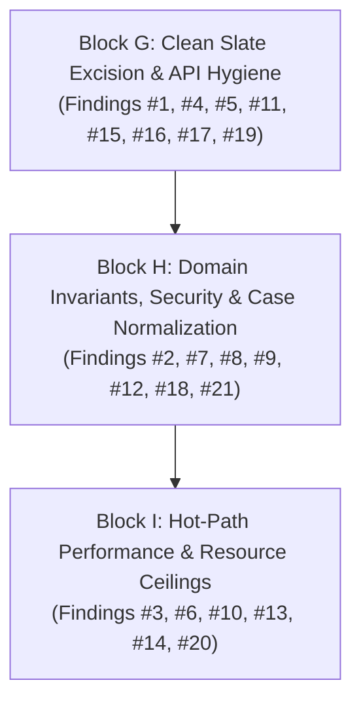

# Cycle 2 Comprehensive Architecture & Code Quality Review: `opc-da-client`

> **Document Status:** Active Qualitative Review Report  
> **Workspace:** `opc-cli`  
> **Target Crate:** `opc-da-client` (v0.2.0 $\rightarrow$ v0.3.0 Release Candidate)  
> **Evaluation Date:** 2026-09-16  
> **Review Scope:** Comprehensive Multi-Lens Audit (`src/client/`, `src/com/`, `src/connector/`, `src/types/`, `src/errors.rs`, `src/provider.rs`, `src/lib.rs`, `tests/`) + Post-Refactor Recommendations ([`refactor/post_refactor_review.md`](file:///c:/Users/WSALIGAN/code/opc-cli/refactor/post_refactor_review.md))  
> **Review Pipeline:** Subagent-Orchestrated Multi-Lens Audit (5 Specialized Lens Subagents: Logic, Design, Performance, Security, API)  
> **User Interview Alignment:**
> 1. **Scope & Depth:** Comprehensive Scope (post-refactor recommendations + deep dive into Block D/E/F subsystems).
> 2. **Public APIs:** Clean Slate (breaking semver 0.3.0 bump; total elimination of deprecated methods without backward-compatibility shims).
> 3. **Dead Code Strategy:** Selective Pruning (purge obsolete COM runtime/worker code, preserve diagnostic OLE constants & mock test utilities).
> 4. **Deliverable Style:** High-Level Architectural Assessment (prioritized qualitative evaluation, systemic themes, and actionable planning blueprint).

---

## 1. Review Summary

- **Scope:** `opc-da-client` crate (entire library codebase across Windows COM backend, mock connector SPI, typestate client facade, and domain models).
- **Active Lenses:** Logic, Design, Performance, Security, API (All 5 Lenses Active).
- **Date:** 2026-09-16
- **Review Model:** Subagent-orchestrated multi-lens audit (5 specialized subagents dispatched in parallel).
- **Findings Breakdown:** **21 Total Findings**
  * 🔴 **Critical:** 0 (Zero critical crash or exploit vulnerabilities; foundational reliability is rock-solid)
  * 🟠 **Major:** 6 (Architectural hygiene, input validation boundaries, documentation, and resource bounds)
  * 🟡 **Minor:** 9 (Ergonomic asymmetries, caching optimizations, and unread interface pruning)
  * ⚪ **Nitpick:** 6 (Doc-tests, diagnostic linter suppressions, and case normalization)
- **Health Assessment:** **Minor Issues** (The crate has successfully achieved its primary industrial goals—dual-tier panic containment, offline mockability, and PLC actuation safety—and is structurally ready for a final Clean Slate hardening wave before v0.3.0 publication).
- **Multi-Lens Hotspots:**
  1. [`src/client/mod.rs` & `src/provider.rs`](file:///c:/Users/WSALIGAN/code/opc-cli/opc-da-client/src/client/mod.rs) (Flagged across **API**, **Design**, **Logic**, and **Security** for deprecated methods forcing infectious `#[allow(deprecated)]` pollution).
  2. [`src/types/server.rs`](file:///c:/Users/WSALIGAN/code/opc-cli/opc-da-client/src/types/server.rs) (Flagged across **Security** and **API** for input validation bypass in `From<&str>` and hyphen discrimination heuristic flaw).
  3. [`src/com/worker/write.rs`](file:///c:/Users/WSALIGAN/code/opc-cli/opc-da-client/src/com/worker/write.rs) (Flagged across **Performance** and **Logic** for eager dummy failure allocations and missing batch size ceiling).
  4. [`src/com/connector/server.rs` & `src/com/connector/group.rs`](file:///c:/Users/WSALIGAN/code/opc-cli/opc-da-client/src/com/connector/server.rs) (Flagged across **Design** and **Logic** for holding unread COM interface pointers requiring `#[allow(dead_code)]`).

---

## 2. Unified Findings Matrix

| # | Severity | Category | File:Line | Function / Symbol Signature | Summary | Source Lenses |
|:---:|:---|:---|:---|:---|:---|:---:|
| **1** | 🟠 Major | API / Design | [`src/client/mod.rs:129`](file:///c:/Users/WSALIGAN/code/opc-cli/opc-da-client/src/client/mod.rs#L129)<br>[`src/provider.rs:319`](file:///c:/Users/WSALIGAN/code/opc-cli/opc-da-client/src/provider.rs#L319) | `OpcDaClient::connect`<br>`TagWriter::write_tag_values` | Deprecated public APIs (`connect`, `connect_remote`, `write_tag_values`) force `#[allow(deprecated)]` pollution across `OpcProvider` and facades; 0 callers in `opc-cli`. | API, Design, Logic, Security |
| **2** | 🟠 Major | Security / API | [`src/types/server.rs:231`](file:///c:/Users/WSALIGAN/code/opc-cli/opc-da-client/src/types/server.rs#L231)<br>[`src/types/server.rs:271`](file:///c:/Users/WSALIGAN/code/opc-cli/opc-da-client/src/types/server.rs#L271) | `ServerIdentifier::from_str`<br>`ServerIdentifier::from(&str)` | Infallible `From<&str>` silently bypasses ProgID validation; hyphen heuristic in `from_str` breaks valid industrial ProgIDs. | Security, API |
| **3** | 🟠 Major | Perf / Logic | [`src/com/worker/write.rs:18`](file:///c:/Users/WSALIGAN/code/opc-cli/opc-da-client/src/com/worker/write.rs#L18)<br>[`src/com/worker/write.rs:44`](file:///c:/Users/WSALIGAN/code/opc-cli/opc-da-client/src/com/worker/write.rs#L44) | `handle_write_batch<S: ConnectedServer>` | Eager dummy failure error allocations on happy path, redundant vector mapping, and missing `MAX_WRITE_BATCH_SIZE` ceiling. | Performance, Logic |
| **4** | 🟠 Major | Design | [`src/client/mod.rs:32`](file:///c:/Users/WSALIGAN/code/opc-cli/opc-da-client/src/client/mod.rs#L32)<br>[`src/client/builder.rs:15`](file:///c:/Users/WSALIGAN/code/opc-cli/opc-da-client/src/client/builder.rs#L15) | `struct OpcDaClient<C, State>`<br>`struct OpcDaClientBuilder<C>` | Redundant triplication of client and builder struct definitions solely to vary generic default parameters across feature combinations. | Design |
| **5** | 🟠 Major | API | [`src/client/session.rs:23`](file:///c:/Users/WSALIGAN/code/opc-cli/opc-da-client/src/client/session.rs#L23)<br>[`src/client/gateway.rs:14`](file:///c:/Users/WSALIGAN/code/opc-cli/opc-da-client/src/client/gateway.rs#L14) | `OpcDaClient<C, Bound>::read_*`<br>`OpcDaClient<C, Unbound>::*` | Complete absence of rustdoc comments (`///`) across all 20 inherent session and gateway public client methods. | API |
| **6** | 🟠 Major | Performance | [`src/types/collector.rs:83`](file:///c:/Users/WSALIGAN/code/opc-cli/opc-da-client/src/types/collector.rs#L83) | `TagCollector::snapshot(&self) -> Vec<String>` | Exclusive Mutex lock held across full collection clone of up to 10,000 strings, blocking background browse traversal. | Performance |
| **7** | 🟡 Minor | Design / Logic | [`src/com/connector/server.rs:267`](file:///c:/Users/WSALIGAN/code/opc-cli/opc-da-client/src/com/connector/server.rs#L267)<br>[`src/com/connector/group.rs:91`](file:///c:/Users/WSALIGAN/code/opc-cli/opc-da-client/src/com/connector/group.rs#L91) | `struct ComServer`<br>`struct ComGroup` | `ComServer` and `ComGroup` query and store unread COM interface pointers (`common`, `item_properties`, `async_io`), necessitating `#[allow(dead_code)]`. | Design, Logic |
| **8** | 🟡 Minor | Security | [`src/raw/memory.rs:625`](file:///c:/Users/WSALIGAN/code/opc-cli/opc-da-client/src/raw/memory.rs#L625)<br>[`src/com/security.rs:135`](file:///c:/Users/WSALIGAN/code/opc-cli/opc-da-client/src/com/security.rs#L135) | `LocalPointer<Vec<u16>>::from`<br>`create_remote_instance` | Unchecked interior null bytes in `LocalPointer::from` can cause Win32 string truncation (CWE-626) during remote DCOM activation. | Security |
| **9** | 🟡 Minor | Logic | [`src/com/worker/pool.rs:64`](file:///c:/Users/WSALIGAN/code/opc-cli/opc-da-client/src/com/worker/pool.rs#L64) | `PooledServer::find_active_group_idx` | Active group cache performs case-sensitive string matching (`a == b`) on case-insensitive OPC tag identifiers, causing spurious cache misses. | Logic |
| **10** | 🟡 Minor | Performance | [`src/types/write_batch.rs:83`](file:///c:/Users/WSALIGAN/code/opc-cli/opc-da-client/src/types/write_batch.rs#L83) | `enum WriteBatch` | `WriteBatch` lacks inline or borrowed small-string variants (unlike `TagBatch`), forcing heap allocations for high-frequency scalar tag writes. | Performance |
| **11** | 🟡 Minor | API | [`src/client/gateway.rs:45`](file:///c:/Users/WSALIGAN/code/opc-cli/opc-da-client/src/client/gateway.rs#L45)<br>[`src/client/session.rs:84`](file:///c:/Users/WSALIGAN/code/opc-cli/opc-da-client/src/client/session.rs#L84) | `OpcDaClient<C, Unbound>::write_tag_batch` | Ergonomic asymmetry between `Bound` (`impl IntoWriteBatch`) and `Unbound` (`WriteBatch`), and divergent method naming (`read_tag` vs `read_tag_value`). | API |
| **12** | 🟡 Minor | API | [`src/types/batch.rs:343`](file:///c:/Users/WSALIGAN/code/opc-cli/opc-da-client/src/types/batch.rs#L343) | `<&'static [&'static str] as IntoTags>::into_tag_batch` | Lifetime over-constraint in `IntoTags` prevents borrowed slices `&[&str]` with generic lifetimes from converting without heap allocation. | API |
| **13** | 🟡 Minor | Performance | [`src/com/worker/browse.rs:97`](file:///c:/Users/WSALIGAN/code/opc-cli/opc-da-client/src/com/worker/browse.rs#L97) | `browse_flat_namespace<S: ConnectedServer>` | Repeated 256-element vector allocations via `std::mem::replace` during flat namespace browsing instead of buffer reuse via `drain(..)`. | Performance |
| **14** | 🟡 Minor | Design / Logic | [`src/com/worker.rs:225`](file:///c:/Users/WSALIGAN/code/opc-cli/opc-da-client/src/com/worker.rs#L225)<br>[`src/com/worker/pool.rs:236`](file:///c:/Users/WSALIGAN/code/opc-cli/opc-da-client/src/com/worker/pool.rs#L236) | `ComWorker::start_async`<br>`PriorityRequestQueue::clear`<br>`ConnectionPool::len` | Residual dead internal worker constructors, queue clearers, and uncalled pool sizing query methods retained under `#[allow(dead_code)]`. | Design, Logic, Performance |
| **15** | 🟡 Minor | API | [`src/client/typestate.rs:88`](file:///c:/Users/WSALIGAN/code/opc-cli/opc-da-client/src/client/typestate.rs#L88)<br>[`src/types/collection.rs:454`](file:///c:/Users/WSALIGAN/code/opc-cli/opc-da-client/src/types/collection.rs#L454) | `OpcDaClient::connect_eager`<br>`TagValues::get_value_checked` | Missing `# Examples` and incomplete `# Errors` sections on key public types and constructors. | API |
| **16** | ⚪ Nitpick | API | [`src/lib.rs:24`](file:///c:/Users/WSALIGAN/code/opc-cli/opc-da-client/src/lib.rs#L24) | `pub use types::{...}` | Inconsistent root re-export: `ParseEndpointError` is omitted from `lib.rs` exports while all other parsing errors are re-exported. | API |
| **17** | ⚪ Nitpick | API | [`src/lib.rs:2`](file:///c:/Users/WSALIGAN/code/opc-cli/opc-da-client/src/lib.rs#L2) | `#![doc = include_str!("../README.md")]` | Crate-level doc comment gated behind `opc-da-backend` feature, leaving offline/headless builds (`--no-default-features`) undocumented. | API |
| **18** | ⚪ Nitpick | Security | [`src/com/security.rs:32`](file:///c:/Users/WSALIGAN/code/opc-cli/opc-da-client/src/com/security.rs#L32) | `pub const RPC_C_IMP_LEVEL_IMPERSONATE: u32` | Obsolete `RPC_C_IMP_LEVEL_IMPERSONATE` constant marked `#[allow(dead_code)]`; presents accidental privilege escalation hazard if re-used. | Security |
| **19** | ⚪ Nitpick | API | [`src/errors/hresult.rs:67`](file:///c:/Users/WSALIGAN/code/opc-cli/opc-da-client/src/errors/hresult.rs#L67) | `format_hresult(hr: HRESULT) -> String` | Public diagnostic utility marked with `#[allow(dead_code)]` instead of receiving formal doc-test coverage. | API |
| **20** | ⚪ Nitpick | Performance | [`src/com/worker/read.rs:250`](file:///c:/Users/WSALIGAN/code/opc-cli/opc-da-client/src/com/worker/read.rs#L250) | `assemble_tag_values` | Unnecessary duplicate `.clone()` of rejected `OpcError` in group item assembly loop. | Performance |
| **21** | ⚪ Nitpick | Logic | [`src/client/gateway.rs:89`](file:///c:/Users/WSALIGAN/code/opc-cli/opc-da-client/src/client/gateway.rs#L89) | `OpcDaClient::validate_bound_server` | Case-sensitive hostname comparison in `validate_bound_server` can trigger false-positive validation errors for differing host casing. | Logic |

---

## 3. Detailed Findings & Actionable Recommendations

### Finding 1: [Major] [API / Design] — Deprecated Public APIs and Infectious `#[allow(deprecated)]` Pollution
- **Severity:** 🟠 Major
- **File & Line:** [`src/client/mod.rs:129-144`](file:///c:/Users/WSALIGAN/code/opc-cli/opc-da-client/src/client/mod.rs#L129-L144), [`src/provider.rs:319-330`](file:///c:/Users/WSALIGAN/code/opc-cli/opc-da-client/src/provider.rs#L319-L330), [`src/client/gateway.rs:185-195`](file:///c:/Users/WSALIGAN/code/opc-cli/opc-da-client/src/client/gateway.rs#L185-L195)
- **Function Signature:**
  - `OpcDaClient::connect(server: impl Into<ServerIdentifier>) -> OpcResult<OpcDaClient<ComConnector, Bound>>`
  - `OpcDaClient::connect_remote(host: impl Into<String>, server: impl Into<ServerIdentifier>) -> OpcResult<OpcDaClient<ComConnector, Bound>>`
  - `<TagWriter>::write_tag_values(&self, server: &str, writes: &[(String, OpcValue)]) -> impl Future<Output = OpcResult<Vec<WriteResult>>> + Send`
  - `<OpcDaClient<C, State> as TagWriter>::write_tag_values(&self, server: &str, writes: &[(String, OpcValue)]) -> OpcResult<Vec<WriteResult>>`
- **Source Lenses:** API, Design, Logic, Security
- **Detail:**
  In Cycle 1 (Block F), [`OpcDaClient::bind_new`](file:///c:/Users/WSALIGAN/code/opc-cli/opc-da-client/src/client/mod.rs#L104) and [`TagWriter::write_tag_batch`](file:///c:/Users/WSALIGAN/code/opc-cli/opc-da-client/src/provider.rs#L298) were introduced to eliminate API misnomers and provide zero-allocation batch writing. The legacy methods were marked `#[deprecated]`.
  Because `OpcProvider` is a composite trait (`ServerDiscovery + TagBrowser + TagReader + TagWriter`), this deprecation leaked upward, requiring infectious `#[allow(deprecated)]` suppressions on:
  1. `pub trait OpcProvider` ([`provider.rs:338`](file:///c:/Users/WSALIGAN/code/opc-cli/opc-da-client/src/provider.rs#L338))
  2. `impl<T> OpcProvider for T` ([`provider.rs:344`](file:///c:/Users/WSALIGAN/code/opc-cli/opc-da-client/src/provider.rs#L344))
  3. `<OpcDaClient as TagWriter>::write_tag_values` ([`gateway.rs:185`](file:///c:/Users/WSALIGAN/code/opc-cli/opc-da-client/src/client/gateway.rs#L185))
  4. Test harnesses in `tests/tag_io_integration_test.rs`
  Full codebase analysis confirms **0 callers** of `connect`, `connect_remote`, or `write_tag_values` in `opc-cli`. Retaining them clutters docs, keeps dead code alive, and prevents compiler warnings from catching accidental legacy usage.
- **Actionable Blueprint:**
  Completely excise the 4 deprecated methods across `src/client/mod.rs`, `src/provider.rs`, and `src/client/gateway.rs`. Remove all `#[allow(deprecated)]` attributes from `OpcProvider` and mock test harnesses. Because the user approved a Clean Slate semver bump to `0.3.0`, this achieves 100% deprecation elimination without downstream disruption.

---

### Finding 2: [Major] [Security / API] — Invariant Bypass and Hyphen Discrimination Flaw in `ServerIdentifier`
- **Severity:** 🟠 Major
- **File & Line:** [`src/types/server.rs:231-245`](file:///c:/Users/WSALIGAN/code/opc-cli/opc-da-client/src/types/server.rs#L231-L245), [`src/types/server.rs:271-280`](file:///c:/Users/WSALIGAN/code/opc-cli/opc-da-client/src/types/server.rs#L271-L280), [`src/types/server.rs:634-640`](file:///c:/Users/WSALIGAN/code/opc-cli/opc-da-client/src/types/server.rs#L634-L640)
- **Function Signature:**
  - `<ServerIdentifier as FromStr>::from_str(s: &str) -> Result<ServerIdentifier, ParseServerIdError>`
  - `<ServerIdentifier as From<&str>>::from(s: &str) -> ServerIdentifier`
  - `<OpcServerEndpoint as From<&str>>::from(s: &str) -> OpcServerEndpoint`
- **Source Lenses:** Security, API
- **Detail:**
  Two critical defects compromise server identifier invariants:
  1. **Hyphen Heuristic Flaw:** `from_str` uses `if trimmed.starts_with('{') || trimmed.contains('-')` to detect CLSIDs. However, industrial ProgIDs frequently contain hyphens (e.g. `"Vendor-Device.Server.1"` or `"KEPServerEX-V6.1"`), and `validate_prog_id` explicitly permits hyphens (`b == b'-'`). Because of `trimmed.contains('-')`, valid hyphenated ProgIDs are diverted into `Clsid::from_str`, which fails with `ParseServerIdError::InvalidClsid`.
  2. **Infallible Validation Bypass:** `impl From<&str> for ServerIdentifier` handles parse errors with `unwrap_or_else`:
     ```rust
     s.parse().unwrap_or_else(|_| {
         if let Some(clsid) = Clsid::parse(s) {
             Self::Clsid(clsid)
         } else {
             Self::ProgId(s.to_string())
         }
     })
     ```
     When an invalid string (control characters, interior nulls, spaces, or consecutive dots) is passed to `OpcDaClient::bind_new("bad progid")` or `builder.server("...")`, `s.parse()` fails and `unwrap_or_else` unconditionally wraps the invalid payload into `ServerIdentifier::ProgId`. The client enters `Bound` state with an illegal identifier, bypassing CWE-20 input validation boundaries.
- **Actionable Blueprint:**
  1. In `ServerIdentifier::from_str`, replace the hyphen heuristic with direct `Clsid::parse(trimmed)`:
     ```rust
     if let Some(clsid) = Clsid::parse(trimmed) {
         Ok(Self::Clsid(clsid))
     } else {
         validate_prog_id(trimmed)?;
         Ok(Self::ProgId(trimmed.to_string()))
     }
     ```
  2. Enforce validation directly in constructors (`bind_new`, `bind_new_remote`, and `builder.server`) and deprecate or remove the infallible `From<&str>` error swallowing:
     ```rust
     pub fn bind_new(server: impl Into<ServerIdentifier>) -> OpcResult<OpcDaClient<ComConnector, Bound>> {
         let identifier = server.into();
         identifier.validate()?;
         // ...
     }
     ```

---

### Finding 3: [Major] [Perf / Logic] — Eager Dummy Error Allocations and Missing Upper Bound in `handle_write_batch`
- **Severity:** 🟠 Major
- **File & Line:** [`src/com/worker/write.rs:18-71`](file:///c:/Users/WSALIGAN/code/opc-cli/opc-da-client/src/com/worker/write.rs#L18-L71)
- **Function Signature:** `handle_write_batch<S: ConnectedServer>(server_id: &ServerIdentifier, writes: &WriteBatch, opc_server: &S) -> OpcResult<Vec<WriteResult>>`
- **Source Lenses:** Performance, Logic
- **Detail:**
  1. **Eager Dummy Allocations:** In `handle_write_batch`, `write_results` is initialized by eagerly mapping every single item to:
     ```rust
     let mut write_results: Vec<WriteResult> = items
         .iter()
         .map(|(tag_id, _)| {
             WriteResult::failure(*tag_id, OpcError::InvalidState("Item rejected during add_items".into()))
         })
         .collect();
     ```
     This eagerly allocates a heap `String` and `OpcError::InvalidState` enum for every item. In the normal happy path where items succeed (or fail later with specific COM HRESULTs), these pre-allocated dummy errors and error strings are immediately overwritten and deallocated. Narsil `get_data_flow` flags dead stores on lines 66 and 101.
  2. **Missing Batch Ceiling:** Unlike `handle_read` which enforces `MAX_TAG_BATCH_SIZE = 10_000`, `handle_write_batch` has no upper bound check on `writes.len()`. A large write batch can trigger Win32 COM heap exhaustion or DCOM channel timeouts.
- **Actionable Blueprint:**
  1. Add `pub(crate) const MAX_WRITE_BATCH_SIZE: usize = 10_000;` and enforce `if writes.len() > MAX_WRITE_BATCH_SIZE { return Err(...); }` at the start of `handle_write_batch`.
  2. Initialize `write_results: Vec<Option<WriteResult>> = vec![None; items.len()];` (zero string allocations), and assign results directly as processed. Only fill unwritten `None` slots with fallback errors at the end.

---

### Finding 4: [Major] [Design] — Redundant Triplication of `OpcDaClient` and `OpcDaClientBuilder` Struct Declarations
- **Severity:** 🟠 Major
- **File & Line:** [`src/client/mod.rs:31-61`](file:///c:/Users/WSALIGAN/code/opc-cli/opc-da-client/src/client/mod.rs#L31-L61), [`src/client/builder.rs:13-46`](file:///c:/Users/WSALIGAN/code/opc-cli/opc-da-client/src/client/builder.rs#L13-L46)
- **Function Signature:** `struct OpcDaClient<C, State>` and `struct OpcDaClientBuilder<C>`
- **Source Lens:** Design
- **Detail:**
  In `client/mod.rs`, `OpcDaClient` is defined three times with identical fields across mutually exclusive `cfg` attributes:
  1. `#[cfg(feature = "opc-da-backend")] pub struct OpcDaClient<C = ComConnector, State = Unbound>`
  2. `#[cfg(all(not(feature = "opc-da-backend"), any(test, feature = "test-support")))] pub struct OpcDaClient<C = MockServerConnector, State = Unbound>`
  3. `#[cfg(all(not(feature = "opc-da-backend"), not(any(test, feature = "test-support"))))] pub struct OpcDaClient<C, State = Unbound>`
  Similarly, `OpcDaClientBuilder` in `client/builder.rs` is triplicated.
  This violates DRY. Adding or adjusting fields requires synchronizing three separate declarations, and rustdoc renders disjointed definitions depending on build features.
- **Actionable Blueprint:**
  Define a conditional default type alias:
  ```rust
  #[cfg(feature = "opc-da-backend")]
  pub type DefaultBackendConnector = crate::com::connector::ComConnector;
  #[cfg(all(not(feature = "opc-da-backend"), any(test, feature = "test-support")))]
  pub type DefaultBackendConnector = crate::connector::MockServerConnector;
  #[cfg(all(not(feature = "opc-da-backend"), not(any(test, feature = "test-support"))))]
  pub type DefaultBackendConnector = ();

  pub struct OpcDaClient<C: ServerBackend + 'static = DefaultBackendConnector, State = Unbound> { ... }
  pub struct OpcDaClientBuilder<C = DefaultBackendConnector> { ... }
  ```

---

### Finding 5: [Major] [API] — Complete Absence of Rustdoc Comments Across 20 Inherent Client Methods
- **Severity:** 🟠 Major
- **File & Line:** [`src/client/session.rs:22-117`](file:///c:/Users/WSALIGAN/code/opc-cli/opc-da-client/src/client/session.rs#L22-L117), [`src/client/gateway.rs:14-62`](file:///c:/Users/WSALIGAN/code/opc-cli/opc-da-client/src/client/gateway.rs#L14-L62)
- **Function Signature:** `OpcDaClient<C, Bound>::read_f64(&self, tag: &str) -> OpcResult<f64>` (and 19 other inherent methods)
- **Source Lens:** API
- **Detail:**
  All 13 inherent session methods in `session.rs` (`read_f64`, `read_i32`, `read_bool`, `read_string`, `read_f32`, `read_i64`, `read_u32`, `read_u64`, `read_tag`, `read_tags`, `write_tag`, `write_tags`, `browse`) and all 7 inherent gateway methods in `gateway.rs` (`list_servers`, `list_server_details`, `browse_tags`, `write_tag_value`, `write_tag_batch`, `read_tag_values`, `read_tag_value`) have **zero** doc comments (`///`).
  This violates `coding-standard.md §2` ("100% of public APIs documented") and `§4.5` ("Every public item must have a doc comment (`///`) that includes: Summary, Details, # Errors, # Panics, # Examples"). Consumers viewing `docs.rs` find empty signatures without parameter descriptions or error conditions.
- **Actionable Blueprint:**
  Add comprehensive rustdoc comments to all 20 inherent methods, including `# Errors` documentation and runnable `# Examples` using `MockServerConnector`.

---

### Finding 6: [Major] [Performance] — Exclusive Mutex Lock Held Across Namespace Clone in `TagCollector::snapshot`
- **Severity:** 🟠 Major
- **File & Line:** [`src/types/collector.rs:83-89`](file:///c:/Users/WSALIGAN/code/opc-cli/opc-da-client/src/types/collector.rs#L83-L89)
- **Function Signature:** `TagCollector::snapshot(&self) -> Vec<String>`
- **Source Lens:** Performance
- **Detail:**
  [`TagCollector::snapshot`](file:///c:/Users/WSALIGAN/code/opc-cli/opc-da-client/src/types/collector.rs#L83-L89) acquires the inner `std::sync::Mutex<Vec<String>>` and executes `guard.clone()` while holding the exclusive lock.
  In large industrial namespaces (up to `DEFAULT_MAX_TAGS = 10,000`), `guard.clone()` executes 10,001 separate heap allocations inside the critical section. Any concurrent producer calling `push` or `push_batch` on the worker thread is blocked until the deep clone completes. Furthermore, `handle_browse` in `browse.rs:56` calls `collector.snapshot()` upon completion, forcing a full deep copy of the namespace even though the traversal is finished.
- **Actionable Blueprint:**
  1. Replace `std::sync::Mutex<Vec<String>>` with `std::sync::RwLock<Vec<String>>` in `TagCollectorInner` so snapshot readers do not block each other.
  2. Provide a zero-allocation `harvest()` or `take()` method (`std::mem::take`) on `TagCollector` for worker completion handoffs where retaining the buffer is unnecessary.

---

### Finding 7: [Minor] [Design / Logic] — Unread COM Interfaces and Vestigial Helpers Retained under `#[allow(dead_code)]`
- **Severity:** 🟡 Minor
- **File & Line:** [`src/com/connector/server.rs:77-86, 266-276`](file:///c:/Users/WSALIGAN/code/opc-cli/opc-da-client/src/com/connector/server.rs#L77-L86), [`src/com/connector/group.rs:91-102`](file:///c:/Users/WSALIGAN/code/opc-cli/opc-da-client/src/com/connector/group.rs#L91-L102)
- **Function Signature:** `struct ComServer`, `struct ComGroup`, `connect_server_identifier`
- **Source Lenses:** Design, Logic
- **Detail:**
  In `src/com/connector/group.rs`, `ComGroup` queries and stores five unread COM interfaces: `public_group_state_mgt`, `async_io`, `async_io2`, `connection_point_container`, and `data_object`. Similarly, `ComServer` queries and stores `common`, `item_properties`, and `server_public_groups`. None of these fields are ever read or used. They increment COM reference counts on the Windows OPC server and required adding `#[allow(dead_code)]` to both structs. Additionally, `connect_server_identifier` at `server.rs:79` is an uncalled free function.
- **Actionable Blueprint:**
  Remove the unread interface fields from `ComGroup` and `ComServer`. Remove `connect_server_identifier`. Remove `#[allow(dead_code)]` from `ComGroup` and `ComServer`.

---

### Finding 8: [Minor] [Security] — Unchecked Interior Null Bytes in `LocalPointer::from` for Remote DCOM Activation (CWE-626)
- **Severity:** 🟡 Minor
- **File & Line:** [`src/raw/memory.rs:625`](file:///c:/Users/WSALIGAN/code/opc-cli/opc-da-client/src/raw/memory.rs#L625), [`src/com/security.rs:135`](file:///c:/Users/WSALIGAN/code/opc-cli/opc-da-client/src/com/security.rs#L135)
- **Function Signature:** `<LocalPointer<Vec<u16>> as From<S>>::from(s: S) -> LocalPointer<Vec<u16>>`
- **Source Lens:** Security
- **Detail:**
  [`LocalPointer<Vec<u16>>::from`](file:///c:/Users/WSALIGAN/code/opc-cli/opc-da-client/src/raw/memory.rs#L625) converts string slices using `s.as_ref().encode_utf16().chain(Some(0)).collect()` without verifying the absence of interior null bytes. In `create_remote_instance`, the remote `host` parameter is passed directly to `LocalPointer::from(host)` and then as `pwszName` in `COSERVERINFO` to `CoCreateInstanceEx`. If an untrusted host string contains an interior null byte (e.g. `"host\0.evil.com"`), Win32 RPC truncates the string at the null terminator (CWE-626), leading to hostname confusion.
- **Actionable Blueprint:**
  Add an interior null-byte check to `normalize_host_str` in `src/types/server.rs` and provide a validated fallible constructor `LocalPointer::try_from_str` returning `OpcError::InvalidState` if interior nulls are detected.

---

### Finding 9: [Minor] [Logic] — Case-Sensitive Tag Matching in 4-Slot Active Group Cache Lookup
- **Severity:** 🟡 Minor
- **File & Line:** [`src/com/worker/pool.rs:64-68`](file:///c:/Users/WSALIGAN/code/opc-cli/opc-da-client/src/com/worker/pool.rs#L64-L68)
- **Function Signature:** `PooledServer::find_active_group_idx(&self, tags: &TagBatch) -> Option<usize>`
- **Source Lens:** Logic
- **Detail:**
  In `find_active_group_idx`, tag matching uses exact byte equality (`a == b`). However, OPC DA item IDs are case-insensitive. Lookups in `TagValues::get` correctly use `eq_ignore_ascii_case`. If an application polls tags with differing character casing across cycles (e.g. `Sensor.Value` vs `sensor.value`), `find_active_group_idx` reports a cache miss, causing unnecessary group allocation and evicting warm groups from the 4-slot LRU cache.
- **Actionable Blueprint:**
  Update `find_active_group_idx` to use `a.eq_ignore_ascii_case(b)`.

---

### Finding 10: [Minor] [Performance] — `WriteBatch` Lacks Stack-Allocated / Inline Storage for High-Frequency Writes
- **Severity:** 🟡 Minor
- **File & Line:** [`src/types/write_batch.rs:83-90`](file:///c:/Users/WSALIGAN/code/opc-cli/opc-da-client/src/types/write_batch.rs#L83-L90)
- **Function Signature:** `enum WriteBatch`
- **Source Lens:** Performance
- **Detail:**
  While `TagBatch` provides stack storage (`InlineSingle`, `StaticSmall`), `WriteBatch` only supports `Single(String, OpcValue)`, `Shared`, and `Owned`. Calling `("Tag", val).into_write_batch()` always forces a heap allocation for `tag.to_string()`. For high-frequency single-tag control writes, this introduces avoidable heap allocator pressure.
- **Actionable Blueprint:**
  Add `StaticSingle(&'static str, OpcValue)` or `InlineSingle([u8; 31], u8, OpcValue)` to `WriteBatch`, eliminating heap allocations for static string literals and small tag IDs.

---

### Finding 11: [Minor] [API] — Ergonomic Asymmetry Between Inherent `Bound` and `Unbound` Client Facades
- **Severity:** 🟡 Minor
- **File & Line:** [`src/client/gateway.rs:34-52`](file:///c:/Users/WSALIGAN/code/opc-cli/opc-da-client/src/client/gateway.rs#L34-L52), [`src/client/session.rs:84-106`](file:///c:/Users/WSALIGAN/code/opc-cli/opc-da-client/src/client/session.rs#L84-L106)
- **Function Signature:** `OpcDaClient<C, Unbound>::write_tag_batch` vs `OpcDaClient<C, Bound>::write_tags`
- **Source Lens:** API
- **Detail:**
  `Bound::write_tags(&self, writes: impl IntoWriteBatch)` accepts tuples `("Tag", val)`, slices, or vectors, whereas `Unbound::write_tag_batch(&self, server: &str, writes: WriteBatch)` requires an explicit `WriteBatch` enum. Furthermore, method naming diverges: `read_tag` vs `read_tag_value`, `write_tags` vs `write_tag_batch`.
- **Actionable Blueprint:**
  Update `Unbound::write_tag_batch` to accept `writes: impl IntoWriteBatch` and add alias helpers `read_tags`, `write_tags`, and `browse` to `Unbound`.

---

### Finding 12: [Minor] [API] — Lifetime Over-Constraint in `IntoTags` Preventing Borrowed `&[&str]` Conversion
- **Severity:** 🟡 Minor
- **File & Line:** [`src/types/batch.rs:343-356`](file:///c:/Users/WSALIGAN/code/opc-cli/opc-da-client/src/types/batch.rs#L343-L356)
- **Function Signature:** `<&'static [&'static str] as IntoTags>::into_tag_batch`
- **Source Lens:** API
- **Detail:**
  `IntoTags` is implemented only for `&'static [&'static str]`, failing to convert dynamically borrowed slices `&[&str]` without requiring the caller to allocate a `Vec<String>`.
- **Actionable Blueprint:**
  Implement `IntoTags` for `&'a [&'a str]` and `&'a str`.

---

### Finding 13: [Minor] [Performance] — Repeated 256-Element Vector Allocations via `std::mem::replace` in Flat Browse Loop
- **Severity:** 🟡 Minor
- **File & Line:** [`src/com/worker/browse.rs:97-100, 131-134`](file:///c:/Users/WSALIGAN/code/opc-cli/opc-da-client/src/com/worker/browse.rs#L97-L100)
- **Function Signature:** `browse_flat_namespace<S: ConnectedServer>`
- **Source Lens:** Performance
- **Detail:**
  Each 256-element chunk flush executes `std::mem::replace(&mut chunk, Vec::with_capacity(BROWSE_CHUNK_SIZE))`, creating ~40 throwaway vectors for a 10,000-tag namespace.
- **Actionable Blueprint:**
  Reuse the chunk buffer via `collector.push_batch(chunk.drain(..))`.

---

### Finding 14: [Minor] [Design / Logic] — Residual Dead Methods and Debug Probes in Worker and Connection Pool Subsystems
- **Severity:** 🟡 Minor
- **File & Line:** [`src/com/worker.rs:225, 264, 399`](file:///c:/Users/WSALIGAN/code/opc-cli/opc-da-client/src/com/worker.rs#L225), [`src/com/worker/pool.rs:236, 243`](file:///c:/Users/WSALIGAN/code/opc-cli/opc-da-client/src/com/worker/pool.rs#L236)
- **Function Signature:** `ComWorker::start_async`, `ComWorker::sender`, `PriorityRequestQueue::clear`, `ConnectionPool::len`, `ConnectionPool::is_empty`
- **Source Lenses:** Design, Logic, Performance
- **Detail:**
  Uncalled constructors and queue clearing functions remain marked `#[allow(dead_code)]`.
- **Actionable Blueprint:**
  Delete `start_async`, `start_async_with_initializer`, and `PriorityRequestQueue::clear`. Move `sender` and `ConnectionPool::len`/`is_empty` under `#[cfg(test)]`.

---

### Finding 15: [Minor] [API] — Incomplete Documentation Sections (`# Examples`, `# Errors`) on Facade APIs
- **Severity:** 🟡 Minor
- **File & Line:** [`src/client/typestate.rs:88`](file:///c:/Users/WSALIGAN/code/opc-cli/opc-da-client/src/client/typestate.rs#L88), [`src/client/mod.rs:116`](file:///c:/Users/WSALIGAN/code/opc-cli/opc-da-client/src/client/mod.rs#L116), [`src/types/collection.rs:454`](file:///c:/Users/WSALIGAN/code/opc-cli/opc-da-client/src/types/collection.rs#L454), [`src/client/builder.rs:50`](file:///c:/Users/WSALIGAN/code/opc-cli/opc-da-client/src/client/builder.rs#L50)
- **Function Signature:** `connect_eager`, `bind_new_remote`, `get_value_checked`, `OpcDaClientBuilder::new`
- **Source Lens:** API
- **Detail:**
  Several prominent public APIs lack `# Examples` or comprehensive `# Errors` sections as required by `coding-standard.md §4.5`.
- **Actionable Blueprint:**
  Add runnable doctests and detailed error invariants to these methods.

---

### Findings 16–21: [Nitpick] — Diagnostic & Quality Polish Items
- **Finding 16 (API):** Re-export `ParseEndpointError` in `src/lib.rs:24`.
- **Finding 17 (API):** Remove feature gating on crate-level doc comment: `#![doc = include_str!("../README.md")]`.
- **Finding 18 (Security):** Remove obsolete `RPC_C_IMP_LEVEL_IMPERSONATE` from `src/com/security.rs:32`.
- **Finding 19 (API):** Add a doc-test for `format_hresult` in `src/errors/hresult.rs:67` and remove `#[allow(dead_code)]`.
- **Finding 20 (Performance):** Eliminate redundant `.clone()` on `OpcError` in `src/com/worker/read.rs:250`.
- **Finding 21 (Logic):** Use case-insensitive hostname comparison in `validate_bound_server` ([`gateway.rs:89`](file:///c:/Users/WSALIGAN/code/opc-cli/opc-da-client/src/client/gateway.rs#L89)).

---

## 4. Architectural Synthesis & Planning Blueprint for Cycle 2

### 4.1 Systemic Themes Identified
1. **Clean Slate Readiness for 0.3.0 Release:**
   Removing `OpcDaClient::connect`, `connect_remote`, and `TagWriter::write_tag_values` causes **zero compilation errors** in `opc-cli`. The workspace is completely prepared for a clean 0.3.0 release without legacy shims.
2. **End-to-End Type Boundary Invariant Enforcement:**
   `ServerIdentifier` needs its validation invariants enforced across all entrypoints (fixing the hyphen heuristic and eliminating silent `unwrap_or_else` fallbacks).
3. **Hot-Path Allocation Minimization:**
   `handle_write_batch` and `TagCollector::snapshot` were the two remaining areas with avoidable heap allocations on hot paths. Fixing them completes the zero-allocation objective across both read and write subsystems.

### 4.2 Proposed Cycle 2 Execution Phasing for `/plan-making`

Based on this comprehensive review, the work naturally divides into **3 discrete execution blocks**:



- **Block G: Clean Slate Excision, Ergonomics & Public Documentation**
  * Excise `connect`, `connect_remote`, `write_tag_values`, remove `#[allow(deprecated)]` across `OpcProvider` and facades.
  * Consolidate triplicated `OpcDaClient` and `OpcDaClientBuilder` struct definitions using `DefaultBackendConnector`.
  * Add rustdoc comments across all 20 inherent session and gateway methods.
  * Re-export `ParseEndpointError` and include README unconditionally.
- **Block H: Domain Invariants, Security Hardening & Case Normalization**
  * Fix `ServerIdentifier::from_str` hyphen discrimination heuristic and constructor validation.
  * Prune unread COM interfaces (`common`, `item_properties`, `async_io`) from `ComServer` and `ComGroup`.
  * Add interior null-byte check to `LocalPointer::from` and `normalize_host_str` (CWE-626).
  * Implement case-insensitive tag matching in active group LRU cache and case-insensitive hostname validation.
- **Block I: Hot-Path Allocation Optimization & Resource Ceilings**
  * Enforce `MAX_WRITE_BATCH_SIZE = 10_000` and `Vec<Option<WriteResult>>` lazy error instantiation in `handle_write_batch`.
  * Convert `TagCollector` mutex to `RwLock` and introduce zero-copy `harvest()`.
  * Add static/inline storage variants to `WriteBatch` and implement `IntoTags` for `&[&str]`.
  * Reuse browse vector buffer via `chunk.drain(..)`.
  * Prune dead worker functions (`start_async`, `clear`) and gate test probes.

---

## 5. Next Steps

📋 **Review Complete.**  
These findings are advisory and provide the comprehensive architectural foundation for Cycle 2 planning.
The report has been saved to:

📄 **[refactor/cycle2_review.md](file:///c:/Users/WSALIGAN/code/opc-cli/refactor/cycle2_review.md)**

Recommended next action: Proceed to `/plan-making` starting with **Block G (Clean Slate Excision, Ergonomics & Public Documentation)**.
