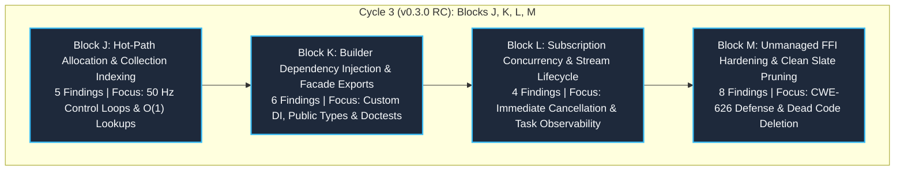

# Refactoring Cycle 3 Architecture Review: Natural Divisions & Modernization Blueprint

> **Document Status:** Active Architectural Blueprint (Cycle 3 / Blocks J–M)  
> **Workspace:** `opc-cli`  
> **Target Crate:** `opc-da-client` (v0.3.0 Release Candidate)  
> **Evaluation Date:** 2026-09-18  
> **Scope:** Comprehensive qualitative review and decomposition of all 23 findings from the post-Cycle 2 multi-lens review into 4 cohesive, decoupled engineering blocks (Blocks J, K, L, M) as part of the v0.3.0 Release Candidate.  
> **Preceding Context:** Builds directly on historical archives [`refactor/cycle1_reference.md`](file:///c:/Users/WSALIGAN/code/opc-cli/refactor/cycle1_reference.md), [`refactor/cycle2_reference.md`](file:///c:/Users/WSALIGAN/code/opc-cli/refactor/cycle2_reference.md), and the master qualitative review [`review_report.md`](file:///C:/Users/WSALIGAN/.gemini/antigravity/brain/1ecdad82-7371-4f86-93b1-b6dc5416f3bf/review_report.md).

---

## 1. Executive Summary & Objective Attainment Verification

A comprehensive 5-lens audit (**Logic**, **Design**, **Performance**, **Security**, **API**) evaluated `opc-da-client` against all historical objectives codified in Cycle 1 and Cycle 2 reference documents. 

### Objective Attainment Verdict
**All past objectives from Cycle 1 (Blocks 1–7, A–F) and Cycle 2 (Blocks G, H, I) were 100% attained and remain fully intact with zero architectural regressions:**
* **Clean Slate & Zero Deprecations:** All deprecated APIs (`connect`, `connect_remote`, `write_tag_values`) and unchecked conversions (`From<&str>`) have been excised; exactly 0 `#[allow(deprecated)]` or `#[deprecated]` attributes remain in the crate.
* **Tier 2 SPI & Headless Compilation:** Client facade is decoupled from Windows COM via pure-Rust [`ServerBackend`](file:///c:/Users/WSALIGAN/code/opc-cli/opc-da-client/src/connector/traits.rs#L248) and [`NoopServerBackend`](file:///c:/Users/WSALIGAN/code/opc-cli/opc-da-client/src/connector/traits.rs#L349); builds cleanly offline on Linux/macOS with `--no-default-features`.
* **COM Modernization & Security Blanketing:** Interface segregation pruned 9 unread COM interfaces from `ComServer` and `ComGroup` (eliminating 12 DCOM round-trips); DCOM packet integrity authentication (KB5004442 / CVE-2021-26414) is applied directly via vtable pointer re-borrowing.
* **Industrial PLC Write Safety:** Dedicated [`RetryPolicy::{Idempotent, NonIdempotent}`](file:///c:/Users/WSALIGAN/code/opc-cli/opc-da-client/src/com/worker/pool.rs#L281) prevents duplicate write actuations across connection dropouts.
* **Hot-Path Memory Optimization:** 4-slot LRU active group cache, 31-byte stack Small String Optimization ([`WriteBatch::InlineSingle`](file:///c:/Users/WSALIGAN/code/opc-cli/opc-da-client/src/types/write_batch.rs#L209)), zero-allocation array batches ([`TagBatch::StaticSmall`](file:///c:/Users/WSALIGAN/code/opc-cli/opc-da-client/src/types/batch.rs#L13)), in-place vector reuse via `chunk.drain(..)`, and zero-copy handoff via [`TagCollector::harvest`](file:///c:/Users/WSALIGAN/code/opc-cli/opc-da-client/src/types/collector.rs#L288).

The 23 new findings identified in [`review_report.md`](file:///C:/Users/WSALIGAN/.gemini/antigravity/brain/1ecdad82-7371-4f86-93b1-b6dc5416f3bf/review_report.md) represent **qualitative optimizations, builder ergonomics, concurrency responsiveness, and defense-in-depth opportunities** executed as part of the final **v0.3.0 Release Candidate**.

---

## 2. Decomposition into 4 Natural Divisions (Blocks J, K, L, M)

The 23 findings decompose into **4 natural engineering divisions** sequenced as **Blocks J, K, L, and M** based on architectural boundaries, failure domains, and coupling dynamics:



---

## 3. In-Depth Architectural Specification per Block

### 3.1 Block J: Hot-Path Allocation Eradication & Collection Indexing

#### Problems Addressed
1. **Scalar Write SSO Bypass ([Finding #3](file:///C:/Users/WSALIGAN/.gemini/antigravity/brain/1ecdad82-7371-4f86-93b1-b6dc5416f3bf/review_report.md#L97-L118)):** [`session.write_tag`](file:///c:/Users/WSALIGAN/code/opc-cli/opc-da-client/src/client/session.rs#L333) and `gateway.write_tag_value` convert `tag: &str` into an owned heap `String` before dispatching `ComRequest::WriteTagValue`, completely ignoring `WriteBatch::InlineSingle` (31-byte stack SSO). Inside `worker.rs:638`, `handle_write` executes `WriteBatch::from_str_lenient(tag_id, value.clone())`, cloning the `value` payload a second time on the worker thread.
2. **Quadratic Linear Scanning in `TagValues` ([Finding #4](file:///C:/Users/WSALIGAN/.gemini/antigravity/brain/1ecdad82-7371-4f86-93b1-b6dc5416f3bf/review_report.md#L120-L136)):** [`TagValues::get`](file:///c:/Users/WSALIGAN/code/opc-cli/opc-da-client/src/types/collection.rs#L419) and all typed extractors perform an unindexed linear scan using `eq_ignore_ascii_case`. For bulk reads of 10,000 tags, sequential named retrieval incurs $O(N^2)$ complexity ($100,000,000$ string comparisons).
3. **Per-Tick Endpoint String Allocations ([Finding #7](file:///C:/Users/WSALIGAN/.gemini/antigravity/brain/1ecdad82-7371-4f86-93b1-b6dc5416f3bf/review_report.md#L156-L168)):** [`Bound::subscribe`](file:///c:/Users/WSALIGAN/code/opc-cli/opc-da-client/src/client/subscription.rs#L64) calls `self.endpoint().clone()` on every polling tick, forcing 1 to 2 heap `String` allocations per tick and eroding the benefits of `TagBatch::into_shareable`.
4. **Intermediate Vector in Batch Write Entry ([Finding #8](file:///C:/Users/WSALIGAN/.gemini/antigravity/brain/1ecdad82-7371-4f86-93b1-b6dc5416f3bf/review_report.md#L170-L181)):** [`handle_write_batch`](file:///c:/Users/WSALIGAN/code/opc-cli/opc-da-client/src/com/worker/write.rs#L58) collects `writes.iter()` into an intermediate `Vec<(&str, &OpcValue)>`, allocating 160 KB on 10k items before partitioning.
5. **Temporary Vector in TagBatch Single Sharing ([Finding #20](file:///C:/Users/WSALIGAN/.gemini/antigravity/brain/1ecdad82-7371-4f86-93b1-b6dc5416f3bf/review_report.md#L248-L256)):** [`TagBatch::into_shareable`](file:///c:/Users/WSALIGAN/code/opc-cli/opc-da-client/src/types/batch.rs#L191) constructs `Arc<[String]>` via `Arc::from(vec![s].into_boxed_slice())`, allocating a temporary 1-element vector.

#### Scope
* [`opc-da-client/src/client/session.rs`](file:///c:/Users/WSALIGAN/code/opc-cli/opc-da-client/src/client/session.rs)
* [`opc-da-client/src/client/gateway.rs`](file:///c:/Users/WSALIGAN/code/opc-cli/opc-da-client/src/client/gateway.rs)
* [`opc-da-client/src/client/mod.rs`](file:///c:/Users/WSALIGAN/code/opc-cli/opc-da-client/src/client/mod.rs)
* [`opc-da-client/src/types/collection.rs`](file:///c:/Users/WSALIGAN/code/opc-cli/opc-da-client/src/types/collection.rs)
* [`opc-da-client/src/types/batch.rs`](file:///c:/Users/WSALIGAN/code/opc-cli/opc-da-client/src/types/batch.rs)
* [`opc-da-client/src/com/worker.rs`](file:///c:/Users/WSALIGAN/code/opc-cli/opc-da-client/src/com/worker.rs)
* [`opc-da-client/src/com/worker/write.rs`](file:///c:/Users/WSALIGAN/code/opc-cli/opc-da-client/src/com/worker/write.rs)

#### High-Level Objectives
Achieve absolute zero-allocation telemetry execution on scalar and small-batch control loops (50 Hz), eliminate quadratic scanning penalties on bulk collections, and streamline batch entry parsing without intermediate vector buffers.

#### Concrete Goals
* Reduce heap allocations for `write_tag` (tag $\le 31$ bytes) from 1 `String` allocation to **0 bytes**.
* Eliminate the second redundant `OpcValue` clone inside `handle_write`.
* Reduce endpoint cloning overhead in `subscribe` from $O(N)$ string allocations to $O(1)$ atomic refcount increments.
* Provide an $O(1)$ lookup path for `TagValues` via `into_map()` yielding sub-millisecond retrieval on 10k batches.
* Eliminate 160 KB memory churn per 10k batch write by streaming `writes.iter()` directly.

#### Blast Radius
* **Actor Messages:** `ComRequest::WriteTagValue` can be deprecated or merged into `ComRequest::WriteTagValues`.
* **Client Internal State:** `OpcDaClient.endpoint` type representation (`Arc<OpcServerEndpoint>`). Public accessor `endpoint(&self) -> &OpcServerEndpoint` remains unchanged via deref.
* **Regression Testing:** `tests/tag_io_integration_test.rs`, `tests/batch_write_test.rs`, and `tests/subscription_integration_test.rs`.

#### Deliverables
1. `session.write_tag` and `gateway.write_tag_value` refactored to construct `WriteBatch::from_str_lenient(tag, value.into())` and dispatch `ComRequest::WriteTagValues`.
2. Worker thread `handle_write` handler updated to accept moved `WriteBatch` without cloning `value`.
3. `TagValues::into_map(self) -> HashMap<String, TagValue>` method with case-insensitive ASCII key normalization.
4. `OpcServerEndpoint` wrapped in `Arc` internally within `OpcDaClient`.
5. `partition_write_inputs` rewritten to consume `writes.iter()` directly with exact capacity sizing.
6. `TagBatch::into_shareable` optimized to `Arc::from([s])`.

#### Recommendations
* Keep `ComRequest::WriteTagValue` as an internal alias or remove it entirely in favor of `ComRequest::WriteTagValues` to enforce uniform batch routing through `handle_write_batch`.
* Ensure `TagValues::into_map` preserves original tag casing in the `TagValue.tag_id` field while indexing by lowercase key.

#### Things to Watch Out For
* **Borrow Checker on In-Place Partitioning:** In `write.rs`, streaming from `writes.iter()` into three target collections must avoid holding multiple conflicting borrows of `writes`.
* **Channel Send Bounds:** Wrapping types in `Arc` must satisfy `Send + 'static` for Tokio `mpsc` actor channel transmission.
* **Backward Compatibility of `endpoint()`:** Do not change the return type of public `client.endpoint()` from `&OpcServerEndpoint` to avoid breaking existing callers.

---

### 3.2 Block K: Builder Dependency Injection & Public Facade Ergonomics

#### Problems Addressed
1. **Restrictive `C: Default` Trait Bound on `build` ([Finding #1](file:///C:/Users/WSALIGAN/.gemini/antigravity/brain/1ecdad82-7371-4f86-93b1-b6dc5416f3bf/review_report.md#L69-L86)):** `build(self)` and `build_bound(self)` in `builder.rs` are bounded by `C: ServerBackend + Default + 'static`. Callers passing customized connectors via `new_with_connector` or `with_connector` cannot call `.build()` unless `C: Default`, and there is no `build_bound_with_connector`.
2. **Unnameable Return Type `ComServer` ([Finding #2](file:///C:/Users/WSALIGAN/.gemini/antigravity/brain/1ecdad82-7371-4f86-93b1-b6dc5416f3bf/review_report.md#L88-L106)):** Public method `ComConnector::connect_endpoint` returns `OpcResult<ComServer>`, but `ComServer` is not re-exported in `src/lib.rs`, preventing callers from writing explicit type annotations or naming it in struct fields.
3. **Missing `&Vec<String>` Implementation for `IntoTags` ([Finding #23](file:///C:/Users/WSALIGAN/.gemini/antigravity/brain/1ecdad82-7371-4f86-93b1-b6dc5416f3bf/review_report.md#L268-L276)):** Callers with a borrowed vector `&Vec<String>` must write `&vec[..]` to satisfy `IntoTags`.
4. **Documentation Type Error in README ([Finding #13](file:///C:/Users/WSALIGAN/.gemini/antigravity/brain/1ecdad82-7371-4f86-93b1-b6dc5416f3bf/review_report.md#L198-L208)):** `README.md:45` advertises `ConversionError::TagNotRequested` which does not exist (variants are on `OpcError` and `TagExtractError`).
5. **Missing Doctests on Peripheral Public Items ([Finding #14](file:///C:/Users/WSALIGAN/.gemini/antigravity/brain/1ecdad82-7371-4f86-93b1-b6dc5416f3bf/review_report.md#L210-L219)):** `OpcDaClient::timeout`, builder setters, and typestate transitions lack `# Examples` runnable doctests.
6. **Hierarchical Browsing N+1 RPC Characteristics ([Finding #5](file:///C:/Users/WSALIGAN/.gemini/antigravity/brain/1ecdad82-7371-4f86-93b1-b6dc5416f3bf/review_report.md#L138-L154)):** Synchronous N+1 `GetItemID` DCOM round-trips in `browse_recursive` require explicit documentation and performance warnings.

#### Scope
* [`opc-da-client/src/client/builder.rs`](file:///c:/Users/WSALIGAN/code/opc-cli/opc-da-client/src/client/builder.rs)
* [`opc-da-client/src/client/mod.rs`](file:///c:/Users/WSALIGAN/code/opc-cli/opc-da-client/src/client/mod.rs)
* [`opc-da-client/src/lib.rs`](file:///c:/Users/WSALIGAN/code/opc-cli/opc-da-client/src/lib.rs)
* [`opc-da-client/src/types/batch.rs`](file:///c:/Users/WSALIGAN/code/opc-cli/opc-da-client/src/types/batch.rs)
* [`opc-da-client/src/com/worker/browse.rs`](file:///c:/Users/WSALIGAN/code/opc-cli/opc-da-client/src/com/worker/browse.rs)
* [`opc-da-client/README.md`](file:///c:/Users/WSALIGAN/code/opc-cli/opc-da-client/README.md)

#### High-Level Objectives
Enable unconstrained dependency injection across the builder subsystem, ensure all public API return types are nameable and exported, achieve 100% doctest coverage on all peripheral public items, and correct documentation taxonomy.

#### Concrete Goals
* Allow `OpcDaClientBuilder::<MockConnector>::new_with_connector(mock).build()` to compile cleanly without `MockConnector: Default`.
* Re-export `ComServer` and `ComGroup` in `lib.rs` under `cfg(feature = "opc-da-backend")`.
* Support `client.read_tags(&vec)` directly where `vec: Vec<String>`.
* Synchronize `README.md` error taxonomy with `OpcError` and `TagExtractError`.
* Add assertion-based `# Examples` doctests across all builder fluent methods and client getters.

#### Blast Radius
* **Public Crate Exports:** `src/lib.rs` adds `pub use com::connector::{ComServer, ComGroup}`.
* **Builder Impl Blocks:** Splitting `impl<C: ServerBackend + Default>` vs `impl<C: ServerBackend>`.
* **Toolchain Verification:** `cargo test --doc --workspace` and `scripts/verify.ps1`.

#### Deliverables
1. `OpcDaClientBuilder::build` and `build_bound` relocated to `impl<C: ServerBackend + 'static>`, unwrapping stored connector via `self.connector.expect(...)`.
2. `OpcDaClientBuilder::new()` and `Default` retained strictly on `impl OpcDaClientBuilder<DefaultBackendConnector>` to maintain zero-turbofish construction.
3. Re-export of `ComServer` and `ComGroup` in `src/lib.rs`.
4. `impl IntoTags for &Vec<String>`.
5. Updated `README.md` line 45.
6. Runnable `# Examples` doctests on `OpcDaClient::timeout`, `OpcDaClientBuilder::{host, server, timeout, with_connector}`, and typestate transitions.
7. Explanatory doc comments on `browse_recursive` explaining flat vs hierarchical performance trade-offs.

#### Recommendations
* Maintain `OpcDaClientBuilder::new()` strictly on `DefaultBackendConnector` to prevent Rust compiler error `E0283` (Case Study G1.1).
* Author all new doctests using assertions and discarded bindings (`let _ = ...;`) to ensure zero Gate 7 forbidden pattern (`println!`) failures.

#### Things to Watch Out For
* **Compiler Error E0283 (Type Annotation Ambiguity):** Do NOT place `pub fn new() -> Self` inside a generic `impl<C: ServerBackend>`. It MUST remain on the concrete `DefaultBackendConnector` block.
* **Feature Gating Integrity:** `ComServer` and `ComGroup` MUST be gated behind `#[cfg(feature = "opc-da-backend")]` so headless builds without backend features continue to compile cleanly under Gate 4b (`--no-default-features`).

---

### 3.3 Block L: Subscription Concurrency & Stream Lifecycle

#### Problems Addressed
1. **Delayed Cancellation Detection on Receiver Drop ([Finding #6](file:///C:/Users/WSALIGAN/.gemini/antigravity/brain/1ecdad82-7371-4f86-93b1-b6dc5416f3bf/review_report.md#L140-L154)):** Inside [`Bound::subscribe`](file:///c:/Users/WSALIGAN/code/opc-cli/opc-da-client/src/client/subscription.rs#L60), the task sleeps in `timer.tick().await`. If the downstream `Receiver` is dropped, the task remains suspended until the full interval timer expires (up to 30s–60s), leaking resources and retaining client clones.
2. **Silent Sample Drops on Non-Connection Read Failures ([Finding #15](file:///C:/Users/WSALIGAN/.gemini/antigravity/brain/1ecdad82-7371-4f86-93b1-b6dc5416f3bf/review_report.md#L214-L224)):** Non-connection errors during polling log a warning and skip the tick without sending any signal to the subscriber.
3. **Inability to Transmit Terminal Connection Disconnections ([Finding #19](file:///C:/Users/WSALIGAN/.gemini/antigravity/brain/1ecdad82-7371-4f86-93b1-b6dc5416f3bf/review_report.md#L242-L250)):** Fatal connection failures break the loop, closing the channel (`None`). Callers cannot distinguish normal cancellation from transport drops.
4. **Destructive Harvesting Side-Effects on Passed Collector ([Finding #16](file:///C:/Users/WSALIGAN/.gemini/antigravity/brain/1ecdad82-7371-4f86-93b1-b6dc5416f3bf/review_report.md#L226-L235)):** [`collector.harvest()`](file:///c:/Users/WSALIGAN/code/opc-cli/opc-da-client/src/types/collector.rs#L288) drains the vector and resets the count on the caller's collector reference.

#### Scope
* [`opc-da-client/src/client/subscription.rs`](file:///c:/Users/WSALIGAN/code/opc-cli/opc-da-client/src/client/subscription.rs)
* [`opc-da-client/src/types/collector.rs`](file:///c:/Users/WSALIGAN/code/opc-cli/opc-da-client/src/types/collector.rs)
* [`opc-da-client/src/com/worker/browse.rs`](file:///c:/Users/WSALIGAN/code/opc-cli/opc-da-client/src/com/worker/browse.rs)

#### High-Level Objectives
Eliminate cancellation lag when subscribers unsubscribe, provide responsive Tokio task shutdown, enhance subscription error transparency, and document collector lifecycle contracts.

#### Concrete Goals
* Task terminates within **< 1 millisecond** of receiver drop regardless of polling interval duration (even for 60s intervals).
* Preserve zero-allocation polling ticks using `IntoTags::into_shareable`.
* Clarify error propagation semantics across subscription streams.
* Document destructive harvesting behavior on `handle_browse` and `collector.harvest()`.

#### Blast Radius
* **Task Loop:** `src/client/subscription.rs` internal Tokio spawn loop.
* **Public Interface:** The return type `Receiver<TagValues>` remains backward compatible. An additive method `subscribe_resilient` returning `Receiver<OpcResult<TagValues>>` is introduced for programmatic error signals.
* **Integration Tests:** `tests/subscription_integration_test.rs`.

#### Deliverables
1. `tokio::select!` racing `timer.tick()` against `tx.closed()` in `Bound::subscribe`:
   ```rust
   tokio::select! {
       _ = timer.tick() => {}
       _ = tx.closed() => break,
   }
   if tx.is_closed() {
       break;
   }
   ```
2. Additive method `subscribe_resilient(&self, tags: impl IntoTags, interval: Duration) -> Receiver<OpcResult<TagValues>>`.
3. Diagnostic logging at `tracing::warn!` with structured error fields for dropped ticks.
4. Rustdoc documentation on `subscribe` explicitly defining channel closure semantics on transport failure.
5. Doc comments on `TagCollector::harvest` and `handle_browse` detailing destructive reset semantics.

#### Recommendations
* Use `tokio::select! { biased; ... }` to prioritize immediate exit on `tx.closed()`.
* Add an integration test specifically verifying that dropping `rx` terminates the background task without waiting for the timer interval.

#### Things to Watch Out For
* **Tokio Select Cancellation Safety:** `timer.tick()` is cancellation-safe, but racing must ensure that when `timer.tick()` finishes, `tx.is_closed()` is checked before dispatching `read_tags`.
* **Zombie Client Leaks:** The task holds a cloned `client: OpcDaClient<C, Bound>`. Responsive shutdown ensures `client` (and its channel senders) drop promptly when subscriptions end.

---

### 3.4 Block M: Unmanaged FFI Hardening & Clean Slate Pruning

#### Problems Addressed
1. **Unchecked Interior Null Bytes in `RemotePointer<u16>::from(&str)` ([Finding #9](file:///C:/Users/WSALIGAN/.gemini/antigravity/brain/1ecdad82-7371-4f86-93b1-b6dc5416f3bf/review_report.md#L183-L196)):** Infallible string-to-COM conversion allows interior null bytes into COM memory buffers, risking silent string truncation (CWE-626 / CWE-158).
2. **Dead Unmanaged Slice Conversion `LocalPointer<Vec<Vec<u16>>>` ([Finding #10](file:///C:/Users/WSALIGAN/.gemini/antigravity/brain/1ecdad82-7371-4f86-93b1-b6dc5416f3bf/review_report.md#L198-L208)):** Dead unmanaged FFI type implements unchecked `From<&[String]>` with zero callers across the codebase.
3. **Inconsistent Host Validation in `OpcServerEndpoint::remote` ([Finding #11](file:///C:/Users/WSALIGAN/.gemini/antigravity/brain/1ecdad82-7371-4f86-93b1-b6dc5416f3bf/review_report.md#L210-L220)):** `bind_new_remote` rejects interior null bytes, but `OpcServerEndpoint::remote` is infallible and accepts them.
4. **Missing Null-Byte Check in `open_reg_key` ([Finding #21](file:///C:/Users/WSALIGAN/.gemini/antigravity/brain/1ecdad82-7371-4f86-93b1-b6dc5416f3bf/review_report.md#L258-L266)):** Subkeys encoded into wide strings without upfront null-byte guard (defense-in-depth).
5. **Coarse `#[allow(dead_code)]` on `ScopedVariant` ([Finding #12](file:///C:/Users/WSALIGAN/.gemini/antigravity/brain/1ecdad82-7371-4f86-93b1-b6dc5416f3bf/review_report.md#L222-L232)):** Active safety-critical RAII guard struct and entire impl block carry blanket `dead_code` suppression because of unit test helper methods.
6. **Unconditional `#[allow(dead_code)]` on `NoOpComInit` ([Finding #17](file:///C:/Users/WSALIGAN/.gemini/antigravity/brain/1ecdad82-7371-4f86-93b1-b6dc5416f3bf/review_report.md#L237-L245)):** Fallback struct marked with unconditional suppression instead of `#[cfg_attr(feature = "opc-da-backend", allow(dead_code))]`.
7. **Blanket Mock Impl Suppressions ([Finding #18](file:///C:/Users/WSALIGAN/.gemini/antigravity/brain/1ecdad82-7371-4f86-93b1-b6dc5416f3bf/review_report.md#L247-L255)):** `connector/mock/` carries whole-block suppressions masking obsolete helpers.
8. **Behavioral Divergence on Null-Byte Handling in Read vs Write ([Finding #22](file:///C:/Users/WSALIGAN/.gemini/antigravity/brain/1ecdad82-7371-4f86-93b1-b6dc5416f3bf/review_report.md#L260-L268)):** Batch read fails whole batch on null tag, while batch write quarantines and continues.

#### Scope
* [`opc-da-client/src/raw/memory.rs`](file:///c:/Users/WSALIGAN/code/opc-cli/opc-da-client/src/raw/memory.rs)
* [`opc-da-client/src/types/server.rs`](file:///c:/Users/WSALIGAN/code/opc-cli/opc-da-client/src/types/server.rs)
* [`opc-da-client/src/com/discovery.rs`](file:///c:/Users/WSALIGAN/code/opc-cli/opc-da-client/src/com/discovery.rs)
* [`opc-da-client/src/com/variant.rs`](file:///c:/Users/WSALIGAN/code/opc-cli/opc-da-client/src/com/variant.rs)
* [`opc-da-client/src/com/guard.rs`](file:///c:/Users/WSALIGAN/code/opc-cli/opc-da-client/src/com/guard.rs)
* [`opc-da-client/src/connector/mock/`](file:///c:/Users/WSALIGAN/code/opc-cli/opc-da-client/src/connector/mock/)
* [`opc-da-client/src/com/worker/read.rs`](file:///c:/Users/WSALIGAN/code/opc-cli/opc-da-client/src/com/worker/read.rs)

#### High-Level Objectives
Enforce airtight CWE-626 null-byte validation across all unmanaged FFI conversion paths, eliminate dead unmanaged memory types, prune coarse lint suppressions, and align mock visibility.

#### Concrete Goals
* Replace infallible `RemotePointer<u16>::from(&str)` with fallible `try_from_str` and `TryFrom<&str>`.
* Delete dead `LocalPointer<Vec<Vec<u16>>>`.
* Validate interior null bytes in `normalize_host` and add fallible `OpcServerEndpoint::try_remote`.
* Add upfront null-byte rejection in `open_reg_key`.
* Remove blanket `#[allow(dead_code)]` from `ScopedVariant`, annotating only test helpers with `#[cfg(test)]`.
* Refine `NoOpComInit` suppression to target-aware `cfg_attr`.
* Document intentional fail-closed read vs quarantine write batch security policies.

#### Blast Radius
* **Unmanaged Memory:** `src/raw/memory.rs` internal FFI types.
* **Endpoint Construction:** `src/types/server.rs` host normalization.
* **Registry Queries:** `src/com/discovery.rs` local registration inspection.
* **Compiler Quality Gate:** Zero clippy warnings under `-D warnings` and 100% AST-Grep Gate 6 compliance (`no-panic-or-unwrap`, `require-safety-comment`).

#### Deliverables
1. Fallible `RemotePointer<u16>::try_from_str(s) -> OpcResult<Self>` and `TryFrom<&str>` (with deletion of infallible `From<&str>`).
2. Deletion of `LocalPointer<Vec<Vec<u16>>>` and its associated `From<&[String]>`.
3. Null-byte rejection in `normalize_host` and `OpcServerEndpoint::try_remote`.
4. Early return `if subkey.contains('\0') { return None; }` in `open_reg_key`.
5. Cleaned up `ScopedVariant` with `#[cfg(test)]` on test helpers.
6. Target-aware `#[cfg_attr(feature = "opc-da-backend", allow(dead_code))]` on `NoOpComInit`.
7. Architectural security commentary documenting read batch fail-closed vs write batch quarantine rationale.

#### Recommendations
* **Rust Orphan Rule Compliance (E0119):** In `raw/memory.rs`, you MUST delete `From<&str> for RemotePointer<u16>` when implementing `TryFrom<&str>`. Retaining `From` triggers rustc error `E0119` due to `core` blanket implementations (Case Study H1.1).
* **AST-Grep Multi-Line Comments:** Ensure every line of comments preceding `unsafe` blocks starts with `// SAFETY:` to pass Gate 6 (Case Study H2.2).

#### Things to Watch Out For
* **Compilation on Non-Windows:** `raw/memory.rs` is compiled on Windows; verify that changes do not break `--no-default-features` on Linux/macOS.
* **Test Double Breakage:** Ensure `test_remote_pointer_string_round_trip` is updated to call `.try_into().unwrap()` or `try_from_str`.

---

## 4. Master Division Roadmap & Summary

| Block | Primary Domain | Lenses Applied | Findings Addressed | Key Deliverables |
|:---|:---|:---|:---:|:---|
| **Block J** | Hot-Path Telemetry & Collections | Performance, API, Logic | #3, #4, #7, #8, #20 | SSO scalar writes, `TagValues::into_map`, `Arc<Endpoint>`, buffer streaming |
| **Block K** | Builder DI & Public Facade | API, Design, Performance | #1, #2, #5, #13, #14, #23 | Unconstrained `build()`, re-export `ComServer`, `&Vec<String>` IntoTags, doctests |
| **Block L** | Subscription Concurrency | Logic, Design, Performance | #6, #15, #16, #19 | `tokio::select!` cancellation, task lifecycle, `subscribe_resilient` |
| **Block M** | FFI Hardening & Clean Slate | Security, Design, API | #9, #10, #11, #12, #17, #18, #21, #22 | CWE-626 `try_from_str`, dead FFI deletion, `#[allow(dead_code)]` pruning |
| **Total** | `opc-da-client` | All 5 Lenses | **23 Findings** | **100% Comprehensive Modernization for v0.3.0 RC** |

---

## 5. Execution Order & TDD Sequencing Strategy

The recommended global execution sequence adheres to strict dependency ordering:

1. **Phase 1: Block J (Hot-Path Telemetry & Collections):**
   - Core data structures first (`Arc<OpcServerEndpoint>`, `WriteBatch` scalar routing, `TagValues::into_map`).
   - Validated via `cargo test -p opc-da-client --test tag_io_integration_test`.
2. **Phase 2: Block K (Builder DI & Facade Ergonomics):**
   - Builder generic trait relaxation, public re-exports in `lib.rs`, peripheral doctests.
   - Validated via `cargo test --doc -p opc-da-client` and `cargo check -p opc-da-client --no-default-features`.
3. **Phase 3: Block L (Subscription Concurrency & Stream Lifecycle):**
   - Immediate cancellation loop in `subscription.rs` and `subscribe_resilient`.
   - Validated via `cargo test -p opc-da-client --test subscription_integration_test`.
4. **Phase 4: Block M (FFI Hardening & Clean Slate Governance):**
   - Fallible unmanaged memory conversions, dead code pruning, and lint attribute cleanup.
   - Validated via `pwsh -File scripts/verify.ps1` (all 9 quality gates).

---

## 6. Confirmed Architectural Decisions (Interview Alignment)

Following developer interview on key design trade-offs, the following architectural choices are formally locked into the Cycle 3 blueprint:

1. **Block J — Unified Scalar Write SSO Routing:**
   - Scalar tag writes (`session.write_tag` and `gateway.write_tag_value`) will construct `WriteBatch::from_str_lenient(tag, value.into())` and dispatch `ComRequest::WriteTagValues`.
   - `ComRequest::WriteTagValue` is deprecated/subsumed, unifying all tag writes onto the 31-byte stack Small String Optimization (SSO) path without secondary `OpcValue` cloning.

2. **Block J — Explicit Hash Map Projection for `TagValues`:**
   - `TagValues` will provide an explicit conversion method `into_map(self) -> HashMap<String, TagValue>` with case-insensitive ASCII key normalization.
   - Default `TagValues` storage remains a zero-overhead `Vec<TagValue>` for high-speed sequential iterations, offering callers explicit $O(1)$ random access when processing large batches (up to 10,000 tags).

3. **Block L — Dual-Tier Subscription Stream Contract:**
   - Existing `Bound::subscribe` preserves its backward-compatible signature returning `Receiver<TagValues>`, enhanced with immediate task cancellation via `tokio::select!`.
   - An additive method `subscribe_resilient(&self, tags: impl IntoTags, interval: Duration) -> Receiver<OpcResult<TagValues>>` will be introduced for mission-critical consumers that require programmatic error signals on dropped or failed samples.

4. **Block M — Strict Fail-Closed Read Batch Policy:**
   - `handle_read` maintains an intentional fail-closed policy: encountering any tag with an interior null byte (`\0`) fails the entire batch with `Err(OpcError::InvalidState)`.
   - This intentional difference from `handle_write_batch` (which quarantines invalid tags and writes valid ones) is formally documented as an industrial data-integrity safeguard for SCADA telemetry ingestion.
