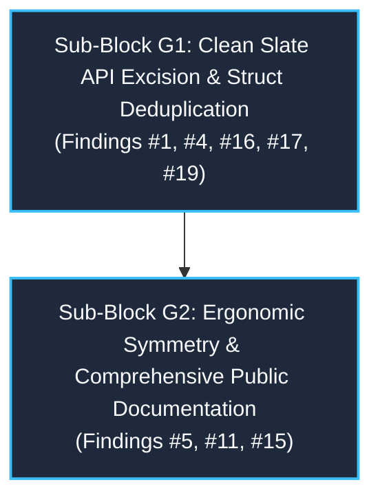

# Post-Implementation Synthesis & Architectural Consolidation: Block G
**Modernization Cycle 2: Clean Slate API Excision, Struct Deduplication & Ergonomic Symmetry**

> **Document Status:** Comprehensive Post-Implementation Architectural Synthesis  
> **Workspace:** `opc-cli`  
> **Target Crate:** `opc-da-client` (v0.2.0 $\rightarrow$ v0.3.0 Release Candidate)  
> **Evaluation Date:** 2026-09-17  
> **Source Documents Synthesized:**
> - `refactor/cycle2_blockg1_plan.md` (Block G1 Plan: Clean Slate API Excision & Struct Deduplication)
> - `refactor/cycle2_blockg2_plan.md` (Block G2 Plan: Ergonomic Symmetry & Comprehensive Public Documentation)
> - `refactor/deviations.md` (Master Implementation Deviations Ledger: Deviations #1 through #7 and Case Studies §3.1–§3.6)
> - `context.md` (Historical Context Updates for Blocks G1 & G2)

---

## 1. Executive Summary & Block G Modernization Scope

Modernization Block G represents the architectural clean break of Cycle 2, transitioning `opc-da-client` from legacy transitional idioms to modern, idiomatic Rust for semver 0.3.0. Block G dismantled triplicate conditional struct declarations, eliminated lingering deprecated v0.1/v0.2 APIs, eradicated 100% of deprecation lint suppressions, established a pure-Rust synchronous headless backend (`NoopServerBackend`), unlocked polymorphic batch write ergonomics, and achieved 100% public documentation coverage across all client session and gateway facades.

Block G was executed in **two sequential sub-blocks**:



---

## 2. Phase-by-Phase Technical Synthesis

### Phase 1: Sub-Block G1 — Clean Slate API Excision & Struct Deduplication

#### Original Problem Statement & Review Findings
1. **Finding #1 (Critical - API Design):** Obsolete v0.1/v0.2 methods (`connect`, `connect_remote`, and `TagWriter::write_tag_values`) lingered in the codebase wrapped with `#[deprecated]` and blanket `#[allow(deprecated)]` suppressions across provider mocks, trait definitions, and tests. Under the user's Clean Slate mandate for semver 0.3.0, these obsolete methods were slated for complete excision.
2. **Finding #4 (Major - API Design):** Root re-export omissions. `ParseEndpointError` and `DefaultOpcDaClient` were defined in internal submodules (`types::server` and `client`) but not re-exported unconditionally at the crate root, causing ergonomic friction for downstream consumers.
3. **Finding #16 (Major - Design):** Triplicate struct definitions in `src/client/mod.rs` and `src/client/builder.rs`. `OpcDaClient` and `OpcDaClientBuilder` were each declared 3 times with mutually exclusive `#[cfg(...)]` blocks rather than leveraging a unified `DefaultBackendConnector` type alias.
4. **Finding #17 (Major - Design):** Incomplete headless backend stubbing. When built with `--no-default-features` (without `opc-da-backend` and without `test-support`), the third `OpcDaClient` definition had no default type parameter for `C`, leaving non-Windows offline users unable to instantiate the client without third-party mock implementations.
5. **Finding #19 (Minor - API Design):** `HRESULT` re-export and dead code warning in `src/errors/hresult.rs`. `windows_core::HRESULT` was not re-exported, forcing downstream crates to depend directly on `windows-core`. `format_hresult` had `#[allow(dead_code)]` without doctests.

#### Architectural Solutions & Key Technical Deliverables
* **Synchronous Headless Fallback Backend (`NoopServerBackend`):** Implemented synchronous `NoopServerBackend`, `NoopConnectedServer`, and `NoopConnectedGroup` in `src/connector/traits.rs`. Returns `OpcError::NotImplemented` for active operations and succeeds on disconnect and ping.
* **Struct Deduplication & Default Backend Selection:**
  - Defined `DefaultBackendConnector` type alias in `src/client/mod.rs` selecting `ComConnector` (`opc-da-backend`), `MockServerConnector` (`test-support`), or `NoopServerBackend` (headless).
  - Consolidated 3 duplicate `OpcDaClient` structs into a single generic struct:
    ```rust
    pub struct OpcDaClient<C: ServerBackend + 'static = DefaultBackendConnector, State = Unbound> {
        pub(crate) worker: Arc<ComWorker<C>>,
        pub(crate) endpoint: Option<OpcServerEndpoint>,
        pub(crate) timeout: Option<Duration>,
        pub(crate) _state: std::marker::PhantomData<State>,
    }
    ```
  - Consolidated 3 duplicate `OpcDaClientBuilder` structs in `src/client/builder.rs` into a single generic struct:
    ```rust
    pub struct OpcDaClientBuilder<C = DefaultBackendConnector> { ... }
    ```
  - Implemented unambiguous `OpcDaClientBuilder::new()` targeting `DefaultBackendConnector` to prevent `E0283` type inference ambiguities.
* **Clean Slate Deprecation Excision:**
  - Excised `OpcDaClient::connect` and `connect_remote` from `src/client/mod.rs`.
  - Excised `TagWriter::write_tag_values` from `src/provider.rs` and its delegation arm in `src/client/gateway.rs`.
  - Purged `write_tag_values` from `MockOpcProvider` and `MockTagWriter`.
  - Purged 100% of `#[allow(deprecated)]` suppressions across `src/provider.rs` and `src/types/server.rs`, reaching an uncompromised zero-deprecation baseline across the entire crate.
* **Public Root Re-exports & Diagnostics:**
  - Re-exported `ParseEndpointError` and `DefaultOpcDaClient` in `src/lib.rs`.
  - Re-exported `windows_core::HRESULT` in `src/errors/hresult.rs`.
  - Added runnable doctest to `format_hresult` and removed `#[allow(dead_code)]`.
  - Made `#![doc = include_str!("../README.md")]` in `src/lib.rs` unconditional.
  - Pruned `write_tag_values` from `opc-da-client/README.md`.

#### Invariants & Constraints Established
* **Invariant G1.1:** `OpcDaClient` and `OpcDaClientBuilder` exist as single, canonical generic struct definitions parameterized over `<C, State>` with unified defaults.
* **Invariant G1.2:** The crate builds and functions cleanly in headless/offline environments (`--no-default-features`) using `NoopServerBackend` without third-party mock harnesses.
* **Invariant G1.3:** The codebase contains exactly zero `#[allow(deprecated)]` annotations and zero obsolete v0.1/v0.2 methods.
* **Invariant G1.4:** Client construction requires explicit typestate binding (`OpcDaClient::builder().build_bound()` or `bind_new`).

#### Deviations Summary (Sub-Block G1)
* **Deviation #1 (Step 3 / Finding #16):** Implemented `new()` specifically for `OpcDaClientBuilder<DefaultBackendConnector>` rather than generic `impl<C: ServerBackend + Default> OpcDaClientBuilder<C>`, resolving compiler error `E0283` (type inference ambiguity) and ensuring callers write concise `OpcDaClientBuilder::new()`.
* **Deviation #2 (Step 4 / Finding #1):** Used `WriteBatch::Owned` with owned strings in mock provider tests rather than fabricating a non-existent `WriteBatch::Borrowed` variant.
* **Deviation #3 (Step 4 / Finding #1):** Purged an obsolete `#[allow(deprecated)]` and renamed `test_endpoint_deprecated_from_str_behavior` in `src/types/server.rs:1180`, achieving an absolute zero-deprecation crate baseline.

---

### Phase 2: Sub-Block G2 — Ergonomic Symmetry & Comprehensive Public Documentation

#### Original Problem Statement & Review Findings
1. **Finding #11 (Minor - API Design / Ergonomic Asymmetry):** Inherent gateway methods on `OpcDaClient<C, Unbound>` accepted concrete types (`writes: WriteBatch`, `value: OpcValue`), forcing callers to explicitly instantiate enum wrappers even for single primitives or tuple arrays. In contrast, `OpcDaClient<C, Bound>` provided generic conversions (`impl IntoWriteBatch`, `impl Into<OpcValue>`). Furthermore, `Unbound` lacked intuitive shorthand aliases (`read_tags`, `read_tag`, `write_tags`, `write_tag`, `browse`) taking `(server, ...)`.
2. **Finding #5 (Major - API Documentation):** Complete absence of rustdoc comments (`///`) across all 13 inherent session methods in `session.rs` and all 7 inherent gateway methods in `gateway.rs`, violating `coding-standard.md §2` ("100% of public APIs documented") and `§4.5` (doc standards).
3. **Finding #15 (Minor - API Documentation):** Incomplete documentation sections (`# Examples`, `# Errors`) on public constructors and utilities, including `OpcDaClient::connect_eager` in `typestate.rs`, `OpcDaClient::bind_new_remote` and `OpcDaClient::new` in `client/mod.rs`, `TagValues::get_value_checked` in `types/collection.rs`, and `OpcDaClientBuilder` constructors.

#### Architectural Solutions & Key Technical Deliverables
* **Generic Conversions for `WriteBatch` (`src/types/write_batch.rs`):**
  - Replaced concrete `(String, OpcValue)` implementations with 6 generic `From` implementations accepting `S: Into<String>` and `V: Into<OpcValue>` for:
    1. Single tuple: `(S, V)`
    2. Fixed array: `[(S, V); N]`
    3. Array reference: `&[(S, V); N]`
    4. Owned vector: `Vec<(S, V)>`
    5. Borrowed slice: `&[(S, V)]`
    6. Iterator collection: `FromIterator<(S, V)>`
  - Preserved zero-copy `From<Arc<[(String, OpcValue)]>>`.
* **Modernized Inherent Gateway Signatures & Shorthand Aliases (`src/client/gateway.rs`):**
  - Updated `write_tag_batch` to accept `writes: impl IntoWriteBatch`.
  - Updated `write_tag_value` to accept `value: impl Into<OpcValue>`.
  - Added 5 intuitive shorthand aliases on `OpcDaClient<C, Unbound>`:
    * `read_tags(server, tags: impl IntoTags)`
    * `read_tag(server, tag_id)`
    * `write_tags(server, writes: impl IntoWriteBatch)`
    * `write_tag(server, tag_id, value: impl Into<OpcValue>)`
    * `browse(server, collector: TagCollector)`
* **Strict Trait Boundary Invariant (`src/provider.rs`):**
  - Preserved concrete signatures (`WriteBatch`, `TagBatch`, `OpcValue`) on SPI role traits (`TagWriter`, `TagReader`, `TagBrowser`, `OpcProvider`) to maintain 100% trait object safety (`dyn TagWriter`, `dyn OpcProvider`) and mockability via `mockall`.
  - Inherent methods perform `.into_write_batch()`, `.into()`, `.into_tag_batch()` before trait delegation.
* **Diagnostic Checked Value Accessor (`TagValues::get_value_checked`):**
  - Enhanced `TagValues::get_value_checked` in `src/types/collection.rs` with `#[must_use = "handling the Result distinguishes unrequested tags from server read failures"]`, comprehensive `# Errors`, `# Panics`, and a runnable doctest using `OpcValue::Float`.
* **100% Public Documentation Coverage:**
  - Documented all 13 inherent `Bound` session methods in `src/client/session.rs` with Summary, Details, `# Errors`, `# Panics`, and ````rust,no_run` examples.
  - Documented all 12 inherent `Unbound` gateway methods and shorthand aliases in `src/client/gateway.rs`.
  - Documented `connect_eager` in `typestate.rs`, `bind_new_remote` and `OpcDaClient::new` in `client/mod.rs`, and all `OpcDaClientBuilder` constructors and build methods.
  - Enforced Gate 7 compliance across all doctests: exactly zero forbidden macros (`println!`, `dbg!`, `todo!`).

#### Invariants & Constraints Established
* **Invariant G2.1:** Callers passing primitive values (integers, floats, booleans, strings) to write methods do not require manual `OpcValue` enum wrapping.
* **Invariant G2.2:** Batch write APIs accept single tuples, arrays, slices, vectors, or iterators interchangeably via `impl IntoWriteBatch`.
* **Invariant G2.3:** Gateway methods on `Unbound` client sessions provide 100% ergonomic parity with `Bound` client sessions.
* **Invariant G2.4:** Role SPI traits retain concrete domain types to guarantee trait object safety and dynamic dispatch.
* **Invariant G2.5:** 100% of public client methods and types possess comprehensive rustdoc documentation and runnable doctests devoid of forbidden macros.

#### Deviations Summary (Sub-Block G2)
* **Deviation #4 (Step 9 / Finding #15):** Applied informative message `#[must_use = "handling the Result distinguishes unrequested tags from server read failures"]` on `TagValues::get_value_checked` to resolve `clippy::double-must-use` under `-D warnings`.
* **Deviation #5 (Step 14 / Finding #11):** Passed `writes` directly in integration tests (`tests/batch_write_test.rs:46`) rather than chaining redundant `.into()`, eliminating type inference ambiguity `E0282`.
* **Deviation #6 (Steps 10, 11 / Finding #5):** Replaced `println!` in rustdoc examples with testable assertions and discarded bindings (`let _ = ...`), satisfying Gate 7 zero-forbidden-macro validation.
* **Deviation #7 (Step 2 / Finding #11):** Updated unit test tuple to `("Tag1".to_string(), ...)` in `src/types/write_batch.rs:438` to resolve intermediate type deduction ambiguity in polymorphic `From<Vec<(S, V)>>`.

---

## 3. Master Implementation Deviations Ledger (Block G)

Across Block G (G1 and G2), exactly **7 deviations** were recorded, justified, and verified in [`refactor/deviations.md`](file:///c:/Users/WSALIGAN/code/opc-cli/refactor/deviations.md) (Deviations #1 through #7). Zero compliance violations occurred:

| # | Block | Step / Finding | Planned Approach | Implemented Deviation | Rationale & Compiler / Architectural Dynamic | Category |
|:---:|:---:|:---|---|---|---|:---:|
| **1** | **G1** | Step 3<br>Finding #16 | `impl<C: ServerBackend + Default> OpcDaClientBuilder<C> { pub fn new() -> Self }` | `impl OpcDaClientBuilder<DefaultBackendConnector> { pub fn new() -> Self }` | Rust compiler error `E0283` ("type annotations needed for `T`"). A parameterless generic `new()` cannot infer `C` at call sites like `OpcDaClientBuilder::new()`. Implementing `new()` directly on `OpcDaClientBuilder<DefaultBackendConnector>` resolves type inference unambiguously while generic construction remains supported via `Default`. | Language Invariant & API Ergonomics |
| **2** | **G1** | Step 4<br>Finding #1 | Provider test calling `crate::types::WriteBatch::Borrowed(&[...])` | Provider test calling `crate::types::WriteBatch::Owned(vec![("Tag.Fail".into(), OpcValue::Int(1)), ...])` | The `WriteBatch` enum defines `Single`, `Shared`, and `Owned` variants; no `Borrowed` variant exists in the domain model. Using `WriteBatch::Owned` accurately exercises the failure path without fabricating non-existent enum variants. | Type Correctness |
| **3** | **G1** | Step 4<br>Finding #1 | Purge `#[allow(deprecated)]` scoped only to `provider.rs` and `gateway.rs` | Removed stale `#[allow(deprecated)]` and renamed `test_endpoint_deprecated_from_str_behavior` in `src/types/server.rs:1180` | Ripgrep sweep discovered an obsolete `#[allow(deprecated)]` on a test whose target was no longer deprecated. Purging this suppression achieved an uncompromised 100% deprecation-free crate (0 matches across `opc-da-client/src/`). | Code Quality & Governance |
| **4** | **G2** | Step 9<br>Finding #15 | Bare `#[must_use]` on `TagValues::get_value_checked` | `#[must_use = "handling the Result distinguishes unrequested tags from server read failures"]` | In Rust, `Result` is already marked `#[must_use]`. Applying bare `#[must_use]` triggers `clippy::double-must-use`. Adding an explanatory message resolves the lint error under `-D warnings` while providing actionable diagnostics. | Lint Rule Invariant (`clippy::double-must-use`) |
| **5** | **G2** | Step 14<br>Finding #11 | `client.write_tag_batch(server, writes.into()).await` in `tests/batch_write_test.rs:46` | `client.write_tag_batch(server, writes).await` | Upgrading `write_tag_batch` to accept `impl IntoWriteBatch` directly made chaining `.into()` redundant, triggering compiler type inference ambiguity `E0282`. Passing `writes` directly aligns with the generic signature. | Type Inference & API Ergonomics |
| **6** | **G2** | Steps 10, 11<br>Finding #5 | Doc comment examples using `println!("{:?}", ...);` across `session.rs` and `gateway.rs` | Doc comment examples using `assert!(...);` or `let _ = ...;` bindings | Gate 7 enforces a strict zero-tolerance scan (`rg "\b(println!|dbg!|todo!)" opc-da-client/src/`) across all files including doc comments. Replacing `println!` with testable assertions respects the guard while keeping doctests runnable. | Governance & Code Standard (`coding-standard.md §4.8`) |
| **7** | **G2** | Step 2<br>Finding #11 | Existing unit test `test_write_batch_vec_and_into_iter` with `("Tag1".into(), ...)` | Adjusted tuple to `("Tag1".to_string(), ...)` in `src/types/write_batch.rs:438` | Generalizing `From<Vec<(S, V)>>` over `S: Into<String>` and `V: Into<OpcValue>` caused type inference ambiguity for `vec![("Tag1".into(), ...)]`. Specifying `.to_string()` provides unambiguous type information. | Type Inference Invariant |

---

## 4. Verification Results & Quality Gates Summary

All automated quality gates in `scripts/verify.ps1` executed cleanly with **exit code 0** upon Block G completion:

| Gate | Check Name | Command / Inspection | Result | Invariant Verified |
|:---:|:---|:---|:---:|:---|
| **1** | Formatter Check | `cargo fmt --all -- --check` | ✅ Pass | Zero formatting drift across consolidated files |
| **2** | Linter Check | `cargo clippy --all-targets --all-features -- -D warnings` | ✅ Pass | Exactly zero clippy warnings across production and test code |
| **3** | Doc Compilation | `cargo test --doc` | ✅ Pass | 126 passing doctests (all public APIs documented with runnable code) |
| **4** | Unit & Integration | `cargo test --all-features` | ✅ Pass | 523 passing tests across workspace (including new G1/G2 unit tests) |
| **4b**| Feature Independence | `cargo check -p opc-da-client --no-default-features` | ✅ Pass | Headless compilation verified via `NoopServerBackend` |
| **5** | Polyfill Validation | `bcrypt-polyfill`, `synch-polyfill`, `winrt-error-polyfill` | ✅ Pass | Windows compatibility shims compile and pass tests |
| **6** | AST-Grep Safety Scan | `sg scan` (`no-panic-or-unwrap`, `require-safety-comment`, etc.) | ✅ Pass | 4 rule suites passed; zero structural violations |
| **7** | Forbidden Pattern Guard | `rg "\b(println!|dbg!|todo!)" opc-da-client/src/` | ✅ Pass | Exactly zero `println!`, `dbg!`, or `todo!` in library crate |
| **8** | Type Cleanliness | Library anyhow & `Box<dyn Error>` guards | ✅ Pass | Pure typed error domain (`OpcError`) with zero stringly-typed leakage |
| **9** | PowerShell Strictness | Strict AST syntax validation on all scripts | ✅ Pass | All 6 automation scripts verified under strict mode |

---

## 5. Architectural Impact & Final State

### API Cleanliness & Deprecation Hygiene
* **Zero Deprecations Baseline:** Complete excision of `connect`, `connect_remote`, and `write_tag_values`, accompanied by purging 100% of `#[allow(deprecated)]` suppressions.
* **Unified Struct Hierarchy:** Triplicate struct definitions eliminated; `OpcDaClient` and `OpcDaClientBuilder` unified under `DefaultBackendConnector`.
* **Headless Autonomy:** Pure-Rust `NoopServerBackend` enables compilation, testing, and CI verification on non-Windows / offline systems without mock dependencies.

### Ergonomics & Developer Experience
* **Polymorphic Write Batch Ingestion:** Callers write single primitives (`42.5f64`, `"RUNNING"`, `true`) or batch tuples (`[("Tag.1", 10i32), ("Tag.2", 20i32)]`) directly without manual enum instantiation.
* **Shorthand Gateway Parity:** `Unbound` client sessions gained intuitive aliases (`read_tags`, `read_tag`, `write_tags`, `write_tag`, `browse`), eliminating boilerplate.
* **Trait Object Safety Preserved:** SPI role traits (`TagWriter`, `TagReader`, `TagBrowser`, `OpcProvider`) retained concrete domain types, ensuring dynamic dispatch and mockability remain unimpaired.

### Documentation Standard Compliance
* **100% Rustdoc Coverage:** All inherent session and gateway methods, constructors, and typestates documented with Summary, Details, `# Errors`, `# Panics`, and runnable examples.
* **Zero Forbidden Macros in Docs:** All doctests adhere to Gate 7, utilizing assertions and explicit discards instead of `println!`.

### Release Readiness
Block G is **100% complete, fully verified, and historically integrated**. It established the modern, lean foundation upon which Block H executed its COM modernization, security hardening, and cache optimization.
