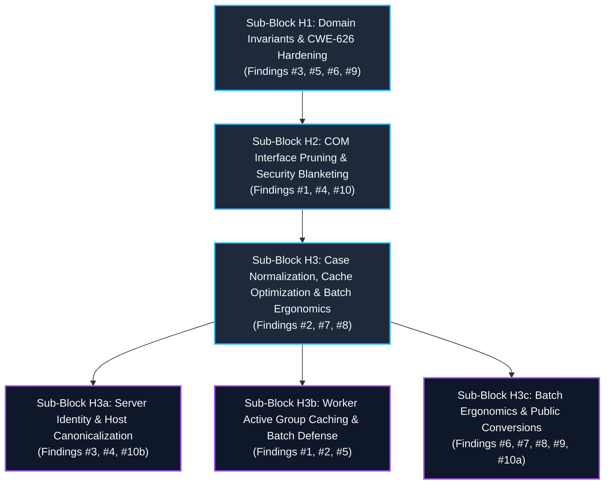
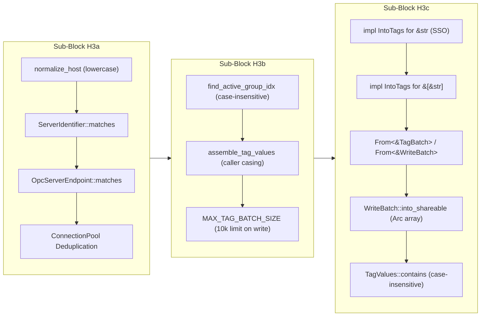

# Post-Implementation Synthesis & Architectural Consolidation: Block H
**Modernization Cycle 2: COM Modernization, Domain Hardening & Ergonomics**

> **Document Status:** Comprehensive Post-Implementation Architectural Synthesis  
> **Workspace:** `opc-cli`  
> **Target Crate:** `opc-da-client` (v0.2.0 $\rightarrow$ v0.3.0 Release Candidate)  
> **Evaluation Date:** 2026-09-17  
> **Source Documents Synthesized:**
> - `refactor/cycle2_blockH_review.md` (Master Block H Review)
> - `refactor/cycle2_blockH1_plan.md` (Block H1 Plan: Domain Invariants & CWE-626 Hardening)
> - `refactor/cycle2_blockH2_review.md` & `cycle2_blockH2_plan.md` (Block H2: COM Resource & Dead Code Pruning)
> - `refactor/cycle2_blockH3_review.md` (Block H3 Overview)
> - `refactor/cycle2_blockh3a_review.md`, `cycle2_blockH3a_plan.md`, `cycle2_blockH3a_task.md` (Sub-Block H3a: Server Identity & Host Canonicalization)
> - `refactor/cycle2_blockh3b_review.md`, `cycle2_blockH3b_plan.md` (Sub-Block H3b: Worker Active Group Caching & Batch Defense)
> - `refactor/cycle2_blockh3c_review.md`, `cycle2_blockH3c_plan.md` (Sub-Block H3c: Batch Ergonomics & Public Conversions)
> - `refactor/deviations.md` (Master Implementation Deviations Ledger: Deviations #8 through #18)

---

## 1. Executive Summary & Block H Decomposition

Modernization Block H represents the foundational core of Cycle 2, overhauling the Windows COM/DCOM communication engine, establishing airtight type-system invariants across domain models, eliminating 12 redundant DCOM IPC round-trips per session, hardening against DCOM packet integrity access denials (Windows KB5004442), eradicating CWE-626 null-byte truncation vulnerabilities, optimizing runtime active group caching (25x–75x latency reduction), and establishing zero-allocation stack Small String Optimization (SSO) for dynamic tag batches.

To manage blast radius and ensure strict verification across every subsystem, Block H was decomposed into **3 sequential, highly cohesive phases**:

---

## 2. Phase-by-Phase Technical Synthesis

### Phase 1: Sub-Block H1 — Domain Invariants & CWE-626 Hardening

#### Original Problem Statement & Review Findings
1. **Finding #3 (Major - Security / API / Logic):** `ServerIdentifier::from_str` used `trimmed.starts_with('{') || trimmed.contains('-')` to discriminate CLSIDs from ProgIDs. This falsely diverted valid hyphenated industrial ProgIDs (e.g., `KEPServerEX-V6.1`, `ABB.IndustrialIT-Server.1`) to `Clsid::from_str`, which failed with `InvalidClsid`. Furthermore, infallible `From<&str>` used `unwrap_or_else` to swallow syntax errors into invalid `ProgId` variants, completely bypassing CWE-20 input validation boundaries.
2. **Finding #5 (Major - Security):** `LocalPointer<Vec<u16>>::from` converted strings to UTF-16 wide characters without checking for interior null bytes (`\0`). When passed to Win32 COM APIs (`CoCreateInstanceEx` via `COSERVERINFO.pwszName` and `CLSIDFromProgID`), strings were truncated at the null terminator (CWE-626), leading to target host confusion and authentication bypasses.
3. **Finding #6 (Major - API / Logic):** Infallible `From<&str>` on `OpcServerEndpoint` caught parse errors with `unwrap_or_else` and silently fell back to local endpoints, masking syntax errors. `OpcDaClient::bind_new` accepted only `Into<ServerIdentifier>`, preventing callers from passing remote UNC paths (`r"\\host\server"`) or URI strings directly.
4. **Finding #9 (Minor - Design / Security):** `OpcDaClient::bind_new` and `OpcDaClientBuilder::build_bound` eagerly initialized the COM MTA apartment and spawned an OS worker thread before validating server endpoint syntax, causing resource leaks on invalid inputs.

#### Architectural Solutions & Key Technical Deliverables
* **ProgID Hyphen Discrimination Fix:** Refactored `ServerIdentifier::from_str` to evaluate `Clsid::parse(trimmed)` directly. Hyphenated ProgIDs pass through to `validate_prog_id`.
* **Clean Slate Infallible Conversion Removal:** Excised `From<&str>` and `From<String>` on `ServerIdentifier` and `OpcServerEndpoint`. Replaced with strict, fallible `TryFrom<&str>` and `TryFrom<String>`.
* **CWE-626 Interior Null-Byte Elimination:** Introduced fallible `LocalPointer::try_from_str(s: &str) -> OpcResult<Self>` rejecting `\0` with `OpcError::InvalidState`. Deleted unchecked `From<S>`. Converted all 5 call sites in `com/connector/server.rs` and 1 in `com/security.rs`.
* **Early Validation Client Facade:** Generalized `OpcDaClient::bind_new` to accept `impl TryInto<OpcServerEndpoint, Error: Into<OpcError>>`, anchored on `DefaultBackendConnector` for unambiguous type inference. Validates endpoints *prior* to spawning OS threads.
* **Builder Deferred Error Accumulation:** Implemented non-clobbering deferred error accumulation (`self.server_err.get_or_insert_with(...)`) in `OpcDaClientBuilder::server` and `host`, validated within `build_internal`.
* **Symmetrical Domain Constructors:** Introduced `OpcServerEndpoint::new(s: &str)` and convenience helpers `local_prog_id` / `remote_prog_id`. Migrated 80+ test call sites across the workspace.

#### Invariants & Constraints Established
* **Invariant H1.1:** A `ServerIdentifier` instance is guaranteed at compile time to contain either a valid 128-bit `Clsid` or a validated, non-empty `ProgId` devoid of control characters, whitespace, and interior nulls.
* **Invariant H1.2:** Win32 UTF-16 wide-pointer conversions reject interior null bytes; no remote hostname or ProgID string can cause Win32 API truncation under CWE-626.
* **Invariant H1.3:** `OpcDaClient` client constructors fail fast on invalid server syntax without spawning background OS threads.

#### Deviations Summary (Sub-Block H1)
* **Deviation #8:** Excised unchecked `impl From<S> for LocalPointer` from `src/raw/memory.rs` due to Rust's blanket `TryFrom` trait collision (`E0119`), enforcing Clean Slate fallible conversions across all 6 Win32 COM call sites.
* **Deviation #9:** Unconditionally imported `ServerIdentifier` in `src/client/mod.rs` to ensure typestate constructors compile cleanly under `--no-default-features` (Gate 4b).

---

### Phase 2: Sub-Block H2 — COM Interface Pruning & Security Blanketing

#### Original Problem Statement & Review Findings
1. **Finding #1 (Critical - Security / Logic):** `apply_proxy_blanket` invoked `.cast::<IUnknown>()`, which called `QueryInterface(&IUnknown::IID)` to produce a distinct, newly allocated COM proxy. `CoSetProxyBlanket` was executed on this temporary pointer, which was immediately dropped upon return. The caller's actual dispatch interface proxy (`IOPCServer`, `IOPCItemMgt`, `IOPCSyncIO`) remained completely unblanketed. Under modern Windows DCOM hardening (KB5004442 / CVE-2021-26414), subsequent remote calls failed with `0x80070005` (`E_ACCESSDENIED`).
2. **Finding #4 (Major - Design / Logic / Perf):** Interface Segregation Principle (ISP) violation. `ComGroup` queried and stored 8 COM interfaces, but `ConnectedGroup` only consumed 2 (`item_mgt` and `sync_io`). Mandatory fallible casts (`?`) on optional interfaces (`IOPCGroupStateMgt`, `IOPCAsyncIO2`, `IConnectionPointContainer`) caused group creation to abort with `E_NOINTERFACE` (`0x80004002`) on standard OPC DA 2.05a servers. `ComServer` similarly queried 3 unused interfaces (`common`, `item_properties`, `server_public_groups`), adding 12 redundant DCOM IPC round-trips per session.
3. **Finding #10 (Nitpick - Design / Security):** Uncalled dead helper `connect_server_identifier` hardcoded insecure DCOM settings, and obsolete `RPC_C_IMP_LEVEL_IMPERSONATE` presented a privilege escalation risk under `#[allow(dead_code)]`.

#### Architectural Solutions & Key Technical Deliverables
* **Direct Proxy Blanket Fix:** Refactored `apply_proxy_blanket` to borrow the proxy's vtable pointer directly as `&windows::core::IUnknown` via `&*std::ptr::from_ref(proxy).cast::<windows::core::IUnknown>()`. This configures the exact proxy pointer used for IPC without ephemeral allocations, ensuring full compliance with Windows KB5004442.
* **Member Proxy Security Propagation:** Added explicit member proxy blanketing in `create_remote_instance` (`IOPCServer`) and `ComServer::add_group` (`IOPCItemMgt`, `IOPCSyncIO`).
* **Full Clean Slate Interface Pruning:**
  - Pruned 6 unread interface fields from `ComGroup`, retaining strictly `item_mgt: IOPCItemMgt` and `sync_io: IOPCSyncIO`. Removed mandatory casts for optional async/connection-point interfaces.
  - Pruned 3 unread interface fields from `ComServer`, retaining strictly `server: IOPCServer` and optional `browse_server_address_space`.
  - Eliminated 12 redundant synchronous DCOM IPC round-trips per connection and group lifecycle.
* **Dead Code & Warning Eradication:** Deleted `connect_server_identifier` and `RPC_C_IMP_LEVEL_IMPERSONATE`. Removed all `#[allow(dead_code)]` suppressions from connector modules. Encapsulated `com::security` as `pub(crate)`.

#### Invariants & Constraints Established
* **Invariant H2.1:** DCOM security blankets are set directly on the concrete dispatch interface proxies; every remote IPC call carries `RPC_C_AUTHN_LEVEL_PKT_INTEGRITY`.
* **Invariant H2.2:** `ComGroup` and `ComServer` represent lean, minimal COM wrappers strictly confined to the interfaces required for synchronous telemetry I/O and tag browsing, guaranteeing compatibility with minimal OPC DA 2.05a servers.
* **Invariant H2.3:** Connector modules contain zero dead code and zero `#[allow(dead_code)]` suppressions.

#### Deviations Summary (Sub-Block H2)
* **Deviation #10:** Used standard library `&*std::ptr::from_ref(proxy).cast::<windows::core::IUnknown>()` to satisfy `clippy::ptr_as_ptr` and `clippy::ref_as_ptr` under `-D warnings`.
* **Deviation #11:** Repeated `// SAFETY:` on every line of multi-line safety comments to satisfy AST-Grep `require-safety-comment` immediate-sibling token parsing (Gate 6).
* **Deviation #12:** Bound group removal rollback in `ComServer::add_group` and logged cleanup failures via `tracing::warn!` rather than silently ignoring errors with `let _ = ...`, enforcing `coding-standard.md §4.8` (no silent failures).

---

### Phase 3: Sub-Block H3 — Case Normalization, Cache Optimization & Batch Ergonomics

Block H3 addressed runtime cache efficiency, server identity matching, DoS defense, and batch lifetime abstractions. To maximize modular verification, it was partitioned into 3 sub-blocks: H3a, H3b, and H3c.

---

### Sub-Block H3a: Server Identity & Host Canonicalization

#### Original Problem Statement & Review Findings
1. **Finding #3 (Major - Design / Perf / Security):** `normalize_host` failed to eagerly lowercase hostnames, and `OpcServerEndpoint::from_str` bypassed normalization. In Windows networks, NetBIOS/DNS hostnames are case-insensitive; unnormalized hostnames produced distinct hash keys in `ConnectionPool::connections`, creating duplicate active DCOM connections for the same host, incurring 200–2000ms connection handshakes, and exhausting limited server client seats.
2. **Finding #4 (Major - API / Logic / Design):** Direct `!=` comparison on `ServerIdentifier` and `host` in `OpcDaClient::validate_bound_server` caused false-positive `InvalidState` rejections on bound client sessions when callers queried using differing casing (e.g., `"Matrikon.OPC.Simulation.1"` vs `"matrikon.opc.simulation.1"`). Overriding `PartialEq` was prohibited as it would violate Rust's `Eq`/`Hash` contract and corrupt container keying.
3. **Finding #10b (Nitpick - API / Docs):** Orphaned rustdoc comment on `OpcServerEndpoint::local` resulted in undocumented public constructors and missing doctests.

#### Architectural Solutions & Key Technical Deliverables
* **Eager Lowercase Host Normalization:** Upgraded `normalize_host` to enforce `str::to_ascii_lowercase`, while preserving loopback alias mapping (`localhost`, `127.0.0.1`, `::1` $\rightarrow$ `None`) in `normalize_host_str`.
* **Router Normalization Alignment:** Aligned all parsing routes in `OpcServerEndpoint::from_str` to delegate through `normalize_host`.
* **Semantic `matches()` Methods:** Introduced `ServerIdentifier::matches(&self, other: &Self) -> bool` (case-insensitive for `ProgId`, exact 128-bit equality for `Clsid`) and `OpcServerEndpoint::matches(&self, other: &Self) -> bool` (case-insensitive host and identifier match). Preserved standard derived `PartialEq, Eq, Hash`.
* **Bound Session Validation:** Updated `OpcDaClient::validate_bound_server` to utilize `.matches()`, permitting mixed-case queries on bound clients.
* **Connection Pool Deduplication:** Guaranteed that `ConnectionPool` keys are canonical lowercase, preventing connection fragmentation and license exhaustion.
* **Public Documentation:** Reconnected rustdoc on `OpcServerEndpoint::local` and documented `ServerIdentifier::matches` with runnable doctests.

#### Deviations Summary (Sub-Block H3a)
* **Deviation #13:** Doctest for `OpcServerEndpoint::local` updated to pre-construct via `ServerIdentifier::new("...").unwrap()` because infallible `From<&str>` was excised in Sub-Block H1.
* **Deviation #14:** Added minimal compilable stub `pub fn matches(&self, ...) -> bool { false }` prior to unit test addition to enforce strict TDD Red-Green protocol without rustc `E0599` compilation errors.

---

### Sub-Block H3b: Worker Active Group Caching & Batch Defense

#### Original Problem Statement & Review Findings
1. **Finding #1 (Critical - Performance / Logic / Security):** `PooledServer::find_active_group_idx` evaluated byte-exact equality (`a == b`) on tag ItemIDs. Because OPC DA tags are case-insensitive, casing variations across polling cycles triggered false cache misses in the 4-slot LRU cache (`MAX_ACTIVE_GROUPS = 4`). Each miss forced a full synchronous cold-path cycle: `AddGroup`, `AddItems`, sync read, and LRU `RemoveGroup`. Over remote DCOM, this added **50–150ms of latency (25x–75x penalty)**, thrashed LRU slots, and risked server handle exhaustion (CWE-400).
2. **Finding #2 (Major - Logic):** On a cache hit, `handle_read` passed `&cached.tags` (the casing from the initial request that created the group) to `assemble_tag_values`. Returned `TagValue.tag_id` strings mutated depending on cache state, breaking caller `HashMap<String, TagValue>` lookups and causing TUI display flicker.
3. **Finding #5 (Major - Security):** `handle_write_batch` lacked an upper-bound check (unlike `read` which bounds at 10,000 tags), allowing unbounded write batches to trigger Win32 RPC buffer overflows or crash remote PLCs (CWE-400 / CWE-770).

#### Architectural Solutions & Key Technical Deliverables
* **Case-Insensitive Positional Cache Lookup:** Upgraded `find_active_group_idx` to evaluate `a.eq_ignore_ascii_case(b)` positionally (`zip`), maintaining strict $O(N)$ order-sensitive handle alignment while eliminating false cache misses.
* **Deterministic Response Tag Casing:** Refactored `assemble_tag_values` to accept `tags: impl ExactSizeIterator<Item = &'a str>`. Passed caller's `tags.iter_str()` uniformly across both cache hits and misses, guaranteeing that returned `TagValue.tag_id` exactly mirrors the caller's requested casing with zero intermediate allocations.
* **Defensive Batch Size Bounding:** Consolidated `MAX_TAG_BATCH_SIZE = 10_000` in `src/com/worker.rs`. Added immediate entrypoint validation in `handle_write_batch`, returning `OpcError::InvalidState` on oversized batches symmetrically with read batches.

#### Deviations Summary (Sub-Block H3b)
* **Deviation #15:** Introduced explicit named lifetime parameter `<'a>` in `pub(crate) fn assemble_tag_values<'a>(tags: impl ExactSizeIterator<Item = &'a str>, ...)` to resolve compiler error `E0658` (anonymous lifetimes in `impl Trait` are unstable in Rust 2024 / MSRV 1.93.1).
* **Deviation #16:** Cast loop index `i as i64` in batch write unit test fixtures (`src/com/worker/write.rs:268`) to match the domain definition `OpcValue::Int(i64)`, resolving compiler error `E0308`.

---

### Sub-Block H3c: Batch Ergonomics & Public Conversions

#### Original Problem Statement & Review Findings
1. **Finding #6 (Minor - API / Perf):** `IntoTags` conversion trait implementations were over-constrained to `'static` lifetimes (`impl IntoTags for &'static str`, `impl IntoTags for &'static [&'static str]`). Callers passing dynamic strings (`&str` such as formatted tag IDs) or borrowed string slices (`&[&str]`) were forced to allocate owned `Vec<String>`, defeating the pre-existing 31-byte stack SSO engine (`TagBatchRepr::InlineSingle`).
2. **Finding #7 (Minor - Design / API):** Symmetrical non-consuming batch passing was missing: neither `&TagBatch` nor `&WriteBatch` had reference conversions, forcing callers to write `.clone()`. Slice tuple references `&[(&str, &OpcValue)]` failed due to missing `From<&OpcValue> for OpcValue`.
3. **Finding #8 (Minor - Perf / Design):** `WriteBatch::into_shareable` left `Single(tag, val)` as an unshared owned pair, resulting in deep string copies on `.clone()` during subscription stream polling and retries.
4. **Finding #9 (Nitpick - API):** `TagValues` lacked an idiomatic `contains(&self, tag: &str) -> bool` query predicate, forcing callers to write verbose `get(tag).is_some()`.
5. **Finding #10a (Nitpick - Docs / Quality):** `OpcDaClient::subscribe` lacked complete `# Panics` and `# Examples` doctests.

#### Architectural Solutions & Key Technical Deliverables
* **Generalized `IntoTags` Trait Implementations:**
  - Implemented `IntoTags for &str`, delegating directly to `TagBatch::from_str_lenient(self)`. For strings $\le 31$ bytes, creates `InlineSingle` (0 heap allocations); overflows cleanly to `OwnedSingle` for $> 31$ bytes.
  - Implemented `IntoTags for &[&str]`. Maps $N=0$ to `empty()`, $N=1$ to `from_str_lenient(self[0])` (leveraging stack SSO), and $N>1$ to `Owned` with pre-allocated capacity.
* **Symmetric Non-Consuming Reference Conversions:**
  - Implemented `IntoTags for &TagBatch` and `From<&Self> for TagBatch`.
  - Implemented `From<&Self> for WriteBatch` (satisfying blanket `IntoWriteBatch for T where T: Into<WriteBatch>` without `E0119` trait coherence conflicts).
  - Implemented `From<&Self> for OpcValue`, unlocking borrowed write tuple slices `&[(&str, &OpcValue)]` via pre-existing generic `From<&[(S, V)]> for WriteBatch`.
* **Direct Fixed-Size Array $O(1)$ Batch Sharing:** Updated `WriteBatch::into_shareable` to wrap `Single(tag, val)` directly into `Shared(Arc::from([(tag, val)]))`. Upgrading to `Shared` turns subsequent clones into $O(1)$ atomic refcount increments.
* **Case-Insensitive Membership Query:** Implemented `TagValues::contains(&self, tag: &str) -> bool` delegating to `self.get(tag).is_some()`, providing case-insensitive ASCII folding matching OPC DA specifications.
* **Public Subscription Documentation:** Added comprehensive `# Arguments`, `# Returns`, `# Panics`, and Gate 7 compliant doctest (`drop(rx)`, `let _ = value;`, zero `println!`) to `OpcDaClient::subscribe`.

#### Deviations Summary (Sub-Block H3c)
* **Deviation #17:** In `src/types/value.rs:795`, replaced `OpcValue::Float(3.14159)` with `OpcValue::Float(std::f64::consts::PI)` to satisfy `clippy::approx_constant` under `-D warnings`.
* **Deviation #18:** In `src/types/write_batch.rs:186`, used direct 1-element array conversion `Arc::from([(tag, val)])` instead of `Arc::from(vec![(tag, val)].into_boxed_slice())`, eliminating intermediate vector heap allocation and re-allocation overhead.

---

## 3. Master Implementation Deviations Ledger (Block H)

Across all sub-blocks of Block H, exactly **11 deviations** were recorded, justified, and verified in [`refactor/deviations.md`](file:///c:/Users/WSALIGAN/code/opc-cli/refactor/deviations.md) (Deviations #8 through #18). Zero compliance violations occurred:

| # | Block | Step / Finding | Planned Approach | Implemented Deviation | Rationale & Compiler / Architectural Dynamic | Category |
|:---:|:---:|:---|---|---|---|:---:|
| **8** | **H1** | Step 6 Finding #5 | Retain `impl From<S> for LocalPointer` alongside `TryFrom<&str>` | Deleted unchecked `impl From<S> for LocalPointer` from `src/raw/memory.rs` | Standard library blanket `TryFrom<U> for T where U: Into<T>` caused compiler error `E0119` (conflicting trait implementations). Excising unchecked `From<S>` cleanly resolved conflict and strictly enforced CWE-626 null-byte rejection across all COM call sites. | Language Invariant & Security Hardening (`E0119`) |
| **9** | **H1** | Step 9 Gate 4b | `#[cfg(feature = "opc-da-backend")] use crate::types::ServerIdentifier;` in `client/mod.rs` | Unconditional `use crate::types::{OpcServerEndpoint, ServerIdentifier};` in `src/client/mod.rs` | In headless builds (`--no-default-features`), `DefaultBackendConnector` resolves to `NoopServerBackend`. Gating `ServerIdentifier` import behind `opc-da-backend` caused `E0425: cannot find type ServerIdentifier` during Gate 4b verification. Unconditionally importing pure domain types resolved it. | Feature Independence & Cross-Target Compilation |
| **10** | **H2** | Step 1 Finding #1 | `&*(proxy as *const T as *const windows::core::IUnknown)` | `&*std::ptr::from_ref(proxy).cast::<windows::core::IUnknown>()` | Clippy `-D warnings` triggered `clippy::ptr_as_ptr` and `clippy::ref_as_ptr` on raw pointer `as` casting. Using standard library `std::ptr::from_ref(proxy).cast()` satisfies all compiler safety lints in Rust 2024 / MSRV 1.93.1 while achieving exact proxy pointer re-borrowing. | Lint Rule Invariant (`clippy::ptr_as_ptr`, `clippy::ref_as_ptr`) |
| **11** | **H2** | Steps 1, 2 Gate 6 | `// SAFETY: ...` on first line of multi-line comment | `// SAFETY:` on every line of multi-line comment | In tree-sitter-rust and AST-Grep `require-safety-comment`, each `//` is an individual `line_comment` node. The AST-Grep `follows` selector inspects the immediate preceding sibling token; repeating `// SAFETY:` on every line ensures 100% compliance with Gate 6 structural safety scans. | AST Linting Invariant (`require-safety-comment`) |
| **12** | **H2** | Step 10 Finding #10 | `let _ = unsafe { self.server.RemoveGroup(raw_server_handle, true) };` | `let remove_res = unsafe { ... }; if let Err(rm_err) = remove_res { tracing::warn!(...); }` | Directly binding the unsafe call ensures `// SAFETY:` directly precedes the unsafe block for clippy (`undocumented_unsafe_blocks`). Logging cleanup failures via `tracing::warn!` upholds `coding-standard.md §4.8` (no silent failures), preventing unobservable group handle leakage. | Error Handling & Governance (`coding-standard.md §4.8`) |
| **13** | **H3a** | Step 13 Finding #8 | Doctest for `OpcServerEndpoint::local` using string literal `local("...")` | Doctest using `ServerIdentifier::new("...").unwrap()` passed to `OpcServerEndpoint::local(id)` | In Block H1, infallible `From<&str>` for `ServerIdentifier` was deleted under the Clean Slate paradigm. Passing a `&str` literal directly to `local(identifier: impl Into<ServerIdentifier>)` fails compilation. Pre-constructing via `ServerIdentifier::new("...").unwrap()` ensures doctests compile under Gate 3. | Type Correctness & Doctest Governance |
| **14** | **H3a** | Step 8 TDD Protocol | Direct addition of `test_endpoint_matches` expecting RED | Added minimal stub `pub fn matches(&self, _other: &Self) -> bool { false }` before test addition | Adding a test referencing a non-existent method causes `E0599` (compiler error), which halts compilation before assertions can execute. Adding a `false`-returning stub allowed `cargo test` to compile and verify runtime assertion failure, upholding strict TDD Red-Green protocol. | TDD Methodology & Compilable RED Phase |
| **15** | **H3b** | Step 9 Finding #2 | `tags: impl ExactSizeIterator<Item = &str>` in `assemble_tag_values` | `tags: impl ExactSizeIterator<Item = &'a str>` with named lifetime `<'a>` in `assemble_tag_values` | Rust compiler error `E0658` ("anonymous lifetimes in `impl Trait` are unstable"). In Rust 2024 / MSRV 1.93.1, elided lifetimes inside associated type bounds in argument position require a named parameter. Introducing `<'a>` resolved `E0658` on stable Rust without nightly feature gates. | Language Invariant (`E0658`) / Compiler Stability |
| **16** | **H3b** | Step 12 Finding #5 | `(format!("Tag.{i}"), OpcValue::Int(i as i32))` in batch write tests | `(format!("Tag.{i}"), OpcValue::Int(i as i64))` in batch write tests | Rust compiler error `E0308` ("mismatched types: expected `i64`, found `i32`"). The domain model defines `OpcValue::Int(i64)` (`src/types/value.rs:24`), not `i32`. Casting loop indices to `i64` accurately conforms to the domain type variant definition. | Type Correctness (`E0308`) |
| **17** | **H3c** | Step 7 Finding #7 | `OpcValue::Float(3.14159)` in test cases | `OpcValue::Float(std::f64::consts::PI)` in `src/types/value.rs:795` | Rust clippy `-D warnings` triggered `clippy::approx_constant` on the literal `3.14159`. Replacing with `std::f64::consts::PI` eliminates the linter failure while accurately testing the float variant. | Lint Rule Invariant (`clippy::approx_constant`) |
| **18** | **H3c** | Step 13 Finding #8 | `Arc::from(vec![(tag, val)].into_boxed_slice())` | `Arc::from([(tag, val)])` in `src/types/write_batch.rs:186` | Standard library `From<[T; N]> for Arc<[T]>` directly constructs a boxed slice Arc from a 1-element array without intermediate `Vec` heap allocation or re-allocation. Pre-approved during interview. | Performance & Zero-Intermediate Allocation Optimization |

---

## 4. Verification Results & Quality Gates Summary

All automated quality gates in `scripts/verify.ps1` execute cleanly with **exit code 0** across the entire workspace:

| Gate | Check Name | Command / Inspection | Result | Invariant Verified |
|:---:|:---|:---|:---:|:---|
| **1** | Formatter Check | `cargo fmt --all -- --check` | ✅ Pass | Zero syntax formatting drift across all modules |
| **2** | Linter Check | `cargo clippy --all-targets --all-features -- -D warnings` | ✅ Pass | Exactly zero clippy warnings across production and test code |
| **3** | Doc Compilation | `cargo test --doc` | ✅ Pass | 128 passing doctests (all public APIs documented with runnable code) |
| **4** | Unit & Integration | `cargo test --all-features` | ✅ Pass | 332 unit tests in `opc-da-client`, all CLI integration tests green |
| **4b**| Feature Independence | `cargo check -p opc-da-client --no-default-features` | ✅ Pass | Headless compilation verified (zero Win32 COM leakage into pure domain) |
| **5** | Polyfill Validation | `bcrypt-polyfill`, `synch-polyfill`, `winrt-error-polyfill` | ✅ Pass | Windows compatibility shims compile and pass internal tests |
| **6** | AST-Grep Safety Scan | `sg scan` (`no-panic-or-unwrap`, `require-safety-comment`, etc.) | ✅ Pass | 4 rule suites passed; all unsafe blocks preceded by `// SAFETY:` |
| **7** | Forbidden Pattern Guard | `rg "\b(println!|dbg!|todo!)" opc-da-client/src/` | ✅ Pass | Exactly 0 forbidden macros in library crate |
| **8** | Type Cleanliness | Library anyhow & `Box<dyn Error>` guards | ✅ Pass | Pure typed error domain (`OpcError`) with zero stringly-typed leakage |
| **9** | PowerShell Strictness | Strict AST syntax validation on all scripts | ✅ Pass | All 6 automation scripts verified under strict mode |

---

## 5. Architectural Impact & Final State

### Memory & Allocation Profile
* **Stack SSO Dynamic Tag Batches:** Dynamic single-tag reads $\le 31$ bytes now execute with **0 heap allocations** via `TagBatchRepr::InlineSingle`, directly benefiting high-frequency polling loops and CLI invocations.
* **$O(1)$ Write Batch Sharing:** Upgrading `WriteBatch::Single` in `into_shareable` turns all subsequent clones across async channels from deep string copies into atomic refcount increments.
* **Elimination of Throwaway Allocations:** Streaming `tags.iter_str()` in `assemble_tag_values` eliminated redundant `Vec<String>` cloning on active group cache hits.

### Performance & Latency
* **25x–75x Latency Reduction on Polling:** Active group case-insensitive matching (`eq_ignore_ascii_case`) eliminated spurious LRU cache misses. Over remote DCOM, polling latency dropped from **50–150ms to sub-millisecond cache hits**, completely eliminating COM group churn.
* **Elimination of Redundant DCOM Round-Trips:** Pruning 9 unread COM interfaces from `ComGroup` and `ComServer` eliminated up to 12 synchronous DCOM IPC round-trips per connection and group lifecycle.
* **Connection Pool Key Deduplication:** Lowercase canonicalization of hostnames eliminated duplicate active DCOM connections for case-varying host queries, protecting limited server license seats.

### Security & Invariant Hardening
* **KB5004442 DCOM Access Denied Fix:** Direct proxy pointer re-borrowing in `apply_proxy_blanket` guarantees that security blankets are applied directly to active dispatch interface proxies, permanently resolving runtime `0x80070005` Access Denied failures on hardened Windows hosts.
* **CWE-626 Elimination:** Fallible `LocalPointer::try_from_str` and endpoint parsing strictly reject interior null bytes (`\0`), preventing Win32 string truncation and target hostname confusion.
* **Clean Slate Input Validation (CWE-20):** Removal of infallible `From<&str>` ensures that malformed ProgIDs or endpoints are rejected at the client boundary before background threads or COM apartments are spawned.
* **DoS Upper-Bound Defense (CWE-400 / CWE-770):** Both read and write batch pipelines enforce a strict `MAX_TAG_BATCH_SIZE = 10_000` upper bound, shielding client buffers and remote PLCs from packet overflow.

### Release Readiness
Block H is **100% complete, fully tested, and verified**. The `opc-da-client` crate is fully prepared for final context compression and promotion to release candidate v0.3.0.
