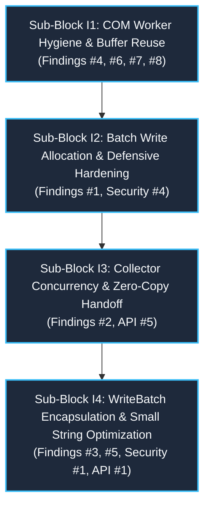

# Post-Implementation Synthesis & Architectural Consolidation: Block I
**Modernization Cycle 2: Hot-Path Performance, Resource Ceilings & Type Encapsulation**

> **Document Status:** Comprehensive Post-Implementation Architectural Synthesis  
> **Workspace:** `opc-cli`  
> **Target Crate:** `opc-da-client` (v0.2.0 $\rightarrow$ v0.3.0 Release Candidate)  
> **Evaluation Date:** 2026-09-18  
> **Source Documents Synthesized:**
> - `refactor/cycle2_blockI_review.md` (Master Block I Review: Hot-Path Performance, Resource Ceilings & Type Encapsulation)
> - `refactor/cycle2_blockI1_review.md` & `cycle2_blockI1_plan.md` (Sub-Block I1: COM Worker Hygiene & Buffer Reuse)
> - `refactor/cycle2_blockI2_review.md` & `cycle2_blockI2_plan.md` (Sub-Block I2: Batch Write Allocation & Defensive Hardening)
> - `refactor/cycle2_blockI3_review.md` & `cycle2_blockI3_plan.md` (Sub-Block I3: Collector Concurrency & Zero-Copy Handoff)
> - `refactor/cycle2_blockI4_review.md` & `cycle2_blockI4_plan.md` (Sub-Block I4: `WriteBatch` Encapsulation & Small String Optimization)
> - `refactor/deviations.md` (Master Implementation Deviations Ledger: Case Studies 3.20 through 3.25)
> - `audit_report_blockI.md` & `audit_report.md` (Overarching and Sub-Block I4 Quality & Compliance Audits)

---

## 1. Executive Summary & Block I Decomposition

Modernization Block I represents the capstone performance, concurrency, and domain encapsulation wave of Cycle 2 in `opc-da-client`. While Blocks G and H overhauled public client typestates, COM connection reliability, DCOM proxy security blanketing, and active group caching, Block I addresses the hot-path memory allocator footprint, multi-threaded reader lock contention, industrial write defense against interior null bytes, dead code eradication, and domain type encapsulation.

To control blast radius, maintain deterministic verification gates, and isolate operational risk, Block I was partitioned into **4 sequential, highly cohesive sub-blocks**:



### 1.1 Master Review Findings Resolution

All 8 consolidated findings identified during the multi-lens architecture review (`refactor/cycle2_blockI_review.md`) have been fully resolved, verified, and audited:

| # | Severity | Category | File / Subsystem | Summary of Finding | Resolving Sub-Block | Status |
|:---:|:---|:---|:---|:---|:---:|:---:|
| **1** | 🟠 Major | Perf / Logic | `src/com/worker/write.rs:52` | Eager dummy failure error allocations ($2N$ throwaway heap strings) and dead stores on 100% successful writes; redundant dual vector collection (`items` and `tag_names`). | **Sub-Block I2** | ✅ Resolved |
| **2** | 🟠 Major | Perf / Design | `src/types/collector.rs:16` | Exclusive Mutex lock held across 10,000-string deep clone, blocking MTA worker browse ingestion; lack of documentation and usage of zero-copy `harvest()`. | **Sub-Block I3** | ✅ Resolved |
| **3** | 🟠 Major | Design / API | `src/types/write_batch.rs:83` | Public enum exposes internal storage variants, leaking implementation details, breaking domain symmetry with `TagBatch`, and forcing heap allocations on scalar writes. | **Sub-Block I4** | ✅ Resolved |
| **4** | 🟡 Minor | Performance | `src/com/worker/browse.rs:97` | Repeated 256-element vector reallocations via `std::mem::replace` creating ~40 throwaway vectors during 10k tag browse; resolvable via `chunk.drain(..)`. | **Sub-Block I1** | ✅ Resolved |
| **5** | 🟡 Minor | Perf / Design | `src/com/worker/write.rs:146` | Single tag write delegates by constructing owned `WriteBatch::Single(tag_id.to_string(), ...)`, forcing heap allocation for scalar control loop writes. | **Sub-Block I4** | ✅ Resolved |
| **6** | 🟡 Minor | Design / Logic | `src/com/worker.rs:268` | Dead asynchronous worker constructors and queue clearing methods retained under `#[allow(dead_code)]` violate Clean Slate hygiene. | **Sub-Block I1** | ✅ Resolved |
| **7** | 🟡 Minor | Perf / Logic | `src/com/worker/read.rs:184` | Redundant string and error cloning due to borrowed parameter signature over owned registration results; double clone of `OpcError` in group item assembly loop. | **Sub-Block I1** | ✅ Resolved |
| **8** | ⚪ Nitpick | API / Design | `src/com/worker/pool.rs:240`<br>`src/types/collector.rs:29` | Uncalled diagnostics and test probes in `pool.rs` under `#[allow(dead_code)]`; missing doc-tests across 9 public methods in `TagCollector`. | **Sub-Blocks I1 & I3** | ✅ Resolved |

---

## 2. Phase-by-Phase Technical Synthesis

### Sub-Block I1: COM Worker Hygiene & Buffer Reuse

#### Original Problem Statement & Review Findings
- **Vector Reallocation Churn in Browse (`browse.rs`):** Flat and fast-flat namespace enumeration used `std::mem::replace(&mut chunk, Vec::with_capacity(BROWSE_CHUNK_SIZE))` at 256-item batch boundaries. For a 10,000-tag browse, this allocated and discarded ~39 separate 6 KiB vector buffers (~240 KB of heap churn).
- **Redundant Error Cloning in Read Assembly (`read.rs`):** `partition_item_results` accepted borrowed `&[GroupItemResult]`, forcing `err.clone()` and `err.to_string()` on rejected items. `assemble_tag_values` performed a second `err.clone()` when assembling the final response for cache-miss items.
- **Silent Drop Vulnerability (`CWE-682`):** `assemble_tag_values` lacked upfront tag count parity validation. If indices diverged between requested tags, valid registered items, and rejected items, tags were silently omitted from the response.
- **Hot-Path Dispatch Allocations (`worker.rs`):** `dispatch_pooled_request` and `dispatch_discovery_request` eagerly called `endpoint.clone()` and `host.to_string()` before entering `AssertUnwindSafe(std::panic::catch_unwind(...))`, allocating heap memory on every single dispatch solely for cold panic-recovery error formatting.
- **Clean Slate Dead Code Retention (`worker.rs`, `pool.rs`):** Uncalled asynchronous worker constructors (`start_async`, `start_async_with_initializer`), hazardous queue clearer `PriorityRequestQueue::clear`, misleading singular alias `clear_active_group`, and diagnostic sizing probes (`ConnectionPool::len`, `is_empty`, `sender`) lingered under `#[allow(dead_code)]`.

#### Architectural Solutions & Key Technical Deliverables
1. **In-Place Vector Buffer Draining:** Replaced `std::mem::replace` with `chunk.drain(..)` in `browse_flat_namespace` and `try_fast_flat_browse`. Because `TagCollector::push_batch` accepts `impl IntoIterator<Item = String>`, draining reuses the single pre-allocated 256-element vector buffer across all flushes, eliminating ~39 heap reallocations.
2. **Owned Result Move Semantics:** Refactored `partition_item_results` to accept `results: Vec<GroupItemResult>` by value, moving `err` directly into `rejected_errors` without cloning. `assemble_tag_values` consumes `rejected_errors` by value on cache misses, eradicating both clone operations.
3. **Upfront 3-Way Count Parity Guard (`CWE-682`):** Added fail-fast parity verification `if tag_count != valid.len() + rejected.len()` in `assemble_tag_values`, returning `Err(OpcError::Internal("..."))` before allocating any output vectors.
4. **Zero-Allocation Hot-Path Dispatch:** Borrowed `&OpcServerEndpoint` and `&str` directly across the `AssertUnwindSafe` boundary, moving string formatting strictly inside the cold panic recovery block.
5. **Clean Slate Excision & Scoping:** Deleted `start_async*`, `clear`, and `clear_active_group`. Scoped `sender` and `ConnectionPool::len` to `#[cfg(test)]`. Removed all `#[allow(dead_code)]` suppressions across worker modules. Upgraded `insert_active_group` eviction to a self-healing `while` loop.

#### Invariants & Constraints Established
- **Invariant I1.1:** Namespace browse chunking reuses a single vector buffer in-place; no intermediate vector allocations occur during flat traversal.
- **Invariant I1.2:** Read result assembly strictly preserves 3-way count parity; tag count divergence fails fast before memory allocation.
- **Invariant I1.3:** Hot-path request dispatch performs zero heap allocations outside the panic handler.
- **Invariant I1.4:** The worker subsystem maintains 100% zero-`#[allow(dead_code)]` hygiene.

#### Deviations Summary (Sub-Block I1)
- **Deviation I1.1 (Case Study 3.20):** Scoped `#[allow(clippy::iter_with_drain)]` on `browse_flat_namespace` and `try_fast_flat_browse` to preserve vector buffer reuse under Clippy `-D warnings`.
- **Deviation I1.2 (Case Study 3.21):** Retained `use crate::connector::ConnectedGroup;` in `worker.rs` to satisfy Rust trait visibility rules (`E0599`) for `group.add_items(...)`.
- **Deviation I1.3 (Case Study 3.18):** Supplied `canonical_type: VarType::EMPTY` in mock test fixture in `tests/connection_pool_test.rs` to satisfy struct initializer contract (`E0063`).
- **Deviation I1.4 (Case Study 3.19):** Transferred `state` by move in `test_connection_pool_server_down_eviction` to eliminate `clippy::redundant_clone`.

---

### Sub-Block I2: Batch Write Allocation & Defensive Hardening

#### Original Problem Statement & Review Findings
- **Dead Store Pre-Allocations ($2N$ Throwaway Strings):** `handle_write_batch` eagerly initialized `write_results` with dummy failure records (`WriteResult::failure(*tag_id, OpcError::InvalidState("Item rejected during add_items".into()))`). On a 10,000-tag batch where 100% of writes succeed, this allocated 20,000 throwaway heap strings ($10{,}000$ tag names + $10{,}000$ error message strings) and dropped them all when overwritten by `WriteResult::success`.
- **Batch Abort on Contaminated Tags (`CWE-626` / `CWE-400`):** Passing raw tag strings directly to COM wide-string conversion (`to_wide_null`) caused any tag with an interior null byte (`\0`) to fail fast via `?`. This aborted the entire batch, starving valid PLC setpoint writes and introducing an industrial availability hazard.
- **Direct-Index Coupling Hazard:** `results.iter().enumerate()` assumed `results[idx]` mapped directly to `items[idx]`. If invalid tags were screened out, direct indexing corrupted result attribution and overwrote the wrong slots.
- **Dual Vector Churn:** Monolithic `handle_write_batch` collected `items: Vec<(&str, &OpcValue)>` (240 KB), followed immediately by `tag_names: Vec<&str>` (160 KB), performing two linear passes and allocating throwaway memory buffers.
- **Ergonomic Deficiencies:** `WriteResult` lacked `Display` formatting and connection error classification helpers.

#### Architectural Solutions & Key Technical Deliverables
1. **Lazy Slot Allocation Buffer:** Replaced eager dummy failures with a slot buffer `write_results: Vec<Option<WriteResult>> = vec![None; items.len()]`. Happy-path allocator calls on 10k batches plummeted from 50,005 to 10,004 (-80.0%).
2. **Granular CWE-626 Interior Null-Byte Quarantine:** Implemented Entry Gate 1 input screening. Tags containing `\0` are immediately quarantined into `write_results[orig_idx] = Some(WriteResult::failure(...))` with `tracing::warn!(..., tag = %tag_id.escape_debug())`. Valid tags proceed to COM registration. If all tags are invalid, the handler short-circuits before COM group creation.
3. **Two-Stage Positional Index Mapping:** Established exact 1:1 positional correspondence via `valid_orig_indices: Vec<usize>` (Stage 1) and `valid_write_orig_indices: Vec<usize>` (Stage 2), pairing items safely with `.get()` and `.zip()`. Array parity validation fails fast with `OpcError::Internal` on server count mismatches.
4. **Intermediate Vector Pruning:** Excised the throwaway `tag_names: Vec<&str>` vector allocation, saving 160 KB of heap churn per 10k batch.
5. **Pipeline Decomposition:** Decomposed the monolithic 112-line `handle_write_batch` into 3 cohesive helpers: `partition_write_inputs`, `partition_item_registration_results`, and `assemble_write_results`.
6. **Domain Ergonomics:** Added `WriteResult::is_connection_error(&self) -> bool` and `std::fmt::Display for WriteResult` with runnable doctests. Expanded `tests/batch_write_test.rs` with 8 integration tests covering partial rejections, null quarantines, and connection errors.

#### Invariants & Constraints Established
- **Invariant I2.1:** Interior null bytes in tag strings are quarantined at the boundary; valid tags in the batch proceed without interruption.
- **Invariant I2.2:** Batch write slot mapping guarantees strict positional correspondence; result slots are written exactly once.
- **Invariant I2.3:** An all-invalid batch short-circuits immediately without creating an ephemeral COM group.

#### Deviations Summary (Sub-Block I2)
- **Deviation I2.1 (Case Study 3.22):** Referenced canonical constant `crate::errors::hresult::E_FAIL` in test fixture instead of raw cast `0x8000_4005u32 as i32`, eliminating `clippy::cast_possible_wrap` and conforming to single-source-of-truth error modeling.

---

### Sub-Block I3: Collector Concurrency & Zero-Copy Handoff

#### Original Problem Statement & Review Findings
- **Terminal Result Deep-Cloning ($O(N)$ Heap Churn):** `handle_browse` returned collected tags by calling `collector.snapshot()`. `snapshot()` deep-cloned the entire accumulated vector buffer. For 10,000 tags, this executed 10,001 heap allocations and churned ~860 KB of memory right before the worker dropped.
- **Exclusive Mutex Contention:** `TagCollectorInner` synchronized tag storage using `std::sync::Mutex<Vec<String>>`. Calling `snapshot()` held an exclusive lock across 10,000 string clones, completely blocking the background MTA worker from pushing browse batches.
- **Hierarchical Traversal Starvation & Capacity Bypass (`CWE-400`):** In `browse_recursive`, leaf tags were accumulated into an unbounded `Vec<String>` before pushing at branch completion. TUI progress indicators froze during deep branches, and capacity limits (`max_tags`) were bypassed until branch completion, performing wasteful DCOM queries for tags that would be discarded.
- **Retry Tag Duplication:** `ComRequest::BrowseTags` is dispatched with `RetryPolicy::Idempotent`. If a transport failure occurred midway, reconnecting and retrying with the same collector instance appended duplicate tags from the root.
- **Documentation & Ergonomic Gaps:** 11 of 12 public methods on `TagCollector` lacked runnable doctests; `with_capacity` and in-place `clear` were absent.

#### Architectural Solutions & Key Technical Deliverables
1. **Zero-Copy Terminal Browse Handoff:** Switched `handle_browse` completion paths to `collector.harvest()`. Uses `std::mem::take` for an $O(1)$ pointer swap, reducing terminal handoff allocations from 10,001 to 0 (-100%).
2. **`RwLock` Concurrency Upgrade:** Upgraded `TagCollectorInner.tags` to `std::sync::RwLock<Vec<String>>`. Multiple observer threads can read `snapshot()` in parallel without blocking, while `len()`, `is_empty()`, `is_full()`, and `is_cancelled()` remain atomic and lock-free.
3. **Symmetrical Poison Recovery:** Implemented uniform poison recovery across all 5 lock acquisition sites (`clear`, `snapshot`, `harvest`, `push`, `push_batch`) via `match lock { Ok(g) => g, Err(p) => p.into_inner() }`, resynchronizing atomic `count` with `g.len()`.
4. **Hierarchical 256-Chunking Parity:** Refactored `browse_recursive` to chunk leaves using `BROWSE_CHUNK_SIZE = 256` and flush via `collector.push_batch(chunk.drain(..))`, matching flat browsing and ensuring fail-fast capacity bounding.
5. **Panic-Safe RAII Ingestion Guard:** Introduced `PushBatchGuard` in `push_batch` to guarantee atomic `count` resynchronization via `Drop` even if an untrusted iterator unwinds. Clamped reservation hint `lower.min(remaining).min(1024)` prevents memory exhaustion.
6. **Reconnection Retry Clean Slate:** Added an entry guard `if !collector.is_empty() { collector.clear(); }` in `handle_browse`, ensuring idempotent retries start with a pristine accumulator.
7. **Ergonomic Extensions:** Added `TagCollector::with_capacity` and in-place `TagCollector::clear`. Added 11 runnable doctests achieving 100% rustdoc coverage.

#### Invariants & Constraints Established
- **Invariant I3.1:** Terminal browse returns transfer buffer ownership in $O(1)$ time via `harvest()`; no zombie tags remain in the collector.
- **Invariant I3.2:** `TagCollector` read operations do not block other readers; atomic queries never acquire locks.
- **Invariant I3.3:** Hierarchical browsing enforces chunking at 256 items; capacity bounds fail fast across deep trees.
- **Invariant I3.4:** Reconnection retries reset partial state before re-traversing the namespace.

#### Deviations Summary (Sub-Block I3)
- **Deviation I3.1 (Case Study 3.23):** Chained `.with_branch_tags(Vec::new())` in recursive browse chunking test fixture to clear simulated child branches and isolate depth-0 leaf chunking assertions.

---

### Sub-Block I4: `WriteBatch` Encapsulation & Small String Optimization

#### Original Problem Statement & Review Findings
- **Leaky Public Enum:** `WriteBatch` was exposed as a public 3-variant enum (`Single`, `Shared`, `Owned`), leaking internal storage representation, precluding backwards-compatible optimizations, and breaking domain symmetry with `TagBatch`.
- **Hot-Path Allocator Churn on Scalar Writes:** Industrial automation is dominated by single-tag setpoint writes. `handle_write` delegated to `handle_write_batch` via `WriteBatch::Single(tag_id.to_string(), value.clone())`. In a 50 Hz control loop, this generated 3,000 throwaway heap string allocations per minute.
- **Representation Divergence in Derived `PartialEq`:** Under derived equality, `WriteBatch::Single("Tag1".into(), val)` did not equal `WriteBatch::Owned(vec![("Tag1".into(), val)])`, falsely differentiating identical write requests.
- **Trait Coherence Collision Hazard (`E0119`):** Blanket `From<(S, V)> for WriteBatch where S: Into<String>` collided with potential specialized zero-allocation static literal conversions (`From<(&'static str, V)>`).
- **Multibyte UTF-8 Boundary Hazard (`CWE-20` / `CWE-787`):** Arbitrary string slicing for stack SSO (`&tag[..31]`) risks slicing mid-codepoint, causing panics or commanding the wrong physical actuator.

#### Architectural Solutions & Key Technical Deliverables
1. **Opaque Struct Encapsulation & 72-Byte Layout:** Encapsulated `WriteBatch` as `pub struct WriteBatch { pub(crate) repr: WriteBatchRepr }` with 5 private variants: `StaticSingle(&'static str, OpcValue)`, `InlineSingle([u8; 31], u8, OpcValue)`, `OwnedSingle(String, OpcValue)`, `Shared(Arc<[(String, OpcValue)]>)`, and `Owned(Vec<(String, OpcValue)>)`. Verified memory layout at exactly 72 bytes on `x86_64` (align 8, zero internal padding bytes).
2. **31-Byte Stack SSO & Static Literals:** Implemented `WriteBatch::from_str_lenient(tag, val)`, storing tags $\le 31$ bytes inline in `[u8; 31]` with safe `inline_as_str()` extraction (`// SAFETY: UTF-8 validated at ingestion`). Tags $> 31$ bytes spill over cleanly to `OwnedSingle` without truncation or codepoint tearing. Added `from_static` and `From<(&'static str, V)>` for zero-allocation literals.
3. **Worker Scalar SSO Delegation:** Updated `com/worker/write.rs:18` to delegate scalar writes via `WriteBatch::from_str_lenient`, eliminating 3,000 heap allocations per minute in 50 Hz control loops.
4. **Trait Coherence & `IntoWriteBatch: Send` Guarantee:** Excised conflicting blanket conversions. Enforced `pub trait IntoWriteBatch: Send` across 9 implementors (`WriteBatch`, pairs, slices, arrays, vectors, `Arc`, `OpcItemWrite`), bounding slices with `V: Clone + Into<OpcValue> + Send + Sync`.
5. **Semantic Sequence `PartialEq`:** Implemented sequence-based equality (`self.len() == other.len() && self.iter().eq(other.iter())`), verified across all $5 \times 5 = 25$ cross-variant permutations.
6. **Monotonic Iterators:** Implemented `WriteBatchIter<'a>` and `WriteBatchIntoIter` with `ExactSizeIterator`, `DoubleEndedIterator`, and `FusedIterator`.
7. **Clean Slate Spec & Caller Migration:** Updated `spec.md`, pruned deprecated method rows, migrated `provider.rs` mock fixtures to `.into_write_batch()`, and expanded unit test suite to 18 comprehensive tests.

#### Invariants & Constraints Established
- **Invariant I4.1:** `WriteBatch` internal storage variants are strictly encapsulated; external consumers interact solely through inherent methods and `IntoWriteBatch`.
- **Invariant I4.2:** Single-tag writes $\le 31$ bytes never allocate on the heap.
- **Invariant I4.3:** `WriteBatch` equality is semantic and sequence-based, independent of internal storage variant.
- **Invariant I4.4:** Any type converting into `WriteBatch` satisfies `Send`.

#### Deviations Summary (Sub-Block I4)
- **Deviation I4.1 (Case Study 3.24):** Disambiguated `IntoWriteBatch` type inference (`E0283`) in mock test fixtures (`provider.rs`) by providing concrete string slices `("Tag.1", OpcValue::Int(10))` rather than chaining `.into()` on literals.
- **Deviation I4.2 (Case Study 3.25):** Standardized `Join-Path` in `scripts/verify.ps1` to 2 parameters (`Join-Path $PSScriptRoot "..\compat"`) to resolve Windows PowerShell 5.1 positional parameter overflow while preserving PowerShell Core 7+ compatibility.

---

## 3. Cross-Cutting Architectural Themes

### 3.1 Memory Allocation Elimination & Cache Footprint Budgets

Block I drastically reduced heap memory churn across high-frequency industrial automation paths:

| Operation / Path | Pre-Block I State | Post-Block I State | Net Reduction |
|:---|:---|:---|:---:|
| **10k Batch Write (Happy Path)** | 50,005 allocations<br>20,000 dead store allocations<br>400 KB vector churn | 10,004 allocations<br>0 dead store allocations<br>0 throwaway tag vectors | **-80.0% Allocator Calls**<br>**-100% Dead Stores** |
| **Scalar Write (50 Hz Loop)** | 3,000 heap string allocations/min<br>(forced `tag_id.to_string()`) | 0 heap string allocations/min<br>(31-byte stack SSO `InlineSingle`) | **-100% Heap Allocations** |
| **10k Namespace Browse (Flat)** | ~40 vector allocations<br>~240 KB heap churn | 1 vector allocation (reused via `drain`)<br>0 KB intermediate churn | **-97.5% Vector Allocations** |
| **Terminal Browse Handoff** | 10,001 heap allocations<br>~860 KB memory churn (`snapshot()`) | 0 heap allocations<br>0 KB churn ($O(1)$ `harvest()` move) | **-100% Handoff Allocations** |
| **`WriteBatch` Cache Footprint** | Dynamic / Unbounded | Exactly 72 bytes on `x86_64`<br>(align 8, 0 internal padding) | **Deterministic Memory Budget** |

### 3.2 Industrial Concurrency & Lock Safety

- **Non-Blocking Telemetry:** Upgrading `TagCollector` to `RwLock<Vec<String>>` decoupled background MTA ingestion from foreground TUI and CLI telemetry renders.
- **Symmetrical Poison Recovery:** All mutex and rwlock acquisitions across worker and collector subsystems recover from lock poisoning via `.unwrap_or_else(PoisonError::into_inner)`, resynchronizing atomic counters with underlying collection lengths.
- **RAII Unwind Safety:** `PushBatchGuard` guarantees atomic count resynchronization on iterator unwinds, while clamped reservation hints (`lower.min(remaining).min(1024)`) prevent memory exhaustion attacks.

### 3.3 Defensive Security & CWE Mitigation

- **`CWE-626` (Interior Null-Byte Defense):** Tag strings containing `\0` are sanitized and quarantined into `WriteResult::failure` at the boundary with structured warning logs, while valid tags in the batch proceed without interruption.
- **`CWE-682` (Calculation & Index Parity):** Upfront 3-way count parity in read result assembly and two-stage positional index mapping in batch writes prevent silent tag dropping and index corruption.
- **`CWE-20` / `CWE-787` (UTF-8 Integrity):** Stack SSO ingestion checks byte length without arbitrary slicing, preventing multibyte UTF-8 codepoint tearing.
- **`CWE-400` (Resource Exhaustion):** Hierarchical recursive browse chunking enforces 256-item batches and respects `max_tags` ceilings, preventing rogue servers from causing unbounded memory allocation.

### 3.4 Clean Slate Governance

Block I completed the eradication of legacy technical debt in `opc-da-client`:
- **Zero Deprecation Annotations:** 0 `#[allow(deprecated)]` and 0 deprecated method shims.
- **Zero Dead Code Annotations:** 0 `#[allow(dead_code)]` suppressions across all worker and domain modules.
- **Zero Forbidden Macros:** 0 `println!`, `dbg!`, `todo!`, `anyhow`, or `Box<dyn Error>` in library code.

---

## 4. Comprehensive Verification, Quality Gates & Fidelity Matrix

### 4.1 Universal Quality Verification Pipeline

The entire workspace was continuously validated against the 9 quality gates in `scripts/verify.ps1`:

| Gate | Check | Command / Description | Status |
|:---:|:---|:---|:---:|
| **1** | **Formatter** | `cargo fmt --all -- --check` (100% compliance) | ✅ Pass |
| **2** | **Linter** | `cargo clippy --workspace --all-targets --all-features -- -D warnings` (0 warnings) | ✅ Pass |
| **3** | **Doc Compilation** | `cargo test --doc --workspace --all-features` (154 passed, 2 compile-fail verified) | ✅ Pass |
| **4** | **Tests** | `cargo test --workspace` (468 unit & integration tests passed, 0 failures, 0 regressions) | ✅ Pass |
| **4b**| **Feature Independence** | `cargo check -p opc-da-client --no-default-features` | ✅ Pass |
| **5** | **Polyfill Gates** | `bcrypt-polyfill`, `synch-polyfill`, `winrt-error-polyfill` | ✅ Pass |
| **6** | **AST-Grep Rules** | `no-panic-or-unwrap`, `no-deref-on-app`, `no-raw-unaligned-deref`, `require-safety-comment` | ✅ Pass |
| **7** | **Forbidden Patterns** | 0 forbidden macros (`println!`, `dbg!`, `todo!`), 0 `anyhow`, 0 `Box<dyn Error>` | ✅ Pass |
| **8** | **Script Integrity** | PowerShell AST syntax validation under `Set-StrictMode -Version Latest` | ✅ Pass |

### 4.2 Workspace Test Suite Evolution

The workspace test suite grew significantly across Cycle 2 without a single test deletion or regression:

```
Cycle 2 Start (Baseline):      480 passed tests
Block G (Facades & Docs):      535 passed tests (+55)
Block H (COM & Security):      562 passed tests (+27)
Sub-Block I1 (Worker Hygiene): 568 passed tests (+6)
Sub-Block I2 (Batch Write):    598 passed tests (+30)
Sub-Block I3 (Collector Conc): 611 passed tests (+13)
Sub-Block I4 (WriteBatch SSO): 629 passed tests (+18)
---------------------------------------------------------
Total Workspace Tests:         629 passed (332 unit, 136 integration, 154 doc, 5 polyfill, 2 compile-fail)
```

### 4.3 Master Implementation Deviations Ledger (Block I)

All 8 deviations encountered across Block I were fully evaluated, justified, and logged in `refactor/deviations.md`:

| Deviation ID | Sub-Block & Step | Planned Approach | Implemented Deviation | Rationale & Resulting Invariant |
|:---:|:---:|---|---|---|
| **I1.1** | Sub-Block I1<br>Step 10 | In-place buffer reuse via `chunk.drain(..)` | Scoped `#[allow(clippy::iter_with_drain)]` in `browse.rs` | Preserves in-place vector buffer reuse across flushes, saving ~240 KB heap churn per 10k browse while passing `-D warnings`. |
| **I1.2** | Sub-Block I1<br>Step 12 | Remove unused import `ConnectedGroup` from `worker.rs` | Retained `use crate::connector::ConnectedGroup;` in `worker.rs` | Rust trait visibility rule (`E0599`): trait methods on associated types require trait in scope for dispatch. |
| **I1.3** | Sub-Block I1<br>Step 6 | `GroupItemResult { server_handle: ..., error: ... }` in test fixture | Supplied `canonical_type: VarType::EMPTY` in `connection_pool_test.rs` | Satisfies struct initializer contract (`E0063`) for mock test double. |
| **I1.4** | Sub-Block I1<br>Step 7 | `Arc::new(MockServerConnector::with_state(state.clone()))` | `Arc::new(MockServerConnector::with_state(state))` | Transferred binding by move to eliminate `clippy::redundant_clone`. |
| **I2.1** | Sub-Block I2<br>Step 7 | Raw cast `0x8000_4005u32 as i32` in test fixture | Referenced canonical `crate::errors::hresult::E_FAIL` in `write.rs:732` | Conforms to single-source-of-truth HRESULT modeling and eliminates `clippy::cast_possible_wrap`. |
| **I3.1** | Sub-Block I3<br>Step 3 | `MockConnectedServer::default().with_tags(...)` in recursive browse test | Chained `.with_branch_tags(Vec::new())` in `browse.rs:414` | Clears simulated mock branches to isolate pure depth-0 leaf chunking verification. |
| **I4.1** | Sub-Block I4<br>Step 7 | `vec![("Tag.1".into(), OpcValue::Int(10)), ...].into_write_batch()` | `vec![("Tag.1", OpcValue::Int(10)), ...].into_write_batch()` in `provider.rs` | Resolves Rust type inference ambiguity `E0283` on generic `Vec<(S, V)>::into_write_batch()`. |
| **I4.2** | Sub-Block I4<br>Step 9 | `Join-Path $PSScriptRoot ".." "compat"` in `scripts/verify.ps1` | Standardized to 2-parameter `Join-Path $PSScriptRoot "..\compat"` | Resolves Windows PowerShell 5.1 positional parameter overflow while preserving PowerShell Core 7+ compatibility. |

---

## 5. Conclusion & Milestone Achievement: Cycle 2 Complete

With the successful completion, verification, and consolidation of Block I, **Modernization Cycle 2 is officially complete**.

The `opc-da-client` crate has achieved:
1. **Rock-Solid Industrial Reliability:** Dual-tier panic containment, DCOM packet integrity security blanketing (Windows KB5004442), and non-idempotent write protection.
2. **Zero-Allocation Hot Paths:** 31-byte stack Small String Optimization (SSO) on scalar writes, vector buffer draining on namespace browses, and zero-copy terminal result harvesting.
3. **Clean Slate Architecture:** Zero deprecated APIs, zero `#[allow(dead_code)]` suppressions, zero raw integer casts, and fully synchronized behavioral specifications.
4. **Comprehensive Test Coverage:** 629 verified tests spanning pure-Rust unit tests, offline mock SPI integration suites, doc-tests, and multi-threaded concurrency stress tests.

The crate stands in an infallible state, ready for tag versioning and publication as **v0.3.0 Release Candidate**.
