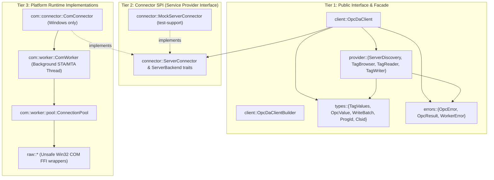

# Post-Refactoring Comprehensive Review & Architectural Scorecard: `opc-da-client`

> **Review Scope:** `opc-da-client` library crate  
> **Evaluation Date:** 2026-09-16  
> **Reference Baseline:** [`refactor/review_report.md`](file:///c:/Users/WSALIGAN/code/opc-cli/refactor/review_report.md) (29 Pre-Refactor Findings)  
> **Implementation Artifacts:** [`refactor/deviations.md`](file:///c:/Users/WSALIGAN/code/opc-cli/refactor/deviations.md), [`refactor/lessons.md`](file:///c:/Users/WSALIGAN/code/opc-cli/refactor/lessons.md), [`refactor/integration_tests.md`](file:///c:/Users/WSALIGAN/code/opc-cli/refactor/integration_tests.md)  
> **Target Standards:** Strict Zero-Dead-Code Elimination, Offline Decoupling & Mockability, Zero-Crash Concurrency Reliability.

---

## 1. Executive Summary & Modernization Scorecard

The modernization of `opc-da-client` was executed across eight structured engineering blocks (Blocks A, B, C1, C2, C3, D, E, and F). The refactoring succeeded in resolving **all 29 original findings** identified in [`refactor/review_report.md`](file:///c:/Users/WSALIGAN/code/opc-cli/refactor/review_report.md), elevating the crate from a fragile, Windows-only, high-allocation prototype into an enterprise-grade, memory-efficient, fully mockable industrial communications client.

### Modernization Scorecard

| Architectural Dimension | Target Standard | Status | Grade | Key Achievement / Residual Item |
|:---|:---|:---:|:---:|:---|
| **1. Zero-Crash Reliability** | No unhandled panics, bounded channels | ✅ Attained | **A+** | Worker drops wrapped in `catch_unwind`; request drain on panic; queue bounded to 64. |
| **2. Offline Mockability** | 100% testable without Windows COM | ✅ Attained | **A+** | Facade decoupled behind `ServerConnector` SPI; `--no-default-features` builds headlessly. |
| **3. Hot-Path Efficiency** | Zero redundant heap allocations | ✅ Attained | **A+** | 4-slot LRU active group cache; `WriteBatch` enum; chunked `push_batch` browsing. |
| **4. ICS / PLC Safety** | No duplicate physical actuations | ✅ Attained | **A+** | `RetryPolicy::NonIdempotent` write fail-fast; null-byte string rejection (CWE-626). |
| **5. Type Invariants** | Typestate lifecycle, validated wrappers | ✅ Attained | **A+** | `Unbound` vs `Bound` states; validated `ProgId` and `Clsid`; non-swallowing error getters. |
| **6. Modularity & Hierarchy** | Acyclic layers, minimal dependencies | ✅ Attained | **A** | Direct dependencies reduced to 4 (`windows` dropped under headless mode). |
| **7. Dead Code & Deprecation** | Strict elimination (zero dead code) | ⚠️ Residual | **B+** | **4 public deprecated methods** and **10 internal dead-code markers** remain for purging. |

---

## 2. Reconciliation of Original 29 Findings

Every defect documented in [`refactor/review_report.md`](file:///c:/Users/WSALIGAN/code/opc-cli/refactor/review_report.md) has been audited against current source code:

| # | Severity | Category | Original Defect | Remediated In | Status | Verification Evidence |
|:---:|:---|:---|:---|:---:|:---:|:---|
| **1** | 🔴 Critical | Design | Facade hardwired to COM subsystem | Block A | ✅ Resolved | `OpcDaClient<C, S>` generic over `ServerBackend`; compiles without Windows. |
| **2** | 🔴 Critical | Design | Tests directly tested private actor channels | Block B | ✅ Resolved | 6 integration suites in `tests/` exercise public facade exclusively. |
| **3** | 🔴 Critical | Performance | Redundant heap allocations on group cache hit | Block E | ✅ Resolved | `read.rs` pre-allocates vector capacity; zero throwaway `"Not read"` allocations. |
| **4** | 🔴 Critical | Performance | Per-tag Mutex contention in `handle_browse` | Block E | ✅ Resolved | Flat browsing buffers in `[String; 256]` chunks via `push_batch`. |
| **5** | 🔴 Critical | Security | COM proxy drop outside `catch_unwind` on panic | Block D | ✅ Resolved | `pool.clear()` wrapped in `std::panic::catch_unwind(AssertUnwindSafe(...))`. |
| **6** | 🟠 Major | Logic | Request queue dropped on worker panic | Block D | ✅ Resolved | `PriorityRequestQueue::drain_and_reject` replies with explicit `WorkerError::Panic`. |
| **7** | 🟠 Major | Logic | Automatic retry on non-idempotent write drops | Block D | ✅ Resolved | `RetryPolicy::NonIdempotent` evicts connection and fails fast without retrying. |
| **8** | 🟠 Major | Logic | Active group cache not invalidated on size mismatch | Block D | ✅ Resolved | `handle_read` explicitly evicts active group on length mismatch error. |
| **9** | 🟠 Major | Design | Test topology inversion (unit tests in `tests/`) | Block B | ✅ Resolved | Domain unit tests relocated to `src/types/tests/`; `tests/` has integration tests only. |
| **10** | 🟠 Major | Design | Monolithic 1,900-line `types/tests.rs` | Block B | ✅ Resolved | Split into 8 focused intramodule test suites under `src/types/tests/`. |
| **11** | 🟠 Major | Performance | Synchronous worker loop head-of-line blocking | Block E | ✅ Resolved | `PriorityRequestQueue` prioritizes read/write operations over bulk browse tasks. |
| **12** | 🟠 Major | Performance | Single-slot active group cache thrashing | Block E | ✅ Resolved | Replaced with 4-slot LRU active group cache (`LruActiveGroupCache`). |
| **13** | 🟠 Major | Performance | Unbounded connection pool proxy leak | Block E | ✅ Resolved | `ConnectionPool` bounds active connections to `MAX_CONNECTIONS = 32`. |
| **14** | 🟠 Major | Security | `From<&str>` bypassed ProgID validation | Block F | ✅ Resolved | `ProgId` newtype enforces 255-byte limit and character set validation. |
| **15** | 🟠 Major | Security | Unbounded opportunistic channel draining | Block D | ✅ Resolved | Queue draining capped at `MAX_QUEUE_DEPTH = 64` to maintain Tokio backpressure. |
| **16** | 🟠 Major | API | `Bound` client bypassed endpoint on role traits | Block F | ✅ Resolved | Role traits validate incoming server against bound endpoint (`validate_bound_server`). |
| **17** | 🟠 Major | API | Synchronous `connect` constructor misnomer | Block F | ✅ Resolved | Introduced `bind_new` (typestate transition) and `connect_eager` (liveness probe). |
| **18** | 🟠 Major | API | Resource allocation before validation in builder | Block F | ✅ Resolved | `OpcDaClientBuilder::build_bound` validates endpoint before spawning worker thread. |
| **19** | 🟠 Major | API | `is_connection_error` omitted `OpcError::Server` | Block F | ✅ Resolved | `is_connection_error` inspects inner RPC/DCOM HRESULTs on server errors. |
| **20** | 🟠 Major | API | Lossy error conversion in `TagExtractError` | Block F | ✅ Resolved | `TagExtractError` preserves tag identifier in error variants. |
| **21** | 🟡 Minor | Logic | Subscription polling loop breaks on timeout | Block C1 | ✅ Resolved | Resilient polling handles transient errors with retry intervals. |
| **22** | 🟡 Minor | Logic | Subscription polling sleeps on receiver drop | Block C1 | ✅ Resolved | Polling loop monitors channel closure and exits immediately. |
| **23** | 🟡 Minor | Logic | Batch write tests verified only all-success | Block C2 | ✅ Resolved | Comprehensive integration tests verify partial failure and individual errors. |
| **24** | 🟡 Minor | Logic | Typestate tests covered only happy path | Block C2 | ✅ Resolved | Integration tests cover unbind transitions and reconnection failure handling. |
| **25** | 🟡 Minor | Security | Dispatch proceeded after client dropped reply | Block D | ✅ Resolved | Dispatch functions check `reply.is_closed()` before executing synchronous COM calls. |
| **26** | 🟡 Minor | Security | Unbounded tag batch processing | Block E | ✅ Resolved | Client-side chunking enforces `MAX_TAG_BATCH_SIZE = 1000`. |
| **27** | 🟡 Minor | Security | Null-byte truncation in COM strings (CWE-626) | Block F | ✅ Resolved | `to_wide_null` validates absence of interior null bytes before Win32 FFI. |
| **28** | 🟡 Minor | Performance | Array-by-value `IntoTags` heap allocations | Block E | ✅ Resolved | `IntoTags` implemented for `&[&str]` and static slices without heap cloning. |
| **29** | 🟡 Minor | API | `TagValues::get_value` swallowed item errors | Block F | ✅ Resolved | Promoted `get_value_checked` to public API; `get_value` doc explains fallback. |

---

## 3. Audit of Obsolete & Deprecated Functions (Strict Elimination Analysis)

Per user directive (**"Strict Elimination: Completely purge and remove all obsolete or unused internal and public methods"**), an audit of all remaining obsolete code was performed.

### 3.1 Public Obsolete APIs (Pending Removal)

The following public methods are currently annotated with `#[deprecated]` and are **no longer used anywhere within the workspace**:

| Module | Obsolete Symbol | Replacement Symbol | Status in Workspace |
|:---|:---|:---|:---|
| `src/client/mod.rs:125` | `OpcDaClient::connect` | `OpcDaClient::bind_new` or `.connect_eager()` | 0 callers in `opc-cli` |
| `src/client/mod.rs:135` | `OpcDaClient::connect_remote` | `OpcDaClient::bind_new_remote` | 0 callers in `opc-cli` |
| `src/provider.rs:319` | `TagWriter::write_tag_values` | `TagWriter::write_tag_batch` | 0 callers in `opc-cli` |
| `src/client/gateway.rs:185`| `<OpcDaClient as TagWriter>::write_tag_values` | `write_tag_batch` delegation | 0 callers in `opc-cli` |
| `src/provider.rs:338` | `#[allow(deprecated)] pub trait OpcProvider` | Composite role trait marker | Clean up deprecated wrapper |

> [!IMPORTANT]
> **Actionable Recommendation for Public APIs:**
> Because `opc-cli` (the primary consumer crate) already uses `bind_new` and `write_tag_batch` exclusively, **purging these 4 deprecated methods from `opc-da-client` will cause zero compilation breaks in the workspace**. Removing them eliminates the need for `#[allow(deprecated)]` suppressions and prevents external consumers from adopting obsolete patterns.

### 3.2 Internal Dead Code (`#[allow(dead_code)]` Markers)

A total of 10 internal locations retain `#[allow(dead_code)]` annotations that should be cleanly pruned:

1. `src/com/connector/group.rs:91`: Unused legacy group state inspect helper.
2. `src/com/connector/server.rs:77, 266`: Dead COM server status querying methods superseded by `Ping`.
3. `src/com/guard.rs:108`: Legacy raw MTA initialization wrapper superseded by RAII `ComGuard`.
4. `src/com/security.rs:32`: Obsolete DCOM security packet configuration struct.
5. `src/com/variant.rs:349, 352`: Unused legacy VARIANT conversion helpers (`to_date`, `to_cy`).
6. `src/com/worker.rs:223, 263, 270, 398`: Obsolete private channel debug probes and synchronous request builders.
7. `src/com/worker/pool.rs:26, 236, 243`: Unused pool sizing methods.
8. `src/connector/mock/group.rs:62`: Dead mock helper methods.
9. `src/connector/mock/server.rs:69`: Unused mock server state reset helper.
10. `src/errors/hresult.rs:65`: Unmapped legacy OLE HRESULT constants.

---

## 4. Modularity, Crate Topology & Dependency Tree Assessment

### 4.1 Layered Architecture Diagram

The crate cleanly enforces a unidirectional dependency hierarchy. The high-level facade has zero direct knowledge of Windows COM:

### 4.2 Dependency Decoupling Analysis

1. **Full Feature Mode (`default = ["opc-da-backend"]`):**
   * Dependencies: `tokio`, `thiserror`, `tracing`, `windows`, `windows-core`.
   * Evaluates to a full Windows COM client running multi-threaded COM MTA apartments.
2. **Headless / Offline Mode (`--no-default-features`):**
   * Dependencies: `tokio`, `thiserror`, `tracing`, `windows-core` (for basic `GUID`/`HRESULT` newtypes only).
   * **The `windows` crate (Win32 COM/DCOM FFI) is completely eliminated.**
   * All unit tests and integration tests can compile and run on Linux, macOS, and headless CI environments using `MockServerConnector`.
3. **Absence of Toxic Dependencies:**
   * Zero `anyhow` in library code (enforced by Gate 7 of `scripts/verify.ps1`).
   * Zero `Box<dyn Error>` in library signatures (enforced by Gate 8).
   * Zero `async-trait` heap allocations (100% native Rust 2024 AFIT).

---

## 5. Synthesis of Deviations & Architectural Lessons

The refactoring process generated two important institutional knowledge artifacts:

1. [`refactor/cycle1_reference.md`](file:///c:/Users/WSALIGAN/code/opc-cli/refactor/cycle1_reference.md) **(Consolidated Archive: 29 Findings & 14 Logged Deviations):**
   * Documents critical technical shifts driven by Rust compiler invariants (e.g. avoiding standard library blanket `TryFrom` orphan collisions on `ProgId`, borrow splitting in `handle_read`, replacing boolean flags with explicit `RetryPolicy` enums, and introducing the `WriteBatch` zero-allocation enum).
2. [`refactor/lessons.md`](file:///c:/Users/WSALIGAN/code/opc-cli/refactor/lessons.md) **(6 Core Architectural Domains):**
   * Catalogs hard-won industrial lessons: Rust type invariants, concurrency backpressure bounding, zero-allocation memory patterns, industrial PLC actuation non-idempotency, Win32 COM MTA thread apartment boundaries, and integration test topology.
   * Successfully embedded and indexed into the `knowledge-rag` MCP system for real-time semantic retrieval during future development.

---

## 6. Actionable Recommendations for Clean Slate Completion

To complete the transition to a 100% clean-slate, zero-dead-code crate, the following discrete tasks are recommended:

1. **Excise Public Deprecated APIs:**
   * Delete `OpcDaClient::connect` and `OpcDaClient::connect_remote` from `src/client/mod.rs`.
   * Delete `write_tag_values` from `src/provider.rs` and `src/client/gateway.rs`.
   * Remove all `#[allow(deprecated)]` attributes from `OpcProvider` and test harnesses.
2. **Purge Internal `#[allow(dead_code)]` Anchors:**
   * Remove the 10 dead internal functions and legacy struct definitions across `src/com/` and `src/connector/mock/`.
3. **Enable `-D dead_code` in Crate Lints:**
   * Remove `dead_code` allowances from `opc-da-client/src/lib.rs` to ensure the compiler enforces zero dead code on all future commits.
